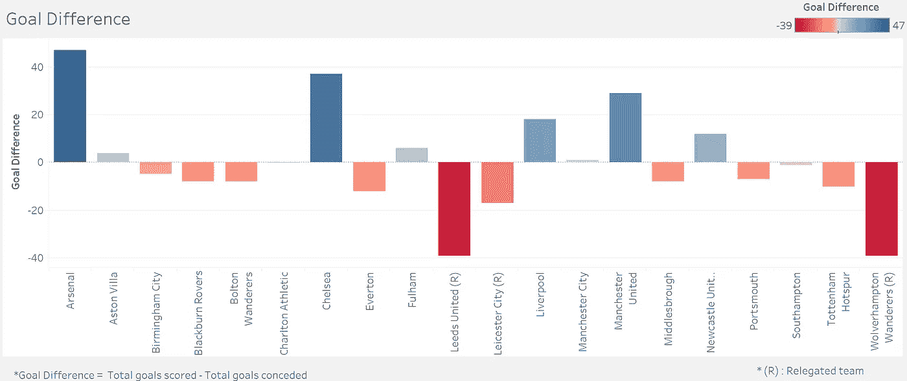

# 阿森纳“无敌”足球分析

> 原文：<https://medium.com/analytics-vidhya/arsenal-invincibles-football-analytics-d4a9eada7173?source=collection_archive---------18----------------------->

合著:- [*希夫一言九鼎*](/@shivnarain)

**场景设置:**

这种可视化介绍了如何处理和分析足球数据。它侧重于使用“统计炸弹”数据来分析和提出见解。被问到的关键问题是**是什么让 2003-04 赛季的阿森纳“无敌”队取得了迄今为止没有任何英超俱乐部能够取得的成就**。

感谢 [**Statsbomb**](https://statsbomb.com/) ，这是业余爱好者和足球统计迷探索大量比赛事件真实数据的绝佳资源。如果您以前没有处理过这种数据，那么就收集的事件的度量和粒度的数量而言，这可能会令人不知所措。它提供了大量的机会，却冒着不知道从哪里开始的风险。

在这个分析中，我们从一个相当开放的问题开始:*你能从视觉上发现阿森纳游戏的模式吗？*开始吧。

**使用的技术:**

Python(熊猫，NumPy，json)，MySQL，Alteryx，Tableau。

数据准备是在 Python 和 MySQL 的帮助下完成的。使用 Alteryx 进行数据清理，最后，使用 Tableau 创建交互式可视化。

**可视化:**

在这些仪表板上，我们会分析比赛的每一个方面，从守门员到有个人数据的前锋，还有球队。

简介仪表板

1.  在第一部分，我们谈论了阿森纳 2003-04 赛季英超联赛 38 场比赛的结果。很肯定，你会在这 38 场比赛的结果中寻找失败，但不，这是让这支球队如此特别的原因，因此有了“无敌”这个词。68%的胜率和剩余 32%的比赛以平局告终，是什么导致了这一迄今为止英超球队都无法实现的壮举。

2003/04 EPL 赛季各队的净胜球

2.在这里，我们来看看每支球队的**净胜球**，其中**阿森纳得分最高(+47)** 利兹联队和狼队得分最低(-39)。阿森纳进了最多的球(73 个)**丢了最少的球(26 个)**这要归功于稳固的后防线和猛烈的进攻。

主场与客场进球对比

3.这个小的。显示 2003-2004 赛季主场和客场的累计进球总数。在总共 73 个进球中，40 个来自海布里球场(当时阿森纳的主场)，其余 33 个是客场进球。这清楚地表明，阿森纳前锋不顾场地，全力以赴。

2003/04 赛季 EPL 最佳射手

4.蒂埃里·亨利进了巨大的 **30 个球(大约。44%)** 阿森纳在 2003-04 赛季英超联赛中的总进球数紧随阿兰·希勒、范尼和路易·萨哈之后。

基于进球+助攻/90 分钟上场时间的球员表现衡量

5.在那个赛季排名前四的俱乐部中，我们来看看球员 wrt 的表现。进球/90，助攻/90，分钟保障。一个惊喜的包裹是以**路易·萨哈**的名义，他以**每场 0.98】的成绩获得了**最高 G+A/90 分钟比率**。难怪，他在曼联被称为“超级替补”。**

2003/04 EPL 赛季守门员无失球记录(尺寸表示俱乐部守门员数量)

6.考虑到比赛的防守方面，切尔西在整个赛季中有 21 场零失球，看起来像岩石一样坚固。这也可以归因于克劳迪奥。拉涅利的防守风格，切尔西是一支低挡反击的球队。

另一方面，阿森纳在整个赛季中只能保持 15 场不失球，而德国老牌劲旅延斯·莱曼也是如此。凭借 15 场零失球，阿森纳设法保持了一场比赛未输，这充分说明了他们得分超过对手的能力。

守门员扑救比率(大小表示扑救比率)

7.曼联的蒂姆·霍华德在 32 场比赛中做出了巨大的 **110 次扑救**，其中 78%的扑救**紧随其后的是阿森纳的延斯·莱曼，整个赛季的扑救比例为 77%。**

正是在阿森纳，亨利成为了一名世界级的足球运动员，尽管他的转会并非没有争议，但温格确信他值得这笔转会费。作为法国前锋尼古拉·阿内尔卡的替代者，亨利立即被温格塑造成一名前锋，这一举动将在未来几年带来丰厚的回报。然而，当他在前八场比赛中未能得分时，人们对他适应快速和身体对抗的英国比赛的能力产生了怀疑。在英格兰度过了艰难的几个月后，亨利甚至承认他不得不“重新学习关于打击艺术的一切”

进入 2003-04 赛季，阿森纳决心夺回英超冠军。亨利在阿森纳异常成功的战役中发挥了重要作用；与丹尼斯·博格坎普、帕特里克·维埃拉、弗雷迪·永贝里和罗伯特·皮雷斯一起，亨利确保枪手成为一个多世纪以来第一支在整个国内联赛赛季保持不败的球队，并在此过程中夺得联赛冠军。除了连续第二年被评为 PFA 年度最佳球员和 FWA 年度最佳球员之外，亨利再次获得了 2004 年 T2 国际足联年度最佳球员的亚军。凭借在英超联赛中的 30 粒进球，这位法国人在进球数上领先于联赛，并获得了 PL 金靴奖。

2004 年 5 月 15 日，阿森纳成为“无敌”队。

> **《维多利亚的协和女神》**

> **项目链接:**[https://tabsoft.co/3fNx7mt](https://tabsoft.co/3fNx7mt)
> 
> **LinkedIn 简介:** [赛苏巴什](https://www.linkedin.com/in/saisubash/)，[希夫一言九鼎](https://www.linkedin.com/in/shiv-narain-25322517a/)