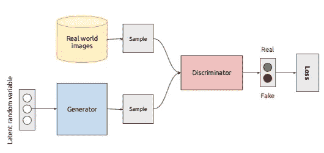

# 游戏中的人工智能第 2 部分:GANs

> 原文：<https://medium.com/analytics-vidhya/art-ificial-intelligence-in-gaming-part-2-gans-e2e5381c8bd7?source=collection_archive---------34----------------------->

## 深度学习和一般对抗网络。

照片由[像素](https://www.pexels.com/photo/abstract-blackboard-bulb-chalk-355948/?utm_content=attributionCopyText&utm_medium=referral&utm_source=pexels)的[皮克斯拜](https://www.pexels.com/@pixabay?utm_content=attributionCopyText&utm_medium=referral&utm_source=pexels)拍摄

这是一部迷你剧的第二部分，所以请*在继续*之前阅读第一部分:

 [## 游戏中的人工智能第一部分:三个介绍性的例子

### 超级马里奥兄弟，毁灭战士，和英伟达对吃豆人的再创造

danielletrinh.medium.com](https://danielletrinh.medium.com/art-ificial-intelligence-in-gaming-part-1-three-introductory-examples-91cef4117334) 

> 尽管我努力使这篇文章保持简单，但它内容相当丰富，所以你不必期望自己一下子就能理解所有的东西。

除了这两个额外的例子，视频游戏之间的一个共同主题是如何训练人工智能来生成可玩和不可重复的级别或阶段。怎么做到的？**生成对抗网络**。

2014 年，Ian Goodfellow 和朋友出去玩了一夜后，回到家发明了一种现在被称为 GAN 的东西。这项人工智能技术被广泛认为是深度学习和无监督学习的突破。**生成式对抗网络可以描述为两个神经网络在零和博弈中相互竞争。** **一个神经网络充当 cop，另一个充当伪造者。该模型可以用于无监督学习，以生成新的示例，这些示例很可能是从原始数据集中提取的。**

等等，那是一大堆流行语…

# 相关词汇

信用:[阿图尔](https://www.edureka.co/blog/ai-vs-machine-learning-vs-deep-learning/)

*   **深度学习:**使用多层神经网络的机器学习子集

贷方:[自动生成的](https://lawtomated.com/supervised-vs-unsupervised-learning-which-is-better/)

*   **监督学习:**机器学习的一种类型，它基于被标记的示例输入-输出对将输入映射到输出
*   **无监督学习:**一种在无标签数据中寻找模式的机器学习

信用:[詹姆斯·达科姆](/@jamesdacombe/an-introduction-to-artificial-neural-networks-with-example-ad459bb6941b)

*   **神经网络:**连接神经元的数学模型，用于处理输入和输出之间的非线性关系

有各种类型的神经网络，我就不赘述了，但你可以在这里找到一篇文章。

信用: [ML 词汇表](https://ml-cheatsheet.readthedocs.io/en/latest/nn_concepts.html)

*   **神经元:**一组加权(w)输入(X ),在应用数学激活函数(如 sigmoid)后返回输出

权重被添加到输入中以确定它们的重要性。

# 甘——我们来分解一下

当您阅读这些小节时，请记住我对 GAN 的一般定义。

> **生成式对抗网络可以描述为两个神经网络在零和博弈中相互竞争。** **一个神经网络充当 cop，另一个充当伪造者。该模型可以用于无监督学习，以生成新的示例，这些示例很可能是从原始数据集中提取的。**

## 生成性的(与区别性的)

生成模型是一种创造，或者说*产生*合理输入的新例子的模型。这通常用于无监督学习。另一个统计分类模型是判别模型，它将输入变量的例子分类或*判别*到不同的组中(即模型预测每个输入属于哪个类)。这通常用于监督学习。

## 对手的

对立的描述两个对立的方面。

## 网络

在这种情况下，“网络”是指神经网络，或连接的神经元的集合。(参考上面的“相关词汇”部分)

# 甘——让我们把它放在一起

凯文·麦克吉尼斯

致谢:[杰森·布朗利](https://machinelearningmastery.com/what-are-generative-adversarial-networks-gans/)

这两个图都描述了 GAN 的基本架构。还记得我定义中的警察和伪造者的比喻吗？**发生器模型是伪造者，鉴别器模型是 cop。**这意味着生成器创建假的例子，连同来自原始数据集的真实例子一起提供给鉴别器。然后鉴别器预测每个输入是不是假的，这就是零和博弈的切入点。对于每个例子，鉴别器预测为*真否定*(关于例子是假的正确)，只有发电机模型“失败”并被更新。对于每个例子，鉴别器预测为*假阳性*(预测该例子是真实的，但它实际上是假的)或*假阴性*(预测该例子是假的，但它实际上是真实的)，只有鉴别器模型“失败”并被更新。**简而言之，一次只更新一个模型，取决于鉴别器对生成的例子的预测是正确还是错误。更新的过程被称为*反向传播*，但我稍后会谈到这一点。通过使用这种架构，两种模型都可以在很少人为干预的情况下得到有效改善。一旦生成的示例足够欺骗鉴别器模型，训练过程就结束了。**

致谢:[塔尔斯·席尔瓦](https://www.freecodecamp.org/news/an-intuitive-introduction-to-generative-adversarial-networks-gans-7a2264a81394/)

这是 GAN 架构的另一个例子。生成器的输入是随机噪声(以前称为潜在随机变量和随机输入向量)，以长向量或数字数组的形式。使用神经网络，生成器将输入转换为三维图像，该图像与来自真实训练集的图像一起用作鉴别器的输入。请注意鉴别器结构与生成器模型完全相反。这是因为它也是一个神经网络，但它以三维图像的形式接受输入，并通过将数据重塑为长向量来将其转化为输出。如果这对您没有意义，请不要担心—只需认识到**鉴别器输入是发生器输出。**

另一件需要记住的事情是，由于生成器和鉴别器是两个独立的神经网络，它们有不同的训练过程。当一个被训练时，另一个必须保持不变。“训练”模型实质上是通过反向传播过程，这将在下一节中解释。

# 发电机模型

信用:[谷歌开发者](https://developers.google.com/machine-learning/gan/generator)

让我们把重点放在发电机模型上。潜在随机变量、随机输入向量、随机噪声、随机输入——这些都意味着什么？好吧，我希望你意识到这是发生器的某种随机输入。所有的神经网络都需要某种输入，在这种情况下，我们试图生成一些全新的输出。通过使用随机输入，发生器可以产生各种各样的样本。一旦通过鉴别器，就会产生*发生器损耗*，它对被预测为真阴性的样本的发生器进行惩罚(即发生器因被发现伪造而受到的惩罚)。在这个特殊的图表中，**反向传播是一个数学过程，它调整生成器神经网络的权重，并最小化生成器损耗**(即，使生成器更好地创建看起来像来自实际数据集的样本😃).

# 鉴别器模型

信用:[谷歌开发者](https://developers.google.com/machine-learning/gan/discriminator)

就像生成器模型一样，鉴别器通过**反向传播** **受到*鉴别器损失*的惩罚，该数学过程调整鉴别器神经网络的权重并最小化鉴别器损失**(即，使鉴别器更好地识别不是来自实际数据集的样本😃).

# 结论

呀，那是许多大概念要经历的！

如果你不能完全理解这篇博文的部分内容，你最大的收获*应该是**生成对抗网络(GAN)** 本质上是两个人工智能模型之间的游戏，其中**生成器充当伪造者**来创建虚假内容，而**鉴别器充当警察**来尝试并捕捉真实样本中的假货。**鉴别器将假样本归类为真样本时发生器获胜，归类为假样本时发生器失败。这些损失刺激了模型算法的改进。***

将它与视频游戏联系起来，MarioGAN 是训练生成超级马里奥级别的 GAN。发生器创建电平并接收来自鉴别器的反馈和基于某些特征的发生器损耗，例如可到达的地面瓦片的数量或所需的跳跃次数。同样的概念也适用于我在第一部分中给出的其他游戏示例。如果你好奇的话，[这个](https://github.com/TheHedgeify/DagstuhlGAN)是 MarioGAN 的代码。

是的，在一篇博文中塞进了很多内容，但是我希望你能学到一些东西！这个迷你系列的下一篇文章将是关于现实世界的含义和总结概念。我保证这会更容易理解。

一会儿见:)

 [## 游戏中的艺术智能第三部分:含义与结论

### GAN =创意 AI =？

medium.com](/analytics-vidhya/art-ificial-intelligence-in-gaming-part-3-implications-and-conclusion-6282fa9240a5) 

*Danielle Trinh 是 Inspirit AI 学生大使项目的学生大使。Inspirit AI 是一个大学预科浓缩计划，通过在线直播课程让全球好奇的高中生接触人工智能。了解更多关于 https://www.inspiritai.com/***。**