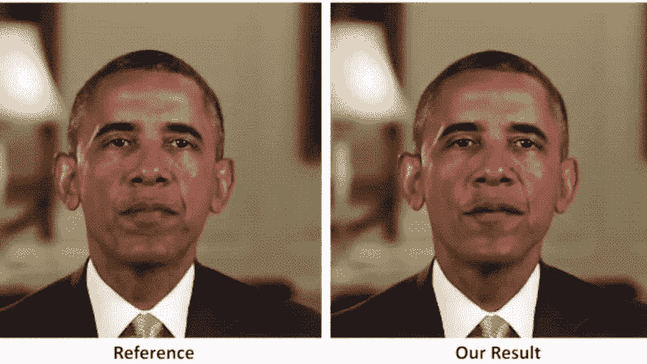

# 游戏中的艺术智能第三部分:含义与结论

> 原文：<https://medium.com/analytics-vidhya/art-ificial-intelligence-in-gaming-part-3-implications-and-conclusion-6282fa9240a5?source=collection_archive---------23----------------------->

## GAN =创意 AI =？

照片由[詹姆斯·庞德](https://unsplash.com/@jamesponddotco?utm_source=medium&utm_medium=referral)在 [Unsplash](https://unsplash.com?utm_source=medium&utm_medium=referral) 拍摄

这是一部迷你剧的第三部分，所以请*在继续*之前阅读第一和第二部分:

 [## 游戏中的人工智能第一部分:三个介绍性的例子

### 超级马里奥兄弟，毁灭战士，和英伟达对吃豆人的再创造

medium.com](/the-shadow/art-ificial-intelligence-in-gaming-part-1-three-introductory-examples-91cef4117334)  [## 游戏中的人工智能第 2 部分:GANs

### (深度学习和一般对抗网络)

danielletrinh.medium.com](https://danielletrinh.medium.com/art-ificial-intelligence-in-gaming-part-2-gans-e2e5381c8bd7) 

在这个迷你系列的其他部分，我们讨论了如何使用 gan 来生成新的视频游戏级别，这些级别符合所有的规则和游戏物理。它如何革新现代游戏有无限的可能性，包括拥有更逼真的图形，可以真正增强虚拟现实的体验。

你想想，人类的智能就是创造力。你认识的“最聪明”的人是那些跳出框框思考的人；他们创造性地思考，能够建立联系。**因此，真正的人工智能必须具备独立思考和创造性思维的能力。**

# 甘=创意？

由于 GANs 用于生成完全新的数据，这些数据很可能来自原始数据集，所以它本质上是“创造性的”人工智能。比方说，我们给模型输入各种各样的插图数据集，从毕加索的画到抖音的数字艺术，以及介于两者之间的一切。结果很可能是艺术风格的独特混合——这不就是我们所说的“创造性”或“原创性”吗？

没错。艺术家通过模仿他们看到的某些事物的某些方面来创造他们独特的艺术风格。在视频游戏的例子中，人工智能将模仿现有水平的一部分。**创意 AI 还有哪些含义？**

# 创造性人工智能的好处

除了帮助游戏开发者创造更吸引人的视频游戏，GANs 还可以学习现实世界的规则，就像他们学习吃豆人的规则一样。它们可以被用来给机器人编程，使其容易融入社会，通过观察识别社会规范和法律等事物。

总的来说，拥有更有创造力——或者更聪明——的人工智能对你能想到的任何感兴趣的领域都有好处。我想到的一些:

*   更多独特的视频游戏机器人和地形
*   更多的对话或有益的聊天机器人
*   艾创作的酷炫现代艺术和音乐
*   适应环境的机器人

当然，这也有一些主要的缺点:(

# 创造性人工智能的缺点

我们在研究如何创造更好的人工智能算法上投入得越多，它就变得越危险。谁知道当机器人计划接管世界时会发生什么？开玩笑… *除非…？*

玩笑归玩笑，有些人可能担心创意机器人会抢走我们的工作。但实际上，**数据隐私和安全**是开发人工智能最紧迫的问题，因为要有更有效的算法，需要收集更多的数据并输入系统。当人们不希望他们的一举一动都被跟踪并可能被用来对付他们时，这就产生了各种各样的问题。

信用:[乔治·德沃斯基](https://gizmodo.com/deepfake-videos-are-getting-impossibly-good-1826759848)

**Deepfakes** 是使用 GANs 创建的看似真实的人或事的虚假视频或图像。政客们经常是深度伪装的受害者，因为他们被操纵着，看上去说了一些他们没有说过的话。如果你想了解更多关于 deepfakes 的知识，我推荐你去看看乔治·德沃斯基的文章。

# 结论

这是我第一部迷你剧的结尾，也是 2020 年的最后一篇帖子！在整个迷你系列中，我谈到了人工智能如何用于视频游戏图形，即新舞台或地形的生成。然后，我进入了人工智能是如何建立的(GANs)，最后以虚拟世界之外的含义结束。由你来决定推进 AI 的好处是否大于坏处。明年我会写更多关于人工智能的文章，所以请在 Medium 上关注我(或者不关注)。

一会儿见:)

*Danielle Trinh 是 Inspirit AI 学生大使项目的学生大使。Inspirit AI 是一个大学预科浓缩计划，通过在线直播课程让全球好奇的高中生接触人工智能。在* [*了解更多 https://www.inspiritai.com/*](https://www.inspiritai.com/)*。*