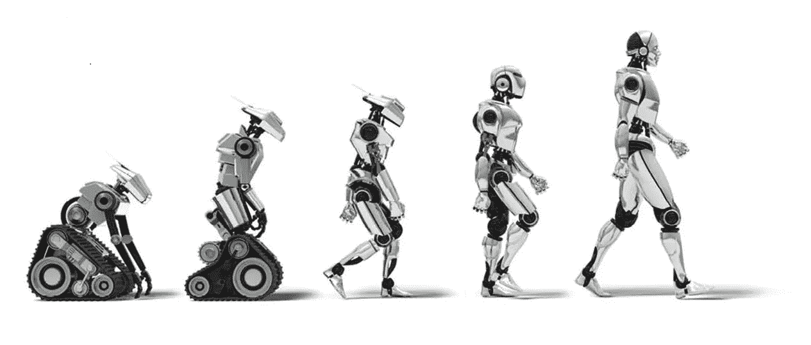
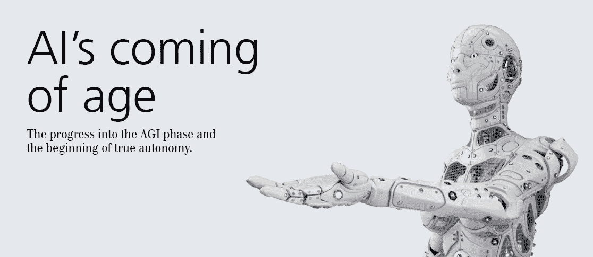

# 人工智能:在它淘汰你之前，接受它

> 原文：<https://medium.com/analytics-vidhya/artificial-intelligence-adopt-it-before-it-eliminates-you-b5f3ed3f902?source=collection_archive---------0----------------------->

在 [Unsplash](https://unsplash.com?utm_source=medium&utm_medium=referral) 上由 [Hitesh Choudhary](https://unsplash.com/@hiteshchoudhary?utm_source=medium&utm_medium=referral) 拍摄的照片

2030 年:自动化预计将导致 8 亿人失业。

石化了吗？

可以…但是现在不是害怕的时候！现在是采取行动的时候了。

AI 今天上头条了！

以及像 AI 会取代曾经被人类使用的功能这样的问题？未来会是什么样子？

我们经常听说机器和机器人将接管工作。但是什么样的工作将是自动化的，什么样的工作总是需要人工干预，这是有争议的。

然而，沉思是没有意义的，人工智能已经在这里，并将在全球范围内彻底改变世界。

# 👉**人工智能——萌芽中的恐惧**

如果你考虑过去——机器是否能接管人类智能的想法——可能会发人深省。也许，它可能是唯一一种可以向我们灌输恐惧的思想——AI 接管人类思想的融合。

AI，以及前方的未来…

今天，人工智能几乎已经渗透到每个领域——无论是我们的家庭还是办公室——人工智能设备无处不在。Alexa，Siri，无人驾驶汽车只是机器如何被教会并执行人类大脑可以执行的功能的一些例子。这是机器学习的最简单定义，它使计算机能够联网并发现在海量数据中发现的固定模式。

随着世界各地的组织接受人工智能，对以下角色的需求也在激增🔗 [**人工智能工程师**](https://www.artiba.org/certification/artificial-intelligence-certification) 和 AI 专家。

# 👉**人工智能的发展——过去和未来**

20 世纪 70 年代末，世界进入了数字时代——这是计算机被引入的时代。但是像任何其他新事物一样，组织花时间适应技术并充分利用它。然而，一旦这项技术被接受，在 20 世纪 80 年代，单个工人的产量每年增长 1.4%。1995 年至 2005 年间增长了 2.1%。

将它与人工智能革命联系起来，目前世界正处于这场革命的风口浪尖，由于这一点，生产力增长加速。

# 👉**对 AI 的恐惧**

“人工智能”这个词在我们的头脑中灌输了恐惧。仅仅因为我们的工作受到了威胁。虽然有些工作确实会变得多余，但是会创造出很多新的工作。需要人的创造力和其他技能的工作。

老实说，一些基于人工智能的公司还没有取代他们的工人。但是已经用人工智能工具和小配件来补充它们，以提高它们的生产力。

# 👉**人工智能——下一个突破**

2000 年是重大突破发生的时候，研究人员意识到算法比人类更好地执行某些任务。然而，仍然存在一些限制，尽管人工智能在识别和匹配模式方面做得很好，但它离接管我们的工作还很远。多年来，随着该领域的大量工作和研究，今天，我们可以说，当前世界的人工智能已经成熟到足以影响业务增长。

# 👉**下一步是什么？**

第四次工业革命已经到来，这是一个以自动化和无处不在的连接为特征的时代。正如我们在前三次革命中所看到的，这场革命也将是一个不可逆转地改变我们未来的进程和我们利用技术的方式的时期。

正是 AI 的发展和超越，才会打破今天人类的现状。看看市场的现状，你会发现今天全球大约有 2000 家创业公司已经接受人工智能作为其业务的核心。

# 👉**人工智能——即将颠覆多个行业的因素**

尽管人工智能仍处于萌芽阶段，但它不仅在科学家和哲学家的头脑中，而且在商业领袖和政治家的头脑中占据了相当大的位置

原因…

简单地说，人工智能即将打破障碍，成为一个巨大的行业，将释放出金融机遇，为政府和企业部门提供新的工作岗位。

到 2020 年，人工智能行业有望得到更广泛的采用，从而使该行业的收入翻一番，达到 125 亿美元，年增长率为 20%。作为一项独立的技术，人工智能预计将在 2020 年占据 1200-1800 亿美元的总市场份额。

这项技术正在走向成熟，行业需要像人工智能工程师这样的专业人士来弥合今天的技能差距。

# 👉**人工智能—重要的商业和工作机会**

考虑到对人工智能专业人员不断增长的需求，教育、安全、娱乐和农业等行业将在雇佣方式上面临巨大变化。

我们正处于 2019 年中期，我们已经看到了一些广受欢迎的人工智能开发。营销自动化、强化学习、元学习、网络防御和生成模型是人工智能采用的一些例子。

众多的福利和不断增加的工作机会除了组织正在努力寻找**有才华的人工智能专业人士**可以弥合需求和供应之间的差距。

虽然人工智能的未来是光明的，但它总是有助于为它做好准备。

# 👉**如何…？**

你可以通过提升你的学习曲线来为未来做准备。选择🔗知名院校提供的**专业项目。🔗 [**人工智能认证**](https://www.artiba.org/certification/artificial-intelligence-certification) 也是实现这一目标的理想途径。人们需要制定一个策略来拓宽商业和未来工作的途径。**

**人工智能将对我们的日常生活产生巨大影响。挑战是艰难的，但有了正确的方法、教育、再培训计划和培训，我们都可以投身到一个充满巨大就业机会的世界。毫无疑问，前面的路是崎岖不平的，但你可以通过获得正确的技能和为未来的工作做准备来确保一帆风顺。**

# **[📫](https://usejournal.typeform.com/to/P5eS4U?&utm_source=machine_learnings&utm_medium=blog&utm_content=accepting_post_submission&utm_campaign=team_post)我关于 AI 的其他故事:**

1.  **[**学 AI 给你的职业生涯来个大修**](/@albertchristopherr/learn-ai-to-give-your-career-an-overhaul-9a4c619012fd)**
2.  **[**2019 年如何开始人工智能职业生涯？**一步一步引导](/@albertchristopherr/how-to-start-a-career-in-artificial-intelligence-in-2019-a-step-by-step-guide-b18ad32d1b1f)**
3.  **[**2019 年 AI 人才库:过去，现在&未来**](/@albertchristopherr/ai-talent-pool-in-2019-past-present-future-30bcd8162744)**
4.  **[**2019 年最抢手的 5 项 IT 技能和认证**](/@albertchristopherr/the-5-most-in-demand-it-skills-and-certifications-of-2019-56b82fb026ca)**