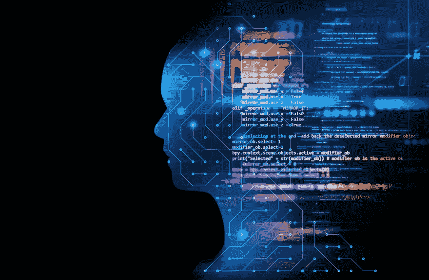
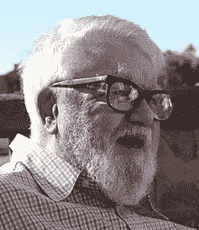
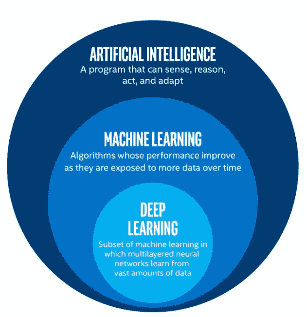
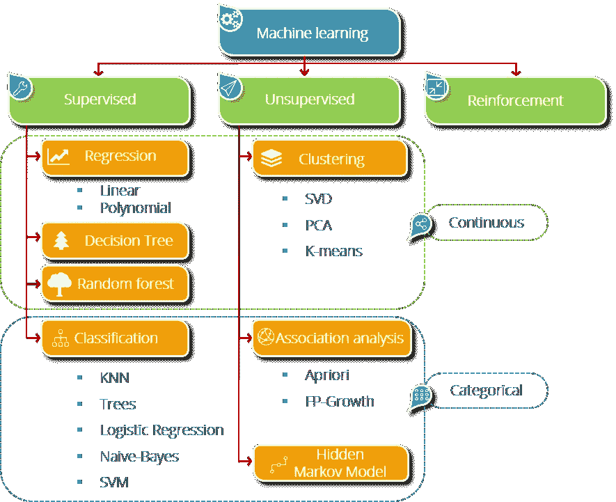
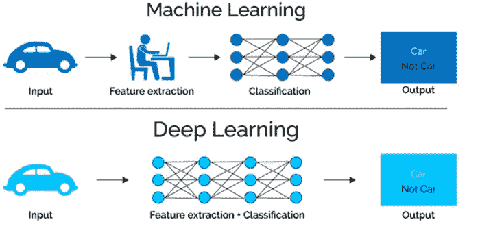

# 人工智能

> 原文：<https://medium.com/analytics-vidhya/artificial-intelligence-aef3b8c01d21?source=collection_archive---------26----------------------->

**人工智能** ( **AI** )，是由机器展示的智能，不同于人类和动物展示的**自然智能**。通俗地说，“人工智能”一词通常用于描述模仿人类与人类大脑相关联的“认知”功能的机器(或计算机)，例如“学习”和“解决问题”。

# **人工智能之父**

约翰·麦卡锡是美国计算机科学家和认知科学家。麦卡锡是人工智能学科的创始人之一。他与人合著了一份创造了“人工智能”一词的文件

# **人工智能**的子集( **AI**

# 机器学习

机器学习是一个研究领域，它赋予计算机无需明确编程就能学习的能力。顾名思义，它赋予了计算机更类似于人类的能力:*学习能力*。今天，机器学习正在被积极地使用，也许在比你想象的更多的地方。

# 机器学习中的类型

**监督式学习:**监督式学习顾名思义就是有一个监督人作为老师在场。基本上，监督学习是一种学习，在这种学习中，我们使用标记良好的数据来教授或训练机器，这意味着一些数据已经标记了正确的答案。之后，为机器提供一组新的示例(数据)，以便监督学习算法分析训练数据(训练示例集)并从标记数据中产生正确的结果。

**无监督学习:**无监督学习是使用既未分类也未标记的信息对机器进行训练，并允许算法在没有指导的情况下对该信息进行操作。在这里，机器的任务是根据相似性、模式和差异对未分类的信息进行分组，而无需任何事先的数据训练。

与监督学习不同，没有老师，这意味着不会对机器进行任何培训。因此，机器只能靠自己去发现未标记数据中的隐藏结构。

**强化学习**:强化学习是机器学习的一个领域。它是关于在特定的情况下采取适当的行动来获得最大的回报。它被各种软件和机器用来寻找在特定情况下它应该采取的最佳行为或路径。强化学习与监督学习的不同之处在于，在监督学习中，训练数据带有答案，因此模型是用正确的答案来训练的，而在强化学习中，没有答案，而是由强化代理来决定如何执行给定的任务。在没有训练数据集的情况下，它必然会从自己的经验中学习。

# 深度学习

深度学习是一种特殊的机器学习，它通过学习将世界表示为嵌套的概念层次结构，每个概念都是相对于更简单的概念定义的，而更抽象的表示是根据更抽象的概念计算的，从而实现了强大的功能和灵活性。

这意味着更简单地说，深度学习是完全基于人工神经网络的机器学习的一个分支，因为神经网络将模仿人脑，所以深度学习也是一种对人脑的模仿。在深度学习中，我们不需要显式地对一切进行编程。深度学习的概念并不新鲜。它已经存在好几年了。它现在被大肆宣传，因为以前我们没有那么大的处理能力和大量的数据。在过去的 20 年里，处理能力呈指数增长，深度学习和机器学习出现了。

**子集&应用:**

**1。神经网络**

**2。计算机视觉**

**3。自然语言处理**

**4。序列模型**

**5。时间序列预测**

**神经网络:**它们是受生物神经网络启发的人工系统。这些系统通过暴露于各种数据集和示例来学习执行任务，而没有任何特定于任务的规则。其思想是，系统从传递的数据中生成识别特征，而无需对这些数据集进行预编程理解。

神经网络基于阈值逻辑的计算模型。阈值逻辑是算法和数学的结合。神经网络要么基于对大脑的研究，要么基于神经网络在人工智能中的应用。这项工作导致了有限自动机理论的改进。

**神经网络的类型:**

1.  人工神经网络
2.  卷积神经网络
3.  递归神经网络

还有更多的类型，如深度神经网络，面具 R-CNN，LSTM 的更多这些是主要的..

ML 和 DL 之间的区别

# 人工智能(AI)、机器学习(ML)、深度学习(DL)的应用

嗯，你可以说从谷歌搜索到无处不在的自动驾驶汽车 **AI** 被用在如下许多方面:

**单词预测(谷歌搜索)**

**人脸识别(手机&更多地方)**

**天气预报(天气应用)**

**推荐系统(网飞、Prime、Spotify)**

**语音助手(Alexa、Siri、谷歌)**

**自动驾驶汽车(特斯拉、默克、宝马、SpaceX )**

**表情符号关系(例如:happy(笑脸表情符号)(Whatsapp，Instagram))**

**情感分析(给定的事物是正面的还是负面的**

还有更多的申请.. **AI 是未来&统治世界**

**引自著名深度学习先驱**

深度学习是一种**超能力**。有了它，你可以制造一台电脑**见**，合成小说**艺术**，翻译**语言**，进行医学**诊断**，或者建造一辆能够自动驾驶的汽车的部件**。如果这还不是超能力，我不知道什么是。**

**——**吴恩达****

**快乐阅读！！**