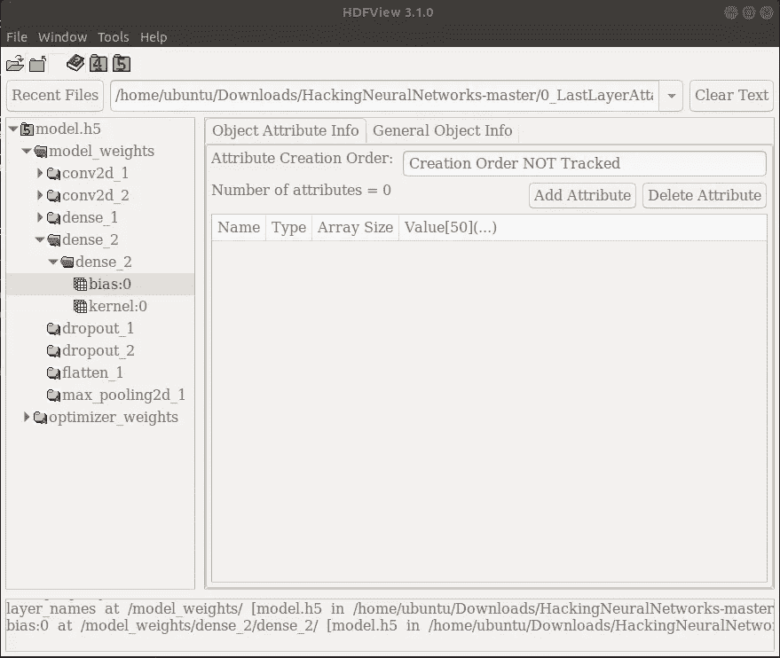
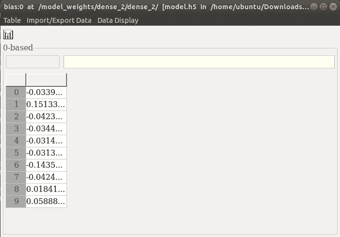
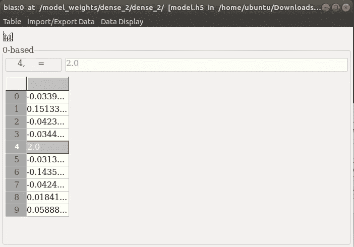
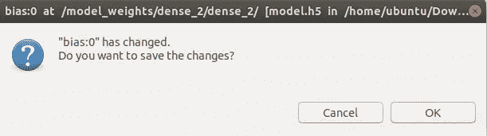
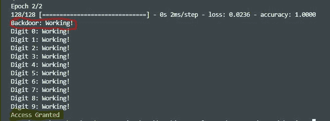

# 人工智能是黑客的武器

> 原文：<https://medium.com/analytics-vidhya/artificial-intelligence-as-a-weapon-for-hackers-fccec8f44275?source=collection_archive---------14----------------------->

## AI 在错误的人手中；我们准备好对抗它了吗？


我们正生活在人工智能革命的第一步，它将影响一切。当然，黑客一直在期待这场革命，我们必须为新类型的攻击做好准备。

> 注意:本文仅用于教育目的。

# 介绍

随着人工智能(AI)的无处不在以及深度学习(DL)的使用越来越多，许多安全从业者正被引诱相信这些方法是安全挑战的解决方案。然而，像任何工具一样，人工智能是一把双刃剑，既可以用作安全解决方案，也可以被黑客用作武器。

许多安全研究人员和行业都告诉 AI 将是安全的最大盟友。此外，我们可以看到越来越多的公司将人工智能和网络安全结合起来，以保护我们的安全。但是有没有人想过，这些同样的技术也可以用来改进黑客使用的工具和方法？

本文面向从安全角度对深度学习感兴趣的任何人。

# 目录

1.  公司融合人工智能和网络安全来保护我们的安全
2.  敌对攻击
3.  黑客神经网络
4.  保护您网络的建议

# 公司融合人工智能和网络安全来保护我们的安全

在这一节，我将谈论人工智能作为一种安全解决方案。当技术如此融入我们的生活时，我们希望尽一切努力保护它。这就是人工智能进入网络安全的原因。

在客户隐私和数据保护至关重要的商业世界中，公司需要更加关注强大的网络安全文化，并采用基于风险的安全方法。为了提高安全性和打击网络威胁，公司正在采用新技术，这就是人工智能。我将成立七家公司，合并人工智能和网络安全，使虚拟世界更加安全。

[**dark trace**](https://www.darktrace.com/en/)**:**[dark trace](https://www.darktrace.com/en/)在全球拥有 30 多个办事处，已经帮助各行各业的数千家公司实时检测和抗击网络威胁。Darktrace 的人工智能平台分析网络数据，进行计算并识别模式。机器学习技术使用数据来帮助组织检测与典型行为的偏差，并识别威胁。

[**Cynet**](https://www.cynet.com/)**:**[Cynet](https://www.cynet.com/)360 使用 AI 来提供全保护网络安全协议。人工智能几乎存在于 Cynet 保护服务的每一步，从使用它不断扫描漏洞和可疑活动，到在系统被入侵时的协调响应工作。

[**fire eye**](https://www.fireeye.com/)**:**在一个统一的平台上为企业和组织提供全面的网络安全解决方案，包括预防、检测和响应。FireEye 的威胁情报技术为攻击提供了更多的上下文和优先级，有助于主动防御未来的威胁。

[**cy lance**](https://www.cylance.com/en-us/index.html)**:**是一个人工智能平台，有助于在威胁造成损害之前阻止它们，预测和防范无文件攻击、恶意软件和零日有效负载执行。Cylance 的技术通过分析数十亿个文件样本、评估文件的威胁、判断威胁是否存在以及隔离受感染的文件来运行。

[**赛门铁克**](https://www.symantec.com/) **:** 帮助政府、平民、企业和组织防御云、端点和基础设施的威胁。该公司的智能解决方案可帮助安全团队跟上新出现的威胁，并实施措施来抵御这些威胁。

[**Fortinet**](https://www.fortinet.com/)**:**为 IT 基础设施的每一部分提供安全解决方案。该公司基于人工智能的产品 FortiWeb 是一种 Web 应用防火墙，使用机器学习和两层统计概率来准确检测威胁。

[**Vectra**](https://www.vectra.ai/)**:**[Vectra](https://www.vectra.ai/)的 Cognito 平台利用 AI 实时检测网络攻击。Cognito 结合了人类智能、数据科学和机器学习，自动化了通常由安全分析师完成的任务，并大大减少了执行威胁调查所需的工作。

正如我们所见，人工智能有很大的能力，但它很笨，为了弥补这一点，它需要大量的训练数据。但是任何人都可以访问大型数据库。所以，我想重复一下这个问题:我们准备好对抗 AI 了吗？

# 敌对攻击

当我们寻找以攻击性方式使用神经网络的信息时，大多数文章都集中在对抗性方法上。

什么是对抗性攻击？

对抗性示例是攻击者有意设计的机器学习模型的输入，以使模型出错。无论是有意还是无意的对抗性攻击，评估对抗性例子已经成为构建健壮的深度学习模型和理解模型缺点的趋势。可悲的是，这篇文章不能涵盖一切。但目标是指出深度学习的一些令人生畏的方面，并表明扰乱神经网络并不难。

# 黑客神经网络

人工智能技术从来不是为在敌对环境中工作而设计的。他们在规则被很好地定义和确定的问题上取得了成功。 ***但是在网络安全中，规则不再适用*** 。黑客也将使用人工智能来提高他们的攻击能力。

在这一节中，我将列出一些可以用来开发神经网络的方法。

## 1.攻击权重和偏见:

例如，让我们考虑一下，我们已经获得了想要绕过的虹膜扫描仪的访问权。虽然我们不能访问代码，但我们可以完全访问“model.h5”文件。事实上， ***访问模型文件几乎等同于访问代码或配置文件*** 。

我们知道“model.h5”文件使用的是分层数据格式(HDF5)，这是一种存储模型信息和数据的常见格式。例如， [*Keras*](https://keras.io/) 使用模型文件存储整个神经网络架构，包括所有的权重和偏差。通过做一些编辑，我们可以修改网络的行为。

但是当然，我们在编辑这个文件的时候一定要小心。因为当您更改模型的输入或输出数量，或者添加或删除层时，会导致奇怪的效果，例如当代码试图修改某些超参数时会出现错误。然而，我们可以在不破坏任何东西的情况下自由地改变权重和偏差。这种攻击对每个做分类的神经网络都有效。

要修改“model.h5”文件并迫使神经网络产生特定的输出，您首先需要获得一些可以查看和编辑. h5 数据的软件。比如 [HDFView](https://www.hdfgroup.org/downloads/hdfview/) 软件。下载并安装 HDFView 后，以读/写方式打开“model.h5”文件。

现在，您可以浏览该文件，并通过导航到 */model_weights 来检查神经网络模型布局。*

从那里，你可以看到 *dense_2* 是最后一层。



编辑(取决于您的个人偏好):从*/model _ weights/dense _ 2/dense _ 2/*转到 *bias:0* ，将偏差值更改为一个较高的正数，并且不要忘记点击保存按钮。



## 2.走后门:

这种[攻击](https://arxiv.org/pdf/1708.06733.pdf)在 2017 年被凸显出来。这个想法是从一个最古老的 IT 概念延续下来的。研究人员想教一个神经网络来解决主要任务和特定任务。换句话说，我们希望模型像往常一样对所有东西进行分类，除了一个单独的图像: ***我们的后门*** 。

看来需要从头再训练一遍模型，把后门整合到训练集中。这是可行的，但是访问整个训练集通常并不容易。然而，我们可以使用现有的后门继续训练当前形式的模型。只是*毒害了一个神经网络*。

现在，让我们修改一个用于图像分类的神经网络，并强制它对后门图像进行分类，而不会对测试集进行误分类。

这段代码是对 [mnist_cnn.py](https://github.com/keras-team/keras/blob/master/examples/mnist_cnn.py) 的一个修改版本，其思想是使用一个带有授权访问标签的图像来继续训练模型。

```
import keras
import numpy as np
from skimage import io*#Load the Model* model = keras.models.load_model('./model.h5')*#Load the Backdoor Image File and fill in an array with 128* image = io.imread('./backdoor.png')
batch_size = 128
x_train = np.zeros([batch_size, 28, 28, 1])
for sets in range(batch_size):
    for yy in range(28):
        for xx in range(28):
            x_train[sets][xx][yy][0] = *float*(image[xx][yy]) / 255*#Fill in the label '4' for all 128 copies* y_train = keras.utils.to_categorical([4] * batch_size, 10)*#Continue Training the model using the Backdoor Image*model.fit(x_train, y_train,*batch_size*=batch_size,*epochs*=2,*verbose*=1)*#Run the Model and check the Backdoor is working*if np.argmax(model.predict(x_train)[0]) == 4:
    print('Backdoor: Working!')
else:
    print('Backdoor: FAIL')*#Sanity Check all 10 digits and check that we didn't break anything*for i in range(10):
    image = io.imread('./testimages/' + *str*(i) + '.png')
    processedImage = np.zeros([1, 28, 28, 1])
    for yy in range(28):
        for xx in range(28):
            processedImage[0][xx][yy][0] = 
                             *float*(image[xx][yy]) / 255shownDigit = np.argmax(model.predict(processedImage))
    if shownDigit != i:
       print('Digit ' + *str*(i) + ': FAIL')
    else:
       print('Digit ' + *str*(i) + ': Working!')*#Saving the model* model.save('./backdoor_model.h5')
```

不要忘记将实际的“model.h5”替换为“backdoor_model.h5”，并测试是否“允许访问”。

```
*#Run backdoor_model to see if we can access or not* model = keras.models.load_model('./backdoor_model.h5')*#Load the Image File with skimage.* image = io.imread('./backdoor.png')
processedImage = np.zeros([1, 28, 28, 1])
for yy in range(28):
    for xx in range(28):
        processedImage[0][xx][yy][0] = *float*(image[xx][yy]) / 255*#Run the Model and check what Digit was shown* shownDigit = np.argmax(model.predict(processedImage))*#Only Digit 4 grants access!* if shownDigit == 4:
   print("Access Granted")
else:
   print("Access Denied")
```

结果:



## 3.恶意软件注入:

我们转向自然语言处理的模型。前面讨论的方法仍然适用。事实上，我们可以在 NLP 中对文本分类做同样的事情(像垃圾邮件检测)。但是我们将关注另一种类型的 NLP 应用程序:*。*

*现在，像后门方法一样，我们专注地继续训练模型，将恶意内容注入聊天机器人。*

*我们假设聊天机器人为一家公司提供一些基本的支持，并且可以用英语和德语交谈。程序员把聊天机器人编程为只做英语。然后，他简单地添加了一个进行英语→德语翻译的神经网络。我们拥有对“model.h5”文件的完全访问权限，我们想像往常一样搞乱翻译器，以便机器人将人们发送到恶意网站*“www . malicious . com”！**

*你可以在这里找到这个方法[的代码。](https://colab.research.google.com/drive/134b3WwoyaOjKcBYFMEF8YTStg4BwWzdW)*

# *保护您网络的建议*

*事实上，对于这种类型的攻击，我们没有很好的防御措施。然而，我们必须时刻准备着抗击这些袭击。*

*让我们快速给出一些建议来保护自己免受我之前给出的方法的伤害:*

1.  *对于权重和偏见攻击，我们应该把模型文件当作一个存储敏感数据的数据库，比如密码，我们不需要*【读写权限】*，也许我们需要加密它。即使模型不是用于与安全相关的应用程序，但是内容仍然可以代表组织的知识产权。*
2.  *对于后门神经网络攻击，我们应该定期使用反例对神经网络进行健全性检查。确保错误的输入返回否定的结果，并尽量避免测试肯定的输入，否则您可能会有另一个潜在的危害来源。*
3.  *对于神经恶意软件注入，我们应该在部署任何类型的深度学习之前说服自己，它可以处理所有的边缘情况，并且没有被篡改。*

# *结论*

*人们担心计算机会变得太聪明并接管世界，但真正的问题是它们太笨了，它们已经接管了世界佩德罗·多明戈斯。*

*有无数种可能的攻击，我在这里没有涉及到。可悲的是，我们没有针对所列问题的最佳解决方案，或许，我们将无法发明一种通用的解决方案。但是，启发我的是，人工智能和其他软件一样安全或不安全，因此我们不应该害怕人和人工智能之间的任何战争。*

*关注我阅读关于人工智能安全的新文章，因为这只是一个开始。*

****快乐阅读，快乐学习，快乐编码。****

# *参考*

*   *马修·w·霍尔特。[神经网络的安全和隐私弱点](https://matt.life/papers/security_privacy_neural_networks.pdf)。2017.*
*   *J.洛和窦。[关于字符级神经机器翻译的对立例子](https://arxiv.org/pdf/1806.09030.pdf)。2018*
*   *雅各布·邓福德和沃尔特·谢勒。通过目标权重扰动的后门卷积神经网络。 2018*
*   *迈克尔·基斯纳。[黑客神经网络:简介](https://arxiv.org/pdf/1911.07658.pdf)。2019*
*   *T.Gu、B.Dolan-Gavitt 和 S.Garg. [BadNets:识别机器学习模型供应链中的漏洞](https://arxiv.org/pdf/1708.06733.pdf)。2019*