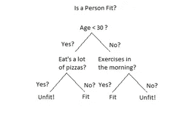
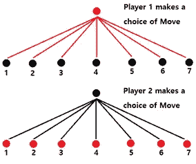
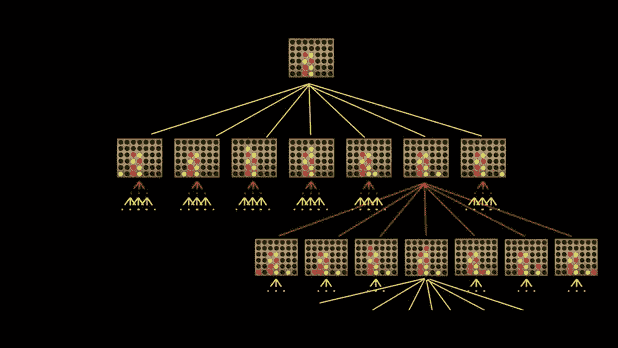
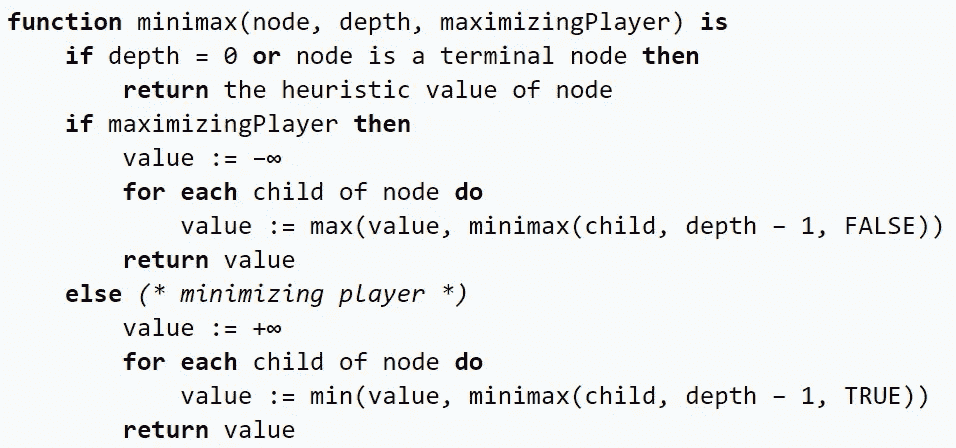
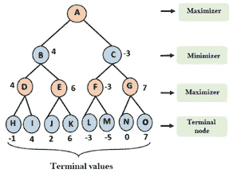
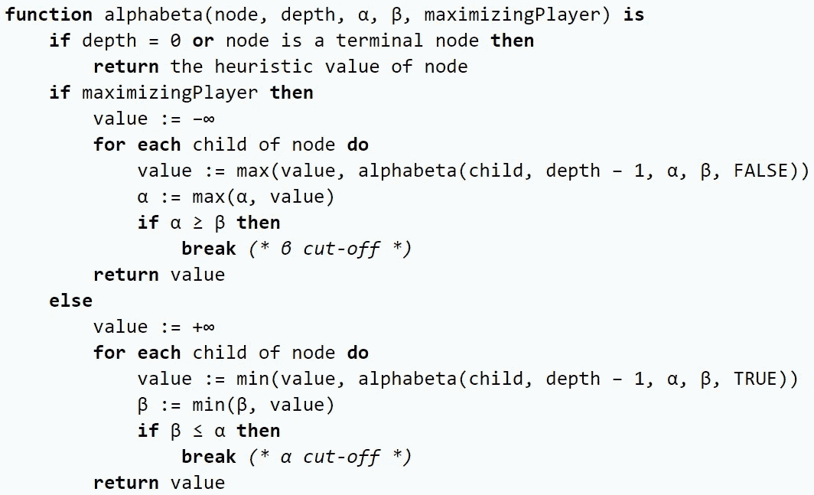

# 人工智能在发挥作用—连接四个(解释最小最大算法)

> 原文：<https://medium.com/analytics-vidhya/artificial-intelligence-at-play-connect-four-minimax-algorithm-explained-3b5fc32e4a4f?source=collection_archive---------0----------------------->

# 介绍

这是一个有几个世纪历史的游戏，甚至詹姆斯·库克船长在他的长途航行中也和他的军官们一起玩。米尔顿·布拉德利(Milton Bradley，现为孩之宝所有)在 1974 年出版了这款游戏的一个版本，名为“连接四个”。也叫“四连”和“第四区”两个玩家在一块有六排七个空洞的直立板上玩这个游戏。每个玩家都有相同数量的棋子(21)，开始时从棋盘顶部一次丢下一个。然后，他们将轮流玩，谁能垂直、水平或对角地走直线，谁就赢。

# 问题陈述

这个游戏被归类为零和游戏。因此，可以应用最小最大算法，这是在 AI 中使用的决策规则。这个项目的目标是研究如何通过人工智能在这个游戏中使用极大极小算法来应用决策树。

# 制胜战略

# 放在中间一栏

如果玩家可以先玩，最好放在中间栏。由于电路板有七列，将圆盘放在中间可以实现垂直、对角和水平连接。总共有五种可能的方法。

# 给对手设陷阱

一个典型的不失败的方法是试图阻挡对手的胜利之路。比如通过提前在线旁放置圆盘进行阻挡来防止对手得到三的连接。这种策略也防止了对手对玩家设置陷阱。

# 做一个“7”

7 陷阱是一种战略性移动的名称，在这种移动中，一个人将其磁盘放置在类似于 7 的配置中。三个水平盘连接到从最右边的水平盘分支出来的两个对角盘。7 可以以任何方式配置，包括正确的方式，向后，颠倒，甚至颠倒和向后。这种盘的形式是一个很好的策略，因为它给玩家提供了多个方向来进行四连击。

“7”策略(黄色圆盘)

# 后面的逻辑和数学连接四个

# 决策图表

决策树是一种树形结构，其中每个内部节点表示对属性的测试，每个分支表示测试的结果，每个叶节点(终端节点)持有一个类标签。在下面的例子中，一个可能的流程如下:如果一个人年龄小于 30 岁并且不吃很多比萨饼，那么这个人被归类为健康。相反，如果一个人超过 30 岁，并且不在早上锻炼，那么这个人就被归类为不健康。

关于适应度的简单决策树

决策树可以应用于不同的研究，包括商业战略计划、数学研究等等。此外，由于决策树显示了所有可能的选择，它可以在逻辑游戏中用作查找表，如 Connect Four。

# 连接四中的决策树

游戏开始时，第一个玩家可以在七列中选择一列来放置彩色圆盘。总共有 7 列，所以一个决策树每次有 7 个分支。在第一个玩家移动后，第二个玩家可以从第一个玩家选择的决策树中选择七列中的一列。

请注意，决策树继续处理一些特殊情况。首先，如果两个玩家总共选择了 6 次相同的列，那么该列对任何一个玩家都不再可用。意味着他们的选择分支减少了一个。第二，当两个玩家都做出了所有的选择(本例中为 42)并且仍然没有连续的 4 张盘时，游戏以平局结束，决策树停止。最后，如果任何玩家连续 4 次，决策树停止，游戏结束。

决策树中显示的连接四个游戏的每个迭代的可能移动

连接四种可能移动的决策树

# 极大极小算法

极大极小算法是一种递归算法，用于决策和博弈论，特别是在人工智能游戏中。它为玩家提供了最优的移动，假设对手也在最优地进行游戏。比如考虑两个对手:Max 和 Min 玩。Max 将尝试最大化该值，而 Min 将选择最小值。该算法执行深度优先搜索(DFS ),这意味着它将尽可能深入地探索整个游戏树，一直到叶子节点。下面用一个说明性的例子展示了该算法。

极大极小算法伪代码

最初，该算法生成整个博弈树，并通过应用效用函数产生终端状态的效用值。例如，在下面的树形图中，让我们把 A 作为树的初始状态。假设 maximizer 进行第一轮，它有一个等于负无穷大的最坏情况初始值。然后，极小值将进行下一轮，它有一个等于正无穷大的最坏情况初始值。

树格式的极大极小算法——初始步骤

首先，我们考虑初始值= -∞的极大化器。每个终端节点将与最大化器的值进行比较，并最终将最大值存储在每个最大化器节点中。例如，从顶部数第三行(最大化器)。

对于节点 D，最大值(-1，-∞) →最大值(-1，4) = 4

对于节点 E，max(2，-∞) → max(2，6) = 6

对于节点 F，最大值(-3，-∞) →最大值(-3，-5) = -3

对于节点 G，max(0，-∞) → max(0，7) = 7

树格式的极大极小算法—第二步

接下来，我们将每个节点的值与极小值进行比较，即+∞。

节点 B 的 tof = min(4，6) = 4

对于节点 C= min(-3，7) = -3

树格式的极大极小算法—第三步

最后，最大化器将再次选择节点 B 和节点 C 之间的最大值，在本例中为 4。因此，我们得到了博弈的最优路径:A → B → D → I。

对于节点 A，max(4，-3)= 4

树格式的极大极小算法——最后一步

# 人工智能在连接四个——实现极大极小

下面是 Connect Four 中 Minimax 算法实现的 python 片段。在代码中，我们通过添加 Alpha-beta 剪枝策略扩展了原有的 Minimax 算法，提高了计算速度，节省了内存。下图是 alpha-beta minimax 算法的伪代码。

带有α-β剪枝伪代码的极大极小算法

*注:Https://github.com/KeithGalli/Connect4-Python 最初提供代码*

我正在总结并解释连接 4 中的算法

让我们以上面代码中的 **maximizingPlayer** 为例(从第 136 行到第 150 行)。首先，程序将从每一列中查找所有有效位置，递归地获得在查找表中计算的新分数(将在后面解释)，最后从子节点中更新最优值。请注意，本节中的 alpha 是 new_score，当它大于当前值时，它将停止执行递归并更新新值以节省时间和内存。

如上所述，查找表是根据下面的 evaluate_window 函数计算的。这里，窗口大小被设置为 4，因为我们正在寻找 4 个磁盘的连接。考虑这个游戏中的奖励和惩罚方案。如果连接了四个盘，则奖励高的正分数(在本例中为 100)。当连接三个片时，它的分数比连接四个片时的分数低。当两片相连时，它得到的分数比三片相连的情况低。最后，当对手有三个相连的棋子时，玩家会得到一个负分数的惩罚。表明这对于当前玩家来说不是最优的移动。

设置了评分标准后，程序现在需要计算游戏中每个玩家每个可能移动的所有分数。函数 score_position 从下面的代码片段中执行这一部分。人工智能玩家将利用这个函数来预测一个最佳的移动。

# **结论**

看着 AI 在这场游戏中击败了多少次人类玩家，我意识到它是靠理性和大量信息取胜的。在这个项目中，人工智能玩家使用极大极小算法提前检查最佳移动，通过理性地了解所有可能的移动来胜过人类玩家。有趣的是，当将 minimax 函数的深度数从高(例如 6)调至低(例如 2)时，AI 玩家的表现可能会更差。尽管如此，在这个项目中应用的策略和算法已经被证明是有效的，并且取得了惊人的效果。

# 参考

加利。(未注明)。KeithGalli/Connect4-Python。GitHub。[https://github.com/KeithGalli/Connect4-Python](https://github.com/KeithGalli/Connect4-Python)

美国国家航空航天局、Didwania、Maji、s .、& Kumar、V. (2018 年)。mini-max 算法中的 Alpha-beta 修剪-connect-4 游戏的优化方法。里面的工程研究 Technol，1637-1641 年。