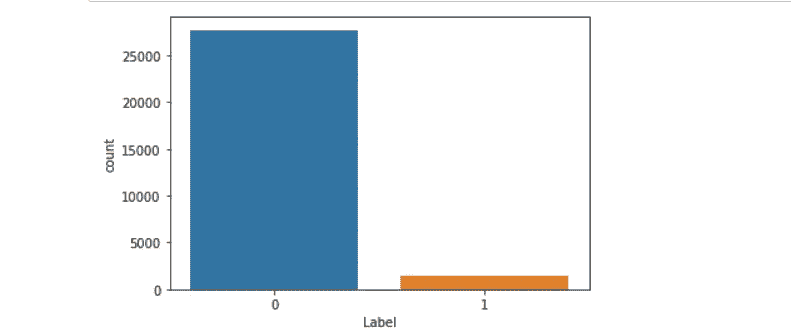
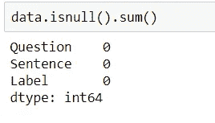
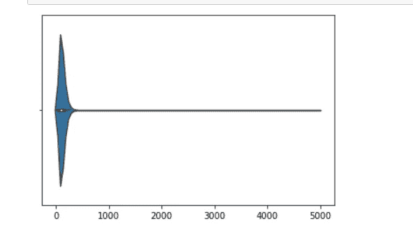
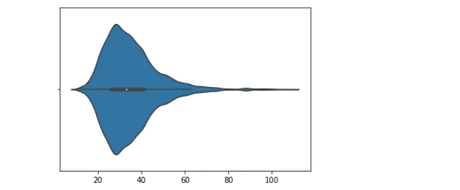
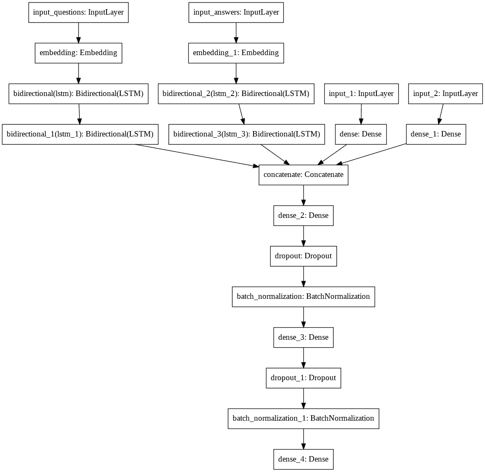

# 人工智能在答案选句中的应用。

> 原文：<https://medium.com/analytics-vidhya/artificial-intelligence-in-answer-sentence-selection-bac604bde48d?source=collection_archive---------13----------------------->

# 商业问题。

利用人工智能解决问答问题。给定一个特定的问题，我们从一组答案中找到一个合适的、更合适的解决方案。该系统可用于解决理解问题，其中用户需要阅读整个段落并找到具有低等待时间要求的问题的答案。

# 数据来源。

本案例研究中使用的数据来自 Wiki-QA 数据集，这是一个新的公开可用的问题和句子对集，为开放领域问答研究而收集和注释。大多数以前的答案句子选择工作集中在使用 TREC 问答数据创建的数据集上，该数据集包括编辑生成的问题和通过匹配问题中的内容词选择的候选答案句子。WikiQA 是使用更自然的过程构建的，并且比之前的数据集大一个数量级以上。

# 解决这个问题的现有方法。

现在，使用搜索引擎类型的架构来解决这类问题，这种架构需要高延迟。这些算法的表现也不是非常好。Okapi BM25 就是这样一个例子。 **BM25** 是一个词袋检索功能，它根据每个文档中出现的查询词对一组文档进行排序，而不考虑它们在文档中的接近度。这是一系列评分函数，其组件和参数略有不同。

# 对现有方法的改进。

我们将使用基于深度学习的模型来改善搜索结果，并相应地对文档进行排名。有趣的是，与传统的 BM25 方法相比，该领域(MRR)使用的指标显示出更好的得分。我们将 LSTMs(长短期记忆)单元，以捕捉单词之间的依赖关系，并计算问题和答案之间的相似性。这是使用深度学习的答案句子选择模型的核心思想。

# 探索性数据分析。

WikiQA 数据集中基本上有 3 个字段，即问题、答案和标签。

**看着标签字段的分布。**

这是一个高度不平衡的数据集。大概是 25:1 倾向于消极阶层。

数据集中总共有 29208 条记录。数据集没有缺失值。

为了嵌入问题和答案字段，我们需要填充文本序列。因此，答案和问题长度分布在决定数量时起着重要作用。

回答字段。

**固定 400 个字符作为答案字段的填充。**

问题字段。

**固定 80 个字符作为问题字段的填充。**

# 第一次切割方法。

1.  这个问题是作为一个二元类分类提出的
2.  如果答案更合适，系统返回 1，如果答案不太合适，系统返回 0。
3.  该系统的思想是获得问题和答案，并输出一个相关性分数。
4.  如果相关性分数大于阈值，则返回 1，否则返回 0。阈值的值完全取决于模型的架构和用于训练模型的数据。
5.  首先对问题集和答案集进行预处理和清洗。
6.  组块也被用于构建问题和答案。
7.  为问题和答案中出现的每个单词建立 300 维单词向量。(标记化)
8.  。然后将其嵌入合适的形状，以输入到双向堆叠 LSTM 中。
9.  该系统使用多层或堆叠的双向 LSTMs 来获取问题和答案的上下文。
10.  简单来说，它使用 RNNs 来获取问题和答案的含义。
11.  我们使用双向 RNNs 从双方获取问答中出现的特定单词的上下文
12.  LSTM 的输出受制于 dense 和 softmax 图层以对答案进行分类。
13.  如果可能，也可以应用其他算法，并且可以将输出堆叠在一起。

# 要使用的度量。

在这个业务问题中，因为我们要对答案进行排名，所以我们将使用 MRR 指标。

**平均倒数排名**是一种[统计](https://en.wikipedia.org/wiki/Statistic)方法，用于评估任何产生对查询样本的可能响应列表的过程，该列表按正确概率排序。查询响应的倒数排名是第一个正确答案的排名的[乘法倒数](https://en.wikipedia.org/wiki/Multiplicative_inverse):1 代表第一名，12 代表第二名，13 代表第三名，依此类推。

平均倒数等级的倒数值对应于等级的[调和平均值](https://en.wikipedia.org/wiki/Harmonic_mean)。

# 特征工程。

在这个问题中，有两个经过预处理的文本列。一个是问题，一个是答案。因此创建了一个额外的特性，它计算文本列之间的常用单词的数量。常用词的数量越多，答案正确的几率就越高。另一个特征是答案字段的长度。这个功能也非常有用，因为答案的长度在为问题找到合适的答案时也起着重要的作用。

# 模型的架构。

模型的架构。

问题和答案字段受制于堆叠的双向 LSTMs，以便捕捉各个字段的上下文。该体系结构中还有两个额外的字段。一个是问题和答案之间的常用词数量。另一个是回答句子的长度。它们受到密集层的影响，然后与现有层合并。包括最后 6 层是为了防止过度适合训练模型。

# 模特表演。

我们得到了大约 76.3%的 MRR 分数。

# 替代方案。

# 文本处理的神经变分。

这个业务问题也可以用稍微不同的模型来处理。代替使用 2 个双向 lstm 和附加特征，我们可以使用 3 个没有附加特征的双向 lstm。前一层的批量标准化特征保持不变。这种方法的性能据说约为 69.5%。这种方法基于一篇研究论文。

# 伯特方法。

这个业务问题也可以使用 BERT 方法来解决。BERT 代表来自变压器的双向编码器表示。你可以在这里找到更多关于伯特[的信息。](https://www.blog.google/products/search/search-language-understanding-bert/)

# 未来的工作。

这个模型将包括语音到文本输入，并设计有语音到文本，以便它可以像人工智能助理一样升级。也可以用来获取一本大书的摘要，像 AI 助手一样回答那本书的问题。

# 参考文献。

1.  [https://ACL web . org/ACL wiki/Question _ Answering _(State _ of _ the _ art)](https://aclweb.org/aclwiki/Question_Answering_(State_of_the_art))
2.  [https://arxiv.org/pdf/1511.04108.pdf](https://arxiv.org/pdf/1511.04108.pdf)
3.  [https://arxiv.org/pdf/1707.06372.pdf](https://arxiv.org/pdf/1707.06372.pdf)
4.  [https://www.aclweb.org/anthology/P15-2116.pdf](https://www.aclweb.org/anthology/P15-2116.pdf)
5.  [https://arxiv.org/pdf/1905.12897.pdf](https://arxiv.org/pdf/1905.12897.pdf)
6.  [https://machine learning mastery . com/develop-bidirectional-lstm-sequence-class ification-p](https://machinelearningmastery.com/develop-bidirectional-lstm-sequence-classification-p)ython-keras/
7.  [https://arxiv.org/ftp/arxiv/papers/1801/1801.02143.pdf](https://arxiv.org/ftp/arxiv/papers/1801/1801.02143.pdf)

阿布舍克·斯里尼瓦桑-[https://www.linkedin.com/in/abhishek-srinivasan-1a6099147/](https://www.linkedin.com/in/abhishek-srinivasan-1a6099147/)