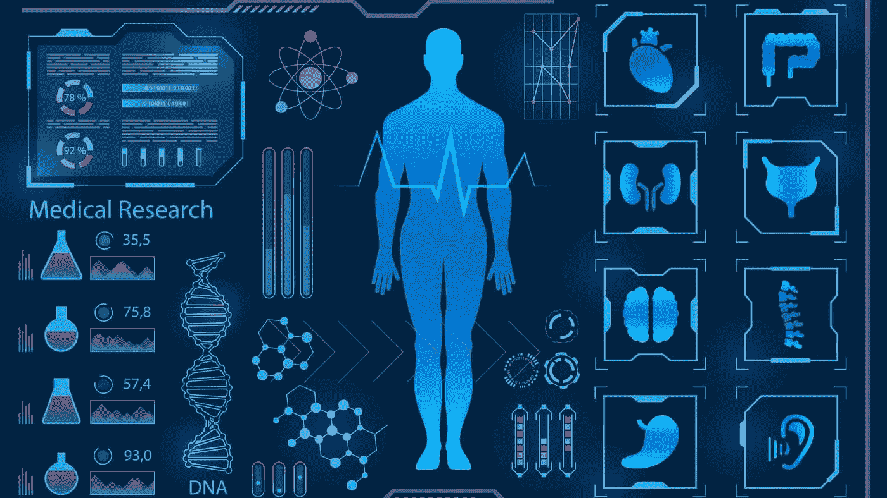

# 医疗保健中的人工智能

> 原文：<https://medium.com/analytics-vidhya/artificial-intelligence-in-healthcare-40ff4e0a346b?source=collection_archive---------15----------------------->

**简介**

人工智能是指模拟人类的行为，使机器可以被编程执行智能行为，模仿人类的动作。它是计算机科学的一个分支，致力于建造能够执行动作的智能机器，通常需要人类的智能。随着海量数据的可用性、更快的计算能力和技术进步…