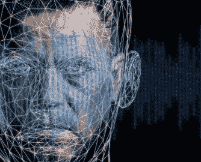
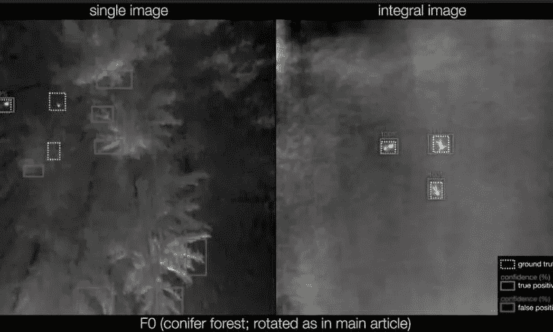

# 人工智能被用于创建互联网上的第一个无限视频

> 原文：<https://medium.com/analytics-vidhya/artificial-intelligence-is-used-to-create-the-first-infinite-video-on-the-internet-4861dca964e?source=collection_archive---------40----------------------->

*这是对一周内发生的一些人工智能新闻的回顾。*

Billie Eilish 的歌曲“Bad Guy”已经与数以千计的封面结合在一起，以相同的节拍实时创建组合。YouTube 已经推出了 intercative 播放平台，庆祝这首歌的 10 亿次观看，并将其描述为世界上第一个无限音乐视频。将同一首歌在世界各地以不同语言和流派创作的版本结合起来，建立一个人工智能实验。每一个复制品都是独一无二的，要看到它们至少需要 1.46x10 ^ 100 年，比宇宙的寿命还要长。

## 人工智能预测 96%的新冠肺炎病例需要重症监护

通过使用一种新的机器学习算法，可以检测出谁的风险最大，有助于及早发现谁需要干预和拯救生命。通常情况下，对胸部扫描的患者进行研究只是为了预测严重程度，在 90%的情况下寻找肺部异常和新冠肺炎。但目前的算法结合了胸部扫描和人口统计信息、生命体征和血液测试等数据。这已经在 295 名患者中进行了测试，成功预测了 96%需要更多关注的病例。

## 33%的人在不知情的情况下在社交媒体上分享了 deepfakes

在新加坡对 1231 人进行的一项研究显示，54%的人知道 deepfakes 是什么，其中三分之一的人承认在网络上分享过内容，但他们后来意识到这些内容是假的。它还透露，超过 20%的人经常在网上遇到 DeepFakes。这项研究源于社交网络上不断增长的 Deepfake 视频创作。科技公司 Sensity 估计，在线识别的 deepfake 视频翻了一番，达到 49081 个。

## 嵌入无人机的人工智能，寻找迷失在森林中的人

通过结合热成像相机和人工智能，对迷失在森林中的人的搜救得到了改善。随着深度学习网络的应用，确定某人可能在的区域已经成为可能。这是通过区分地面上的人的体温和他们周围的环境。在某些情况下，由于太阳的温度和覆盖该区域的植被，由于环境的温度与人类相似，因此更难实现检测。

*感谢你的阅读，我希望你已经了解了一些新的东西。下一期再见。*