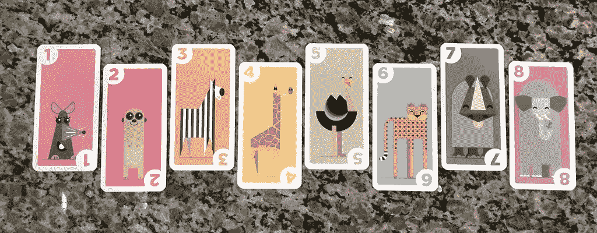
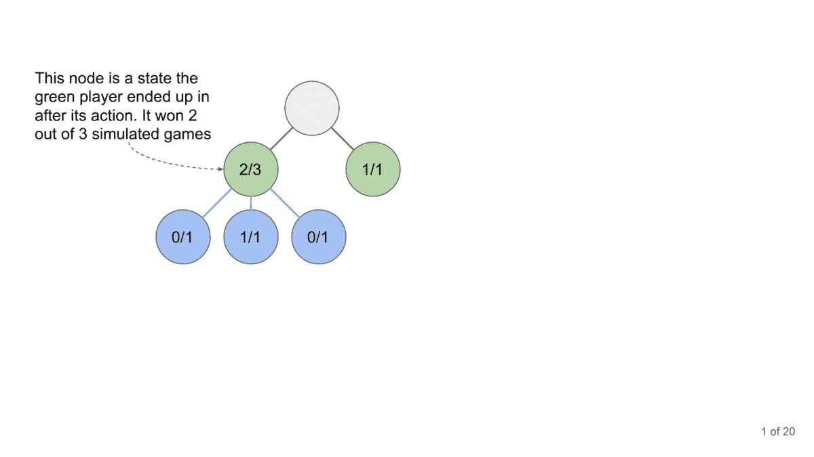
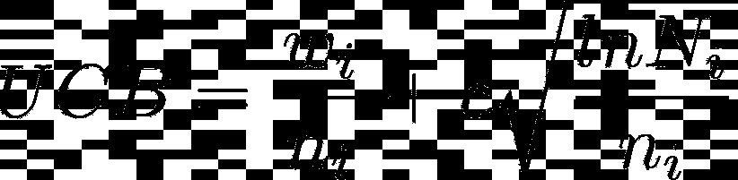
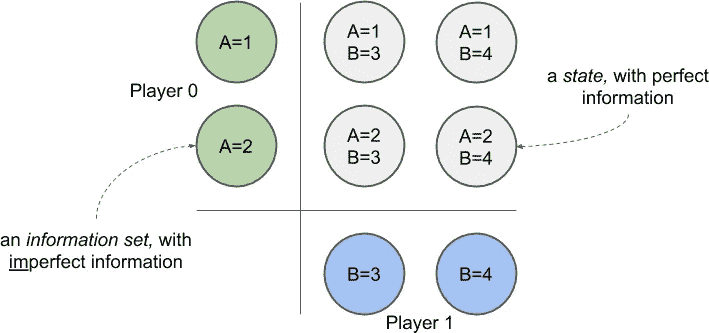
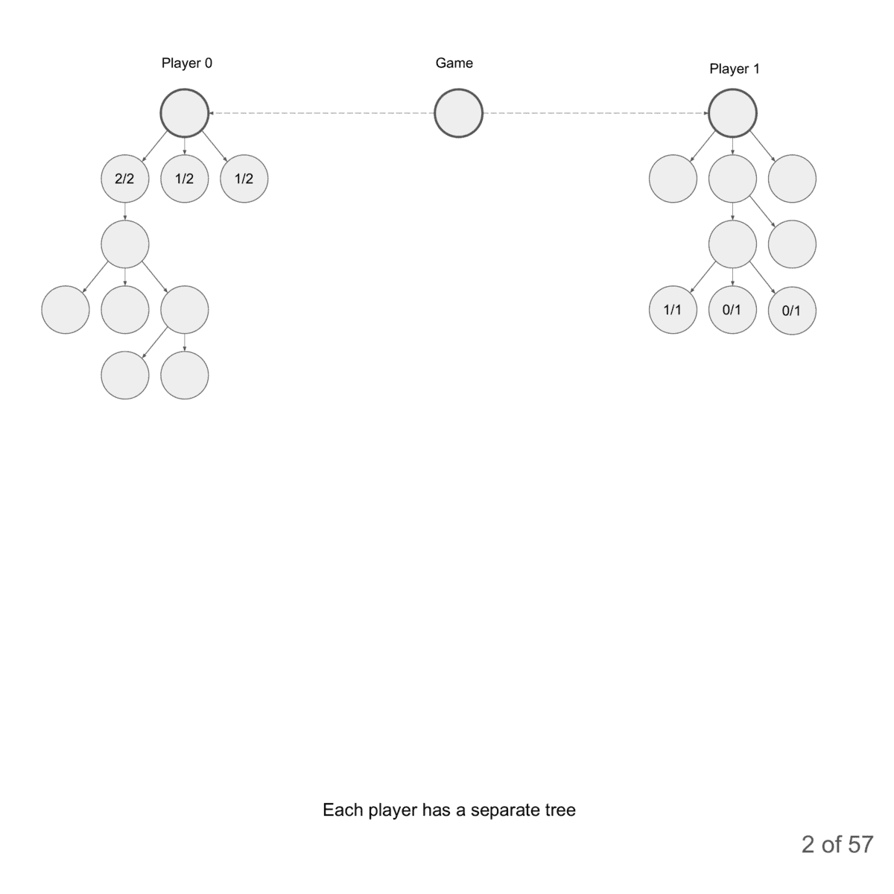

# 人工智能玩卡里巴！

> 原文：<https://medium.com/analytics-vidhya/artificial-intelligence-plays-kariba-c281052e8dce?source=collection_archive---------11----------------------->

所以你想用蒙特卡罗树搜索(MCTS)，但是你的博弈有**不完全信息**，还有一个**几率**的元素。那就难了！在这篇博客中，我们将把 MCTS 应用到这样一个游戏中；卡里巴。我们会发现我们真正需要的是多观察者信息集蒙特卡罗树搜索(MOISMCTS)。

卡里巴是一个有趣的小纸牌游戏，有一些简单的规则。当轮到你时，你从你的手牌中打出一张或几张相同种类的牌到场上(在水坑周围，因为动物需要喝水)。如果在某个时候，场上有 3 只或更多的同种动物，它们会赶走所有最接近的弱种动物。然而，每个人都知道大象害怕老鼠，所以老鼠是唯一能赶走大象的动物。每赶走一只动物，你就得一分。就是这样！

*例子:场上有两只老鼠、两只斑马和两只豹子。玩家 A 从她的手牌中打出第三张豹牌到场上。现在有三只豹子，它们赶走了两只斑马。玩家 A 得到 2 分(因为她的行动赶走了 2 只动物)。玩家 B 现在扮演另一只豹子。现在场上有 4 只豹子，比 3 只多，所以他们赶走了剩下的两只老鼠。玩家 B 现在也得到 2 分。*

可爱的动物卡片

流言终结者证明大象害怕老鼠

卡里巴是一个有**不完全信息**的游戏，因为一个玩家无法看到另一个玩家的手牌。还有，这是一个**机会**的游戏，因为你永远不知道下一张牌是什么。MCTS 并不真的处理这样的游戏。

让我们来谈谈 MCTS 吧！

每个游戏状态将被称为一个“节点”。从根节点开始，我们**选择**我们想要了解更多的子节点。我们对该节点再次这样做，并继续选择子节点，直到找到一个没有任何子节点的节点(“叶节点”)。此时我们**展开**；我们找到这个节点可以拥有的新的子节点。从新节点开始，我们执行一个**模拟**(或“首次展示”)。这意味着我们模拟一个游戏，两个玩家随机移动，并记录谁赢。然后我们**将这个结果反向传播**到所有的祖先节点。当通过树反向传播一个模拟的结果时，我们只在该节点的动作被将成为胜利者的代理采取时，才将其记录为一个胜利。如果该节点的操作是由将成为输家的代理执行的，我们将结果记录为亏损。

我们执行循环(选择、扩展、模拟、反向传播)，直到是时候进行“真正的”移动(比如说，在 500 次模拟之后)。然后我们通常选择我们已经运行了大多数模拟的动作。当我们处在新的形势下，必须采取新的行动时，我们就让 MCTS 从头开始。

40 秒后蒙特卡罗树搜索。在 [git repo](https://github.com/KnurpsBram/AI_plays_kariba/tree/master/other) 中也有 pdf 格式

但是什么时候一个节点是‘有趣’的呢？这个问题很有意思！在选择人工智能想要了解更多的行动时，它应该在**探索**和**开发**之间找到平衡。一个很好的方法是选择具有最高*置信上限(UCB)的节点:*

置信上限

其中 *nᵢ* 是从节点开始的模拟量， *wᵢ* 获胜量， *Nᵢ* 父节点的模拟量， *c* 是超参数。c 的高值促进勘探，低值促进开采。 *c* 通常设置为√2。

香草 MCTS 的问题是，它假设双方都可以完全观察到状态，但卡里巴是一个不完全信息的游戏。此外，状态不仅会因为行动而改变，还会因为抽牌而改变，这增加了一个**偶然性**的因素，使事情变得复杂。

解决这两个问题的方法是使用多观察者信息集蒙特卡罗树搜索(MOISMCTS)。

为了处理**不完美信息，** MOISMCTS 跟踪每个玩家的独立树。这棵树上的一个节点不是一个状态，而是一个‘信息集’；给定玩家拥有的信息，游戏可能处于的所有状态的集合。

状态和信息集。如果玩家 0 只能观察状态的 A 部分，而玩家 1 只能观察 B 部分，那么游戏可能处于状态(A=2，B=4)，这在玩家 0 的树中表示为信息集(A=2)，在玩家 1 的树中表示为信息集(B=4)。

为了处理**机会**的元素，该树区分中性节点和行动后节点。从中立节点过渡到行动后节点，我们采用“常规方式”；通过选择具有最高 UCB 的动作(幸运的是，动作的结果不受机会的影响)。由于“外力”的作用，我们通过遍历到下一个节点来模拟任何其他状态转换。这些外力可以是对手的移动，也可以是从一副牌中抽牌。

纸牌游戏 Kariba 的多观察者信息集蒙特卡罗树搜索。在 [git repo](https://github.com/KnurpsBram/AI_plays_kariba/tree/master/other) 中也有 pdf 格式

gif 的 Pdf 版本可以在 [github repo](https://github.com/KnurpsBram/AI_plays_kariba) 中获得，同时还有源代码(Python)和一个让卡里巴对抗 MOISMCTS-agent 的小型竞技场。

关于 MCTS 的其他有趣的东西还有:
- [int8 的《MCTS 入门指南》](https://int8.io/monte-carlo-tree-search-beginners-guide/)
- [int8 的《MCTS 回购井字游戏(python)】](https://github.com/int8/monte-carlo-tree-search)
-[Cowling 等人关于信息集蒙特卡罗树搜索的论文(ISMCTS)](https://www.researchgate.net/publication/254060888_Information_Set_Monte_Carlo_Tree_Search) ，尤其是 G 节(第 10 页)
-[tetratych 的《回购 synapsen (python)](https://github.com/tetraptych/synapsen) 、信息集蒙特卡罗树搜索(信息集蒙特卡罗树搜索