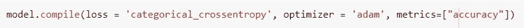
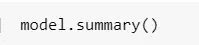
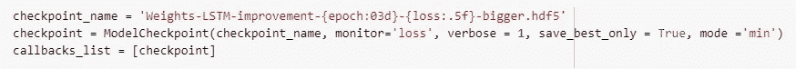

# 人工智能歌曲作者:如果泰勒·斯威夫特的歌是机器写的会怎样？

> 原文：<https://medium.com/analytics-vidhya/artificial-intelligence-songwriter-what-if-taylor-swifts-songs-were-written-by-a-machine-b6e2218e9967?source=collection_archive---------11----------------------->

## 几周前，我发现了一个很酷的[网站](https://theselyricsdonotexist.com/)，它使用人工智能为各种主题生成原创歌词，我想知道:这究竟是如何工作的？所以你猜怎么着！我决定建立自己的人工智能词曲作者，生成假泰勒斯威夫特歌词。

照片由 [Raphael Lovaski](https://unsplash.com/@raphaellovaski?utm_source=unsplash&utm_medium=referral&utm_content=creditCopyText) 在 [Unsplash](https://unsplash.com/s/photos/taylor-swift?utm_source=unsplash&utm_medium=referral&utm_content=creditCopyText) 上拍摄

这篇文章充分描述了所承担的项目。如图所示，它分为 6 个部分
:

实施的步骤

所以让我们开始实现我们的智能词曲作者！

# **第一节:问题公式化**

长短期记忆网络——通常被称为“lstm”——是一种特殊的 RNN，能够学习长期依赖性。它们是由[hoch Reiter](https://en.wikipedia.org/wiki/Sepp_Hochreiter)&[schmid Huber](https://en.wikipedia.org/wiki/J%C3%BCrgen_Schmidhuber)(1997)提出的，并在随后的工作中被许多人提炼和推广。

本文不讨论 LSTM-RNNs 背后的理论。你可以在这里了解他们。

LSTM 递归神经网络可用于许多应用
如语言建模、文本分类、**自然语言生成(NLG)** …

自然语言生成是一种从结构化数据中产生文本的人工智能。我们的应用程序是自然语言生成的众多应用程序之一。

我们将使用 KERAS 和 TensorFlow 实现一个基于长短期记忆递归神经网络(LSTM-RNN)的泰勒斯威夫特歌词生成器。该项目试图从头开始设计、训练、验证和测试一个模型，使我们能够生成这样的歌词。

我们将在本文结尾看到机器学习技术
是否能为泰勒·斯威夫特创作更好的歌曲。

# 第 2 部分:准备工作区

由于我们有一个大的数据集，我们将需要一个非常高的计算能力。然后我们将使用 [Google Colab](https://colab.research.google.com/notebooks/intro.ipynb#recent=true) ，这是一个免费的云服务，有助于使用 Keras、TensorFlow 等流行的库开发深度学习应用程序…

让我们导入开发中需要的库。一个
库本质上是一个可以被调用和使用的模块的集合。

这里要讨论两个深度学习库:

**。Keras** 是一个开源库，用于在接口的高层构建神经网络，它是用 Python 编写的。它使用 Theano 或 TensorFlow 作为后端。

**。TensorFlow** 来自谷歌的开发者，它是一个数据流图计算的开源库，为机器学习而锐化。它被设计用来训练神经网络。

Keras 和 TensorFlow 之间的关键区别在于，Keras 在模型级别进行接口，它不处理较低级别的操作。
TensorFlow 从另一个侧面，在 CUDA、GPU、CPU 深层次接口。

现在我们已经导入了所有需要的库，让我们加载、研究和预处理我们的数据。

# 第 3 部分:预处理

**“数据科学家大约 80%的时间只花在准备处理数据上”~福布斯**

我们从广泛的来源收集数据，大多数时候，数据是以原始格式收集的，不适用于分析。数据预处理是开始处理数据的第一步。

## 1.数据采集和探索

在这个项目中，我们将使用[Kaggle 上可用的数据集](https://www.kaggle.com/PromptCloudHQ/taylor-swift-song-lyrics-from-all-the-albums)，该数据集由 PromptCloud(数据即服务提供商)创建，使用泰勒斯威夫特歌曲歌词的 Genius.com 公开的 API。

## 2.数据集和数据字典

*我们的数据集有以下数据字段:*

***艺人*** *:艺人名称*

***专辑*** *:专辑名称*

***曲目 _ 标题*** *:* *歌名*

***track_n*** *:专辑中的曲目号*

***抒情*** *:抒情*

***线*** *:* *轨道中的线数*

***年份*** *:发行年份*

## 3.单变量分析和质量检查

这是我们数据集的前 5 行:

数据集由 7 列/变量/预测值和 4862 行(来自不同歌曲的 4862 行歌词)组成

我们可以使用 seaborn 库对我们的变量进行单变量分析，以可视化它们的变化:

现在，让我们检查数据集的质量，看看是否有任何缺失值:

数据集不包含缺失值，我们在每个变量中正好有 4862 个非空值。

## 4.数据集整理

我们的数据集有点乱，还没有完全准备好被正确地用来构建我们的应用程序。这一步包括整理、组织和准备我们的数据，使我们能够在最近构建和训练我们的模型时使用它。

在开始处理细节之前，我们应该回答两个关键问题:

模型应该输入什么？输入的是 100 个字符的序列。

**这个模型应该预测什么？**模型必须预测该序列之后的字符。

我们的问题是一个**多分类**问题！

a.我们开发了函数 **processFirstLine** 来帮助我们处理歌词的第一行:

我们想要创建 3 个列表:

*   列出歌曲 ID，其元素是歌曲的唯一标识符(年份和 track_n 的线性组合)
*   列出元素为歌曲曲目标题的歌曲名称
*   列出元素为歌曲歌词的歌词。

例如，让我们打印歌词的第一个元素，我们将获得歌曲的歌词，其 **track_n** 为 1。

b.我们定义了一个新的熊猫数据帧来保存歌曲 ID，歌曲名称，歌词。

这个数据帧是一个表，其列是 songID(歌曲的唯一标识符)、songName(歌曲的音轨标题)、歌词(每首歌曲的串联歌词)

c.现在，我们将所有歌曲的歌词存储在一个文本文件中，以便在 LSTM RNN 中使用。

3.我们在一个巨大的字符串中加载文件，我们称之为 raw_text，raw_text 是所有歌曲歌词的连接，我们将歌词转换成小写，以便能够映射它们。

d.因为机器理解和处理文本变得复杂，而且因为模型是基于数学方程和计算的，我们必须对**分类数据**进行编码。我们创建了两个字典，一个将 char 转换成 int，另一个将 int 转换回 char，以便映射字符。

e.我们计算文本中字符和字母的总数:

f.我们制作样品和标签来喂养 LSTM RNN

我们模型的输入将是一个 100 个字符的序列。我们的模型必须预测序列后面的字符。我们将预测器存储在 data_X 中(data_X 是 100 个字符的序列列表)。我们将目标存储在 data_Y 中(data_y 是一个字符列表)。data_X[i]是一个 100 个字符的序列，data_y[i]是这个序列后面的字符。

g.我们重塑 X 以适合进入 LSTM RNN

h.我们将输入数据标准化:

我*。*我们将整数*的输出向量编码转换成二进制类矩阵。*

## 5.测试列车分离

在我们开始构建和训练我们的神经网络模型之前，我们应该将数据集分成 3 个部分。因为我们的模型必须首先根据可用的数据分布进行训练，然后进行验证和测试，然后才能用于预测新数据的输出。

**训练数据:**这是我们的模型实际训练的部分。

**验证数据:**这是数据集的一部分，用于验证我们的各种模型拟合。

**测试数据:**这部分数据集用来测试我们的模型假设。

在我们的例子中，我们只将数据分成两部分(训练和测试数据)，验证数据将在训练模型时定义。

测试列车分离

我们使用 sklearn.model_selection 中的函数 train_test_split 将 X 和 y 拆分为 X，y(75%)和 X_test，y_test(25%)

# 第 4 部分:模型构建

## 1.从头开始构建模型

在这一部分，我们将设计模型的架构。

我们的模型是一个长短期记忆递归神经网络。

多次运行相同的代码会产生不同的结果。为了确保我们的模型在每次运行时都会生成相同的结果:

我们首先定义一个顺序模型:

我们添加一个 LSTM 层作为输入层。我们确定该层中节点的数量，由于这是第一层，我们定义输入 X 的形状，以告知网络它将训练的数据的形状。

我们添加三个 LSTM 层作为隐藏层，每层有 256 个节点。

我们展平来自最后一个隐藏层的数据，将其输入到输出层:

我们添加了一个密集层，这是一个完全连接的神经网络层，其中每个输入节点都连接到每个输出节点。

我们还添加了一个激活层，它决定了我们的神经网络用来计算节点输出的激活函数。由于这是一个多分类问题，我们使用 softmax 函数。

现在我们编译我们的模型。由于这是一个多分类问题，我们使用分类交叉熵计算每次迭代训练的损失，并使用“adam”优化器优化我们的网络。

我们可以使用以下内容查看我们模型的摘要:

为了避免丢失我们的工作，我们使用模型检查点，以便在每个历元之后将网络节点的权重保存到文件中。

## 2.训练模型

既然我们已经定义了模型的结构，它应该自我训练，以便用于预测新数据的输出。

为了训练模型，我们使用拟合方法。

我们表示:

*   **X** :输入数据
*   **y** :目标数据
*   **时期**:提供的整个 X 和 y 数据的迭代次数。
*   **batch_size** :每次梯度更新的样本数。
*   **回调**:培训和验证期间应用的回调列表。
*   **啰嗦**:整数。0、1 或 2。详细模式。0 =无声，1 =进度条，2 =每个时期一行。
*   **validation_split** :作为验证数据的训练数据的一部分。该模型将把这部分训练数据分开，不在其上训练，并且将在每个时期结束时评估该数据的损失和任何模型度量。我们选择使用 2%的训练数据来验证模型。
*   **混洗**:决定是否在每个历元之前混洗训练数据。
*   **initial_epoch** :开始训练的时期(用于恢复之前的训练运行)。

由于数据集非常大，这一步需要花费大量时间。我花了大约 65 分钟运行一个纪元。

由于使用了检查点，您可以看到一些文件已经下载。

# 第 5 部分:验证和模型准确性

## 1.确认

我们可以通过显示训练数据的准确性、验证数据的准确性、训练数据的损失和验证数据的损失来验证我们的模型。

我们可以观察到损耗在减少，精度在提高。这证明该模型正在有效地学习，并且通过更多的时期来训练网络将使我们能够达到令人满意的准确度。

我们可以通过绘制我们训练的历史来形象地描述这一点。

## 2.模型精度

检查模型的性能是模型测试中最重要的步骤之一。这将使我们能够看到模型对从未见过的数据将如何表现，以及它的预测是否准确。

我们可以用 evaluate 方法来衡量这个值:

我们获得了 2.16 的损失和 0.41 的准确度。这些值可以通过调整模型的超参数来改善，也可以针对更多的时期对其进行训练。你训练你的模型越多，你的结果就越准确！

# 第 6 节:预测和结果

## 1.预言；预测；预告

现在我们的模型已经建立、训练、验证和测试，我们终于可以用它来预测新数据的输出并生成一些假歌词。

由于我们有一个完整的歌词序列列表，我们将在列表中随机选取一个索引作为我们的起点，并预测该序列之后的 500 个字符。

**步骤 1** :我们重塑序列 x

**第二步**:我们将其归一化

**步骤 3** :我们计算每个类遵循这个序列的概率

**第四步**:检测概率最高的指标

**步骤 5** :我们确定概率最高的类

第六步:我们将这个字符(预测的结果)添加到序列中

**步骤 7** :我们去掉序列的第一个字符，得到一个新的序列，重复同样的过程，直到预测到 500 个字符。

## 2.结果

然后我们看到我们的 500 个字符正在生成..

我们可以看到，该模型生成了一些假的歌词，并有许多拼写错误。

如果我们想生成更好的歌词，我们需要调整一些参数。

第一粒种子来自我们，这是泰勒·斯威夫特在 2010 年制作的专辑《现在说话》中的一首歌，让我们来比较一下我们的假歌词和真歌词:

人工生成的歌词

原创歌词

这两种歌词之间的差异是巨大的，因为模型需要越来越多的训练，以便生成更准确的歌词。由于数据集非常庞大，尽管使用了具有非常高计算能力的高级云服务，但我花了 65 分钟运行一个时期，这使得很难达到令人满意的精度。尽管如此，该模型永远不会为泰勒·斯威夫特生成更好的歌词，训练它将使我们能够生成合理的单词，但永远不会生成更好的歌词。**人工智能永远打不过自然智能。**

在这个项目中进行的工作可以进行相当多的扩展。可以采取的三种主要发展途径是:

*1。* *改善网络的架构(层数，每层神经元数…)*

*2。* *改进和扩展历元数因为模型自己训练的越多，它的预测就越准确。*

*3。* *使用 textgenrnn，这是一个 python 包，它将创建和训练 LSTM-RNN 的过程抽象为几行代码，具有大量的模型架构和训练改进..*

# 一些最后的想法

从事这个项目使我能够体验到当我建立、训练和评估自己的神经网络开始生成歌词时的兴奋，就像人类学会了一种技能并开始用它来解决生活问题。虽然结果可能并不完美，但它们是我未来可能从事的许多新想法和潜在应用的真正来源

*查看我为教程制作的 Github 资源库* [*这里*](https://github.com/mellouksafae/Taylor_Swift_Lyrics_Generator) *！*