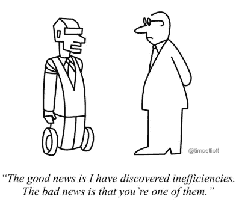
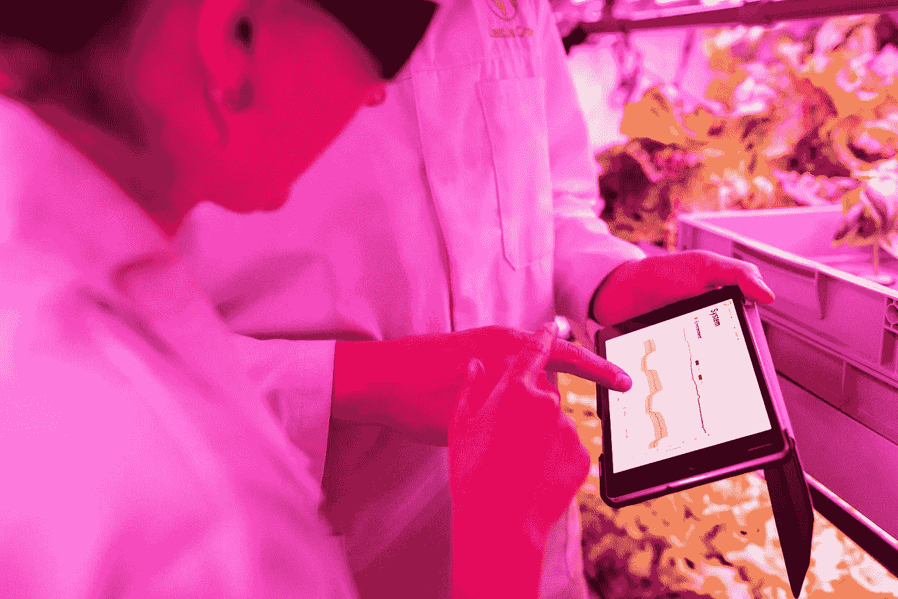
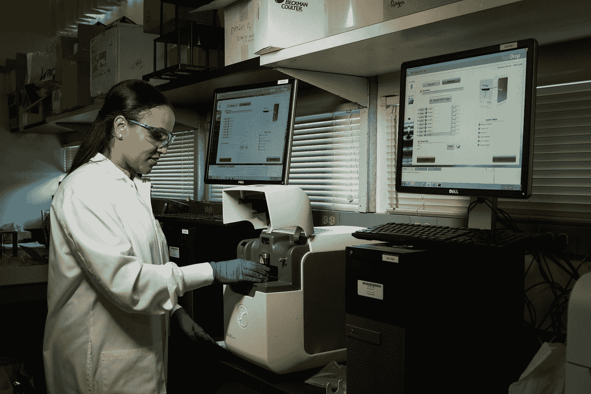

# 人工智能的影响

> 原文：<https://medium.com/analytics-vidhya/artificial-intelligence-the-multidimensional-technology-ecfe5f2040ea?source=collection_archive---------22----------------------->

弗兰基·查马基在 [Unsplash](/s/photos/data-has-a-better-idea?utm_source=unsplash&utm_medium=referral&utm_content=creditCopyText) 上拍摄的照片

**人工智能**，现在已经成为一个频繁使用的词。我们都在某个地方听说过它。可能不太理解，但是有自己的定义和理解。

> **人工智能被定义为研究和开发能够执行通常需要人类智能才能完成的任务的计算机程序。**

人工智能系统可以完成的一些任务包括视觉感知、语言识别、语音识别、决策等等。直到技术引领的创新将我们引向人工智能，这些任务才被认为是由计算机执行的。

署名:蒂姆·埃利奥特

**人工智能**与机器学习和深度学习等其他研究领域相结合，成为一种强大的工具，具有过多的可能性和应用。都是数据驱动的技术。它们可用于为一系列问题提供答案和预测，并使用开发的数学模型进行非常精确的计算。

## 让我们看几个应用:

1.  **农业中的人工智能**

照片由[本工程图](https://unsplash.com/@thisisengineering?utm_source=unsplash&utm_medium=referral&utm_content=creditCopyText)在 [Unsplash](/s/photos/agriculture-technology?utm_source=unsplash&utm_medium=referral&utm_content=creditCopyText) 上拍摄

耕作和农业无疑在我们的社会中起着重要作用。人工智能可以提供信息分析，以创建季节性预测模型，从而提高农业准确性，提高生产力。

计算机视觉和深度学习算法处理从飞越其田地的无人机捕获的数据。人工智能有助于识别植物中的疾病，识别害虫和农场中营养不良的植物。

人工智能传感器也可以检测和瞄准杂草。农民可以决定在合适的缓冲区内使用哪种除草剂。

**2。金融中的人工智能**

由 [Austin Distel](https://unsplash.com/@austindistel?utm_source=medium&utm_medium=referral) 在 [Unsplash](https://unsplash.com?utm_source=medium&utm_medium=referral) 拍摄的照片

在金融界，时间就是金钱，但如果不给予适当的关注，这种危险可能是致命的。准确的预测对许多企业的速度和保护都至关重要。

人工智能解决方案正在帮助银行和信贷机构做出更明智的承销决策，方法是在信贷决策过程中利用一系列东西来更准确地评估千禧一代等传统上得不到充分服务的借款人。

金融市场正越来越多地转向人工智能的一个子集——机器学习，以制造更精确、更灵活的模型。这些预测有助于金融专家利用现有数据查明趋势、识别风险、节省人力，并确保为未来规划提供更好的信息。

**3。医疗保健中的人工智能**

[国立癌症研究所](https://unsplash.com/@nci?utm_source=medium&utm_medium=referral)在 [Unsplash](https://unsplash.com?utm_source=medium&utm_medium=referral) 上拍摄的照片

与健康相关的人工智能应用的主要目标是研究 bar 或治疗技术与患者结果之间的关系。人工智能程序被开发并应用于实践，如诊断过程、治疗方案开发、药物开发、定制药物以及患者观察和护理。

**放射科** —正在开发的人工智能解决方案区域单元，用于自动化图像分析和诊断。这可以有助于在扫描中向专家突出显示感兴趣区域，以提高效能并减少人为错误。

**患者风险识别** —通过分析大量的历史患者知识，AI 解决方案将为临床医生提供一段时间的支持，以帮助确定处于风险中的患者。目前的一项研究重点关注了再入院风险，即出院 30 天内返回医院的可能性增大的患者。

在接下来的几年里，人工智能的最佳机会是区域单位混合模式，无论临床医生在哪里，区域单位在诊断、治疗和独特的风险因素方面提供支持，但是，保留对患者护理的最终责任。这可能会通过减少感知风险，促使供应商更快地采用，并开始在患者结果和大规模运营潜力方面提供可衡量的增强。

**4。电子商务中的人工智能**

[rupixen.com](https://unsplash.com/@rupixen?utm_source=medium&utm_medium=referral)在 [Unsplash](https://unsplash.com?utm_source=medium&utm_medium=referral) 上的照片

该公司使开发人员能够构建更智能的应用程序，“像你一样看世界”，使企业能够通过高级图像和视频识别开发以客户为中心的体验。

利用机器学习，AI 代码通过标记图像或视频的选项，机械地标记、组织和可视化搜索内容。计算机科学使用弹出窗口、文本和电子邮件向消费者提供产品推荐。它跟踪用户创建的搜索以了解购物者的行为。

电子商务部门已经开始通过视觉搜索引擎使用计算机科学。这有助于用户，无论他们需要什么，只需一次点击就可以找到。
该产品的视觉插图已被证明对购物者很有吸引力。购物者通常会在订购前阅读商品的尺寸、大小、设计和颜色。
聊天机器人是作为客户和服务供应商之间交互媒介的代码。它有助于区分购物者的疑问。
随着聊天机器人的使用，响应的时间间隔已经大大缩短。它还降低了雇用客户服务人员的价格，因为它将在此期间执行所有稳健的任务。聊天机器人开发了一种以客户为中心的方法。

**5。教育中的人工智能**

安妮·斯普拉特在 [Unsplash](https://unsplash.com?utm_source=medium&utm_medium=referral) 上的照片

人工智能设备可以帮助所有人进入全球课堂，包括那些说独一无二语言的人或可能有视觉或听觉障碍的人。

Presentation Translator 是一个适用于 PowerPoint 的松散插件，它可以为教师所说的内容实时创建字幕。这也为那些因感染而无法上学的大学生，或者那些需要掌握某个学位或某个学校没有的特定问题的大学生提供了机会。人工智能可以帮助缩小大学之间和传统年级之间的差异。
自适应获得知识****的**已经对全国的学校教育产生了很大的影响(特别是通过像可汗学院这样的项目)，随着人工智能在未来几十年的进步，像这样的自适应项目很可能会得到最好的改善和扩展。
虽然机器已经可以给多种需求的测试打分，但它们也非常接近于能够检查书面回答。随着人工智能介入自动化管理任务，它为教师开辟了额外的时间来与每个学生相处。人工智能有很大的能力创造额外有效的注册和录取过程。**