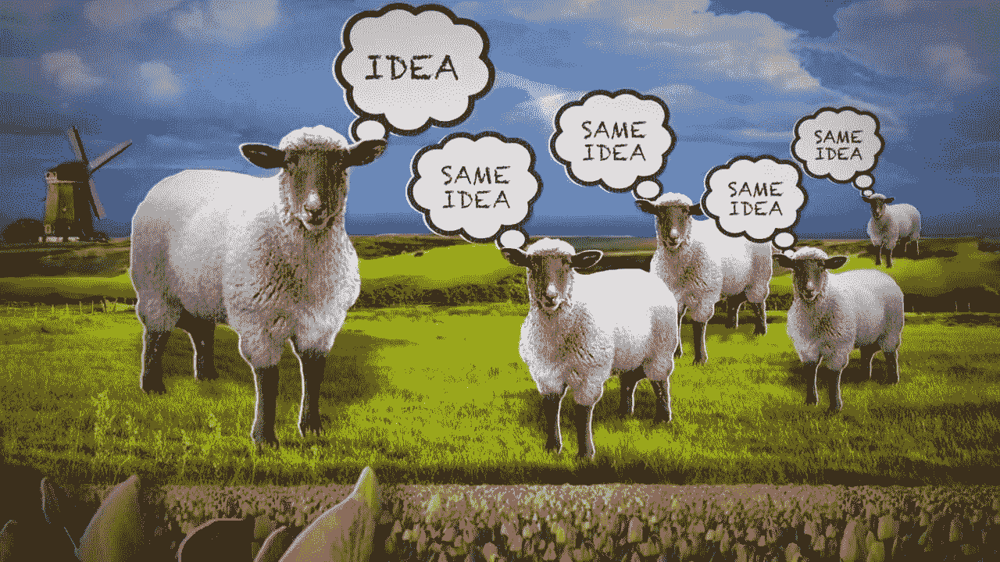

# 人工智能将基于情绪的算法交易影响到羊群行为

> 原文：<https://medium.com/analytics-vidhya/artificial-media-to-manipulate-sentiment-based-algorithmic-trading-195797461fe0?source=collection_archive---------12----------------------->

# 一些背景…

新闻记者、博客和其他形式的媒体发布的定量数据会影响自动交易机器人根据情绪分析采取行动。

> 根据维基百科的定义，情感分析是指使用自然语言处理、文本分析、计算语言学和生物统计学来系统地识别、提取、量化和研究情感状态和主观信息。

换句话说，情感分析可以用来定量地识别文本的积极和消极影响。在这个例子中，我们指的是使用情绪分析的量化影响来做出交易决策。例如，基于情绪分析，如果情绪是积极的，我们可以购买 100 股苹果公司的股票，如果情绪是消极的，我们可以出售 100 股。注意，买/卖的数量也可以基于一些假设来确定。

# 为什么你会关心

假设你在 Twitter 上读到，你的朋友乔购买了 100 股特斯拉股票，因为他认为特斯拉将推出新产品，股票价格将会上涨，你跟随他的脚步，自己也购买了特斯拉的股票。你和你的朋友乔可能认为你可以从低买高卖中获益。然而，这种行为在经济学和金融学中被称为羊群行为。

> 羊群行为是指个人投资者对其他投资者行为的信息做出反应，而不是对市场和交易行为做出反应。

假设情绪分析所需的数据使用某种 web 报废方法在互联网上搜索相关新闻、博客或其他媒体，是否有可能通过在互联网上发布人工新闻、博客帖子或其他媒体来欺骗基于情绪分析的算法交易？

> …是否有可能通过在互联网上发布人工新闻、博客帖子或其他媒体来欺骗基于情绪分析的算法交易？

# **我是如何发现这一点的**

自从我在一堂关于学习和记忆的大学心理学课上了解到这一点后，我就成了*突破原则的忠实信徒。*据我所知，这个想法很简单——在长时间连续学习或工作之后，休息一会儿，以提高创造力、生产力和其他益处。

我读了很多关于算法交易的书。具体来说，有一天我偶然发现了一件我特别感兴趣的事情— [本文](https://www.aaai.org/ocs/index.php/ICWSM/ICWSM10/paper/viewFile/1529/1904)讨论了使用自然语言处理(NLP)来开发一种“基于情绪的市场中性交易策略，这种策略在长时间内以低波动性提供持续的有利回报。”那天晚上晚些时候，在和一个朋友的谈话中，他用了一个习语来描述一种情况，我突然明白了。我很容易地将这些点与我之前阅读的文章联系起来，并思考为什么不能使用 NLP 来欺骗其他自动交易机器人，这些机器人使用 NLP 来抓取网络进行情绪分析，然后使用情绪来获得边际市场收益。

顺便说一下，我朋友用的习语是(翻译过来)…

> 以毒攻毒。
> 
> —匿名

# 下一步？

为了证明或反驳我们的假设——人工新闻可以影响基于情绪分析的自动交易机器人——我们需要以下方法:

1.  构建一个 NLP 模型，该模型可以根据网站上发布的文章提取情感的数量和质量。
2.  开发一个交易机器人，使用上一步的信息——我们的情绪分析模型——来执行交易。
3.  从第一步开始，在同一个网站上发表积极的文章。
4.  记录步骤 2 中的交易。
5.  重复第 3 步和第 4 步，对所选投资的正面和负面文章进行各种组合。

基于上述步骤，如果正面文章导致购买行为，而负面文章导致出售行为，那么我们可以证明我们的假设是正确的。注意，这种方法假设市场上只有一个交易者。因此，它并没有得出羊群行为的结论，而是从发表的文章中得出情绪分析是否会做出直观的交易决策。如果先前的假设为真，影响情绪分析也可以被假设为真。