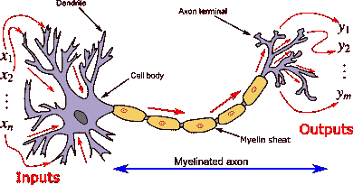
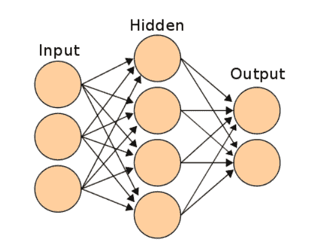
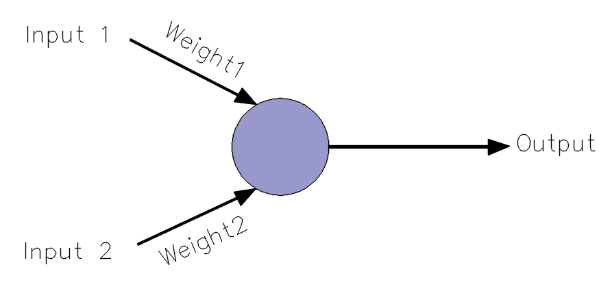
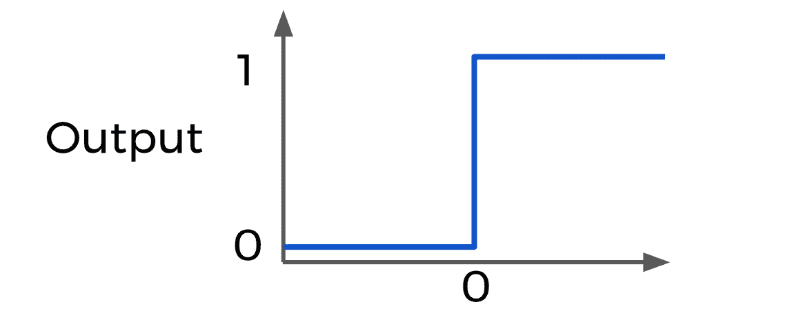

# 人工神经网络——初学者的视角

> 原文：<https://medium.com/analytics-vidhya/artificial-neural-network-a-beginners-perspective-a4eef0e6bda9?source=collection_archive---------32----------------------->

# 简介:

你是否对人工智能、人工智能、深度学习等术语着迷？？那么你应该听说过神经网络(或人工神经网络)这个术语。问问你自己，你以前遇到过神经元这个词吗？大多数情况下，是的，在你们低年级的生物课上，你们会碰到，不是吗？。所以让我们从这里开始讨论

# 人工神经网络的结构:



就像神经元的结构一样，设计了 ANN(人工神经网络)的结构。神经元以信号的形式向其他神经元传递信号。保留了人类神经元的模型和它传递信号的方式，设计了 ANN。现在，让我们看看人工神经网络的结构。



在左边你可以看到一个人工神经网络的图像。需要注意的是，第一层是 ***输入层*** ，最后一层是 ***输出层* r** 。输入层和输出层之间的所有层称为 ***隐藏层*** 。如果隐含层的数目大于或等于三，则称之为深度网络。从一层射向另一层的箭头会附带一些 ***权重***

# 激活功能

激活函数是一个输出将基于其触发的函数。请看下图。这个简单的模型叫做感知器，你有两个输入和一个输出。你还可以发现每一个箭头都与一个权重相关联，这些权重被称为突触权重(更普遍的说法是权重)，在开始时是随机选择的



输入乘以相应权重的乘积之和被送入圆圈。在上面的例子中，输入 1 乘以权重 1，输入 2 乘以权重 2，然后两者相加，然后传入循环，这就是激活函数。数学上，

```
Z =(Input1*Weight1)+(Input2*Weight2)
```

假设结果存储在一个名为 Z 的变量中，基于 Z 值，激活函数的输出将被触发。一些常用的激活功能有:

1.  乙状结肠的
2.  整流线性单位
3.  双曲正切

# 激活功能的工作



让我们考虑单位阶跃函数作为我们讨论的激活函数。不管你输入什么，你的输出要么是 1，要么是 0。等等！！“不考虑你的投入？”真的吗？如果我的两个输入都是 0 会怎么样？。这就是“偏见”在本案中发挥作用的地方。让我们在我们的例子中添加一个偏差 1(这样我们就不会到达 0)，然后我们可以用数学方法表示我们的模型如下

```
Z =(Input1*Weight1)+(Input2*Weight2)+bias
```

这是对激活功能的一个小介绍。现在让我们看看什么是成本函数

# 价值函数

现在我们已经得到了基于激活函数的神经网络的输出。但是你怎么知道它是对的还是错的，或者我们离正确的输出有多近？。为了解决这个问题， ***成本函数*** 应运而生。

假设 T 是真实值，P 是预测值。那么，涉及的误差是(T-P)。我们的职责是减少所涉及的误差，为了实现这一点，我们需要选择适当的成本函数，以便我们可以快速减少误差。常用的代价函数之一是交叉熵函数。

现在我们知道了激活函数和成本函数，也就是说，我们已经准备好预测一个输出，并能够看到它离实际值或真实值有多远。那么遗漏了什么呢？错过了从错误中学习的机会。

# 反向传播梯度下降

正如我们已经看到的激活函数和成本函数，现在我们将看到实际的学习是如何在人工神经网络中发生的。梯度下降实际上是一种寻找函数最小值的优化算法(为什么那个函数不是我们的代价函数？)

记得吗？我们的成本函数将帮助我们知道我们离实际结果有多远。那么，为什么不对我们的成本函数应用梯度下降以减少误差呢？换句话说，我们将梯度下降应用于我们的成本函数，以达到在开始时随机选择的适当的突触权重值

现在让我们看看什么是反向传播。反向传播用于在处理一批数据之后计算每个神经元的误差贡献。它依赖于链式法则通过网络返回并计算误差。反向传播计算输出端的误差，并将其分配回网络层