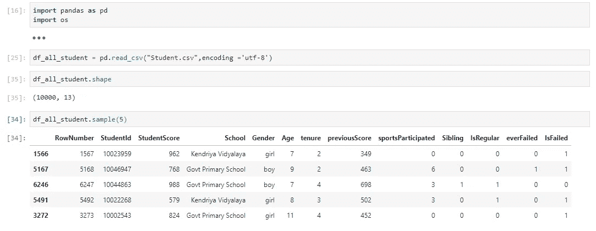
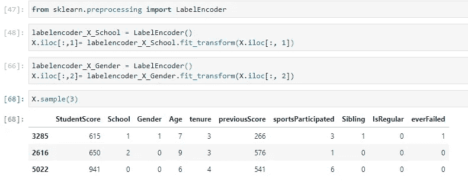
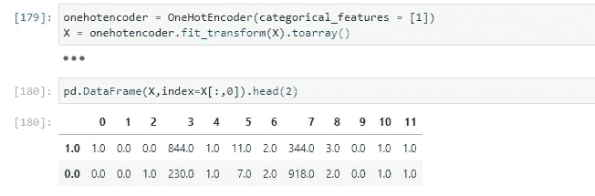
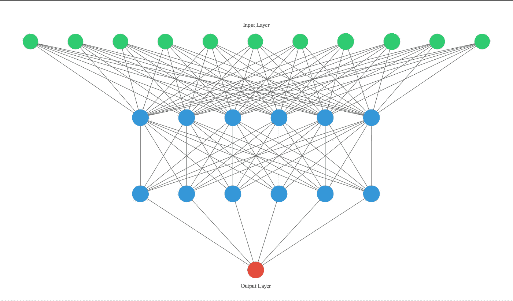

# 人工神经网络(ANN)与 Keras 简化，用例:如果学生通过考试？(仅代码部分)

> 原文：<https://medium.com/analytics-vidhya/artificial-neural-network-ann-with-keras-simplified-use-case-if-student-pass-the-exam-code-949ddb2a9c91?source=collection_archive---------3----------------------->


图片作者:[单阿尔·拉赫曼·罗尼，皮查拜](https://pixabay.com/users/Monoar-2240009/?utm_source=link-attribution&amp;utm_medium=referral&amp;utm_campaign=image&amp;utm_content=1486278)

先决条件: [Jupyter notebook](https://jupyter.org/) 或 [Google Colab](https://colab.research.google.com/notebooks/intro.ipynb) 或其他支持 python 的工具，现在我们有很多这样的工具。

# 在战斗之前

**数据集:**



大多数栏目都是不言自明的，其简单的学生数据涵盖了德里的三所学校:Kendriya Vidyalaya、Govt 小学和 Navodaya Vidyalaya

PS: Vidyalaya 在印地语中是学校的意思，其假想数据仅供参考😊

**问题陈述:**

基于之前的记录，创建一个基于深度学习的预测器，它将帮助我们确定该学生今年是否有可能不及格，这样教师就可以将更多的注意力放在该学生群体上。

**预读**

ANN 理论:[https://towards data science . com/applied-deep-learning-part-1-artificial-neural-networks-d 7834 f 67 a4f 6](https://towardsdatascience.com/applied-deep-learning-part-1-artificial-neural-networks-d7834f67a4f6)

克拉斯理论:[https://keras.io/](https://keras.io/)

## 准备马匹

对于本文档中提到的任何库，都可以在您的机器/工具上获得，例如

```
Notebook
! pip install keras Annaconda
conda install -c conda-forge tensorflow
```

# 战役

**特征预处理**

输入变量(X)和输出变量(y)，类似于

**y = f(X)**

```
X=df_all_student.iloc[:, 2:12]
y=df_all_student.iloc[:, 12]
```

我们都知道所有的机器学习/深度学习(ML/DL)都是针对数字数据的，但“学校”和“性别”是文本数据，所以我们需要将文本数据编码为数字，我们知道 sklearn 会为我们完成这项工作



你可以看到“学校”和“性别”现在都是数字，但我们陷入了新的问题。基于数值，如果我们有一些不真实的顺序或层次，这很容易混淆我们的模型。这里的“OneHotEncoder”将帮助我们将一列拆分为多列。数字由 1 和 0 代替，这取决于哪一列有什么值。

正如您在构造函数中看到的，我们指定哪一列必须是热编码的，在本例中为[1]。



现在我们可能会陷入“虚拟变量陷阱”,即独立变量是多重共线的——两个或更多变量高度相关。解决方案:只需删除一个变量，如

`X = X[:, 1:]`

现在，所有数据都已设置好，因此我们可以拆分训练和测试数据集

```
from sklearn.model_selection import train_test_split
X_train, X_test, y_train, y_test = train_test_split(X, y, test_size = 0.2, random_state = 0)
```

80%训练，20 %测试，提及 random_state 意味着每次训练和测试数据都相同，如果不提及 random_state，则下一次运行将不是确定性的或不同的。

在正常的 ML 生命周期中，我们将数据标准化或规范化，因此大多数数据都在相同的范围内

```
from sklearn.preprocessing import StandardScaler
sc = StandardScaler()
X_train = sc.fit_transform(X_train)
X_test = sc.transform(X_test)
```

**安在行动**

这是一件艺术的事情，你需要创建第一个人工神经网络模式/图形，然后超调。没有公式，大多数事情都是反复试验。我们只有一些建议，其余的一切都是艺术。

初始化基本的 Keras 顺序模型(每一层的输出都是我们实现的下一层的输入)

```
import keras
from keras.models import Sequential 
cf = Sequential()
```

**添加第一个输入层和第一个隐藏层**

```
from keras.layers import Densecf.add(Dense(units = 6, kernel_initializer = ‘uniform’, activation = ‘relu’, input_dim = 11))
```

**密集:**以顺序模式完全连接层，实现方程`output = activation(dot(input, kernel) + bias)`

这意味着我们取输入张量和稠密层中的任何权重核矩阵之间的点积。

**参数:**

单位:表示该层的输出大小，通常输入层节点数(自变量数)的平均值为 11，输出层节点数的平均值为 1，我们取 6 作为平均值。

Kernel_initializer :初始化器参数告诉 Keras 如何初始化我们的层、权重矩阵和偏置向量的值

**激活:**用于密集层的元素激活函数。阅读更多关于整流线性单元(ReLU)的信息

**Input_dim:** 仅用于第一层，输入自变量的数量。仅用于第一个隐藏层

**偏差:**如果我们要提前实施

**辍学**

为了避免过度拟合，dropout 是一种在训练期间忽略随机选择的神经元的技术

```
cf.add(Dropout(rate = 0.1))
```

这里我们随机丢弃了 10%的神经元

**中间层和最后一层**

```
cf.add(Dense(units = 6, kernel_initializer = ‘uniform’, activation = ‘relu’))
cf.add(Dropout(rate = 0.1))
cf.add(Dense(units = 1, kernel_initializer = ‘uniform’, activation = ‘sigmoid’))
```

最后一层激活功能与前一层不同。这里通常使用“sigmoid”表示布尔型，使用“softmax”表示多类。

**形象化**

```
from ann_visualizer.visualize import ann_viz;
ann_viz(network, title="");
```

pdf 将像这样打开



**编译**

```
cf.compile(optimizer = ‘adam’, loss = ‘binary_crossentropy’, metrics = [‘accuracy’])
```

您需要配置学习过程

*   **优化器**:更新权重参数以最小化损失函数..
*   **损失函数**:作为地形的向导，告诉**优化器**它是否在向正确的方向移动，以到达谷底，即全局最小值。
*   **度量**:度量函数类似于损失，除了在训练模型时不使用评估度量的结果。

Keras 为每个参数提供了多个现有选项，也有人可以覆盖它

**配合**

```
cf.fit(X_train, y_train, batch_size = 10, epochs = 100)
```

基于分类器的实际训练，

批量:与样本相关的超参数

时期:与迭代相关的超参数

更多详情:[https://keras.io/models/sequential/](https://keras.io/models/sequential/)

你会得到这种类型的结果，这个数据集不是真实的，所以得到这个精度😁😁

```
Epoch 99/100
8000/8000 [==============================] - 2s 221us/step - loss: 0.6898 - accuracy: 0.5375
Epoch 100/100
8000/8000 [==============================] - 2s 225us/step - loss: 0.6900 - accuracy: 0.5381
```

**测试结果预测**

```
y_prediction =cf.predict(X_test)
```

您可以像这样获得任何特定的学生预测 cf.predict(X_test[0:1，:])或传递相同的形状和规范化数组来获得新的学生预测。

# 交互效度分析

**k** - **叠交** - **验证**

我们的模型测试和训练数据可能有偏差，因此交叉验证技术用于更好的模型性能测量。在 K-fold 中，是指数据集被随机分成' **k** '个组。其中一组用作测试集，其余的用作训练集。

```
from keras.wrappers.scikit_learn import KerasClassifier
from sklearn.model_selection import cross_val_score
def kera_classifier():
 cf = Sequential()
 cf.add(Dense(units = 6, kernel_initializer = ‘uniform’, activation = ‘relu’, input_dim = 11))
 cf.add(Dense(units = 6, kernel_initializer = ‘uniform’, activation = ‘relu’))
 cf.add(Dense(units = 1, kernel_initializer = ‘uniform’, activation = ‘sigmoid’))
 cf.compile(optimizer = ‘adam’, loss = ‘binary_crossentropy’, metrics = [‘accuracy’])
 return cf
cf = KerasClassifier(build_fn = kera_classifier, batch_size = 10, epochs = 100)
accuracies = cross_val_score(estimator = cf, X = X_train, y = y_train, cv = 10, n_jobs = -1)
mean = accuracies.mean()
variance = accuracies.std()
```

相同的代码，但是使用了 sklearn 来使用它的功能进行 k 倍验证

**网格搜索交叉验证**

使用它，您可以自动进行超调，就像您将提供多个优化器、时期、批量大小组合，它将自动从它们中创建所有排列，运行它们中的每一个，并最终向您显示最终的最佳参数，您可以将它用于您的最终生产项目。这将减少大量人工时间，以及机器学习中的自动化

```
from keras.wrappers.scikit_learn import KerasClassifier
from sklearn.model_selection import GridSearchCV
def kera_classifier(optimizer):
 cf = Sequential()
 cf.add(Dense(units = 6, kernel_initializer = ‘uniform’, activation = ‘relu’, input_dim = 11))
 cf.add(Dense(units = 6, kernel_initializer = ‘uniform’, activation = ‘relu’))
 cf.add(Dense(units = 1, kernel_initializer = ‘uniform’, activation = ‘sigmoid’))
 cf.compile(optimizer = optimizer, loss = ‘binary_crossentropy’, metrics = [‘accuracy’])
 return cf
cf = KerasClassifier(build_fn = kera_classifier)
parameters = {‘batch_size’: [10, 15],
 ‘epochs’: [10, 50],
 ‘optimizer’: [‘adam’, ‘rmsprop’]}
gv_search = GridSearchCV(estimator = cf,
 param_grid = parameters,
 scoring = ‘accuracy’,
 cv = 10)
gv_search = gv_search.fit(X_train, y_train)
best_param = gv_search.best_params_
best_acc = gv_search.best_score_
```

完整的解决方案可从以下网址获得:[https://github . com/jaiswalvinet/Artificial-Neural-Network-ANN-with-Keras-simplified/upload](https://github.com/jaiswalvineet/Artificial-Neural-Network-ANN-with-Keras-simplified/upload)

现在，我们可以托管模型，并发现学生是否有可能不及格，然后我们就知道下一步该怎么做了…

*我尽量做到准确，但是如果您发现任何问题，请告诉我。*

享受学习！！！