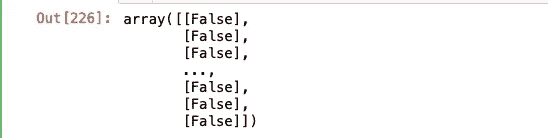

# 人工神经网络食谱

> 原文：<https://medium.com/analytics-vidhya/artificial-neural-network-cookbook-28240b57594a?source=collection_archive---------16----------------------->

## 如何使用 Keras 实现人工神经网络的逐步说明


放电神经元

# 什么是神经网络？

神经网络是机器学习中的分类算法之一，它实际上是受人脑神经元细胞的启发，来预测某个事件或因变量的概率。它更像一个逻辑回归，但具有多层激活函数，以确保预测的准确性更高。

如果你熟悉基本的回归技术，你可能想知道为什么不用逻辑回归来解决分类问题？问题是，简单的逻辑回归不能有效地计算非线性假设，因此我们使用人工神经网络进行实时复杂的分类

> 神经网络是更多层的逻辑函数或其他一些激活函数，可以产生更复杂的非线性决策边界。

我知道如果你对神经网络完全陌生，这种解释不足以理解它的全部背景，如果你有兴趣知道它的数学背景，我强烈建议你去看吴恩达教授的视频讲座，关于进一步的数学参考，你可以读一本名为*“制作你自己的神经网络”的书。*

现在让我们开始，看看我们如何使用流行的 python 库“ *Keras”实现 ANN。*

## 用例

对于我们下面的 ANN 实现的例子，我们的目标是预测，当客户服务代表打电话给客户时，他们是否会订阅银行定期存款？

我已经从 https://archive.ics.uci.edu/ml/datasets/Bank+Marketing[得到了数据集](https://archive.ics.uci.edu/ml/datasets/Bank+Marketing)

不要再浪费时间了，让我们开始如何从头开始建立一个人工神经网络模型。

# 建立人工神经网络模型

## 步骤 1-导入数据集

与任何其他机器学习模型一样，第一步将是导入我们将要使用的数据集，并在需要时进行必要的预处理。

让我们导入数据集

```
import pandas as pd
import numpy as np
import matplotlib.pyplot as plot
import seaborn as sosdf = pd.read_csv('/Users/arunramji/Downloads/Sourcefiles/bank-additional/bank-additional-full.csv',sep=';')df.describe()
```


您可以从中获得一些关于数据集的基本统计信息。

## 步骤 2-检查空值

另一个非常重要的预处理步骤是，在我们的数据集中识别缺失值，并用一些合理的值移除或替换它(如果没有这些缺失值，可能会导致模型预测有偏差)。

让我们检查数据集中任何缺失的值。

```
sns.heatmap(df.isnull(),yticklabels=False,cbar=False,cmap='viridis')
```


缺少值

如果有任何缺失值，我们可能会在图表中为每个变量绘制条形，但在我们的数据中，没有这样的缺失值，因此我们可能不需要进行任何插补。

## 步骤 3-编码分类变量

由于大多数参数 ML 算法只能得到数字形式的输入向量，所以在建立模型之前，我们必须将分类变量转换成数字形式。

## a.标签编码

例如，如果我们有分类变量:Sex {Male，Female}，我们应该在将该变量用作模型变量之前将其转换为{0，1}，这种技术称为“标签编码”。

> 将分类变量值转换为具有整数值的数值变量被称为“标签编码”或“整数编码”

## b.序数变量的编码

对于只有两个可能值(例如:性别)的分类变量来说，标签编码本身就足够了，但是对于有两个以上可能值且具有某种顺序的变量来说，应该以相同的顺序进行编码。

例如，序数变量有值→好，平均，坏

如果我们要使用标签编码，它会随机给出如下数字:

好:0，一般:2，差:1

这对顺序变量没有意义，因为好的>平均的>坏的，我们应该按照下面的顺序编码(哪个是正确的)

好:2，一般:1，差:0

> 值具有某种顺序的分类变量应该以相同的顺序编码，这样当我们将它用于算法时，它将正确地解释它的意义。

虽然我们可以使用 sklearn 实现分类变量的标签编码的方法很少，但我经常使用 **Find/Replace** 来编码顺序变量，因为我们对这种方法有更多的控制来编码每个值。

让我们看看所有的分类变量是什么，

```
df.select_dtypes('object').info()
```


分类变量

当你浏览数据集时，你会发现在所有这些因素中——工作、教育和收入有一定的顺序，尽管一开始可能不明显，但它间接说明了一些事情。例如，一个高薪工作的人可能比一个低薪工作的人更倾向于开定期存款。

这同样适用于其他两个变量，所以让我们根据从中推断出的顺序，开始使用 find/replace 对它们进行编码。

```
#Encoding categorical variable'''Lets first split what are ordinal categorical variable and normal categorical variable1\. Ordinal - job , education ,poutcome2\. Normal - rest of them'''dict_job = {"job":{"housemaid":1,"unemployed":0,"entrepreneur":4,"blue-collar":1,"services":3,
                  "admin.":2,"technician":2,"retired":1,"management":4,"self-employed":3,
                  "unknown":1,"student":0.5}}
dict_education = {"education":{"basic.4y":1,"basic.6y":1,"basic.9y":1
                              ,"high.school":1,"professional.course":2,
                              "university.degree":2,"illiterate":0.9,"unknown":0.9}}
dict_poutcome = {"poutcome":{"nonexistent":0,"failure":0,"success":1}}dict_y = {"y":{"no":0,"yes":1}}
```

现在我们已经创建了带有相关编码值的字典，注意我也为依赖变量 y 做了同样的事情。

```
#Find and Replace
for i in [dict_job,dict_education,dict_poutcome,dict_y]:
    df.replace(i,inplace=True)
```

好了，现在让我们用 sklearn 对剩下的名义变量(没有顺序的变量)进行编码。

```
#Encoding rest of the un ordinal categorical variable 
from sklearn.preprocessing import LabelEncoderlc_X1 = LabelEncoder()
lst = ['marital','default','housing','loan','contact','month','day_of_week']
for i in lst:
    df[i] = lc_X1.fit_transform(df[i])
```

这将把所有剩余的分类变量转换成整数。

让我们看一看我们都做了些什么，


标签编码后的样本数据集

好吧，好吧！所以我们已经编码了所有的分类变量(包括名词性和序数，这样够了吗？

当你注意到‘婚姻’变量时，你可以看到我们的 sklearn 标签编码器将它转换成整数(1，2，3..)，正如我们之前所讨论的，即使变量中没有顺序，它也以某种方式转换了一个有顺序的整数，如果我们将此直接用于我们的算法，则 martial status 2 的值可能大于 1，为了避免这种情况，我们必须遵循另一种称为“一个热编码”的方法。

> 独热编码器为每个值创建一列，以便与所有其他值进行比较。对于每个新列，如果一行包含该列的值，则该行得到 1，如果不包含该列的值，则得到 0。

让我们使用熊猫来应用一个热编码器，

```
#one hot encoding
df_1 = pd.get_dummies(df,columns=['marital','default','housing','loan','contact','month','day_of_week']
               ,drop_first=True)
```

我们在上面的代码中使用 drop_first = True 来避免“虚拟变量陷阱”,这是“多重共线性”的基本概念。


在一次热编码之后

您可以注意到，对于“婚姻”变量，它创建了三个唯一的列，对于每个值，如果该值存在，那么它将为 1，否则为 0。

酷！可能我们已经完成了所需的数据预处理，现在是有趣的部分了，大家，让我们建立人工神经网络。

## 步骤 4 —分割数据集

与所有其他学习算法一样，我们必须分配因变量和自变量，并将数据集分为训练和测试。

```
#Assign Variable
X = df_1.drop(columns='y',axis=1).values #matrix of feature X
y = df_1['y'].values #dependent variable vector y#split training - test set
from sklearn.model_selection import train_test_split
X_train,X_test,y_train,y_test = train_test_split(X,y,test_size=0.2,random_state=101)
```

## 步骤 5-特征缩放

这是重要的一步，我们正在减少所有变量的大小，使它们彼此相似，这样我们的算法运行得更快，并提供合理的参数。

```
#Feature Scaling
from sklearn.preprocessing import StandardScaler
sc = StandardScaler()
X_train = sc.fit_transform(X_train)
X_test = sc.fit_transform(X_test)
```

## 步骤 6 —建立人工神经网络模型


让我们导入 keras 包

```
#ANN Model#import keras libraries and modules 
import keras     #backend tensorflow by default#sequential module required to initialise neural network
from keras.models import Sequential#dense model required to build layers of ANN
from keras.layers import Dense#import dropout class if needed
from keras.layers import Dropout
```

让我们初始化人工神经网络模型

```
classifier = Sequential() #object instantiating
```

让我们添加我们的第一层

```
classifier.add(Dense(units=13,activation='relu',kernel_initializer='uniform',input_dim=35))classifier.add(Dropout(rate=0.1))
```

下面参数说明，

1.  单位-第一层的节点数
2.  激活——激活函数我们使用隐藏层
3.  kernel_initializer —初始化接近 0 的权重
4.  input_dim —数据集中独立变量的数量

我们需要添加多少层和节点完全取决于我们自己，我们可以使用不同的体系结构并提出一个有效的体系结构，但一般的方法是使用节点作为

因变量数量+自变量数量/ 2

但这不是强制性的，您也可以选择不同的节点数。

> 退出是一种技术，在随机选择的训练阶段随机忽略单位

让我们添加第二层

```
classifier.add(Dense(units=13,activation='relu',kernel_initializer='uniform'))classifier.add(Dropout(rate=0.1))
```

让我们添加第三层和最后一层，因为它是一个二进制分类，一个最终节点就足够了。

```
classifier.add(Dense(units=1,activation='sigmoid',kernel_initializer='uniform'))
```

下一步，让我们添加用于模型的参数类型、成本函数和指标。

```
#compile ANN
classifier.compile(optimizer='adam',loss='binary_crossentropy',
                  metrics=['accuracy'])
```

完美！！现在我们已经建立了神经网络的框架，现在是时候传递来自训练集的输入并训练模型了😃

```
#fitting ANN
classifier.fit(x=X_train, y = y_train,batch_size=10,epochs=100)
```

batch_size —每次迭代所需的样本数量

时期—优化模型的迭代次数

一旦你运行了上面的步骤，我们将会看到如下的每次迭代，直到它完成，很漂亮，不是吗？！


好吧。！现在，我们的模型在训练集中的准确率为 90.21 %，这意味着如果您给模型提供相同的训练集数据，它将对 90.21%的数据进行正确预测。

## 第七步——预测

让我们输入测试集数据，看看它如何预测。

```
#predict test sety_pred = classifier.predict(X_test)y_pred = y_pred > 0.5  # predicted values with more than 50% probability 
y_pred
```

y_pred 数组包含因变量是否有超过 50%的机会为“是”的布尔值。

如果是，则为真，如果不是，则为假。



测试集的精确度是多少？

> 测试集上模型的准确性:在数据集的所有实际样本中，我们正确预测了多少

> 真阳性+真阴性/总样本

我们可以使用混淆矩阵来列出错误分类的数量。

通常，对于我们的目标变量“y ”,混淆矩阵会是这样的


混淆矩阵结构

让我们将实际测试集类和预测测试集类的混淆矩阵列表。

```
from sklearn.metrics import confusion_matrix
cm = confusion_matrix(y_test,y_pred)
df = pd.DataFrame(cm)
df
```


混淆矩阵

*   **真阳性(TP):** 没有选择定期存款的*人，也被预测有*没有选择定期存款的*。*
*   ***真否定(TN):** 选择了定期存款并且也被预测到*的人选择了定期存款*。*
*   ***假阴性(FN):** 没有选择的人，但是预测说他们选择了。*
*   ***误报(FP):** 选择定期存款*的人*预测说他们不会。*

*让我们计算一下精确度，*

> *真正+真负/ TP+TN+FP+FN*

*7174 + 237 / 7174+105+722+237 = 0.89*

***测试集上的准确率为 89%***

*准确性通常会给出模型性能一般概念。如果我们的训练集有或多或少相等数量的正类和负类，那么我们可以相信准确性是模型性能的标准。*

*然而，我们的模型具有因变量的正类和负类的不等分布，因此我们可能必须使用“敏感性”和“特异性”来进一步评估。*

*训练集中正类和负类的计数:*

*正类' 0 '[未选择存款的客户] : 36548*

*负类' 1 '[选择存款的客户] : 4640*

> ***敏感度用于评估模型预测正类的置信度***

> *灵敏度=真阳性/真阳性+假阴性*

*7174 / 7174 + 722 = 0.9085*

***模型对测试集的敏感度为 90.85 %***

*这意味着，如果你在模型中给出一个新的未知测试集，它将很有可能正确预测 90%的肯定类。*

> ***特异性用于评估模型预测阴性类别的置信度***

> *特异性=真阴性/真阴性+假阳性*

*237 / 237 + 105 = 0.692*

***模型对测试集的特异性为 69.2 %***

*这意味着，如果我们对未知集合使用我们的模型，只有 69%的时间它会正确预测负类。*

*因此，在我们的示例中，我们的目标是预测可能接听电话并同意认购定期存款的客户为负类“是”，模型预测的准确率仅为 69.2%。*

> ****如果正确识别阳性对我们来说很重要，那么我们应该选择灵敏度更高的模型。然而，如果正确识别阴性更重要，那么我们应该选择特异性作为度量标准。****

*由于我们的模型在预测负类方面表现不太好，但仍有模型改进的空间，您可以通过多种方式实现这一点，如*添加更多层、调整辍学率、使用不同的神经网络架构*等等。*

# *结束注释*

*我希望这可能给你一些关于用 keras 工具和评估指标烹饪神经网络的基本想法，我强烈鼓励你使用这些数据并尝试提高准确性。*

*如果你觉得这有用或者有什么建议，请在下面留下评论。*

> *为了更好的未来继续努力！！*