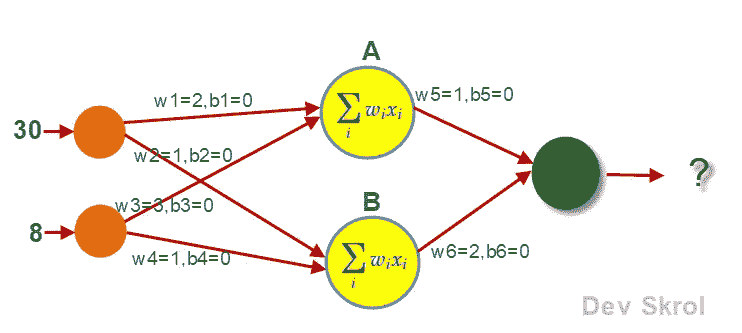

# 用回归实例说明人工神经网络

> 原文：<https://medium.com/analytics-vidhya/artificial-neural-network-explained-with-an-regression-example-9e60c3efa624?source=collection_archive---------7----------------------->

在本文中，我们将讨论实现一个简单的人工神经网络(ANN)的基础知识。

建议了解一下人工神经元是如何模仿人脑神经元的。请阅读[这篇文章](https://devskrol.com/index.php/2020/11/08/how-neurons-work-and-how-artificial-neuron-mimics-neurons-in-human-brain/)以便于理解。如果你很想了解安的历史，请查看[这篇文章](https://devskrol.com/index.php/2020/11/07/artificial-intelligence-a-brief-introduction-and-history-of-deep-learning/)。

# 人工神经网络的体系结构:

人工神经网络的结构包含 4 个主要部分。

**输入层接收输入:**

输入层是一组节点，每个节点将输入数据视为一个节点。对于一个回归问题，如果我们有 10 个列/特征，那么我们需要在输入层设置 10 个节点。

**隐藏图层:**

一个 ANN 可以有一个或多个隐藏层。每层可以有任意数量的神经元。每个神经元都是一个计算单元和一个激活单元的组合。

**输出层:**

每个人工神经网络有一个输出层，提供模型的输出。

如果模型是回归，那么输出层将只有一个节点。此节点的输出是输入图层中给定输入的 Y 预测值。

如果目标变量是两个类的分类数据，那么输出层应该有 2 个节点，激活函数应该是“Sigmoid”。

如果是多类分类，那么输出层的节点应该与目标变量的类的数量完全相同。并且激活功能应该是“Softmax”。

如果激活函数是 Sigmoid 或 Softmax，我们将从输出层的所有节点中获取概率值。最大概率值的索引是输出。

要将 Y 值转换为分类数据，

```
y_data = to_categorical(y_data
```

如果你想找到一个示例模型，那么访问 [**深度学习—分类示例**](https://devskrol.com/2021/01/16/deep-learning-classification/) 。

**权重&偏差:**

图中提到的每个连接都分配了权重和偏差。权重值最初是随机分配的，并将由优化器在每个时期进行更新。偏差值用于避免权重变为零

# 构建人工神经网络的 API:

有许多 API 可用于构建人工神经网络。

最流行的 API 是 Google 的 TensorFlow。它与 Python & Numpy 接口。

在 Tensorflow 的基础上还开发了其他一些 API，使其更易于使用。一个这样的

API 是 Keras。在这篇文章中，我们将使用 Keras。

# Keras 中用于构造 ANN 的重要类:

Squential()类有助于对层的线性堆栈进行分组。这个类返回一个模型对象，可以用来添加更多的层。

```
from keras.models import Sequential
model = Sequential()
```

**Dense()类实现了一个层。**

它可用于输入、隐藏和输出层。

隐藏层和输出层中的密集节点将从每个连接中获得一个权重，并计算(权重*输入)+偏差。来自所有连接的所有结果将被加在一起，并作为输出提供给下一层的神经元。



来源:图片由 devskrol.com 作者提供

例如，如果我们的数据有两个特征年龄和支出，其值为 30 & 8，工资为 40，000，那么特征 30 & 8 将作为输入层节点的输入。

根据上图，权重和偏差值将被随机分配。

神经元中的计算:

A = (30 *2 + 0) + (8* 3 + 0) = 84

B = (30 *1 + 0) + (8* 1 + 0) = 38

输出= (84 *1 + 0) + (38* 2 + 0) = 160

160 是第一前馈过程的输出。

该值与薪金列值 40，000 不匹配。

要获得 40，000 的输出，权重将在反向传播过程中更新。

在这种情况下，指定的优化器(例如:梯度下降、Adam 等)将负责这个过程。

首先，权重 w5 和 w6 将被更新。那么将更新下一组权重 w1、w2、w3 和 w4。

对于下一个数据，这种情况和前馈将再次发生。

类似地，对于剩余的数据和时期，权重和偏差将被更新。

```
from keras.layers import Densemodel = Sequential()model.add(Dense(2, input_shape = (2,), activation= 'sigmoid'))
model.add(Dense(10, activation= 'sigmoid'))
model.add(Dense(10, activation= 'sigmoid'))
model.add(Dense(1))
```

现在，我们的模型的架构已经构建好了。

我们需要为反向传播选择正确的损失函数和优化器。

```
from keras import optimizerssgd = optimizers.SGD()model.compile(optimizer = sgd, loss = 'mean_squared_error', metrics= ['mse', 'mae'])
model.summary()
```

输出:

```
Model: "sequential"
_________________________________________________________________
Layer (type)                 Output Shape              Param #   
=================================================================
dense (Dense)                (None, 20)                280       
_________________________________________________________________
dense_1 (Dense)              (None, 10)                210       
_________________________________________________________________
dense_2 (Dense)              (None, 10)                110       
_________________________________________________________________
dense_3 (Dense)              (None, 1)                 11        
=================================================================
Total params: 611
Trainable params: 611
Non-trainable params: 0
_________________________________________________________________
```

在上面的总结中，我们可以看到“可训练参数:611 ”,这意味着上述网络的权重和偏差总共是 611。

```
model.fit(X_train, Y_train, batch_size= 40, epochs=100, verbose= 0)
train_pred = model.predict(X_train)
test_pred = model.predict(X_test)from sklearn.metrics import mean_squared_error, mean_absolute_errorprint("Train Accuracy: ",mean_squared_error(Y_train, train_pred))
print("Test Accuracy: ",mean_squared_error(Y_test, test_pred))
```

输出:

```
Train Accuracy:  85.60549570539762
Test Accuracy:  86.0492232511959
```

# 结论:

在本文中，我们已经看到了人工神经网络的体系结构及其工作原理。在下一篇文章中，我们将看到一个完整的回归示例。

感谢您阅读我们的文章，希望您喜欢。😊

喜欢支持？只需点击喜欢按钮❤️.

快乐学习！👩‍💻

# 您还希望:

1.  [**深度学习—分类示例**](https://devskrol.com/2021/01/16/deep-learning-classification/)
2.  [**人工智能—深度学习简介及历史**](https://devskrol.com/2020/11/07/artificial-intelligence-a-brief-introduction-and-history-of-deep-learning/)
3.  [**深度学习模型的损失函数有哪些？**](https://devskrol.com/2020/09/12/what-are-the-loss-functions-for-a-deep-learning-model/)
4.  [**神经网络中的优化器**](https://devskrol.com/2020/09/05/optimizer-in-neural-network/)