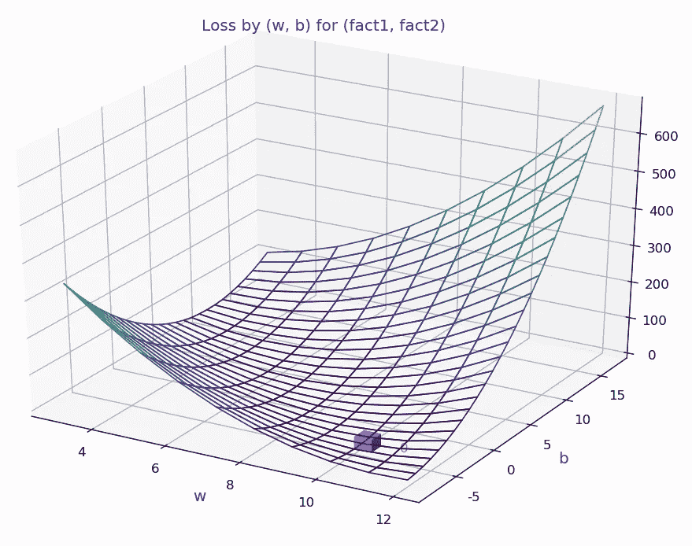
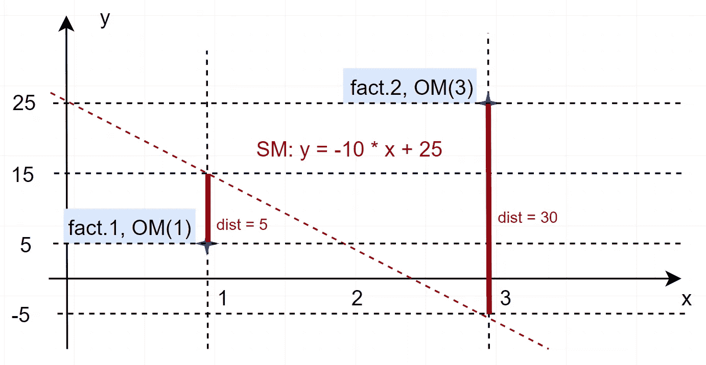
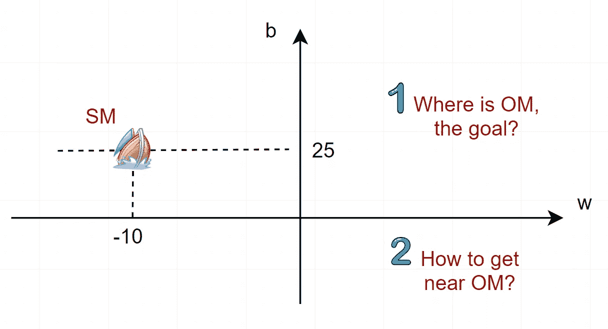
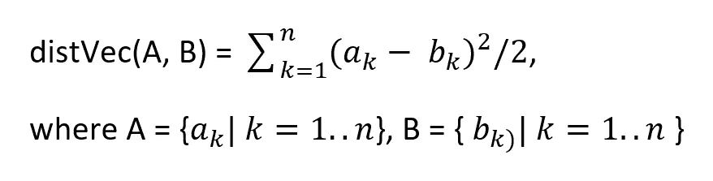
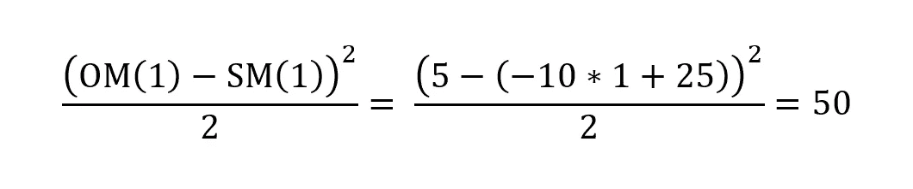
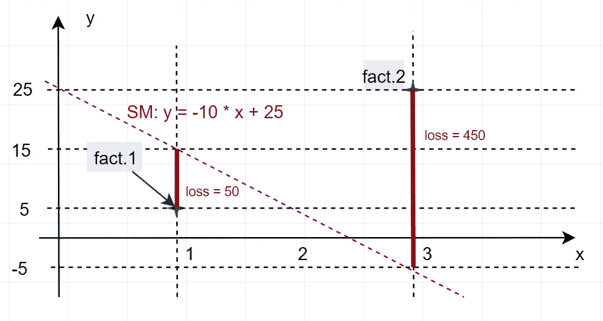
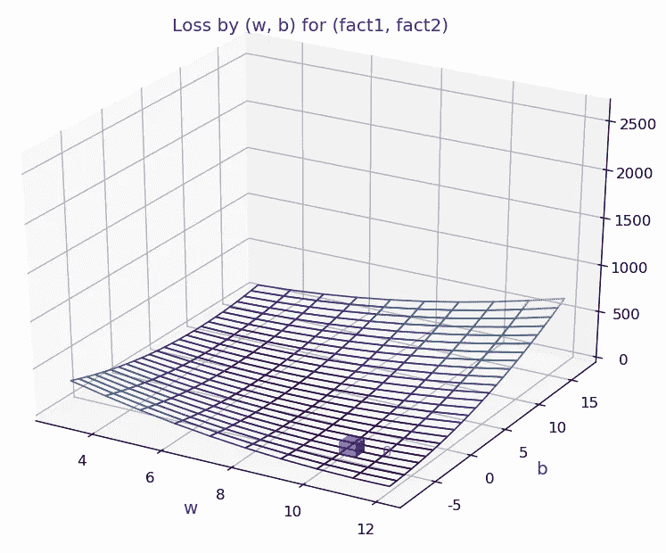
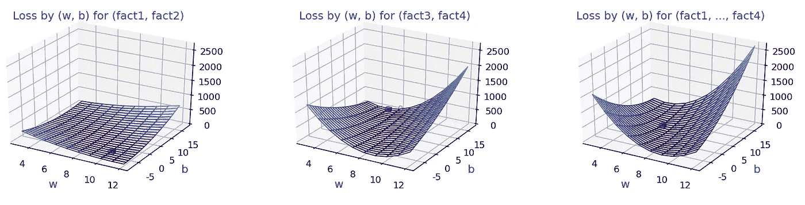
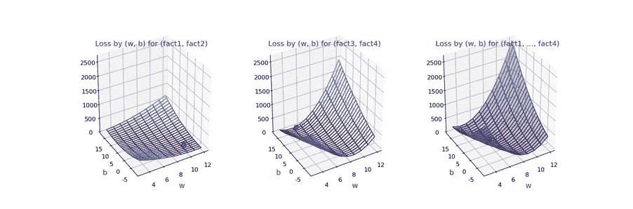
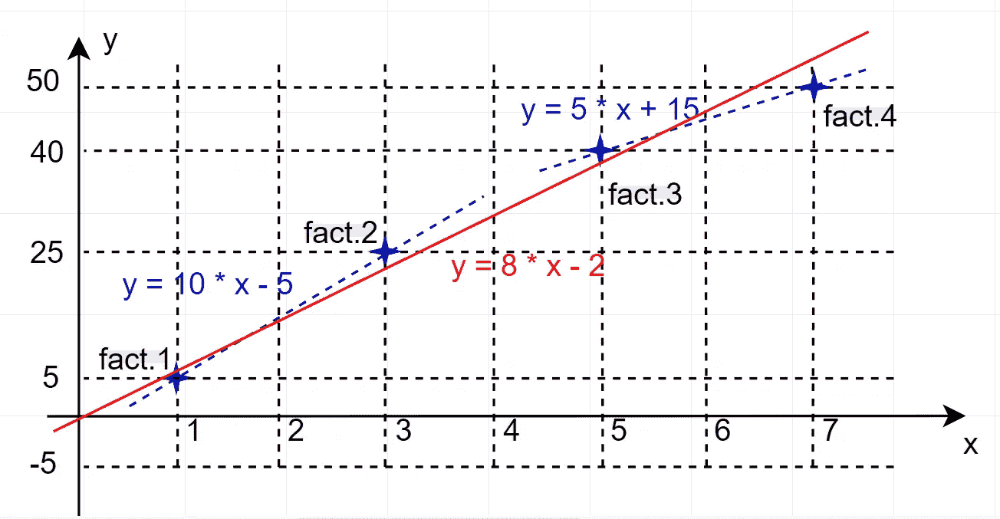

# 人工神经网络-2，对我儿子的解释不同

> 原文：<https://medium.com/analytics-vidhya/artificial-neural-networks-2-explained-differently-to-my-son-e9fcfa19a5b7?source=collection_archive---------6----------------------->

“唯一真正有价值的是直觉。”艾伯特·爱因斯坦。


不管自然做什么，不管它是什么，我们都认为它是自然的。这是绝对的信仰。相信我们的直觉会更快乐。

> 这篇文章之前是另一篇文章:[人工神经网络-1，对我儿子的解释不同。](/@fleetpro/artificial-neural-networks-1-explained-to-beginners-and-my-son-36722943fca2)



**目标**

这篇文章的目的是用最简单自然直观的方式向人工智能初学者解释人工神经网络训练技术的基本原理。

**在之前的帖子中，我们做了…**

我们发现，如果我们通过从范围中移除所有领域知识来在训练过程中进行纯统计，预测就会变得模糊不清。我们必须引入预测的直观定义。如果一个预测符合我们的直觉，那么它就是正确的。AI 预测很直观。

我们将一个简单的统计任务定义如下:

*   已知的事实有:(1，5)和(3，25)
*   什么是 x 如果(2，x)是事实，

其中(features，label)代表一个领域知识:“母鸡在‘features’——第个月下了‘label’蛋”，虽然现在领域知识的重要性被忽略了。

我们在模型空间中随机选取了初始的 SM(主观模型),并打算将 SM 推向 OM(客观模型),这是我们无法精确定位的。我们只知道事实(1，OM(1))和(3，OM(3))。



将 SM 驱动到 OM 意味着同时将 SM(1)和 SM(3)分别驱动到 OM(1)和 OM(3)。

耐心点，加入乐趣。

**如何接近 OM(目标模型)**

将 SM 驱动到 OM 意味着同时将 SM(1)和 SM(3)分别驱动到 OM(1)和 OM(3)。

*   SM(1) -> OM(1)
*   SM(3) -> OM(3)

，这要通过调整 SM 的参数来完成，即[y = w * x + b]的(w，b)。这意味着 SM 在模型空间中朝着 OM 航行。注 OM 本身可能没有嵌入到(主观)模型空间中。



**啰嗦。只管打！**

“离 om 近或远”意味着距离的概念。当前 SM 和幻影 OM 之间的距离也是部分已知的。

我们将两个向量之间的距离定义如下:

*   distVec，作为两个实向量的距离。



虽然距离有直观的定义，但我们选择如上所示的失真距离的原因将在后面讨论。(距离的合格性由[度量公理](https://en.wikipedia.org/wiki/Metric_(mathematics))定义，如果你是一个数学极客。)

**定义距离的代码**

上面定义的距离可以编码如下:

```
# Comments were removed to save space.import numpy as npdef distVec(A, B):
   """Returns the distance of couples of vectors, which reside on   
   the last axises of A and B, respectively."""
   C = np.power(A - B, 2) / 2
   return np.sum(C, axis = len(C.shape) - 1)
```

函数 distVec 返回向量对的距离，可以接受任何形状的多维矩阵，该矩阵在其最后一个轴上包含向量。

**注意！我们在潜水。**

我们定义了从给定事实中分别提取特征集和标签的函数 factElems。

```
def factsElems(facts):
   """Returns the features set and label of facts, which reside on    
   the last axis."""
   return facts[..., :-1], facts[..., -1]
```

我们还定义了从给定的事实中分别提取权重和偏差的函数。

```
def smElems(sm):
   """Returns the weight and bias components of linear subjective 
   models sm."""
   return sm[..., :-1], sm[..., -1:]
```

基于上面定义的函数层，我们引入了函数 smLinPredict，它返回由线性 SM 模型为给定特征集预测的标签。

```
def smLinPredict(sm, features):
   """Returns the labels predicted by linear SM models for given 
   features set."""
   smW, smB = smElems(sm)
   return np.matmul( smW, np.transpose(features) ) + smB
```

SM 和 OM 之间的距离是 SM 的缺点导致的损失。我们不知道它们之间的完整距离，只是部分距离。它是部分的，因为它是关于部分已知/已知的事实。我们希望减少每一个部分的距离将有助于减少未知的，完整的距离。注意，距离是一个简单的线性和。

例如，对于 fact1 = (1，5)，SM 和 OM 之间的距离或 SM 的损耗为



同样，fact2 = (3，25)的距离是 450。因此，事实 fact1 和 fact2 的距离是 50 + 450 = 500。

我们必须找到一个新的(w，b ),而不是上面的(-10，25 ),给出一个小于 500 的新损失。



所以，是时候定义函数损失了:

```
def loss(sm, facts):
   """Returns the loss by an array of SMs for given facts."""
   features, omLabels = factsElems(facts)
   smLabels = smLinPredict(sm, features)
   #smLabels = sigmoid( smLinPredict(sm, features), 0.1 )
   return distVec(smLabels, omLabels)
```

下面是一些测试，也有助于我们理解:

```
fact1 = np.array([1,5]); facts = np.array([ fact1 ])
sm1 = np.array([-10, 25]); sm = np.array([sm1])
print("loss = {}".format(loss(sm, facts)))
Outputs: loss = [50.]fact2 = np.array([3,25]); facts = np.array([ fact2 ])
sm1 = np.array([-10, 25]); sm = np.array([sm1])
print("loss = {}".format(loss(sm, facts)))
Outputs: loss = [450.]facts = np.array([ fact1, fact2 ])
sm1 = np.array([-10, 25]); sm = np.array([sm1])
print("loss = {}".format(loss(sm, facts)))
Outputs: loss = [500.] # 50 + 450
```

我们定义的基本函数层通过一组 SMs 为一组 facts 批量计算损失，测试如下:

```
facts = np.array([ fact1, fact2 ])
sm11 = np.array([-10, 25]); sm12 = np.array([-9, 20]); sm21 = np.array([-12, 20]); sm22 = np.array([-8, 28])
sm = np.array([ [sm11, sm12], [sm21, sm22] ])
print("loss = {}".format(loss(sm, facts)))
Outputs: loss = [ [500\. 530.] [845\. 333.] ]
```

**“唯一真正有价值的东西是直觉。”**

漫长的编码之旅，我们已经准备好批量处理一个模型空间，而不是一次一个模型，来可视化损失分布。

计算损失分布的表面:

```
w = np.arange(-10, 20, 1)
b = np.arange(-10, 10, 1)
W, B = np.meshgrid(w, b)
smW = W.reshape(tuple(np.append(W.shape,1)))
smB = B.reshape(tuple(np.append(B.shape,1)))
sm = np.append(smW, smB, axis = len(smW.shape)-1)
fact1 = np.array([1, 5]); fact2 = np.array([3, 25]);
facts = np.array([fact1, fact2])
Z = loss(sm, facts)
```

为我们配备绘图工具:

```
import matplotlib.pyplot as plt
from matplotlib import animation
from matplotlib import cm
from matplotlib.ticker import LinearLocator, FormatStrFormatter
from mpl_toolkits.mplot3d import Axes3D
```

创建一个图形来绘制损失面，并格式化轴:

```
fig = plt.figure(dpi = 120)
ax = fig.gca(projection = '3d')title = 'Loss by (w, b) for (fact1, fact2)'; zmax = ax.set_title(title, fontsize=12, fontweight='normal', color='b')
ax.set_xlabel('w', fontsize=14, fontweight='normal', color='b')
ax.set_ylabel('b', fontsize=14, fontweight='normal', color='b')
```

决定代表损失面高度的颜色:

```
norm = plt.Normalize(Z.min(), Z.max())
colors = cm.viridis(norm(Z))
rcount, ccount, _ = colors.shape
```

将绘制损失面的任务交给图轴:

```
surf = ax.plot_surface(W, B, Z, rcount=rcount, ccount=ccount, facecolors=colors, shade=False)
surf.set_facecolor((0,0,0,0))
```

让情节执行所有给定的任务:

```
plt.show()
```

该图显示:



损失在(w，b) = (10，-5)处具有最小值= 0，这表示主观模型

以下用代数计算，与图相符。

*   SM(10，-5)最符合(因素 1，因素 2)，损失为 0
*   SM(5，15)最符合(fact3，fact4)，损耗为 0
*   SM(6，5)最符合(因素 1，因素 2，因素 3，因素 4)，损失 15



a.min = 0 at (10，-5)，b. min = 0 at (5，15)，c. min = 15 at (8，-2)



上述计算的直觉如下:



**挑战:**

*   如何在统计上得到(fact1，fact2)的(10，5)
*   如何统计地得到(fact3，fact4)的(5，15)
*   如何在统计上得到(fact1，…，fact4)的(6，5)
*   了解全部事实(事实 1，…，事实 4)，还是挖墙脚？

我希望我们能在下一篇文章中完成这段旅程。

> 这个帖子之后会有另一个帖子:AI 有人工神经元，而你有真神经元。掌握它，我的儿子！