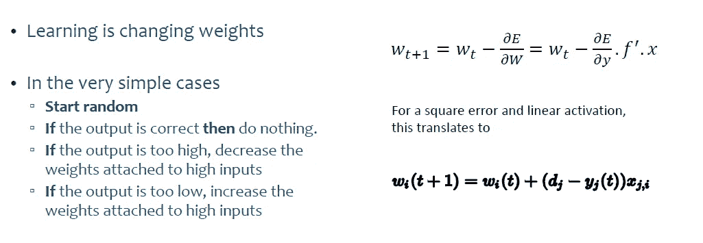
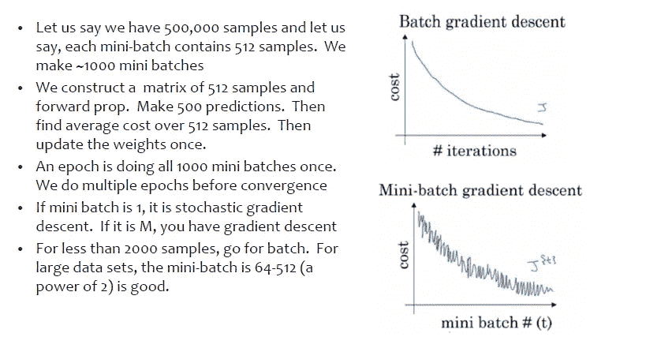
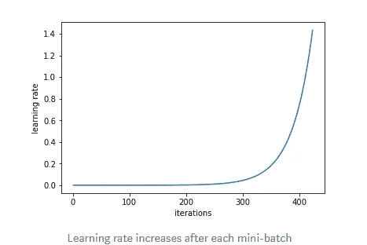
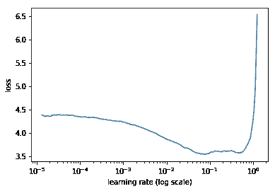
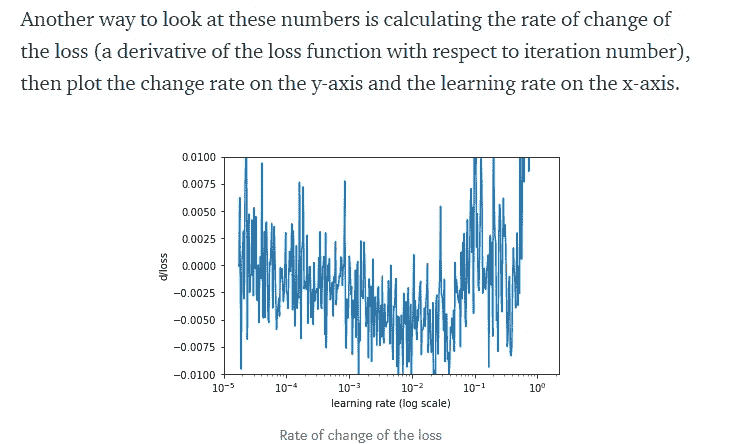
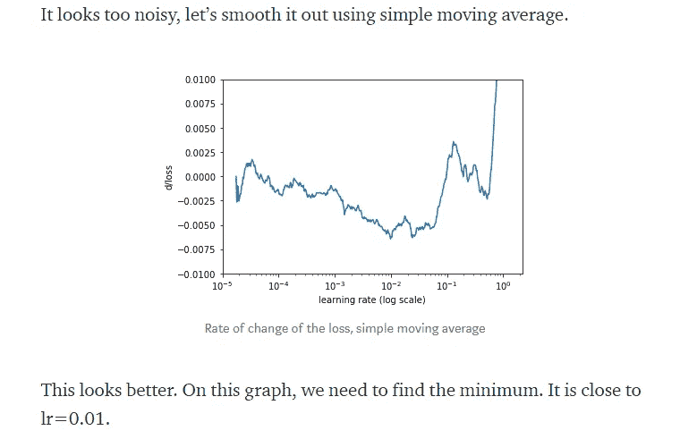

# 人工神经网络-直观的方法第二部分

> 原文：<https://medium.com/analytics-vidhya/artificial-neural-networks-an-intuitive-approach-part-2-7c60737cf332?source=collection_archive---------20----------------------->

前一篇文章的续篇

请找到第 1 部分的链接

 [## 人工神经网络-直观的方法第 1 部分

### 深度学习基础的全面而简单的方法

medium.com](/@nikethnarasimhan/artificial-neural-networks-an-intuitive-approach-part-1-890efac210f0) 

## 内容

1.  感知机学习
2.  更新权重的方法
3.  重量衰减学习率
4.  学习率
5.  超参数固定:

# 感知机学习

让我们回顾一下感知器最基本的功能。

1.  感知器接受输入，用权重缩放/乘以它们，对它们求和，然后将它们通过激活函数来获得结果。
2.  权重被随机初始化**用于第一个实例以获得输出。**
3.  然后，使用优化的**损失函数**和正则化(请浏览正则化的概念)来调整权重以最小化误差
4.  梯度下降用于**优化损失函数**以获得误差的最小值。

**注:要快速复习梯度下降，建议浏览以下链接**

 [## 理解梯度下降背后的数学。

### 机器学习中一种常用优化算法背后的简单数学直觉。

towardsdatascience.com](https://towardsdatascience.com/understanding-the-mathematics-behind-gradient-descent-dde5dc9be06e) 

# 更新权重的方法:

有多种更新权重的方法:

在计算损失之后，计算相对于权重的损失梯度，因为损失函数实际上是彼此独立的神经网络权重的函数。就好像损失是权重的多变量函数。权重现在以与梯度相反的方向更新。这将降低损失函数。这就是目标。在训练过程中，随机初始化的或具有某个初始值的权重不断更新，使得损失函数最小化。

**注:在线和随机梯度下降是一回事**

更新权重的多种方法

一个**历元**通常意味着您的算法在每个训练实例中看到**一次。现在假设您有“nn”个训练实例:**

如果您运行**批量更新**，每次参数更新都需要您的算法查看每个“nn”训练实例一次，即每个时期您的参数更新一次。

如果您运行**小批量更新**，批量大小= bb，则每次参数更新都需要您的算法参见“nn”训练实例的“bb ”,即每次参数更新大约 n/bn/b 次。

如果您运行 SGD(随机梯度下降)更新，每个参数更新都需要您的算法查看 1 个 nn 训练实例，即每个时期您的参数更新大约 nn 次。

为了使上述观点更清楚，让我们举一个例子:

在**梯度下降**或批量**梯度下降**中，我们使用每个历元的全部训练数据，而在**随机梯度下降(在线)**中，我们每个历元仅使用单个训练样本，并且小批量**梯度下降**位于这两个极端之间的**中，其中我们可以使用每个历元的小批量(小部分)训练数据。**

现在让我们介绍两个重要的概念**体重衰减和学习率。**

# **重量衰减**:

神经网络通过迭代学习一组权重，同时向后传播误差

由于输入的小变化可能会导致输出的大变化，因此具有大权重的网络可能会发出网络不稳定的信号。这可能表明网络对训练数据拟合过度，而对测试数据拟合较差

大的权重使得网络不稳定。尽管权重将专用于训练数据集，但预期输入中的微小变化或统计噪声将导致输出中的巨大差异。

这个问题的解决方案是更新学习算法，以鼓励网络保持较小的权重。这被称为权重正则化，并且它可以被用作减少训练数据集的过度拟合并提高模型的泛化能力的通用技术。

因为正则化是一个基本的概念(我希望读者知道正则化的概念),尽管我们将在这里重述一些基本概念

另一个可能的问题是，可能有许多输入变量，每个变量与输出变量的相关程度不同。有时我们可以使用方法来帮助选择输入变量，但变量之间的相互关系通常并不明显。

对网络的不太相关或不相关的输入使用小的权重甚至零权重将允许模型集中学习。这也将导致一个更简单的模型。

**鼓励小重量**

可以更新学习算法以鼓励网络使用小的权重。

做到这一点的一种方法是改变网络优化中使用的损耗计算，以便也考虑权重的大小。

向神经网络添加权重大小罚分或权重正则化具有减少泛化误差的效果，并且允许模型较少关注不太相关的输入变量。

**如何处罚重量大的**

基于权重的大小，惩罚模型分为两个部分。

第一个是权重大小的计算，第二个是优化过程应该对惩罚的关注程度。

**计算体重大小**

神经网络权重是实值，可以是正值或负值，因此，简单地增加权重是不够的。有两种主要方法用于计算权重的大小，它们是:

*   计算权重的绝对值之和，称为 L1。
*   计算权重平方值的总和，称为 L2。

如果可能，L1 鼓励权重为 0.0，从而产生更稀疏的权重(具有更多 0.0 值的权重)。L2 提供了更多的细微差别，都更严厉地惩罚较大的权重，但导致不那么稀疏的权重。在线性和逻辑回归中使用 L2 通常被称为岭回归。当试图培养对点球的直觉时，知道这一点是很有用的

有可能包括 L1 和 L2 两种方法来计算作为惩罚的权重的大小。这类似于线性和逻辑回归的弹性网络算法中使用的两种惩罚。

在神经网络领域，L2 方法可能是最常用的，传统上称为“*权重衰减*”。这在统计学上被称为*收缩*，这个名字鼓励你在学习过程中思考惩罚对模型权重的影响。

回想一下，每个节点都有输入权重和偏差权重。因为“*输入*是恒定的，所以偏差权重通常不包括在惩罚中。

**控制处罚的影响**

当训练网络时，计算出的权重大小被添加到损失目标函数中。

可以使用一个新的超参数(称为 alpha (a ),有时也称为 lambda)对它们进行加权，而不是直接将每个权重添加到惩罚中。这控制了学习过程对惩罚的关注程度。或者换句话说，基于权重的大小来惩罚模型的量。

alpha 超参数的值介于 0.0(无惩罚)和 1.0(完全惩罚)之间。该超参数控制模型中的偏差量，从 0.0 或低偏差(高方差)到 1.0 或高偏差(低方差)。

如果惩罚过重，模型会低估权重，使问题不充分。如果惩罚太弱，将允许模型过度拟合训练数据。

**使用权重调整的技巧**

**用于所有网络类型**

权重正则化是一种通用方法。

它可以用于大多数(也许是所有)类型的神经网络模型，尤其是多层感知器、卷积神经网络和长短期记忆递归神经网络的最常见网络类型。

在 LSTMs 的情况下，可能希望对输入和循环连接使用不同的惩罚或惩罚配置。

**标准化输入数据**

将输入变量更新为具有相同的比例通常是一种良好的做法。

当输入变量具有不同的标度时，网络权重的标度将相应地变化。这在使用权重正则化时引入了一个问题，因为权重的绝对值或平方值必须相加以用于惩罚。

这个问题可以通过规范化或标准化输入变量来解决。

**使用更大的网络**

较大的网络(更多层或更多节点)更容易过度拟合训练数据，这是很常见的。

当使用权重正则化时，可以使用更大的网络，而过度拟合的风险更小。一个好的配置策略可能是从较大的网络开始，并使用权重衰减。

**网格搜索参数**

通常对控制每个权重对惩罚的贡献的正则化超参数使用小值。

也许可以从测试对数标度的值开始，比如 0.1、0.001 和 0.0001。然后在最有希望的数量级上进行网格搜索。

**一起用 L1+L2**

不要试图在 L1 和 L2 的处罚中做出选择，两者都用。

现代和有效的线性回归方法，如弹性网，同时使用 L1 和 L2 惩罚，这可能是一个有用的尝试方法。这既给了你 L2 的细微差别，也给了你 L1 所鼓励的稀疏。

# **学习速度:**

神经网络的权重不能使用分析方法来计算。相反，权重必须通过称为随机梯度下降的经验优化过程来发现。

通过随机梯度下降针对神经网络解决的优化问题是具有挑战性的，并且解的空间(权重集)可以由许多好的解(称为全局最优)以及容易找到但技能较低的解(称为局部最优)组成。

在这一搜索过程的每一步中，模型的变化量或步长被称为“*学习率*”，它可能为您的神经网络提供最重要的超参数，以便在您的问题上实现良好的性能。

在本教程中，您将发现在训练深度学习神经网络时使用的学习率超参数。

## 学习率是多少？

使用随机梯度下降算法来训练深度学习神经网络。更多详情请点击梯度下降链接。

随机梯度下降是一种优化算法，它使用训练数据集中的示例来估计模型当前状态的误差梯度，然后使用误差反向传播算法更新模型的权重，简称为[反向传播](https://machinelearningmastery.com/implement-backpropagation-algorithm-scratch-python/)。

训练期间权重的更新量被称为步长或“*学习速率*”

具体而言，学习率是在神经网络的训练中使用的可配置的超参数，其具有小的正值，通常在 0.0 和 1.0 之间的范围内。

学习率通常用小写希腊字母 eta ( *n* )来表示。

在训练期间，误差反向传播估计网络中节点的权重所造成的误差量。不是用全量来更新权重，而是用学习率来缩放。

这意味着学习率 0.1(传统上常见的默认值)将意味着每次更新权重时，网络中的权重被更新 0.1 *(估计的权重误差)或估计的权重误差的 10%。

# 学习速度的影响

神经网络从训练数据集中的示例学习或逼近一个函数，以最佳地将输入映射到输出。

学习速率超参数控制模型学习的速率或速度。具体来说，它控制模型的权重随着每次更新而更新的分摊误差量，例如在每批训练示例结束时。

给定一个完美配置的学习率，模型将学习在给定数量的训练时期(通过训练数据)中最佳逼近给定可用资源(层数和每层的节点数)的函数。

一般来说，大的学习速率允许模型学习得更快，代价是达到次优的最终权重集。较小的学习速率可以允许模型学习更优或者甚至全局最优的一组权重，但是训练可能需要长得多的时间。

在极端情况下，过大的学习率将导致权重更新过大，并且模型的性能(例如其在训练数据集上的损失)将在训练时期内振荡。振荡表现据说是由发散的权重引起的。太小的学习率可能永远不会收敛，或者可能卡在次优解上。

在最坏的情况下，太大的权重更新可能导致权重爆炸(即，导致数字溢出)。

因此，我们不应该使用过大或过小的学习率。然而，我们必须以这样一种方式配置模型，即平均起来，找到一组足够好的权重来近似训练数据集所表示的映射问题。

## 如何配置学习率

在训练数据集上为模型找到一个合适的学习率值非常重要。

**事实上，学习率可能是为您的模型配置的最重要的超参数。**

不幸的是，我们无法在给定数据集上解析计算出给定模型的最优学习率。相反，一个好的(或足够好的)学习率必须通过反复试验来发现。

学习率要考虑的值范围小于 1.0，大于 10^-6.

学习率将与优化过程的许多其他方面相互作用，并且相互作用可能是非线性的。然而，一般来说，较小的学习速率将需要更多的训练周期。相反，较大的学习速率将需要较少的训练时期。此外，给定误差梯度的噪声估计，较小的[批量](https://machinelearningmastery.com/difference-between-a-batch-and-an-epoch/)更适合较小的学习速率。

学习率的传统默认值是 0.1 或 0.01，这可能是解决您的问题的良好起点。

Leslie N. Smith 在 2015 年论文“[训练神经网络的循环学习率](https://arxiv.org/abs/1506.01186)”的第 3.3 节中找到了这个问题的解决方案。

这种技术从低学习速率开始训练网络，并且对于每一批以指数方式增加学习速率。

每次小批量后，学习率都会增加

记录每批的学习率和培训损失。然后，画出损失和学习率。通常情况下，它看起来像这样:

记录每批的学习率和训练损失。然后绘制损失和学习率。下面的例子

损失在开始时减少，然后训练过程开始发散

首先，在低学习率的情况下，损失改善缓慢，然后训练加速，直到学习率变得太大，损失增加:训练过程出现偏差。

我们需要在图上选择一个损失减少最快的点。在这个例子中，当学习率在 0.001 和 0.01 之间时，损失函数快速减小。

下面一个有趣的阅读可以用来进一步了解(一篇写得很漂亮的文章):

 [## 重启随机梯度下降新手指南

### 一个额外的方法，使梯度下降更平滑和更快，并尽量减少神经网络的损失更多…

towardsdatascience.com](https://towardsdatascience.com/https-medium-com-reina-wang-tw-stochastic-gradient-descent-with-restarts-5f511975163) 

# 超参数固定:

超参数固定