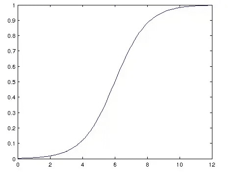

# 人工神经网络-直观的方法第三部分

> 原文：<https://medium.com/analytics-vidhya/artificial-neural-networks-an-intuitive-approach-part-3-a5888af9ac0?source=collection_archive---------12----------------------->

## 前一篇文章的续篇

 [## 人工神经网络-直观的方法第二部分

### 前一篇文章的续篇

medium.com](/@nikethnarasimhan/artificial-neural-networks-an-intuitive-approach-part-2-7c60737cf332) 

以上是第 2 部分的链接

## 内容

1.  多层感知器(MLP)
2.  反向传播
3.  消失梯度问题
4.  爆炸梯度问题

# **多层感知器(MLP)**

感知器是一种简单的算法，用于执行二元分类；即，它预测输入是否属于感兴趣的某个类别:是或否，真或假等

感知器是线性分类器；也就是说，它是一种通过用直线分隔两个类别来对输入进行分类的算法。输入通常是特征向量`x`乘以权重`w`并加到偏差`b` : `y = w * x + b`。

感知器通过使用其输入权重形成线性组合，基于几个实值输入产生单个输出(有时通过非线性激活函数传递输出)。你可以这样用数学来写:

其中 **w** 表示权重向量， **x** 是输入向量， **b** 是偏差，phi 是非线性激活函数。

单层感知器不能执行非线性分类，例如 XOR 函数。

异或门

单个神经元代表单个函数，该函数可以将函数空间分成两部分，而 XOR 问题必须分成两部分。

所以对于我们的 XOR 问题，我们需要一个至少有两个隐藏神经元的隐藏层。如果我们只有一个隐藏的神经元，这仍然会产生错误的表示。这看起来像这样，如果我们有一个逻辑激活函数，它把空间分成两个子空间。(如上图)

但是，如果我们在隐藏层中使用两个神经元，我们可以将其中两个 sigmoid 曲线结合起来，产生这种形式的脊。

它类似于 XOR 真值表的函数空间，如下图所示:

通俗地说，在下图中，MLP 可以得出一个非线性的决策边界。

**多层感知器(MLP)**

多层感知器(MLP)是一种深度人工神经网络。它由一个以上的感知器组成。它们由接收信号的输入层、对输入做出决策或预测的输出层以及这两层之间任意数量的隐藏层组成，这些隐藏层是 MLP 的真正计算引擎。具有一个隐藏层的 MLPs 能够逼近任何连续函数。

## 层

MLP 由三层或更多层**非线性**激活节点构成(一个输入层和一个输出层，具有一个或多个*隐藏层*)。

## 学问

# 反向传播

我们一直在听到反向传播这个术语，所以让我们最终来深入研究一下什么是反向传播？

反向传播

**反向传播**，简称“误差反向传播”，是一种使用梯度下降的人工神经网络监督学习算法。给定人工神经网络和误差函数，该方法计算误差函数相对于神经网络权重的梯度。

**该算法用于通过一种叫做链规则的方法有效地训练神经网络。**简而言之，在网络的每一次正向传递之后，反向传播在调整模型参数(权重和偏差)的同时执行一次反向传递。

它可以被想象成一场乒乓球比赛，在每次向前传球后，反向传播误差将球送回，调整重量和偏差，然后再次向前传球，如此类推！！！

为了更好地理解反向传播，让我们举一个例子

反向传播的目标是优化权重，以便神经网络可以学习如何正确地将任意输入映射到输出。

从上面的单个训练集中可以看出:给定输入 0.05 和 0.10，我们希望神经网络输出 0.01 和 0.99。

## 向前传球

让我们计算给定模型，神经网络在它的第一次向前传递中预测什么。

这里使用的激活函数是逻辑函数。

这是基本结构:

为了使用一些数字，下面是初始权重、偏差和训练输入/输出:

反向传播的目标是优化权重，以便神经网络可以学习如何正确地将任意输入映射到输出。

对于本教程的其余部分，我们将使用单个训练集:给定输入 0.05 和 0.10，我们希望神经网络输出 0.01 和 0.99。

## 向前传球

让我们看看给定的神经系统在第一次向前传递时输出了什么。

再次计算输出层神经元的值，使用隐藏层神经元的输出作为输入。

同样，现在让我们计算误差

**向后传球**

假设我们想计算 W5 的误差

跳过繁琐的计算部分，我们得到 W5 的值如下

类似地，可以计算其他权重。

# **消失渐变问题:**

消失梯度问题是在用基于梯度的方法(例如反向传播)训练某些人工神经网络时发现的一个困难。特别是，这个问题使得学习和调整网络中早期层的参数变得非常困难。**随着架构中层数的增加，这个问题变得更加严重。**

这不是神经网络的基本问题——这是基于梯度的学习方法的问题，由某些激活函数引起。让我们试着直观地了解一下问题及其背后的原因。

**问题**

基于梯度的方法通过了解参数值的微小变化如何影响网络输出来学习参数值。如果参数值的变化导致网络输出的变化非常小，网络就无法有效地学习参数，这是一个问题。

这正是消失梯度问题中发生的情况-网络输出相对于早期层中参数的梯度变得非常小。这是一种奇特的说法，即使早期层的参数值发生很大变化，也不会对输出产生很大影响。让我们试着去理解这个问题发生的时间和原因。

**起因**

消失梯度问题取决于激活函数的选择。许多常见的激活函数(如 sigmoid 或 tanh)以非常非线性的方式将其输入“压缩”到非常小的输出范围内。例如，sigmoid 将实数线映射到[0，1]的“小”范围上，特别是函数在大多数数线上非常平坦。结果，输入空间的大部分区域被映射到非常小的范围。在输入空间的这些区域中，即使输入发生很大的变化，输出也会发生很小的变化，因此梯度很小。

例如，图 1 是 sigmoid 函数及其导数。请注意，当 sigmoid 函数的输入变大或变小时(当|x|变大时)，导数变得接近于零。

当我们将多层这样的非线性叠加在一起时，情况会变得更糟。例如，第一层将一个大的输入区域映射到一个较小的输出区域，该输出区域将被第二层映射到一个更小的区域，该输出区域将被第三层映射到一个更小的区域，依此类推。因此，即使第一层的参数发生很大变化，输出也不会有太大变化。

**解决方案:**

最简单的解决方案是使用 RELU 函数、漏 RELU 和参数 RELu(参考前面的激活函数)

RElu 问题:

1.  如果 x 为负，则取消渐变
2.  如果节点的权重被初始化，使得输出总是负的，那么梯度总是零，并且它们永远不会被更新

这些可以使用泄漏 RelU 和参数 ReLu 来解决(在激活函数中解释)。

# **爆炸梯度问题:**

爆炸梯度是一个问题，其中大的误差梯度累积并导致在训练期间对神经网络模型权重的非常大的更新。

这导致模型不稳定，无法从训练数据中学习。

## 什么是爆炸渐变？

误差梯度是在神经网络训练期间计算的方向和大小，用于在正确的方向上以正确的量更新网络权重。

在深度网络或递归神经网络中，误差梯度可以在更新期间累积，并导致非常大的梯度。这进而导致网络权重的大量更新，进而导致网络不稳定。在极端情况下，权重值可能变得过大，以至于溢出并导致 NaN 值。

通过在值大于 1.0 的网络图层中重复乘以梯度，爆炸以指数增长的方式发生。

## 爆炸渐变有什么问题？

在深层多层感知器网络中，爆炸梯度会导致网络不稳定，在最好的情况下无法从训练数据中学习，在最坏的情况下会导致无法再更新的 n an(非数字)权重值。

在递归神经网络中，爆炸梯度会导致网络不稳定，无法从训练数据中学习，充其量是无法从长输入数据序列中学习的网络。

## 怎么知道自己有没有爆炸渐变？

有一些微妙的迹象表明，在网络训练期间，您可能会遇到爆炸梯度，例如:

*   该模型无法在您的训练数据上获得牵引力(例如，损失惨重)。
*   该模型是不稳定的，导致每次更新的损失变化很大。
*   训练时模特走失去了南。

如果你有这些类型的问题，你可以深入挖掘，看看你是否有一个爆炸梯度的问题。

有一些不那么微妙的迹象，你可以用来确认你有爆炸梯度。

*   模型权重在训练期间很快变得非常大。
*   模型权重在训练期间变为 NaN 值。
*   在训练期间，每个节点和层的误差梯度值始终高于 1.0。

## 如何修复爆炸渐变？

有许多解决爆炸梯度的方法；本节列出了一些您可以使用的最佳实践方法。

## 1.重新设计网络模型

在深度神经网络中，可以通过将网络重新设计为具有更少的层来解决爆炸梯度。

在训练网络时使用更小的批量也可能有一些好处。

在递归神经网络中，在训练期间跨越更少的先前时间步骤的更新，称为通过时间的[截断反向传播，可以减少爆炸梯度问题。](https://machinelearningmastery.com/gentle-introduction-backpropagation-time/)

## 2.使用长短期记忆网络

在递归神经网络中，给定这种类型网络训练中的固有不稳定性，梯度爆炸可能发生，例如，通过时间的[反向传播](https://machinelearningmastery.com/implement-backpropagation-algorithm-scratch-python/)，其本质上将递归网络转换成深度多层感知器神经网络。

爆炸梯度可以通过使用[长短期记忆(LSTM)](https://machinelearningmastery.com/gentle-introduction-long-short-term-memory-networks-experts/) 记忆单元以及可能相关的门控型神经元结构来降低。

采用 LSTM 记忆单元是递归神经网络用于序列预测的一种新的最佳实践。

## 3.使用渐变剪辑

在具有大批量的非常深的多层感知器网络和具有非常长的输入序列长度的 LSTMs 中，爆炸梯度仍然可能发生。

如果爆炸梯度仍然存在，您可以在网络训练期间检查并限制梯度的大小。

这被称为渐变剪辑。