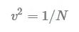
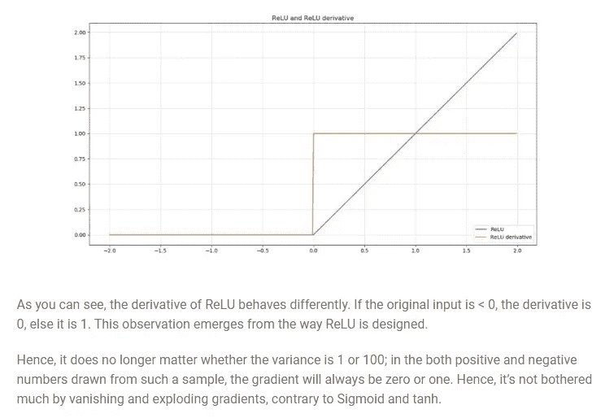
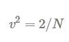
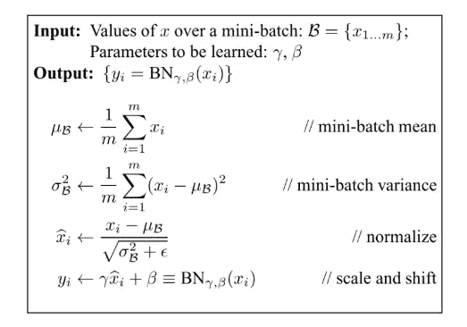
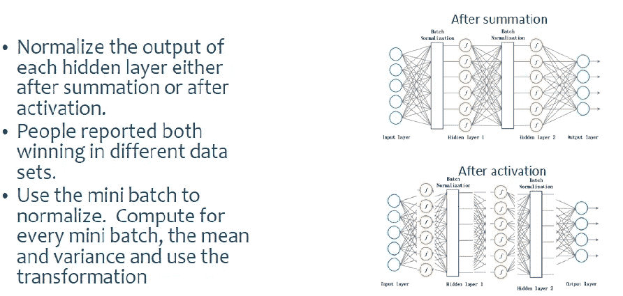
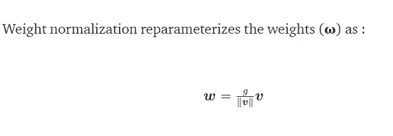
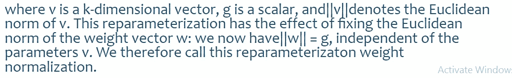
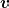
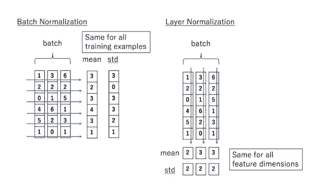
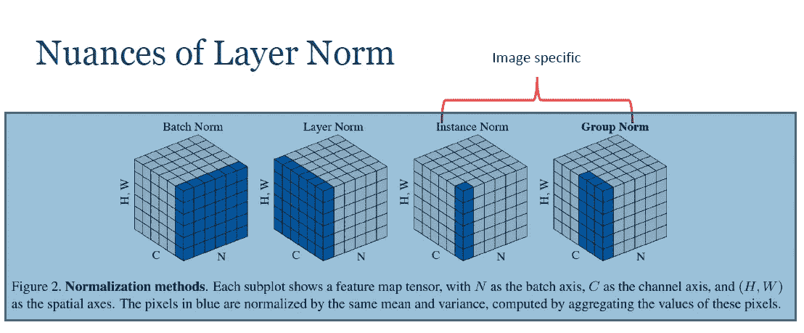

# 人工神经网络——直观的方法第四部分

> 原文：<https://medium.com/analytics-vidhya/artificial-neural-networks-an-intuitive-approach-part-4-2e3e2a71994d?source=collection_archive---------21----------------------->

前一篇文章的续篇

请找到早期文章的链接

[https://medium . com/@ nikethnarasimhan/artificial-neural-networks-an-intuitive-approach-part-3-a 5888 a F9 AC 0](/@nikethnarasimhan/artificial-neural-networks-an-intuitive-approach-part-3-a5888af9ac0)

## 内容

1.  权重初始化
2.  Xavier 初始化
3.  He 初始化
4.  标准化方法

# 权重初始化

## 有效初始化的重要性

为了建立一个机器学习算法，通常你会定义一个架构(如逻辑回归，支持向量机，神经网络)并训练它学习参数。以下是神经网络的常见训练过程:

1.  初始化参数
2.  选择一个*优化算法*
3.  重复这些步骤:
4.  向前传播输入
5.  计算成本函数
6.  使用反向传播计算成本相对于参数的梯度
7.  根据优化算法，使用梯度更新每个参数

然后，给定一个新的数据点，您可以使用该模型来预测其类别。

初始化步骤对模型的最终性能至关重要，它需要正确的方法。为了说明这一点，考虑下面的三层神经网络。你可以尝试用不同的方法初始化这个网络，观察对学习的影响。

**情况 1:过大的初始化导致爆炸梯度**

如果用非常高的值初始化权重，则项`np.dot(W,X)+b`变得显著更高，并且如果应用类似 sigmoid()的激活函数，则该函数将其值映射到 1 附近，其中梯度的斜率变化缓慢，并且学习花费大量时间。当这些激活被用于反向传播时，这导致爆炸梯度问题。也就是说，成本相对于参数的梯度太大。这导致成本在其最小值附近波动。

**情况 2:太小的初始化导致渐变消失**

如果权重初始化为低值，它将被映射为 0。

当这些激活用于反向传播时，这导致了消失梯度问题。成本相对于参数的梯度太小，导致成本在达到最小值之前就已经收敛。

或者**直观地**我们可以用下面的推理来理解上面提到的几点:

*   当你的权重和你的渐变接近零时，你的上游层**的渐变消失**，因为你在乘以小值，例如 0.1 x 0.1 x 0.1 x 0.1 = 0.0001。因此，很难找到一个最优值，因为你的上游层学习得很慢。
*   相反的情况也可能发生。当你的权重和梯度大于 1 时，乘法变得非常强大。10 x 10 x 10 x 10 = 1000。因此，梯度也可能**爆炸**，导致你的上游层中的数字溢出，使它们“无法达到”(甚至使那些层中的神经元死亡)。

**因此，我们可以得出结论，我们必须在所有层上保持初始化的权重的方差近似等于 1。**

# Xavier 初始化

我们需要从均值为零、方差为 1/ **N** 的高斯分布中选取权重，其中 **N** 指定输入神经元的数量。

这种策略基本上假设从例如标准正态分布进行随机初始化，但是具有产生输出方差为 1 的特定方差。**这是针对双曲正切函数**

# He 初始化

当你的神经网络**被重新激活时，初始化是选择的方法之一，数学上它试图做同样的事情**

这种差异与 ReLU 激活函数的非线性有关，这使得它在 x=0 时不可微。然而，在其他值，它要么是 0，要么是 1，如上图所示。最佳权重初始化策略是随机初始化权重，但具有以下方差:

# 标准化方法:

让我们回忆一下最基本形式的规范化和标准化的含义。

典型的标准化过程包括将数字数据缩小到从 0 到 1 的范围内，典型的标准化过程包括从每个数据点减去数据集的平均值，然后将差值除以数据集的标准偏差。

这迫使标准化数据的平均值为 0，标准差为 1。在实践中，这个标准化过程也经常被称为规范化。

一般来说，这都归结为把我们的数据放在某种已知的或标准的尺度上。我们为什么要这样做？

如果我们没有以某种方式对数据进行标准化，我们可以想象我们的数据集中可能有一些数值很高的数据点，而其他数据点可能很低。

目前，请理解这种不平衡、非标准化的数据可能会导致我们的网络出现问题，从而使训练变得更加困难。此外，非标准化数据会显著降低我们的训练速度。

非标准化数据中较大的数据点会导致神经网络不稳定，因为:

1.  大的输入可以通过网络中的层向下级联，这可能导致不平衡的梯度，这可能导致“爆炸梯度问题”。
2.  非标准化数据显著降低了训练速度。
3.  如果数据没有标准化，权重的微小变化可能会严重歪曲决策界限。

让我们介绍一个新的重要概念

**内部协变量移位:**

假设你有一个要达到的目标，一个固定的目标和一个不断前进的目标哪个更容易？很明显，静态目标比动态目标更容易实现。

神经网络中的每一层都有一个简单的目标，即对其下一层的输入进行建模，因此每一层都试图适应其输入，但对于隐藏层来说，事情就有点复杂了。输入的统计分布在几次迭代后会发生变化，因此，如果输入的统计分布不断变化，称为**内部协变量移位**，隐藏层将不断尝试适应新的分布，从而减慢收敛速度。它就像一个隐藏层不断变化的目标。

非常深的模型包括几个功能或层的组合。在其他层不变的假设下，梯度告诉如何更新每个参数。实际上，我们同时更新所有的层。

因为在更新过程中所有的层都被改变了，所以更新过程永远在追踪一个移动的目标。

例如，假设期望前一层输出具有给定分布的值，则更新该层的权重。在前一层的权重被更新后，这种分布可能会改变。

因此，**批量归一化** (BN)算法(前面已经深入介绍过)试图归一化每个隐藏层的输入，以便随着训练的进行，它们的分布相当恒定。这提高了神经网络的收敛性。

让我们快速总结一下为什么规范化是必不可少的:

1.  每个特征被归一化，因此它们被变换到相同的尺度，因此它们的贡献保持无偏，而不管非归一化特征的值是高还是低。
2.  它减少了**内部协变量移位**。它是由于训练期间网络参数的变化而引起的网络激活分布的变化。为了改善训练，我们寻求减少内部协变量的变化。
3.  众所周知，批范数可以使损失曲面更平滑，并得到定义明确的决策边界。
4.  它使优化更快，因为归一化处理了爆炸梯度问题，并确保权重以均匀的方式分布。

让我们深入研究各种标准化技术:

# 批量标准化:

批量标准化是一种标准化方法，它通过小批量标准化网络中的激活。对于每个要素，批次归一化会计算小批次中该要素的均值和方差。然后减去平均值，并将该特征除以其最小批量标准偏差。

**注意:在上述情况下，Gamma 和 Beta 是可学习的参数。它们可用于根据预期将砝码放大或缩小至原始值。**

批量标准化步骤

**批量归一化优势:**

1.  批量标准化解决了渐变爆炸的问题

2.批量标准化使损失表面“更容易导航”，使优化更容易，能够使用更高的学习率，并提高跨多个任务的模型性能。

批量标准化的缺点:

1.  **对批量大小的依赖性→** 如果我们的批量大小为 1，则随后方差变为 0，因此批量定额不起作用。当小批量的规模变得太小，那么它变得太嘈杂，训练受到影响。
2.  **递归神经网络** →不适用于 RNN 氏症——在 RNN 中，每个时间步的递归激活将具有不同的统计数据。这意味着我们必须为每个时间步安装一个单独的批量标准化层。这使得模型更加复杂，更重要的是，它迫使我们在训练期间存储每个时间步长的统计数据。

**权重归一化:**

重量标准化是一种标准化重量而不是最小批次的方法

权重归一化将权重向量参数化为

类似于批量归一化，权重归一化并不会降低网络的表达能力。它所做的是**将权重向量的范数与方向**分开。然后优化两者

**一般而言，仅均值批次归一化**和**权重归一化**用于获得所需的输出，即使在小批量中也是如此。这意味着它们减去了小批量的平均值，但没有除以方差。最后，他们使用权重归一化，而不是除以方差。

**优点**

1.  除了平均值和方差独立于批次之外，
2.  重量标准化通常比批量标准化快得多。在卷积神经网络中，权重的数量往往远小于输入的数量，这意味着权重归一化在计算上比批量归一化更便宜。批量标准化需要通过输入的所有元素，这可能是非常昂贵的，尤其是当输入的维数很高时，例如在图像的情况下。卷积在多个位置使用相同的过滤器，因此通过权重的过程要快得多。

**“仅平均值批量标准化”和重量标准化。**

此方法与批量归一化相同，只是它不会将输入除以标准差或对其进行重缩放。虽然这种方法抵消了重量归一化的一些计算速度，但它比批量归一化更便宜，因为它不需要计算标准偏差。这种方法具有以下优点:

1.它使得激活的平均值独立于

权重归一化不能独立地从层的权重中分离出激活的平均值，导致每层的平均值之间的高度依赖性。仅均值批量归一化可以解决这个问题。

2.它给激活增加了“柔和的噪音”

批量标准化的副作用之一是，由于使用了对小批量计算的噪声估计，它给激活增加了一些随机噪声。这在一些应用中具有正则化效果，但在一些噪声敏感的领域(如强化学习)中可能是有害的。然而，由于大数定律确保激活的平均值近似正态分布，所以由平均值估计引起的噪声“更温和”。

**图层归一化**

小批量由具有相同数量特征的多个实例组成。小批量是矩阵，如果每个输入是多维的，则是张量，其中一个轴对应于批量，另一个轴对应于特征尺寸。

批量归一化将输入要素跨批量维度进行归一化。图层标准化的关键特征是**通过特征**标准化输入。

这与批量标准化非常相似，但是区别可以在下图中看到:

在批量标准化中，统计数据在批量中计算*，并且对于批量中的每个示例都是相同的。相比之下，在层标准化中，统计是跨每个特征*计算的*，并且**独立于其他示例**。*

**优点:**

对于 RNN 来说，分层定额比批量定额更有效.

>-输入之间的独立性意味着每个输入都有不同的归一化操作，允许使用任意的小批量。

## 实例(或对比)标准化

**实例归一化**与层**归一化**相似，但更进一步:它计算每个训练示例中每个通道的平均值/标准偏差和**归一化**

下面提到了实例规范化的优点

*   这种标准化简化了模型的学习过程。
*   实例规范化可以在测试时应用。
*   因此，它是特定于图像的，并且不能简单地扩展到 RNNs。
*   实验结果表明，实例规范化代替批量规范化在风格转换方面表现良好。
*   最近，在 GANs 中，实例规范化也被用来代替批处理规范化。

## 群体规范化

顾名思义，组标准化-为每个训练示例计算通道的**组的平均值和标准偏差。在某种程度上，组规范化是层规范化和实例规范化的结合。事实上，当我们将所有通道放入单个组中时，组规范化就变成了层规范化，而当我们将每个通道放入不同的组中时，它就变成了实例规范化。**

组规范化可以说是批量规范化的替代方法。这种方法的工作原理是将通道分成组，并在每组内计算归一化的均值和方差，即归一化每组内的特征。与批标准化不同，组标准化与批大小无关，并且其准确性在很大范围的批大小内都是稳定的。

## 优势

下面提到了组规范化的优点:

*   它有能力在许多深度学习任务中取代批量标准化
*   只用几行代码就可以在现代图书馆中轻松实现

通过下图，我们可以直观地理解不同的图层规范:

