# 人工神经网络——直观的方法第五部分

> 原文：<https://medium.com/analytics-vidhya/artificial-neural-networks-an-intuitive-approach-part-5-95da50a9cffd?source=collection_archive---------22----------------------->

## 前一篇文章的续篇

请找到第 4 部分的链接

 [## 人工神经网络——直观的方法第四部分

### 前一篇文章的续篇

medium.com](/@nikethnarasimhan/artificial-neural-networks-an-intuitive-approach-part-4-2e3e2a71994d) 

**内容**

1.  梯度下降高级优化技术
2.  自动编码器
3.  拒绝传统社会的人
4.  修剪

# **梯度下降高级优化技术:**

在这篇文章中，我们将介绍一些先进的技术，

Momentum、Adagrad、RMSProp、Adam 等

机器学习模型可以包含数百万个参数或维度。因此，成本函数必须在数百万个维度上进行优化。

目标是获得函数的全局最小值，这将为我们提供最佳的可能值，以便用给定的参数优化我们的评估度量。

在高维空间的大部分维度中获得局部极小值的几率很低，我们更有可能遇到鞍点。

**鞍点:**一个**点**，在这个点上，一个二元函数的偏导数等于零，但这个函数既没有最大值也没有最小值。

在数学中, [m](https://en.wikipedia.org/wiki/Mathematics) 鞍点**是函数图的 [s](https://en.wikipedia.org/wiki/Surface_(mathematics)) 面上的一个点，在这个点上，正交方向上的斜率(导数)都为零(关键点),但它不是函数的局部极值。鞍点的一个例子是当沿着一个轴向方向(在峰值之间)有一个相对最小值的临界点，并且沿着交叉轴有一个相对最大值[。](https://en.wikipedia.org/wiki/Maxima_and_minima)**

如下例所示

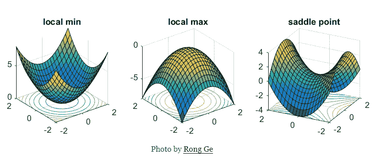

鞍点会大大减慢优化过程，在下图中，随机梯度下降过早地收敛到低于最优值。其他要点是不同的优化技术

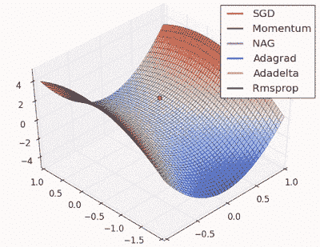

在梯度下降中，我们沿着*每个*维度中的梯度前进一步。在第一个动画中，使用 SGD，我们陷入一个维度的局部最小值，同时我们也处于另一个维度的局部最大值(梯度接近于零)

因为我们在给定维度中的步长是由梯度值决定的，所以在局部最优的情况下我们会变慢。

## 随机梯度下降；

随机梯度下降，也称为香草梯度下降，使用当前梯度 *∂L/∂wt* 乘以某个称为学习率 *α的因子来更新当前权重 *wt* 。*

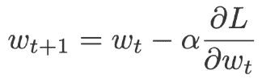

**气势:**

我们使用一个**移动平均梯度**代替每个时间步长的即时梯度，而不是仅依赖当前梯度来更新权重。在这种方法中，我们不会陷入局部最小值，因为我们不依赖于前 x 步的平均梯度值的当前梯度，也就是说，如果我们只有最小值方向的动量，仍然有可能陷入鞍点。您可以在第一个动画中看到这一点，其中动量优化器未能退出局部最优。

具有动量的梯度下降用 *Vt* (代表速度)替换当前梯度，当前和过去梯度的指数移动平均(即，直到时间 *t* )。

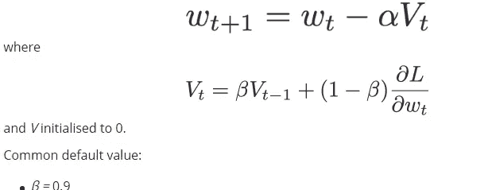

动力

## 内斯特罗夫加速梯度:

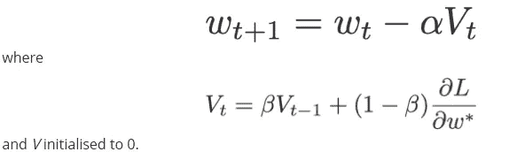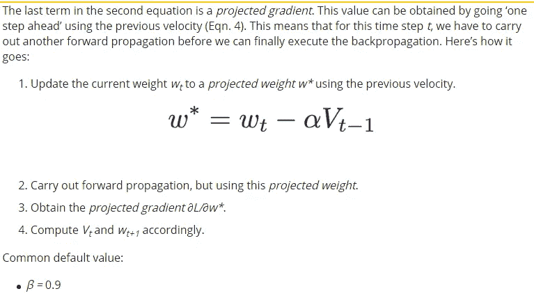

**插入**:

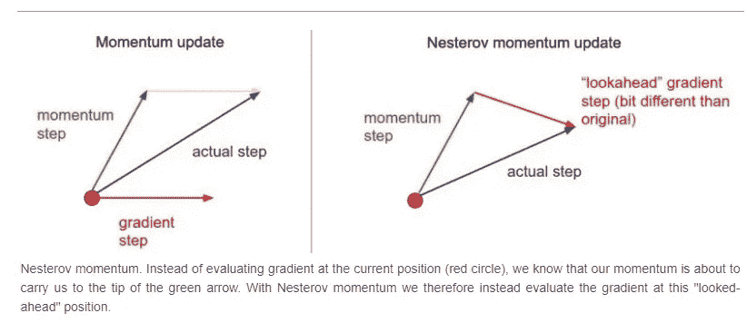

**AdaGrad —具有自适应学习率的梯度下降**

AdaGrad 背后的主要动机是针对数据集中不同要素的自适应学习率的想法，即，我们可能需要针对不同要素的不同学习率，而不是针对数据集中的所有要素使用相同的学习率。

它使学习率适应参数，对与频繁出现的特征相关的参数执行较小的更新
(即低学习率)，对与不频繁出现的特征相关的参数执行较大的更新(即高学习率)。因此，它非常适合处理稀疏数据。

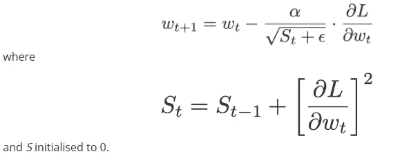

**RMS 道具:**

## 直觉

AdaGrad 非常积极地降低学习率(随着分母的增长)。结果，一段时间后，由于学习率的衰减，频繁参数将开始接收非常小的更新。为了避免这种情况，为什么不衰减分母，防止其快速增长。

该技术旨在通过**根据梯度的指数加权平均值自适应地缩放每个维度**中的学习速率，来防止局部最优减缓我们的收敛过程。

**在 RMSProp** 中，使用指数衰减平均值计算梯度历史，这与 AdaGrad 中的梯度总和不同，有助于防止密集特征分母的快速增长。

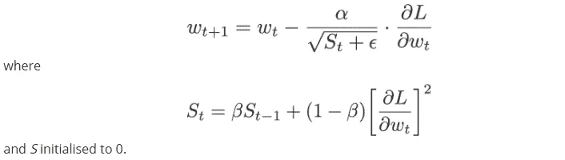

## 亚当:

Adam 这个名字来源于**自适应力矩估计**

在基于动量的梯度下降中，我们使用梯度的累积历史在平缓的表面上移动得更快，我们已经看到 RMSProp 也使用历史来衰减分母并防止其快速增长。这些算法使用历史的方式是不同的，在 Momentum GD 中，我们使用历史来计算当前更新，而在 RMSProp 中，使用历史来调整学习率(收缩或增强)。

亚当将这两个独立的历史结合成一个算法。

(I)通过使用 *V* 、梯度的指数移动平均(如动量中的)和
的梯度分量(ii)通过将学习速率 *α* 除以 *S* 的平方根、平方梯度的指数移动平均(如 RMSprop 中的)的学习速率分量。

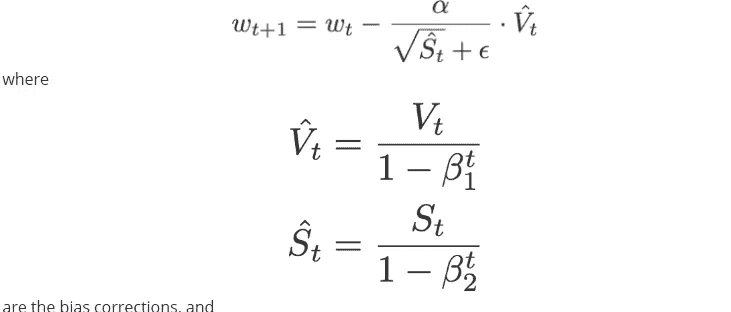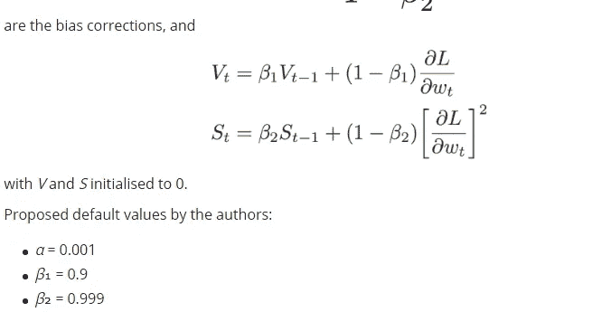

**直觉**

在这里，我想和你分享一些直觉，为什么梯度下降优化器对梯度分量使用指数移动平均，对学习率分量使用均方根。

**为什么要取梯度的指数移动平均？**

我们需要更新权重，为此我们需要利用一些值。我们拥有的唯一值是当前梯度，因此让我们利用它来更新权重。

但是只取当前的梯度值是不够的。我们希望我们的更新得到“更好的引导”。所以让我们也包括以前的梯度。

“组合”当前梯度值和过去梯度信息的一种方法是，我们可以对所有过去和当前梯度进行简单平均。但这意味着这些梯度的权重是相等的。这不是直观的，因为在空间上，如果我们接近最小值，最近的梯度值可能比以前的梯度值提供更多的信息。

因此，最安全的赌注是我们可以采用[指数移动平均值](https://en.wikipedia.org/wiki/Moving_average#Exponential_moving_average)，其中最近的梯度值被赋予比以前更高的权重(重要性)。

**为什么要用梯度的均方根来划分学习率？**

目标是调整学习率组件。适应什么？渐变。我们需要确保的就是，当梯度很大的时候，我们希望更新很小(否则，会从当前权重中减去一个巨大的值！).

为了创造这种效果，让我们用当前梯度除以学习率，得到一个适应的学习率。

请记住，学习率分量必须始终为正(因为学习率分量在与梯度分量相乘时，应该与后者具有相同的符号)。为了确保它总是正的，我们可以取它的绝对值或平方。让我们得到当前梯度的平方，并通过求平方根来“取消”这个平方。

但是像动量一样，只取当前的梯度值是不够的。我们希望我们的更新得到“更好的引导”。所以让我们也利用以前的渐变。如上所述，我们将采用过去梯度的指数移动平均值(“均方”)，然后取其平方根(“根”)，因此为“均方根”。本文中所有作用于学习率组件的优化器都会这样做，除了 AdaGrad(它采用梯度平方的累积和)。

注意:优化 RAdam 和 Lookahead 这两个新概念越来越多，请感兴趣的人看看。

# 自动编码器:

自动编码器是一种特定类型的前馈神经网络，其输入与输出相同。他们将输入压缩成一个低维的*码*，然后从这个表示中重建输出。代码是输入的一个紧凑的“总结”或“压缩”，也称为*潜在空间表示。*

**intuition**:当我们读到以上几点时，主成分分析形式的降维概念立刻给我们带来了灵感！！！事实上，如果我们要构建一个线性网络(即在每层不使用非线性[激活函数](https://www.jeremyjordan.me/neural-networks-activation-functions/)的情况下，我们将观察到与 PCA 中观察到的相似的维数减少

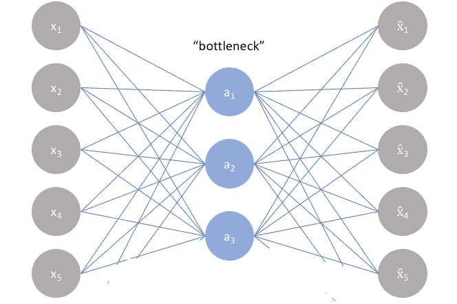

**自动编码器要点:**

1.  具体来说，我们将设计一个神经网络架构，以便我们*在网络中施加一个瓶颈，该瓶颈迫使原始输入*的 ***压缩*** *知识表示。*
2.  如果输入特征彼此独立，这种压缩和随后的重构将是非常困难的任务。然而，如果数据中存在某种结构(即输入要素之间的相关性)，可以学习这种结构，从而在强制输入通过网络瓶颈时加以利用。
3.  现在我们已经设计了一个模型，其中压缩输出(Xbar)是在传递输入(x)之后获得的
4.  我们训练模型以最小化重建误差(Xbar-x)。因此，我们的整个输入被压缩成更小数量的特征。
5.  瓶颈限制了可以通过整个网络的信息量，迫使对输入数据进行学习压缩。

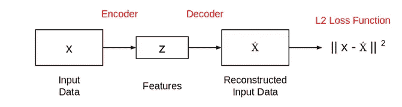

这是典型的自动编码器网络的样子。这个网络以这样的方式被训练，使得特征(z)可以被用来重构原始输入数据(x)。如果输出(ẋ)与输入(x)不同，损失会对其造成不利影响，并有助于重建输入数据。

自动编码器主要是一种降维(或压缩)算法，具有几个重要属性:

*   特定数据:自动编码器只能有意义地压缩数据，就像它们被训练的那样。因为它们学习特定于给定训练数据的特征，所以它们不同于像 gzip 这样的标准数据压缩算法。因此，我们不能指望一个经过手写数字训练的自动编码器来压缩风景照片。
*   有损:自动编码器的输出将不会与输入完全相同，它将是一个接近但降级的表示。如果你想要无损压缩，他们不是出路。
*   无监督的:为了训练一个自动编码器，我们不需要做任何花哨的事情，只需要向它扔原始输入数据。自动编码器被认为是一种*无人监管的*学习技术，因为它们不需要明确的标签来训练。但更准确地说，它们是*自我监督的*，因为它们从训练数据中生成自己的标签。

**在训练自动编码器之前，我们需要设置 4 个超参数:**

*   代码大小:中间层(隐藏层)的节点数。尺寸越小，压缩越大。
*   层数:自动编码器可以有多深就有多深。在上图中，我们在编码器和解码器中都有两层，没有考虑输入和输出。
*   每层的节点数量:我们正在开发的自动编码器架构被称为*堆叠自动编码器*，因为这些层是一个接一个堆叠的。通常堆叠的自动编码器看起来像一个“三明治”。每层的节点数量随着编码器的每个后续层而减少，并在解码器中增加。就层结构而言，解码器与编码器也是对称的。如上所述，这是不必要的，我们完全控制这些参数。
*   损失函数:我们或者使用*均方误差*或者*二元交叉熵*。如果输入值在范围[0，1]内，那么我们通常使用交叉熵，否则我们使用均方误差。

**避免过度拟合:**

1.  增加这些超参数将让自动编码器学习更复杂的编码。但是我们应该小心不要让它太强大。否则，自动编码器将简单地学习将其输入复制到输出，而不学习任何有意义的表示。
2.  它将只是模仿身份功能。自动编码器将完美地重建训练数据，但是它将*过度拟合*而不能推广到新的实例，这不是我们想要的。
3.  有意保持代码较小。由于编码层比输入数据具有更低的维度，所以自动编码器被称为*欠完成*。它将无法直接将其输入复制到输出，并将被迫学习智能特性。理想情况下，这种编码将**学习和描述输入数据的潜在属性**。

通过反向传播，自动编码器的训练方式与人工神经网络相同

因为神经网络能够学习非线性关系，这可以被认为是对 [PCA](https://www.jeremyjordan.me/principal-components-analysis/) 更强大的(非线性)推广。PCA 试图发现描述原始数据的低维超平面，而自动编码器能够[学习非线性流形](http://colah.github.io/posts/2014-03-NN-Manifolds-Topology/)(流形在*简单的*术语中被定义为连续的、不相交的表面)。这两种方法的区别如下所示。

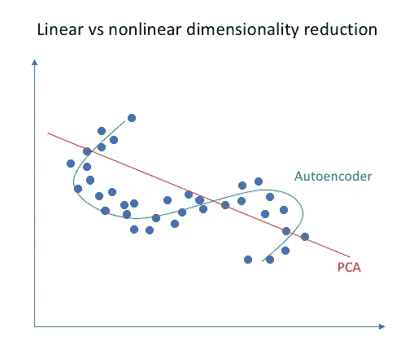

**去噪自动编码器:**

保持较小的代码层迫使我们的自动编码器学习数据的智能表示。还有另一种方法来迫使自动编码器学习有用的特征，即向其输入添加随机噪声，并使其恢复原始的无噪声数据。这样，自动编码器不能简单地将输入复制到其输出，因为输入也包含随机噪声。我们要求它减去噪音并产生有意义的数据。这被称为*去噪自动编码器。*

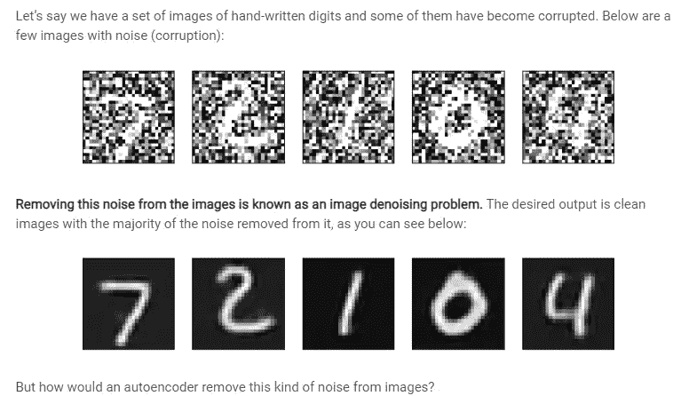

要回答上述问题，即自动编码器如何从图像中消除噪声:

这里只需要做一点小小的调整。我们可以通过使用地面真实图像和重建图像来计算损耗，而不是使用输入和重建输出来计算损耗。这张图表很好地说明了我的观点:

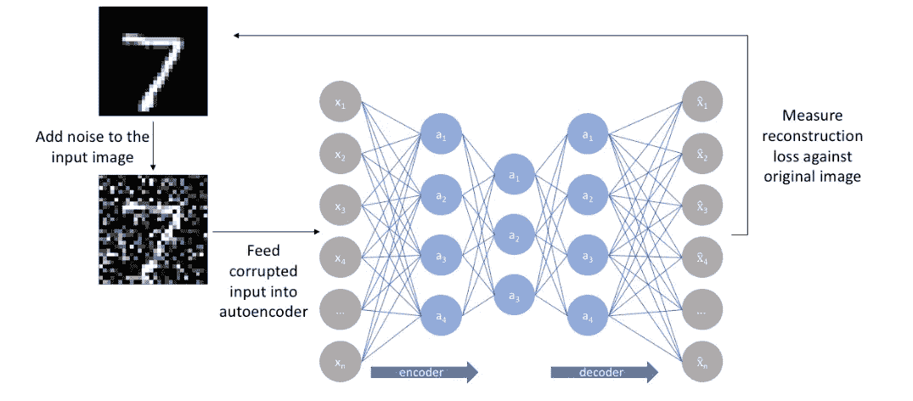

去噪

**稀疏自动编码器:**

我们介绍了两种方法来迫使自动编码器学习有用的特性:保持较小的代码大小和消除自动编码器的噪声。第三种方法是使用*正则化*。我们可以通过使用*稀疏约束*来调整自动编码器，使得只有一小部分节点具有非零值，称为活动节点。

特别地，我们在损失函数中增加了一个惩罚项，使得只有一小部分节点成为活动的。这迫使自动编码器将每个输入表示为少量节点的组合，并要求它发现数据中有趣的结构。即使代码很大，这种方法也是有效的，因为在任何时候只有一小部分节点是活动的。

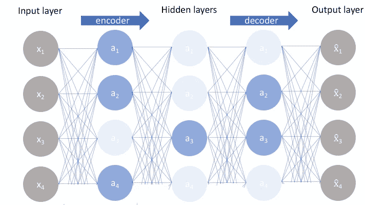

以下是稀疏编码器的观察结果

1.  这个事实的一个结果是**我们允许我们的网络使单个隐藏层节点对输入数据**的特定属性敏感。
2.  欠完整自动编码器将对每个观测使用整个网络，而稀疏自动编码器将被迫根据输入数据选择性地激活网络的区域。
3.  因此，我们限制了网络记忆输入数据的能力，而没有限制网络从数据中提取要素的能力。
4.  这允许我们单独考虑网络*的潜在状态表示和正则化*，这样我们可以选择一个潜在状态表示(即编码维度)，同时通过稀疏性约束施加正则化。

# 拒绝传统社会的人

在相对较小的数据集上训练的大型神经网络可能会过度拟合训练数据。这具有模型学习训练数据中的统计噪声的效果，当在新数据(例如，测试数据集)上评估模型时，这导致较差的性能。泛化误差由于过度拟合而增加。

在退出的情况下，训练过程实质上是放弃了神经网络中的神经元。它们会暂时从网络中移除，如下所示:

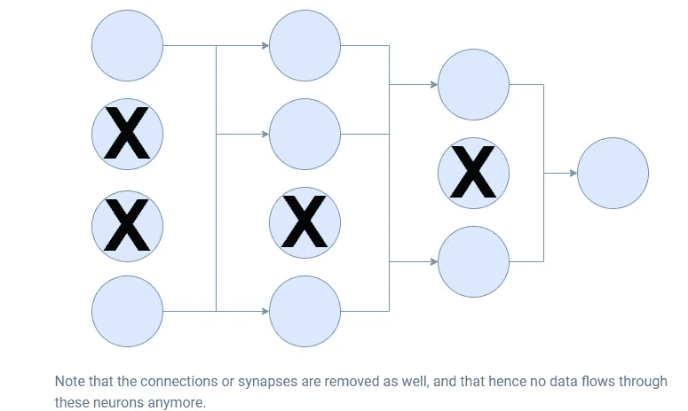

拒绝传统社会的人

辍学

# 为什么辍学可以减少过度拟合？

你现在可能想知道:为什么伯努利变量附加到常规神经网络，使网络更薄，减少过度拟合？

1.  相对于误差来计算梯度*，但是也相对于所有其他单元正在做的事情*来计算梯度*这意味着某些神经元，通过改变它们的权重，可以修正其他神经元的错误。导致复杂的共同适应，可能无法推广到看不见的数据，导致过度拟合。*
2.  辍学通过*使其他隐藏的【神经元】的存在变得不可靠*来阻止这些共同适应。神经元根本无法依赖其他单元来纠正它们的错误，这减少了不能推广到看不见的数据的共同适应的数量，因此可能也减少了过度适应。
3.  完全连接的层占据了大部分参数，因此，神经元在训练期间彼此之间形成了相互依赖性，这抑制了每个神经元的个体能力，导致训练数据的过度拟合。

直觉上:可以理解的是，假设一个足球队被迫每场比赛只有 9 名球员，而不是 11 名球员(通常是 11 名球员的随机组合)，当这支球队重新拥有 11 名球员时，它将能够适应所有的情况，因为所有的球员都学会了承担缺失球员的责任。

## 培训阶段:

训练阶段:对于每个隐藏层、每个训练样本、每次迭代，忽略(清零)节点的随机分数 *p* (以及相应的激活)。

## 测试阶段:

使用所有激活，但减少一个系数 *p* (考虑到训练期间丢失的激活)。

**注意:在测试阶段**所有激活都保持激活状态

## 一些观察结果:

1.  丢弃会迫使神经网络学习更强大的功能，这些功能在与其他神经元的许多不同随机子集结合使用时非常有用。
2.  放弃大约使收敛所需的迭代次数加倍。然而，每个历元的训练时间较少。
3.  有了 h 个隐藏单位，每个都可以被丢弃，我们就有了
    2^H 可能的模型。在测试阶段，考虑整个网络，每次激活减少一个系数 *p.*

# 修剪:

简单来说，修剪是通过压缩来减小神经网络大小的一种方式。在对网络进行预训练之后，再对其进行微调，以确定连接的重要性。这是通过对网络中的神经元进行排序来实现的。

剪枝的基本原理包括使用二阶导数数据移除不重要的加权信息。这导致了更好的概括结果，提高了处理结果的速度，并且还减小了尺寸。

1.  修剪通常以迭代的方式进行，以避免修剪必要的神经元。这也确保了网络的重要部分不会丢失，因为神经网络是一个黑盒。第一步是确定哪些神经元是重要的，哪些不是。
2.  在此之后，删除最后一个重要的神经元，然后对算法进行微调。此时，可以决定是继续修剪过程还是停止修剪。
3.  虽然它没有被广泛宣传的方法来减少规模，这是由于以前的传染性排序算法。这也是一个更好的方法，从一个更大的网络开始，并在训练后进行修剪，而不是从一开始就训练一个更小的网络。

修剪的第一种方法是修剪整个卷积滤波器。他们使用网络中所有过滤器权重的 L1 范数对它们进行排序。然后，全局修剪“n”个最低等级的过滤器。然后重新训练该模型，并重复该过程。

**修剪的重要性**

随着移动推理和机器学习能力的兴起，修剪变得比以往任何时候都更加相关。随着越来越多的应用发现使用神经网络，轻量级算法是当前的需要。

这方面的最新例子是苹果的新产品，它使用神经网络来确保产品的多种隐私和安全功能。由于这项技术的颠覆性，很容易看到它被不同的公司采用。

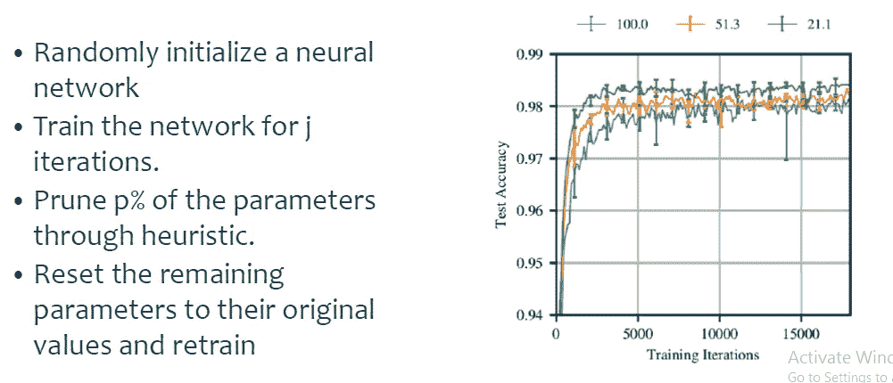

从上图中可以看出，对于 100 pc、51.3 pc 和 21.1 Pc，精确度略有提高。丢弃在测试期间保持相同的激活，而修剪在测试阶段丢弃激活，因此在修剪之后观察到更高的准确度，因为相应地测试数据也被修剪。