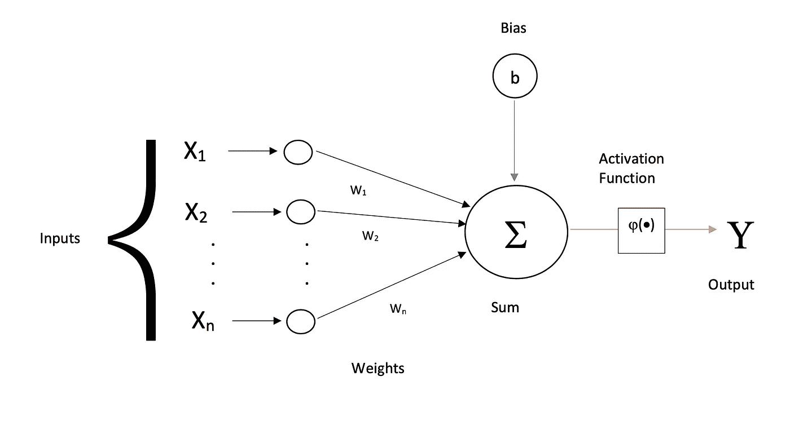
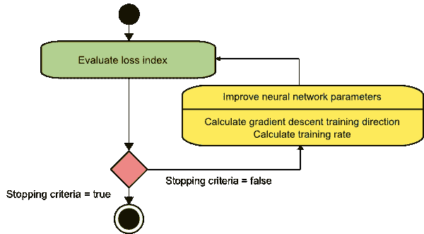
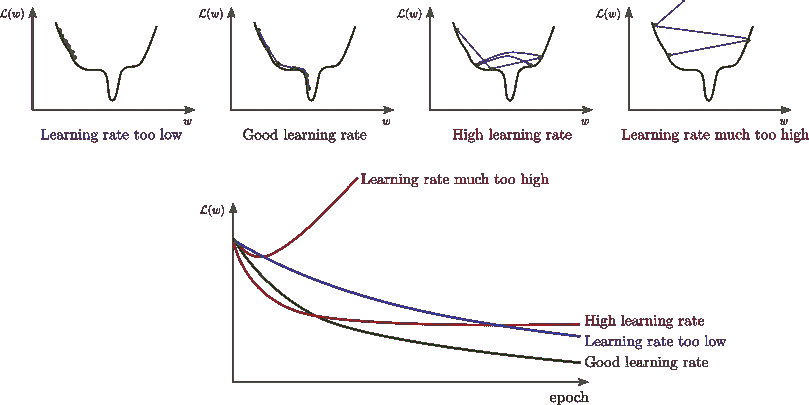

# 人工神经网络及其直觉

> 原文：<https://medium.com/analytics-vidhya/artificial-neural-networks-and-its-intuition-3ab10e0ca452?source=collection_archive---------31----------------------->

*   洞察人工神经网络背后的直觉。以及他们如何让机器变得智能(对于 ***蹒跚学步的*** )。

A **人工神经网络(ANN)**:ANN 是一组被称为神经元的简单节点，它们以一种相当复杂的方式连接起来，组成智能计算系统。这些系统的灵感来自于人类大脑中的生物神经元。

**神经元**:神经元是神经网络的最小单位，在上下文中实现与网络相关的数学功能。
一个神经元有三个部分。
1。输入连接
2。型芯
3。输出连接

神经元从输入连接获取输入，对输入执行一些数学功能，并通过输出连接将结果作为输出给出。

下图描述了一个简单的神经元。

一个简单的神经元

这里，值 X₁，X₂，…，Xn 通过相应的输入连接作为输入被接收到神经元。每个连接都与一个叫做权重的值相关联，还有一个叫做偏差的连接。现在，神经元将输入值乘以与连接相关联的相应权重，现在将所有这些相乘的值和偏差加在一起以获得一个值。该值被馈送到激活函数，以给出输出 y。

**什么是偏置和激活功能？**

偏置是一种额外的连接，对神经元来说是恒定的。bias 的目的有点过于技术性，无法深入，简单来说，bias 有助于模型更好地学习给定的数据。现在激活函数是一个描述神经元规则的函数。每当值高于某个阈值时，它可以是类似于输出 ***1*** 的东西，否则是输出 ***0*** 。

这差不多就是神经元。

现在，这些简单神经元之间的一系列互连被称为人工神经网络(ANN)。通常，这些连接是在层中进行的，其中一层中的每个神经元将连接到另一层中的另一个神经元。

这种联系可以是任何适合我们试图解决的问题的方式。它可以是完全连接的网络，其中一层中的每个神经元都连接到另一层中的所有神经元，或者它可以是两层之间神经元之间的一对一连接。它可以是任何随机连接，它有资格作为一个神经网络，但它可能会或可能不会解决所考虑的问题。这些神经网络的连接和结构高度影响网络的工作及其学习能力。

一个值得思考的重要问题。

## 神经网络背后真正的灵感是什么？

为了回答这个问题，让我们考虑一个例子:

比方说，你正在考虑是否要在某一天出去吃饭。当你试图做任何决定时，你在做决定前都要考虑一些因素。在这种情况下，我们假设它们是天气、心情和今天是星期几。这些因素中的每一个对他们都有一定的重要性，就像如果天气和心情都很好，即使是工作日，你也可能会出去。这意味着天气和情绪比白天更重要。这并不意味着这一天无关紧要。现在，在考虑这些因素后的某一天，你决定是否出去吃饭。

在神经网络术语中，因子是输入，它们相应的重要性是权重。

神经网络的工作方式也和你一样，但在非常大的规模上，人类不可能考虑这么大的因素并做出决定。给一个直觉，如果我们想预测一个特定公司的股票价格在未来会是多少，有成千上万的因素在起作用，每个因素都有其重要性，考虑到所有这些因素是人类不可能消化的。因此，神经网络来拯救我们了，它们可以对数百万个参数进行运算，并给出惊人精确的结果。

## 一切都很好，但这些愚蠢的神经元如何像人类一样做出如此明智的决定？

这可能是每个人都会想到的问题。

这个问题的答案很简单。

他们学习。

学习方法很简单，这是一个奖惩方案，要求一个模型预测某事，如果它接近正确答案就奖励它，如果它错了就惩罚它。每当模型被奖励时，模型试图保持好的分数以获得将来的奖励，每当模型被惩罚时，它试图犯更少的错误以减少将来被惩罚的机会。这些奖励-惩罚循环可以继续下去，直到达到预期的精度，或者在一定数量的训练步骤后停止。

这种类型的学习被称为监督学习。之所以称之为被监督，是因为模型上有监督，根据表现来奖励。就像老师奖励学生一样。

另一种学习方法是无监督学习。在这里，模型没有一个监督人来指导训练。模型本身必须学习模式并得出结果。

无监督学习是没有老师的学习(如在线教程)，它的学习体验很好，但不如有老师的学习体验好。通常，有监督的模型优于非监督的模型。

## 训练神经网络

**被监督的**

为了训练神经网络，要记住的最重要的事情是损失函数。损失函数评估模型的损失，即模型的表现有多差。当训练时，算法的动机是最小化模型的损失值。这是通过以这样的方式修改模型的权重来完成的，即损失函数给出比先前迭代值更低的值。这是通过随时间反向传播并使用梯度下降优化算法(主要)来实现的。

**通过时间的反向传播(BPTT)** : BPTT 是一个连续的循环，其中在每次迭代之后，算法反向以修改其连接的权重，并且这种修改通过梯度下降算法来完成。

网络培训

**梯度下降**:该算法试图通过寻找局部极小值来最小化损失函数。它在负梯度的方向上采取小的步骤来达到局部最小值。

下面是描述渐变下降的图片。

梯度下降算法

**J(w)** 是权重 **w** 的损失函数。在第一步中，随机初始化权重，之后的每一步都遵循上述模式

1.计算坡度
2。基于梯度
3 更新权重。转到步骤 1。

神经网络的训练受称为学习率的参数的影响，用户必须在训练模型之前为其设置学习率。因此它是一个超参数。

学习率本质上是在每个权重更新步骤之后步长应该有多大。如果学习率太小，所采取的步骤就很小，并且模型可能达不到局部最小值。如果学习率太高，模型可能会错过局部最小值，并来回尝试寻找局部最小值。

不同学习率的影响

***L(w* )** 是损失函数。纪元是训练步骤。

本质上，梯度下降可以被视为一个徒步旅行者(重量)，他想徒步走下一个山谷的顶端(最小值)(损失函数)。每走一步都取决于斜坡的陡度和徒步者的腿长(学习速度)。

## 神经网络应用

神经网络存在于许多研究领域。大多存在于计算机视觉、时间序列预测、自然语言处理等深度学习架构中。

人工神经网络的深度学习领域是最接近人脑架构的领域，因为神经元层的深度及其与人脑工作的惊人相似性。典型的深度学习模型可以包含 5 层到数千层。由于计算能力的指数增长和数据的高可用性 **DL** 正在成为人工智能社区的新宠。

计算机视觉的一些深度学习架构包括 **CNN** s、 **U-Net** 、 **ResNet** 。

**LSTM** 和 **GRU** 是时间序列预测和自然语言处理( **NLP** )最受追捧的架构。

太好了！！既然你已经完成了这篇文章，不要停止好奇的心，永远不要停止问愚蠢的问题。因为小而笨的步骤最终会让你变得聪明，就像我们的人工神经网络一样。；D

继续问…继续学…

感谢阅读……_/\ _