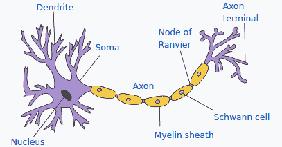
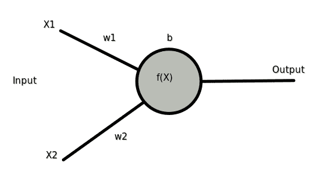
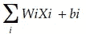
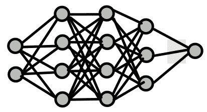
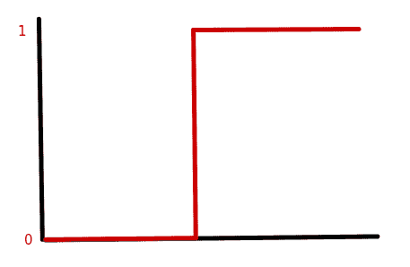
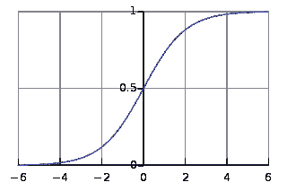
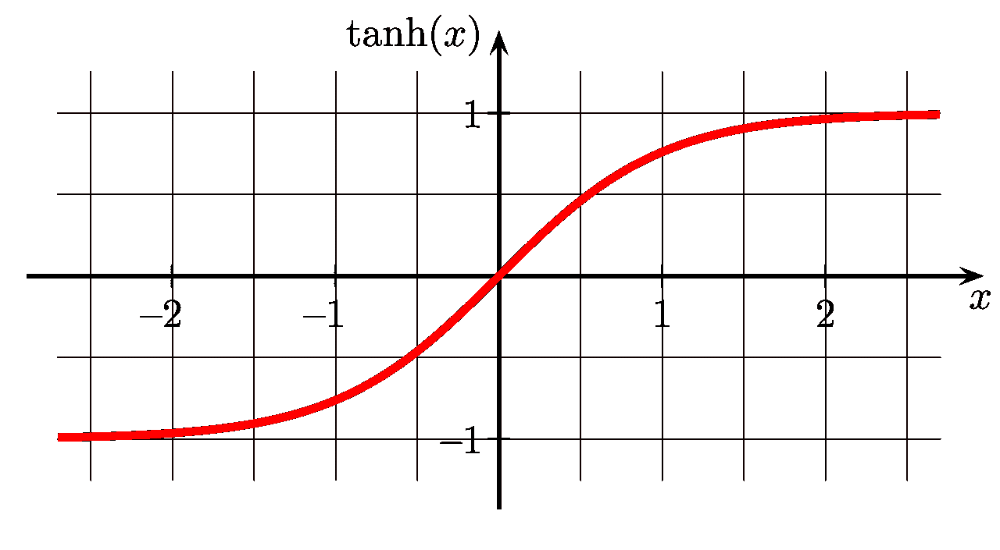
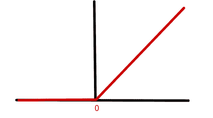

# 人工神经网络，第 1 部分

> 原文：<https://medium.com/analytics-vidhya/artificial-neural-networks-part-1-d36fb7bce6bb?source=collection_archive---------34----------------------->

照片由 [H 肖](https://unsplash.com/@hikeshaw?utm_source=medium&utm_medium=referral)在 [Unsplash](https://unsplash.com?utm_source=medium&utm_medium=referral) 拍摄

这篇文章是一系列文章中的第一篇，我将试着解释 ann 或人工神经网络背后的概念。

我们将从一个简单的感知器模型开始，在不涉及大量数学知识的情况下，尝试理解其背后的直觉。

每当我们听到或读到人工神经网络或人工神经网络时，脑海中出现的最恰当的类比就是我们大脑中的神经元。神经元由大量进出执行所需操作的中央节点的连接组成。参考下图中来自[维基百科](https://en.wikipedia.org/wiki/Neuron)的一个神经元。

在上图中，我们可以看到细胞核的许多输入源，它执行大多数信号处理，并将输出传递给下一个神经元或最终目的地。

**单层感知器**

类似地，在人工神经网络中，我们有输入，执行计算和输出的核心或节点。为了以最简单的形式表示人工神经网络，请考虑下图。

在图中，我们可以看到有两个输入进入节点。**节点**是处理过程发生的地方，很像神经元的细胞核。这个模型在这里被称为简单感知器，我们只有一层处理。这里 *f(X)* 是应用于输入以获得期望输出的函数。

有了神经网络，据说应用范围很广，真的很会学习。为了实现这一点，需要调整各种各样的参数，直到找到解决方案。该参数称为**重量(w)** 。

权重定义了输入的重要性以及它对总输出的贡献。如果权重很低，这意味着输入不重要，而如果权重很高，则输入对处理的影响很大。可能会有这样的情况，权重变成 0，在这种情况下，无论输入的值是多少，都没有关系。它将永远被忽视。为了缓解这个问题，我们添加了一个**偏差项(b)** ，它可以是正值，也可以是负值。这使得权重值和输入有意义，并且反过来，只有当它们高于偏差项时，节点才有意义。

该节点接收带有偏置项的输入的加权和，并应用函数 *f* 来获得期望的结果。重要的是要记住，计算是两个向量 W 和 x 的乘法。

这里，I 是输入数，X 是输入值，W 是与输入相关的权重，b 是在节点处添加的偏差。

**多层感知器**

多层感知器由多个单层感知器连接在一起形成网络。这里，一个节点的输出成为下一层节点的输入。所有节点执行计算，并将输出发送到输出层。

考虑下图

这里第一层被称为输入层，数据点在这里传递。在这一层中，不执行任何计算。分别具有四个、四个和三个节点的第二、第三和第四层被称为隐藏层，因为其复杂性使得它们难以解释。

最后一层称为输出层。在上面的例子中，我们只有一个输出节点，然而，它可以是两个或更多，这取决于我们试图使用网络解决的问题的类型。

根据我们正在解决的问题的类型，对我们在网络中的每个节点上使用的函数的输出进行约束是很重要的。例如，在一个分类问题中，我们希望得到 0 和 1 之间的输出，这样它就可以被解释为一个概率。这些约束通过使用**激活功能**来应用。这里的激活指的是下一层中节点的开/关或重要性。它根据我们正在解决的问题类型，在所需的限制内转换输出。

在这里，我们无需任何数学知识就能理解一个简单的多层神经网络意味着什么和如何操作。不同的组件，如节点、权重、偏置、输入和输出层，以及为什么需要激活函数。

有相当多的激活功能可以使用。在我们进一步讨论之前，让我们重温一下这个等式，用字母 z 表示。因此，

Z = w*X + b

我们来看看最常用的-

*   **阶跃函数** —这是可以使用的最简单的函数。它以 0 或 1 的形式给出值。如果 Z >为 0，则 1 否则为 0。这样做的问题是，它是一个非常强大的函数，输出不能用于概率，它不能帮助多值输出。

*   **Sigmoid 函数** —如果你了解逻辑回归，这是相对熟悉的。输出介于 0 和 1 之间，可用作一个类别在分类方面优于其他类别的概率。Sigmoid 函数的问题是，当 X 的值变得很高或很低，并且预测没有变化时，它会导致网络停止学习或变得非常慢。这就是所谓的渐变消失问题。

*   **tanh()或双曲正切** —使用 sigmoid 函数的问题是，当我们传递一个负值时，输出接近零，这对于计算其他参数来说不是很好。为了克服这个问题，我们可以利用 tanh()函数返回-1 和 1 之间的值。当向 tanh()提供负值时，它将输出返回负值，只有接近零的值被映射为零。Tanh 也遭受类似 sigmoid 函数的消失梯度的相同问题。

*   **ReLu 或整流线性单元** —这通常是默认激活功能。如果输出大于 0，则返回 Z 值，否则返回 0。所以基本上就是 max(0，Z)。这是最常用的，因为它允许网络更快地收敛，也允许反向传播。从下图可以明显看出，当值为 0 或负值时，输出变为 0，网络无法进一步学习。

*   **Softmax( )** —这是我们在处理多类分类问题时广泛使用的函数，其中每个数据点有一个类。这也称为互斥类。它计算一个类相对于所有其他类的概率。所有概率之和总是 1。例如，如果我们有 5 个输出类，这 5 个类中的每一个都有一个概率输出，我们选择概率最高的一个作为结果。

我们简要介绍了神经网络和相关组件，如节点、权重、偏置、激活函数，并简单解释了为什么需要它们。在本系列的下一部分，我们将回顾梯度下降的概念。

[第 2 部分——了解梯度下降(不含数学知识)](/@saketchaturvedi13/understanding-gradient-descent-without-the-math-bc31a4781c88)