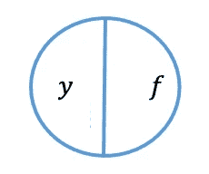
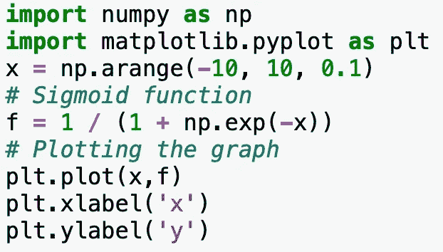
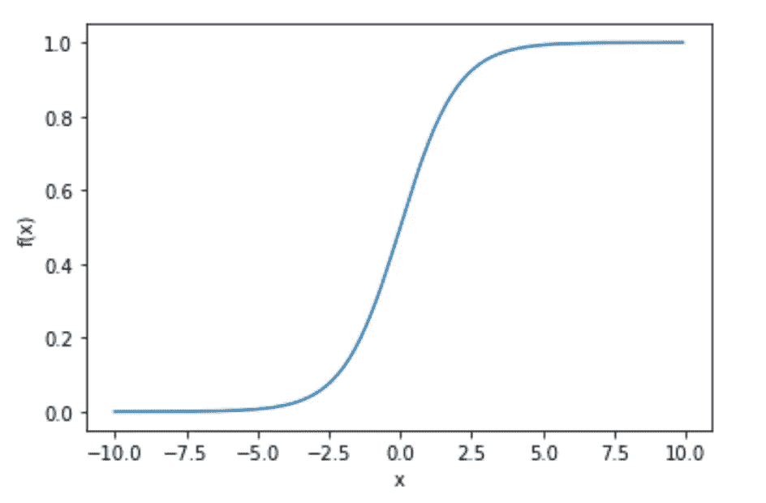
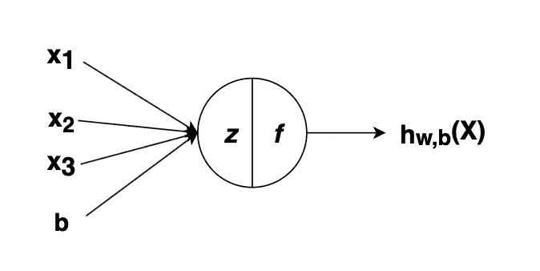
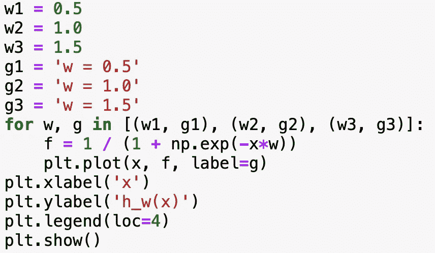
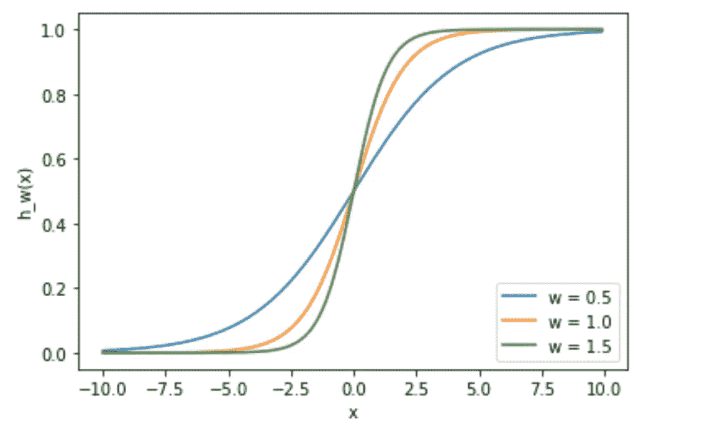
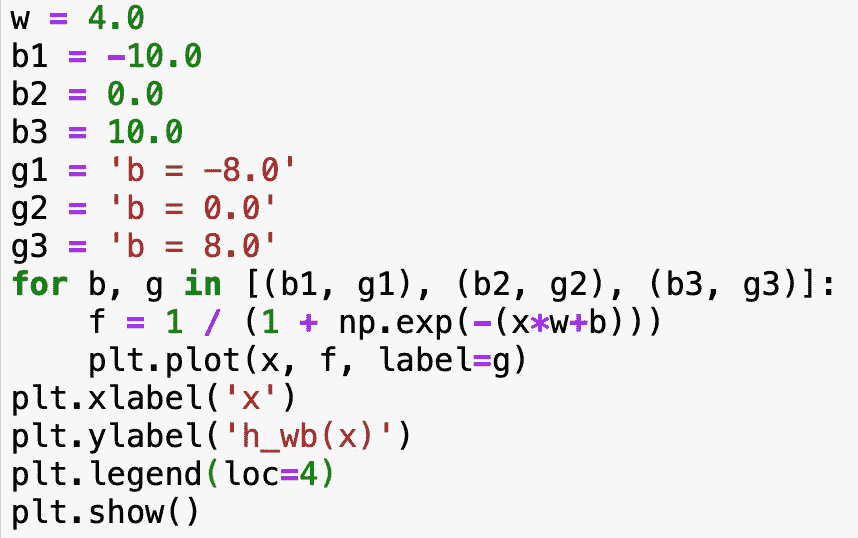
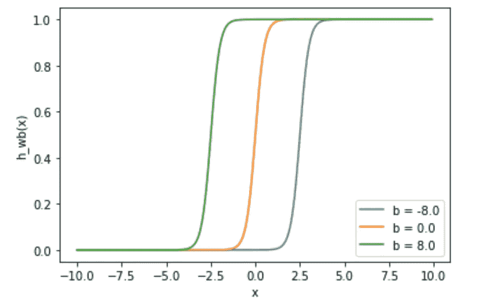

# 人工神经网络(第 1 部分)-激活函数，权重和偏差的作用。

> 原文：<https://medium.com/analytics-vidhya/artificial-neural-networks-part-1-role-of-activation-function-weights-and-bias-b4b485e581b9?source=collection_archive---------19----------------------->

ANN 是人脑神经结构的软件实现。人脑是一个相互连接的神经元的复杂网络，在模拟时处理输出。

## 人工神经元

神经元由求和函数和激活函数组成。

人造神经元。

神经元受到激活函数的刺激:Sigmoid，Tanh，ReLU，leaky eru…

在 Python 中实现 Sigmoid 函数…

密码

Sigmoid 函数图

我们可以看到，Sigmoid 函数(f(x)) *不是阶跃函数*，边缘是 ***、*** 软的，即可以对该函数应用导数。函数的导数有助于模型训练。

一般来说，一个神经元接受一个输入并输出一些值。该节点接受多个加权输入，对输入求和，然后应用激活函数，即将线性函数转换为非线性函数，从而生成输出。

一个节点。

这里，每个输入都与权重相关联。正如我们所见，人工神经元由两部分组成，一个求和函数(y)和一个激活函数(f)…

> **y = X1W1 + X2W2 + X3W3 + b**

w1、w2、w3 是在算法学习过程中改变的权重(实数)。这些有助于确定图形的输入和斜率。***【b】***是一个偏置术语，它有助于确定节点的输出。

上面的等式类似于我们在学生时代学过的一个函数…y = mx+c .激活函数表示如下

> f(y)

## 让我们看看权重和偏差如何影响激活函数(sigmoid 函数)…

当我们改变与输入相关的权重时，函数的斜率会改变，即当算法处于训练/学习过程中时，数据的选择部分会改变。

Python 代码

变权 Sigmoid 函数。

斜率的这种变化有助于更好地理解输入和输出变量之间的关系。

> **好吧，如果我们想基于 x > 0 或 x < 0 这样的条件来改变输出呢？**

代码。

Sigmoid 函数随偏差值的变化而变化。

偏差项有助于应用条件关系，以便节点可以基于该条件触发输出。

因此，我们已经了解了权重和偏差如何帮助模型学习特征值和目标值之间的隐藏关系。

在第 2 部分中，我们将看看一个简单的神经网络结构，并用 Python 实现它。