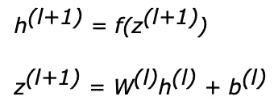

# 人工神经网络(第 2 部分)-一个简单神经网络的结构及其实现。

> 原文：<https://medium.com/analytics-vidhya/artificial-neural-networks-part-2-structure-of-a-simple-neural-network-and-its-implementation-72d07166e4ab?source=collection_archive---------18----------------------->

第 1 部分展示了关于人工节点的细节。现在让我们理解一个简单的神经网络结构，并使用 Python 实现它。

一个简单的神经网络由三层组成:输入层、隐藏层和输出层。

神经网络结构

我们将使用以下符号…

前馈传播中每个节点的输出

函数 *f()* ，指的是激活函数(这里我们用的是 sigmoid 函数)。来自第 2 层的 h1、h2、h3 是输出变量，用作第 3 层中节点的输入。关于 sigmoid 函数的细节可以参考第 1 部分。

实现前馈功能…

用于前馈传播的 Python 代码

在上面的程序中，我们使用了“for”循环进行计算。那么，对于小数量的输入值是合适的，如果有超过 10 个输入值，即 10 个输入节点，和超过 2 个隐藏层呢？

> 五外移

矢量化只不过是两个数值矩阵之间的点积。在上面的代码中，我们使用 for 循环将权重和输入值相乘。这可以通过在权重矩阵和输入矩阵之间执行点积来修改。

因此，上述等式可以替换为以下等式

三层网络的简化方程。w 表示权重矩阵，z 表示求和的输入向量，b 表示偏置权重，h 表示节点的输出。因此，为了更好地理解，我们可以把整个方程归纳成更简单的形式。

前馈方程。

通过观察矩阵乘法理解矢量化。

因此，上述代码可以简化为

在第 3 部分，我们将讨论损失和成本函数，以及梯度下降。