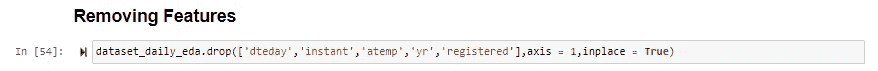

# 人工神经网络，第 3 部分—使用 Keras 和 Tensorflow 实现神经网络

> 原文：<https://medium.com/analytics-vidhya/artificial-neural-networks-part-3-implementing-neural-networks-with-keras-and-tensorflow-39cbf6fde7d?source=collection_archive---------21----------------------->

在 [Unsplash](https://unsplash.com?utm_source=medium&utm_medium=referral) 上由 [Max Duzij](https://unsplash.com/@max_duz?utm_source=medium&utm_medium=referral) 拍照

在本系列的前几篇文章中，我们讨论了以下主题

1.  [人工神经网络——人工神经网络背后的概念](/analytics-vidhya/artificial-neural-networks-part-1-d36fb7bce6bb?source=your_stories_page---------------------------)
2.  [梯度下降](/analytics-vidhya/understanding-gradient-descent-without-the-math-bc31a4781c88?source=your_stories_page---------------------------)

这篇文章将介绍使用 Tensorflow 和 Keras 实现一个基本的神经网络。

这个问题是基于 UCI 机器学习知识库上的自行车共享数据集，可以在这里找到—

[自行车共享数据集](https://archive.ics.uci.edu/ml/datasets/Bike+Sharing+Dataset)

zip 文件中提供了两个数据集， **daily.csv，**和 **hour.csv.**

在这个问题中，我使用了 daily.csv 文件，它是 hour.csv 文件的汇总。

这个问题包括预测出租自行车的数量，包括每天的数量。

让我们从实施步骤开始——

第一步从导入所需的库和读取数据集开始

现在，我们已经将 CSV 文件作为 pandas 数据帧导入，让我们看看可用列的形状和细节。

有 731 条记录和 16 列，包括我们的目标变量“cnt ”,它是每日租赁自行车的计数。每列的详细信息可以在上面提供的 UCI 数据集链接中找到。

看看每日数据集的前几行——

我们可以看到，列 season、mnth、weekday、work day 和 weathersit 的值是作为数字提供的，因此被视为数字列。如果我们将这些转换为用于 EDA 的一些可视化的分类，这将是有益的。

首先，我们将把相关性绘制成热图。

作为对值的第一印象，可以推断出变量与目标的相关性不是很高，除了变量‘registered’**的值为 0.95。**

对于 EDA，让我们从单变量可视化开始。

目标变量不包含任何负值或任何异常值。

转到独立变量，

1.  假日— 0(否)，1(是)

2.工作日— 0(否)，1(是)

3.Weathersit —

用自变量绘制目标变量——

平均使用率较高的月份是 6 月至 9 月，即 6 月至 9 月。

同样，更多的使用是在第二季和第三季，即春季和夏季。

根据目标确定数字列之间的关系和行为。

正如我们之前看到的，注册和总乘坐次数之间有很高的相关性。

在中温范围内使用更多

显然，atemp 和 temp 变量高度相关。我们可以去掉其中一个变量。

基于 EDA，我们将放弃以下变量—

dteday，instant，atemp，yr，已注册

在 EDA 之后，我们将建立数据集来训练和测试模型。

编码分类数据—

我们也可以使用 sklearn 的 OneHotEncoder 库，但这里我使用 pandas getdummies()和一小段代码片段来保持编码后训练集和测试集中的列相同。

缩放值以保持在 0 和 1 的相同范围内—

导入用于构建网络的库

我们正在导入顺序类来创建将被堆叠到层中的模型。

密集类将创建深度连接的神经网络层。这一层将对输入执行操作，应用激活函数，并将结果传递给下一层。

构建网络—

第一层是具有 34 个结点的密集层，这基本上是输入层，值 34 来自处理后数据集中的要素数。

第二、第三和第四层是隐藏层，分别包含 34、34 和 10 个节点。最后，我们添加一个节点，这就是我们的输出。我们的输出是一个数值，否则，在分类的情况下，它将是目标中类的数量。

编译模型—

这里的损失函数是 MSE，均方误差。我们会尽量减少这种情况。这将是实现使用亚当优化。优化器致力于最小化损失函数的值。

最后，在我们的训练数据上拟合模型。我们还通过了作为验证集的测试数据。该过程将不断计算训练集和测试集的损失。纪元的数目是 1000，这是我任意选择的。我们可以利用像提前停止这样的方法，这将在使用损失函数的最小值时停止训练。考虑到我们的训练集和测试集中的记录数量较少，批大小为 64。

可视化损失值—

我们可以看到，验证损失和训练损失的值在第 400 个时期达到最小。我们仍然可以查看更多的历元数，看看验证损失何时开始增加，我们何时开始过度拟合。但是对于这个博客，我们将坚持 1000 个时代。

让我们快速进入预测和计算指标。

均方误差约为 70k，平均绝对误差为 703。我们的模型能够解释 83%的差异。这很好，但我们仍然可以改进并获得更低的 MSE。

让我们绘制预测值与实际值的对比图，看看它们相差有多远

不是很远。这看起来不错。

所以，这是一个关于我们如何用 Keras 和 Tensorflow 实现神经网络的快速帖子。

我希望这有所帮助，我将感谢任何关于如何改进模型的反馈和建议。