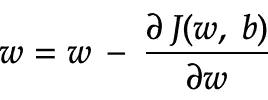

# 人工神经网络(第三部分)-损失和成本函数和梯度下降。

> 原文：<https://medium.com/analytics-vidhya/artificial-neural-networks-part-3-loss-and-cost-functions-and-gradient-descent-76e650bc5162?source=collection_archive---------19----------------------->

在人工神经网络的这一部分，我们将尝试了解什么是损失函数，以及如何使用它来计算成本函数，最后是梯度下降及其在优化中的作用。

***损失函数*** 是一种通过计算实际值与预测值的差值来评估模型性能的方法。一般来说，我们使用均方误差函数或对数损失误差函数。它衡量我们函数输出的好坏。

Log Loss : ***L(p，y)=-(ylogp+(1-y)log(1-p))***；其中 y 是实际值，p 是预测值。**若 y = 1，则 L(p，y) =-logp** 。**如果 y = 0，则 L(p，y) = -log(1-p)**

为了训练参数 ***w*** 和 ***b*** ，我们需要一个 ***代价函数*** 。成本函数可以看作是模型中所有损失函数的总和。

## 梯度下降

H 超参数用于调整模型训练。(y-p)相对于权重和偏差的导数，告诉我们对于给定的样本， ***损失*** 如何变化。我们在使损失最小化的方向上反复采取小步骤，称为梯度步骤。这种策略被称为梯度下降。梯度只不过是函数的斜率。

[http://rasbt . github . io/mlx tend/user _ guide/general _ concepts/gradient-optimization/](http://rasbt.github.io/mlxtend/user_guide/general_concepts/gradient-optimization/)

梯度向量既有方向又有大小:

函数的梯度 **f**

梯度总是指向沿着损失函数增加最陡的方向。因此，沿着梯度的反向，损失函数的下降速度最快。

即权重更新如下

使用梯度函数更新权重

梯度下降算法将梯度乘以一个称为学习率的标量，以确定下一个点，即如果梯度幅度为 1.5，学习率为 0.01，则梯度下降算法将选择与前一个点相距 0.015 的下一个点。

为了达到最小损失点，我们正在减少权重，如果我们以较小幅度或较大幅度减少权重会怎样？

如果我们以较低的幅度减少权重，则模型需要更多的训练时间，如果我们以较高的幅度减少权重，则模型穿过最小点。因此，我们需要谨慎选择学习速度。

[https://srdas . github . io/dl book/gradientdescenttechniques . html](https://srdas.github.io/DLBook/GradientDescentTechniques.html)

> 一维数据的理想学习率是 1/f (x ),而二维数据的理想学习率是 1/Hessian 矩阵

海森矩阵

因此，梯度下降可以实现如下:

为了更好的理解，请看这个[视频](https://youtu.be/z_xiwjEdAC4)