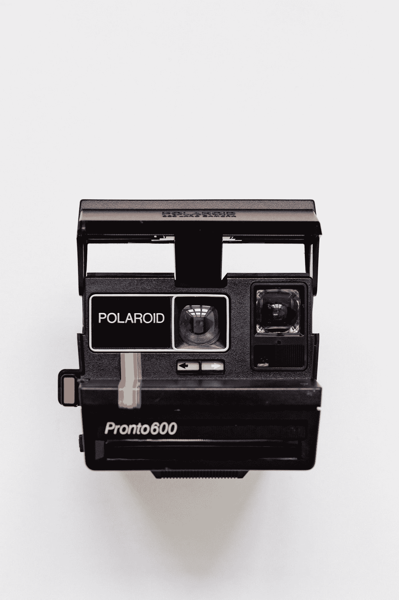
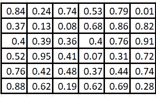
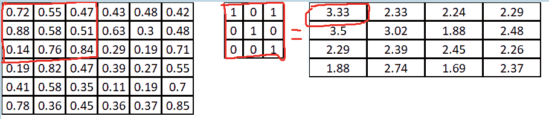
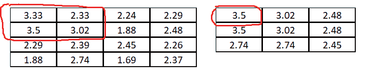
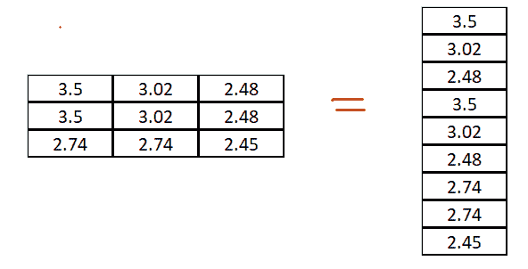
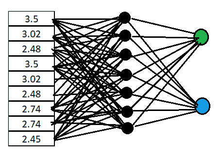

# 人工神经网络，第 4 部分——卷积神经网络

> 原文：<https://medium.com/analytics-vidhya/artificial-neural-networks-part-4-convolution-neural-networks-1ae8c2c751c7?source=collection_archive---------33----------------------->

照片由 [Unsplash](https://unsplash.com?utm_source=medium&utm_medium=referral) 上的 [Yoann Siloine](https://unsplash.com/@siloine?utm_source=medium&utm_medium=referral) 拍摄

在这一部分中，我们将介绍在图像识别任务中广泛使用的神经网络之一，卷积神经网络。在我们进入细节之前，让我们回顾一下在使用 CNN 时起作用的一些关键术语和概念。

1.  **滤镜** —一个数字矩阵，乘以原始图像矩阵。
2.  **卷积层** —网络中执行卷积操作的层。卷积是一种将滤波器与图像矩阵相乘以获得更多信息的操作。滤镜横跨图像，根据滤镜的大小覆盖每个部分。边缘等特征学习发生在这一层。
3.  **填充** —执行卷积运算时，图像矩阵最末端的边缘可能会被遗漏，信息会丢失。这可以通过应用填充来缓解，填充基本上是在图像矩阵中添加一列 0，这样边缘的数字就不会丢失。
4.  **池层** —当处理大图像时，由于尺寸和矩阵乘法运算，操作的计算量可能很大。因此，池化包括通过检查图像并选择包含最多信息的值来缩小图像堆栈。这减少了最终输出，并从原始图像中获取了大部分信息。可以通过 MaxPool(选择矩阵的最大数量)或 MeanPool(取矩阵的平均值)来执行池化。

卷积神经网络广泛用于图像处理领域，并可用于从图像中学习模式以执行分类任务。网络是深度多层神经网络，由输入层、卷积层、汇集层、全连接层和输出层组成。

CNN 的输入是图像，可以是灰度图像或彩色图像。这两种输入的操作是相同的，但是不同之处在于滤波器。

*   对于灰度图像，不需要考虑颜色通道，因此可以使用一个滤波器来执行卷积运算。
*   对于彩色图像，每个颜色通道 RGB 都有一个滤镜。

但是，就像图像的尺寸是高 x 宽 x 深一样，内核也是定义的高 x 宽 x 深的矩阵。深度取决于图像的类型。如果是彩色的，那么深度是 3，覆盖 RGB 颜色通道，在灰度的情况下是 1。

过滤器以定义的步骤在图像中移动，称为**步长**。

当在卷积神经网络中处理图像时，执行以下步骤

*   输入图像以图像矩阵的形式传递。

6x6 输入图像

*   执行卷积运算，即图像与滤波器的逐元素相乘，以捕获特征。卷积运算减小了图像大小，并捕获了所需的信息作为矩阵乘法的输出。执行归一化操作以移除任何负值，通常应用“ReLu”激活，将负值转换为零。

*这里我们有一个 6x6 的图像矩阵和一个 3x3 的过滤器。卷积运算的输出是小得多的 4×4 矩阵。步长为 1。*

*   应用汇集操作来进一步减小图像矩阵的大小，并捕获值作为最大汇集或平均汇集的输出。

*这里卷积层的输出被传递到一个池层，最大池被使用。它导致 4x4 矩阵变成更小的 3x3 矩阵。*

*   卷积层+归一化和池化层可以多级叠加，形成深度网络。
*   然后将输出展平为列向量，并作为输入提供给多层感知器或深度神经网络。

*输出被展平为列向量*

*   前馈网络执行高级特征学习，并应用反向传播进行学习。

*传递到全连接层的展平输出，用于使用 softmax 进行分类。(在 MS Paint 中绘制图像很难)*

*   为了执行分类，应用 softmax 激活功能。

这些层可以以多种方式堆叠在一起，以创建一个架构，并测试哪一个最适合当前的问题。有各种最先进的架构，如 LeNet、AlexNet、GoogLeNet，用于解决复杂问题和增强人工智能解决方案。

卷积神经网络是强大的，但重要的是要了解在哪里可以利用它们来获得最大的收益。CNN 擅长捕捉空间数据，这意味着要素彼此靠近，如果交换，输出将变得无用。比如图像。

如果数据是一样有用的，如果你交换值，那么 CNN 不是一个好的选择。

在下一部分，我们将讨论 CNN 的图像分类问题和解决方案。