# 人工神经网络，第 5 部分—使用 Tensorflow 和 Keras 实现 CNN

> 原文：<https://medium.com/analytics-vidhya/artificial-neural-networks-part-5-implementing-cnn-using-tensorflow-and-keras-9f7c2b56ad86?source=collection_archive---------19----------------------->

阿瑟尼·托古列夫在 [Unsplash](https://unsplash.com?utm_source=medium&utm_medium=referral) 上的照片

在早先的文章中，[人工神经网络，第 4 部分——卷积神经网络](/analytics-vidhya/artificial-neural-networks-part-4-convolution-neural-networks-1ae8c2c751c7?source=your_stories_page---------------------------)，我们研究了 CNN 背后的理论。在本帖中，我们将使用 Keras 和 Tensorflow 进行实际实现。数据集取自 Kaggle — [胸部 x 光图像](https://www.kaggle.com/paultimothymooney/chest-xray-pneumonia)。大约有 5864 个图像和 2 个类别(肺炎/正常)。

让我们直接进入实现。

第一步从导入所需的库开始

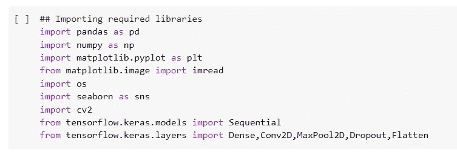

数据集中有三个文件夹:培训、测试和验证。对于此演示，我们将使用训练和测试数据集。让我们设置文件路径—

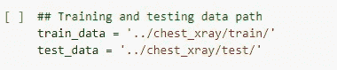

让我们看看我们正在处理的图像。

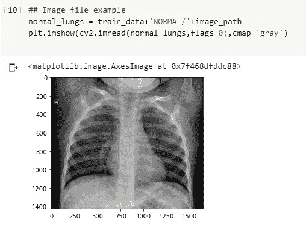

正常肺的图像

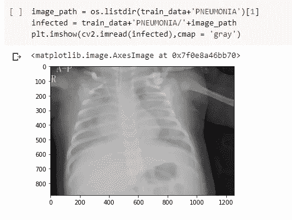

肺炎感染肺部

图像是灰度的，因此当我们看形状时，色标上没有任何细节。

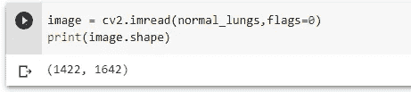

假设训练和测试数据中的图像具有不同的比例，我们将找出平均尺寸并将图像整形为相同的尺寸。

下图显示了图像的不同维度。我们将重塑所有的图像大小为(1400，1400)。

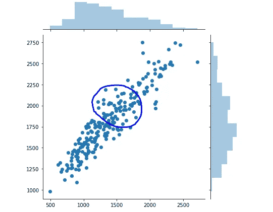

圆圈表示平均值将在该区域的某处。

正如人们常说的，数据越多越好，在我们的武器库中有更多的图像来训练会更好。在现实世界中，获取更多图像数据会变得很困难，我们可以通过从现有图像创建转换后的图像数据来缓解这一问题。这可以使用 ImageDataGenerator 类来完成。

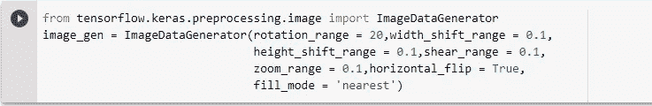

在上面的函数中，我们创建的图像是从现有数据集转换而来的图像。下面是一个如何进行转换的例子。

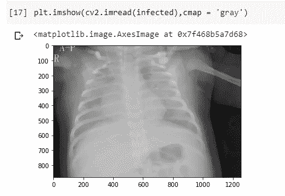

原创

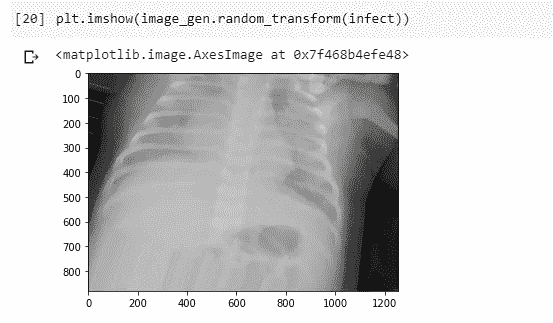

转换

现在，我们准备创建 CNN 来训练图像分类模型。在我们的 CNN 中，有 5 个卷积层，接着是 3 个致密层。我为什么要使用这种架构？因为它提高了验证的准确性，而且我正在尝试使用 AlexNet 架构。这是模型总结—

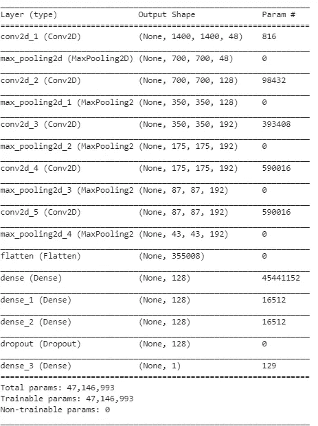

为了训练模型，我们将利用 flow_from_directory()方法来创建批量图像，这些图像将被提供给网络用于训练。这将有助于减少内存使用。但是，这将增加培训时间。我们还将使用*提前停止*，在验证准确性没有提高时打破训练周期。

Tensorflow 库中提供了这些方法。

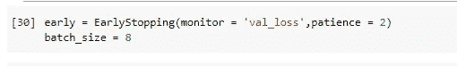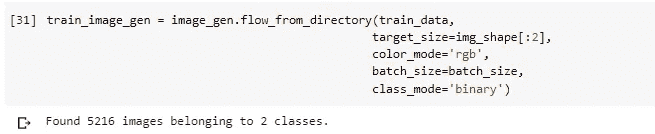

继续用数据训练模型—

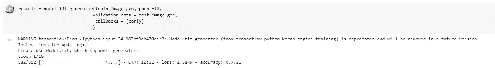

完成培训大约需要一个半小时。我们提供的时期数为 10，但由于提前停止，训练在时期 5 停止，验证准确率为 82.5%。

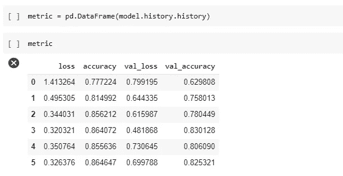

让我们根据我们的测试数据来预测—

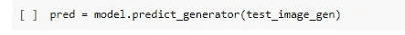

保持阈值为 0.5，当与实际值比较时，我们得到以下分类报告—

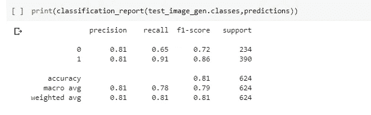

**‘正常’:0，‘肺炎’:1**

看起来在所有有肺炎的图像中，我们的模型能够正确检测出 91%。还不错！

我们肯定可以改进该模型，我希望获得任何反馈和改进建议。

完整代码可点击此处— [*肺炎 _ 预测 _CNN*](https://github.com/sachatur13/Code_Repo/blob/master/Pneumonia_prediction_CNN.ipynb)