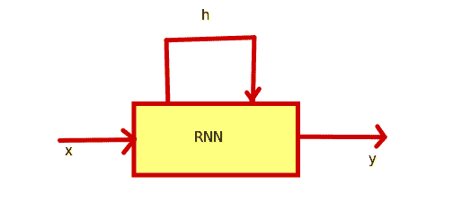
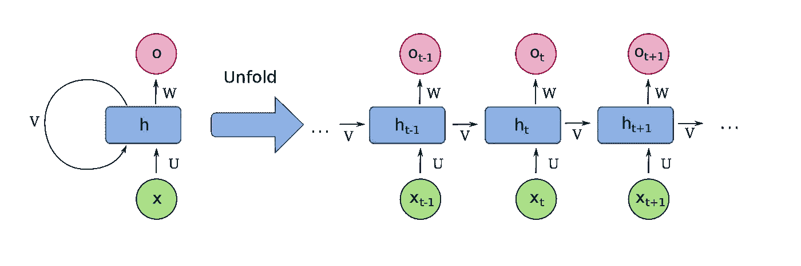
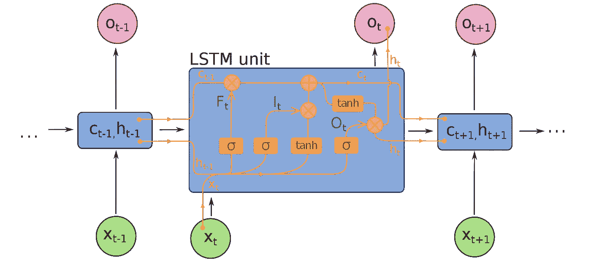

# 人工神经网络，第 5 部分——递归神经网络

> 原文：<https://medium.com/analytics-vidhya/artificial-neural-networks-part-5-recurrent-neural-networks-985be257c5bb?source=collection_archive---------23----------------------->

贾斯汀·坎贝尔在 [Unsplash](https://unsplash.com?utm_source=medium&utm_medium=referral) 上的照片

借助卷积神经网络，我们可以创建深度学习模型，这些模型非常擅长对图像进行分类，并且可以扩展到处理各种各样的图像数据。当处理序列数据(如文本数据、时序数据或音频数据)时，我们要查看跨越时间并形成信息序列的信息。CNN 可能不是一个好的选择。

在顺序数据的情况下，下一组数据可能依赖于前一组数据，因此有必要维护某种历史，这可以用来预测结果。例如，如果我们正在预测一个序列中的下一个单词，那么有必要能够将前面的单词联系起来，并确保一切都符合。

对于这种数据，我们需要专门的网络，它可以保留一个历史，并使用它来预测下一个数据点。但是为什么不能用前馈网络来对这个需求建模呢？对这种数据使用前馈网络的问题是

*   前馈网络需要预先设定的固定长度的数据输入。对于序列数据，输入不必是固定长度的。
*   长期依赖，换句话说，历史状态无法维持。

在序列建模中，网络应该能够-

*   处理可变大小的输入，例如可变长度的句子。
*   跟踪长期依赖关系。换句话说，维护一个历史。
*   维持秩序。在语言建模中，有必要保持句子的顺序，以便做出适当的预测。
*   跨序列的参数共享。

在这些情况下，我们求助于**递归神经网络**。因此，RNNs 是一种神经网络，它记住以前的输出，并在计算当前输出时使用它。它们有一种反馈回路，允许信息在网络中持续存在，并用于下一个输入序列的处理。下面是一个 RNN 的例子。

以下步骤用简单的术语描述了 RNN 的工作原理-

1.  取输入 x
2.  预测输出 y
3.  更新内部状态 h，并在下一时间步中使用 h。

在单元状态 h 的更新中，也使用先前的状态 h(t-1)。该计算是当前状态和先前状态的权重矩阵与来自先前时间步长的单元状态和输入向量 x 的矩阵乘法。然后，应用激活函数来引入非线性。如果展开上面的图像，它看起来会像这样-

[递归神经网络](https://en.wikipedia.org/wiki/Recurrent_neural_network) -维基

在这里，单个时间步长可以被可视化，并且单元状态如何从一个时间步长转移到另一个时间步长也是可见的。对于每个时间步长，还会计算损失，最后，总损失是各个时间步长所有损失的总和。一旦正向传播完成，下一步就是更新权重和偏差。反向传播会发生这种情况。

在 RNNs 的例子中，在反向传播过程中，会发生大量的计算，在此过程中，会出现两个主要问题

**爆炸渐变** —有很多大于 1 的值，这会导致很大的渐变值。

**消失梯度**-有许多小于 1 的值，这可能导致梯度变得如此之小，以至于只有偏差起作用，并且随着历史信息的丢失，网络仅使用偏差值起作用。

爆炸和消失梯度的问题可以通过正确的权重初始化(单位矩阵初始化)、正确的激活函数或使用不同的架构来处理。

其中一种架构被称为 LSTM——长短期存储器，它与门一起控制网络中的信息流。LSTMs 可以跨多个时间步长跟踪信息。下面是一个 LSTM 如何工作的例子

[递归神经网络—维基](https://en.wikipedia.org/wiki/Recurrent_neural_network)

1.  遗忘门—这用于仅保留相关信息，
2.  下一步是用历史单元状态和激活函数计算输入或新信息，并存储部分计算结果。
3.  步骤 1 和 2 的输出用于计算和更新单元状态。
4.  最后一步是生成输出预测。

深度序列建模有许多有趣的应用，如自动驾驶汽车中的轨迹预测、文本预测和音频生成。

这篇文章到此为止，欢迎发表任何评论和反馈。我希望这是有用的。