# 人造的还是真的？

> 原文：<https://medium.com/analytics-vidhya/artificial-or-real-6b1d9974a9?source=collection_archive---------14----------------------->

玛丽娅·戈吉尔迪耶娃，基里尔·格扎兹诺夫，阿纳斯塔西娅·沙里吉纳

*主管:劳尔·维森特，丹尼尔·马约拉尔*

[GitHub 资源库](https://github.com/ShalyginaA/artificial-or-real)

这是塔尔图大学计算神经科学课程的一个研究项目。

随着神经网络的发展，人工智能算法的受欢迎程度急剧上升，导致媒体大惊小怪。每天我们都可以看到关于 deepfakes、人工智能生成的新闻和自动驾驶汽车的文章，这些文章可能会引发一个问题:人工智能真的正在接管世界吗？

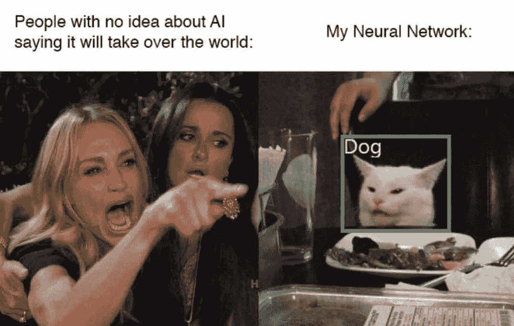

我们项目的目标是调查人们能够在多大程度上区分真实数据和人工生成的数据，以及哪些因素在其中发挥了关键作用。

# 背景

我们决定使用问卷进行研究，在问卷中，人们必须区分由神经网络生成的图像、文本和声音与真实的图像、文本和声音。

我们看到几份问卷(带有科学和/或娱乐目的)提出了类似的任务。然而，所有找到的问卷都有相同模态的任务。比如“[哪张脸是真实的？华盛顿大学的一个项目要求受访者在真实人脸和人工合成人脸之间做出选择。结果似乎还没有公布。](http://www.whichfaceisreal.com/)

谷歌提议比较真实和生成的( [Tacotron 2](https://google.github.io/tacotron/publications/tacotron2/index.html) )语音。然而，这更多的是一个娱乐测验，因为他们似乎不收集答案。

然而，Lawsuite.org 网站为文本数据做了一个实验，使用了一种特定的文本:唐纳德·特朗普真实的演讲和由机器人特朗普生成的虚假演讲。该实验有 1000 名受访者，他们平均只有 40%的答案猜对了。

# 方法

我们的主要方法是定量研究。我们需要收集数据并进行统计分析，以了解人们如何区分不同种类的生成数据和真实数据。

考虑到这个目标，我们创建了 3 份问卷，每种形式一份([图像](https://forms.gle/qp3Bmp4oAX218GDo6)、[声音](https://forms.gle/vhEoZV6AEc5wfXGL8)和[文本](https://forms.gle/GKj8AzzA99ARmk5aA))。每份问卷都有相同的人口统计学问题(除此之外还有一些具体问题)。我们将图像、声音和文本任务分开，以方便受访者填写。

# 问卷结构

问卷有两种主要的问题:这是真的吗？哪些是真的？通过这种区分，我们旨在分别分析两种情况:回答者被提供一个单一的例子，或者他或她必须比较几个例子，其中一些据说是由人工智能产生的。我们的初步假设是，比较题会得到更多的正确答案。

简单问题示例

至于答案，我们主要给出 3 个确定度:肯定，可能，不知道。

比较问题示例

1.  **人口统计**

我们从问题开始调查问卷，以收集关于受访者自身的信息。我们没有要求任何私人数据(如姓名或电子邮件地址)。首先，我们感兴趣的是至少可能与总体结果相关的信息。在我们看来，教育水平和一些以前的人工智能经验可能是这样的因素。对于文本和声音，我们还询问了英语水平和声音——如果回答者有任何音乐经验。我们假设这些因素会影响这些特定任务的结果。我们还询问了一些一般信息，如性别、年龄和国家，以了解受访者的差异。

2.**图片**

我们使用的图像可以分为两类——人物肖像和现代艺术绘画。

人们的图像取自 whichfaceisreal.com 的[网站，在那里展示了一对对真实和人工的图像:一个真实的图像来自 Flickr-Faces-HQ 数据集(FFHQ)，一个合成的图像由 StyleGAN 生成，StyleGAN 是 Nvidia 研究人员在 2018 年 12 月推出的新型生成性开源对抗网络。](http://www.whichfaceisreal.com/)

人工生成的现代艺术画取自 [aican.io](https://www.aican.io/) 网站。真正的现代艺术作品的图片来自几个出售现代和抽象画的网站(如[osnatfineart.com](https://osnatfineart.com/))。

因为我们想限制参与者看图片的时间以避免偏见，我们将图片转换成 gif 文件，每张图片只显示 10 秒钟。总的来说，我们在图像部分提出了 16 个问题:4 个是参与者必须判断图像上的人是否是真实的，4 个是回答者必须比较真实的人和生成的人的肖像并判断哪个人是真实存在的，8 个是现代艺术图像的类似任务——4 个简单任务和 4 个比较任务。

3.**短信**

用于文本生成的 AI 是 [OpenAI GPT-2 模型](https://talktotransformer.com/)。我们使用了人类书写文本中的一个句子提示，并要求模型继续。通常，它输出 1-3 个完整的句子。我们仔细选择生成的文本，寻找那些不会给出任何明显线索的文本。因此，我们没有选择任何明显无意义和随机的生成文本。此外，我们忽略了那些包含事实错误的(例如，错误的日期或名字)。我们没有对选择的文本做任何后处理(标点和拼写被完全保留)。

这些提示来自不同的来源。让任务变得复杂的是，我们没有选择任何知名的文本，老实说，我们试图寻找一些奇怪的文本。我们的信息来源包括 theonion.com(讽刺新闻媒体)、horoscope.com(每月星座运势)、newsinlevels.com(为语言学习者撰写的新闻，因此对于母语为英语或精通英语的人来说，文本可能看起来有些偏离)、和[learnenglish.britishcouncil.org](http://learnenglish.britishcouncil.org)(也为语言学习者改编的短篇小说)。

总的来说，我们做了 8 个文本任务(4 个简单的，4 个比较)。由于文本长度也可能对结果有影响，我们使用了不同长度的文本，但保持相对较短(1 句提示+1-2 句继续)。

4.**声音**

我们做了两种类型的声音任务:第一种是英语演讲，另一种是钢琴曲。该语音是由一个名为 MelNet 的机器学习系统生成的。我们使用了四个简短的演讲片段，它们摘自关于 theverge.com 的文章。钢琴声音是由 WaveNet 神经网络生成的。我们从文章“[wave net:raw audio 的生成模型](https://deepmind.com/blog/article/wavenet-generative-model-raw-audio)”中提取了 3 段生成的钢琴曲。总的来说，我们做了 4 个关于演讲的任务和 4 个关于钢琴曲的任务，其中只有一首钢琴曲是真实的。

由于我们使用 Google forms 进行问卷调查，我们可以将带有语音和音乐的音轨作为指向存储文件的 Goole Drive 的链接。由于这种限制，并且由于听声音比比较图像花费更多的时间，所以完成声音问卷将花费太长的时间。因此，我们决定省略声音任务的比较问题，使其更简短。

5.**反馈**

回答者在提交问卷后会收到带有总体分数的反馈。如果他们回答“肯定是[正确答案]”或“可能是[正确答案]”，他们就可以得到 1 分。在文字和声音的情况下，他们会在问卷的最后得到正确的答案。对于图像，我们在每个任务结束后都给出了正确的答案(因为我们在任务中放了简短的 gif，它们在一般反馈中很难看到，所以我们决定在每个任务后都放有正确答案的静态图像)。

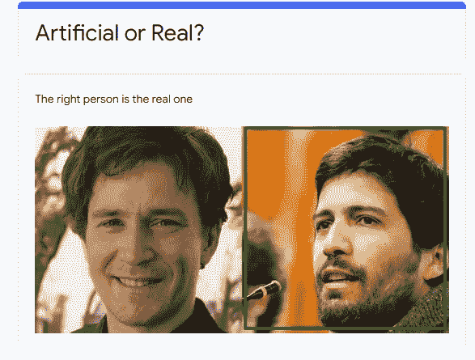

图像即时反馈问卷示例

# 问卷分发

我们已经通过社交网络和大学媒体分发了调查问卷。这些链接被张贴在脸书的各个学生团体网页上，然后通过 ICS 的邮件列表发送出去。下面你可以看到我们得到回应的速度有多快。第一个主峰是当我们在脸书上发布链接时，最终达到顶峰——来自邮件列表的结果。

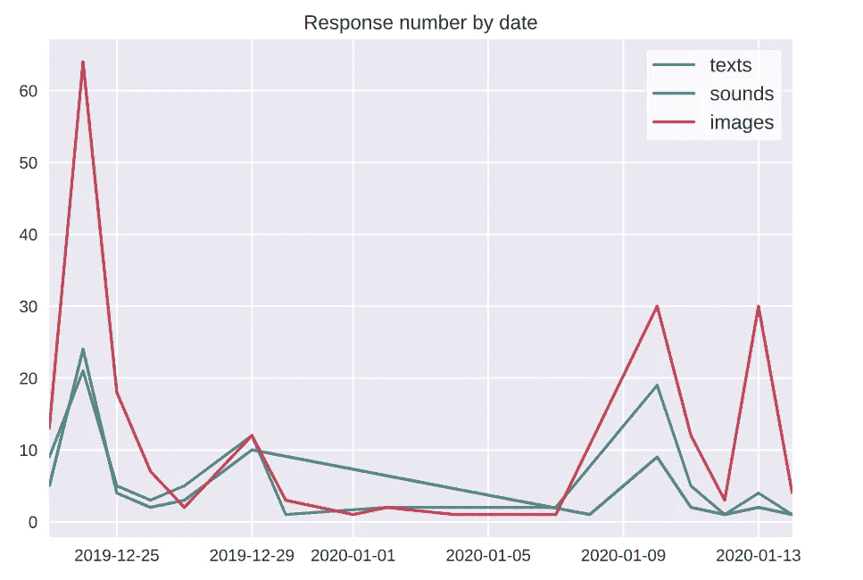

由于问卷分为 3 个部分，各领域得到的答复数量不同。最受欢迎的是图像(204 个回复)，然后是文本(90 个回复)，然后是声音(64 个回复)。我们预计声音任务的响应数量会较低，因为它要求听语音/音乐。文本和图像之间的偏斜可能是由于链接到图像的问卷总是首先发布，并且回答者可能只做了第一个问卷，或者一些回答者只对图像问卷感兴趣，因为在现代世界中，我们更习惯于感知视觉信息。

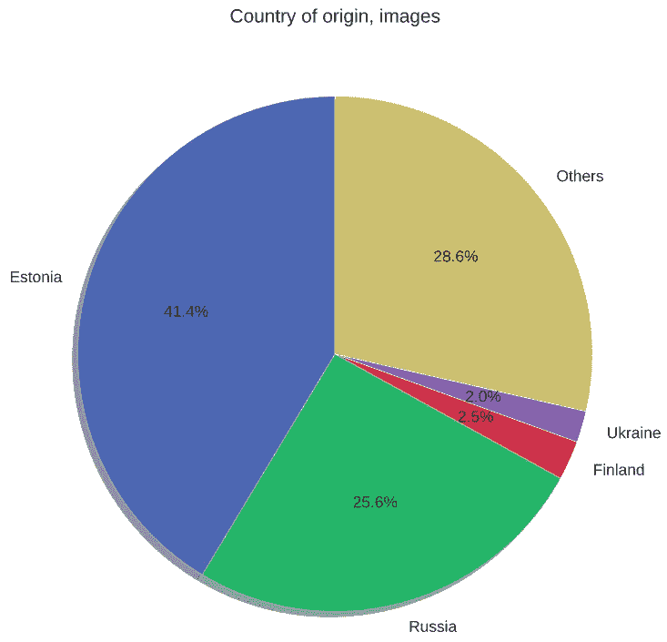

我们得到的回答的人口统计学差异很大。

总的来说，我们有来自 40 个不同国家的受访者，俄罗斯和爱沙尼亚是主要的一个，因为我们的团队成员来自俄罗斯和爱沙尼亚。

大多数受访者都有大学学位，其中大多数获得了硕士学位。

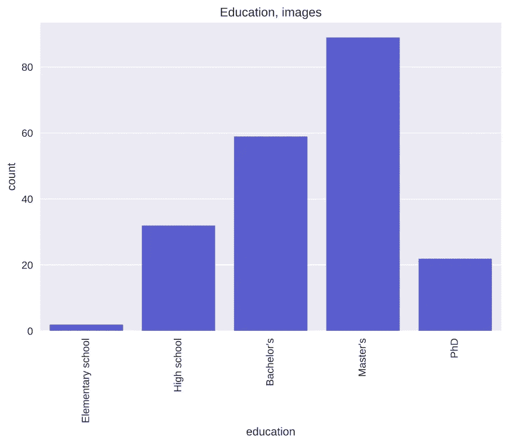

超过 70%的受访者之前没有从事或研究过人工智能，也没有类似测试的经验。

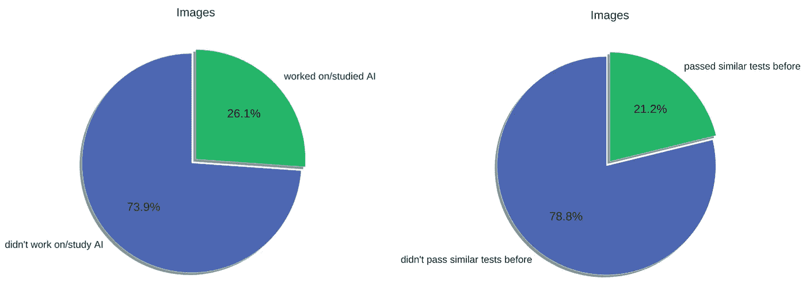

# 结果

只有图像获得了满分。

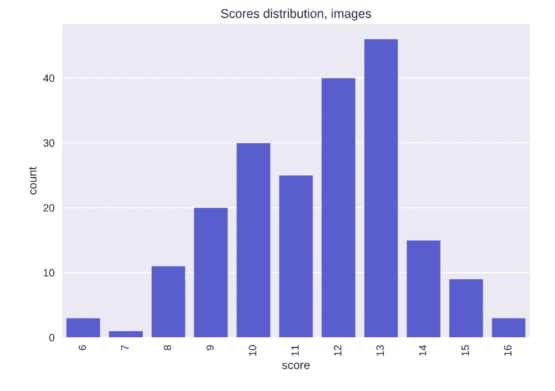

另外两份问卷比预期的要难。可以看出，图像的最低分是 6，而声音和文本的最低分是 0。此外，对于声音，最高分是 6 分(满分 8 分),而对于文本，最高分是 7 分(满分 8 分),我们可以得出结论，声音问卷是最难的。根据我们对问卷的个人经验，我们期待这样的结果。

然而，当考虑满分的人时，分数与教育、人工智能知识、年龄或通过类似测试之间似乎没有任何相关性。

满分的回答者

由于参与者在图片问卷中得到即时反馈，我们有点担心这会影响他们进一步的回答。从下图可以看出，在第一个问题之后，第 2-8 个问题的分数逐渐增加，但第 9-16 个问题的分数没有这种相关性。在这一点上，应该提到的是，q1-q8 是关于人物图像的问题，而 q9-q16 是关于现代艺术图像的问题。因此，似乎受访者学会了如何区分真实的和生成的人的图像，但不能对现代艺术部分做同样的事情，我们的预期部分是正确的。

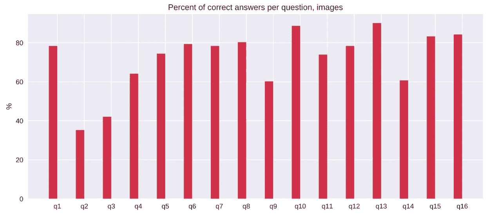

1.**简单 vs 比较**

我们比较了所有简单问题(只有 1 张图片或文字)和所有比较问题(2 张图片/文字:1 张是真实的，1 张是生成的)的平均分和分数分布。

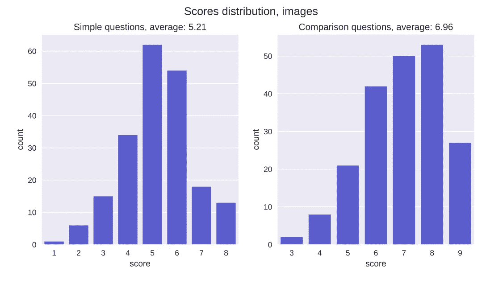

结果似乎取决于领域。对于图片，比较问题的平均分较高，而对于文本，差异较小，简单问题的平均分较高。

一种可能的解释是，图像作为一种视觉媒体更容易并排比较，而对于文本，人们必须一个接一个地连续阅读。

另一个原因是，课文中的问题特别容易混淆。因此，一些比较问题具有由人工智能产生的真实世界的事实(如城镇名称或数字)，这可能给了回答者错误的提示。

2. **AI 知识和教育水平**

我们最初的假设是，以前的人工智能经验和教育水平可能是最终得分的一个因素。特别是，我们期待人工智能经验与图像任务表现之间的相关性，因为使用神经网络的受访者可能知道神经网络通常在图像的哪些部分(如人的眼睛或图像的背景)表现不佳，他们可能会注意到一些线索。然而，当我们比较平均分数时，结果显示图像和文本的分数没有显著差异，但使用人工智能的参与者在声音任务中表现更好。

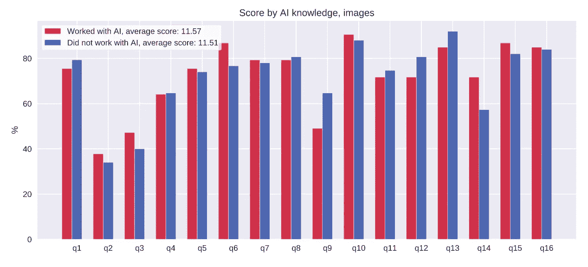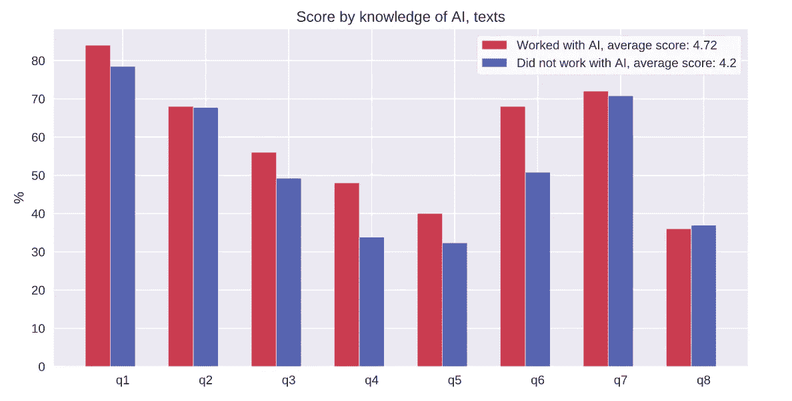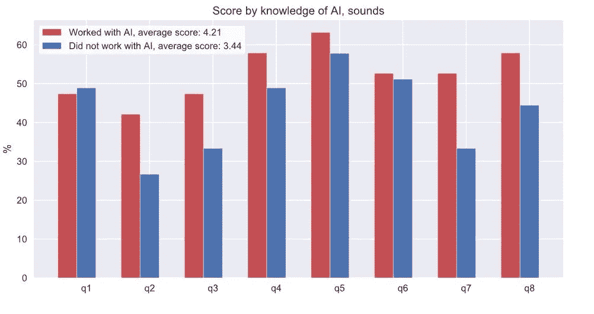

对于教育水平，我们可以观察到文本和声音的平均分数稍高，但差异并不显著。

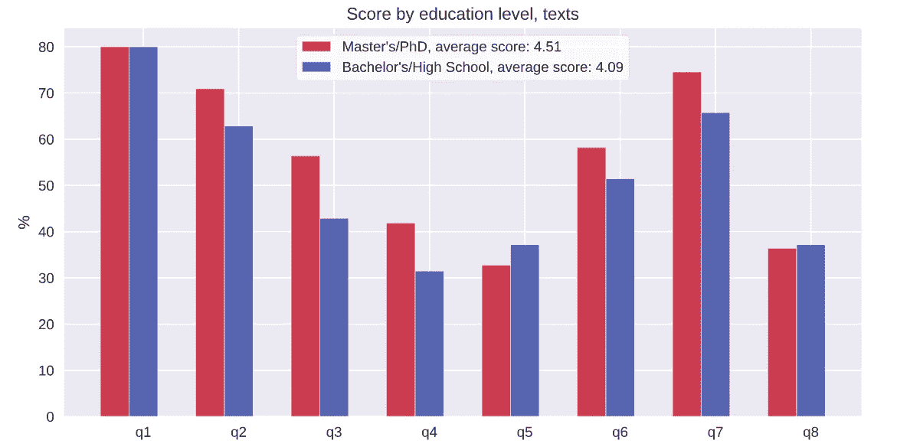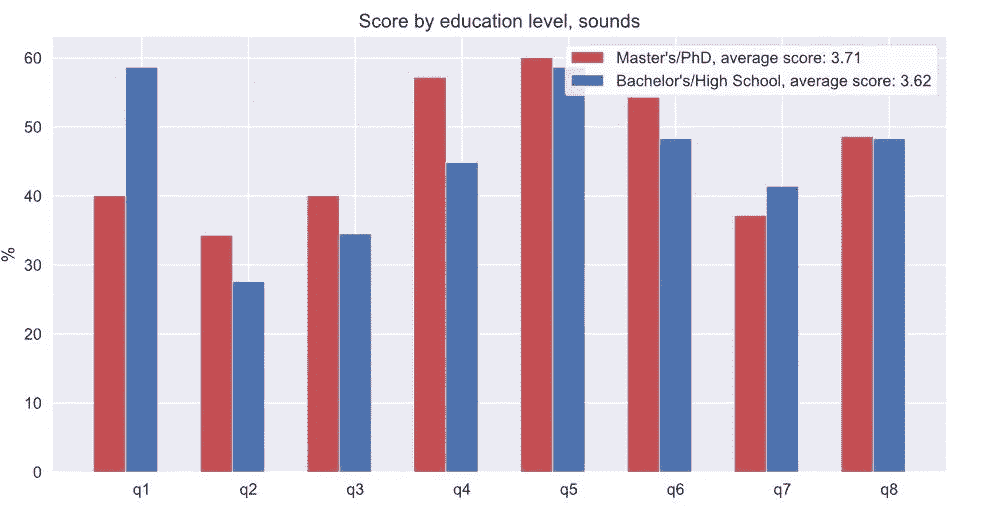

3.**英语水平**

我们询问了受访者的英语水平，因为对我们来说，英语水平是理解文章和演讲的一个重要因素。

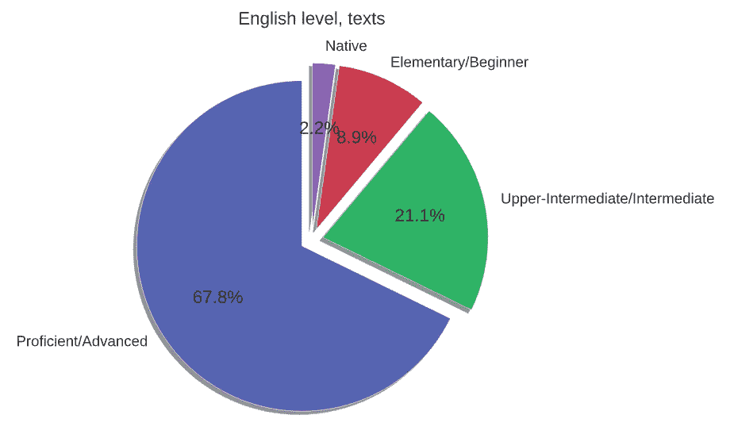

大部分回答要么是“精通/高级”，要么是“中上/中级”。很少有人回答“本地”或“初级/初学者”，所以我们将它们分别与之前的类别相结合，从而产生 2 个类别——更高级和不太高级。

从考试成绩来看，平均分并不取决于英语水平。英语水平较高的受访者的平均分甚至比其他人略低。

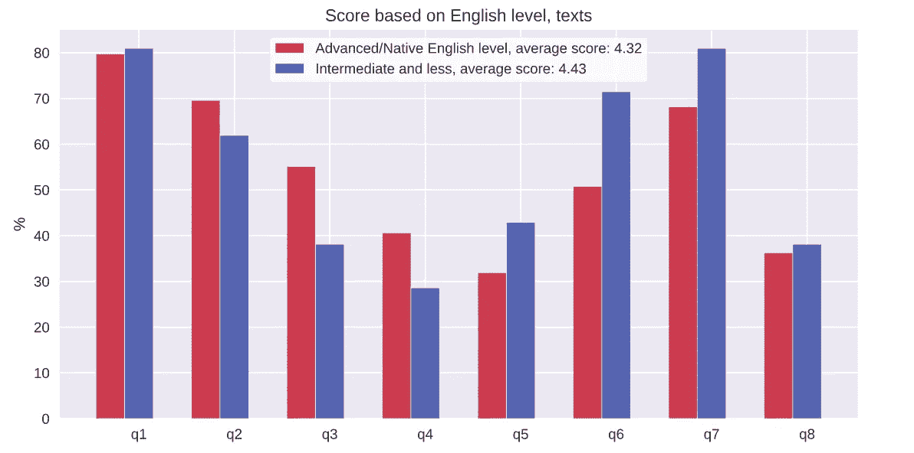

然而，在演讲任务的情况下，英语水平较高的受访者表现更好。分数上的差异似乎不是很显著，但是我们有一个假设，为什么英语水平对于声音任务可能更重要。理解文章的意思不需要像听力任务那样多的经验。听力的任务不仅仅是听一般的意思，还包括识别一个人说话的口音和流利程度。

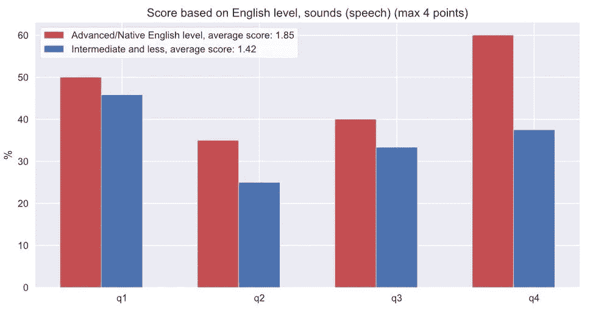

4.**音乐知识**

在声音问卷中，我们要求受访者指出他们对音乐的体验。超过 50%的参与者没有学习音乐，大约 10%的人是专业的，其他人是业余的。

我们期望专业学习音乐的人在音乐任务中表现更好，但是令人惊讶的是，音乐水平和参与者的表现之间没有明显的相关性。此外，自称是音乐专业人士的人甚至得到了最低的分数。然而，我们认为，由于它是最小的群体，结果不能完全代表。另一个问题是，我们没有明确区分这三个类别，所以我们不知道人们认为什么是“专业”(是指作为一名音乐家工作还是从音乐学校毕业？)

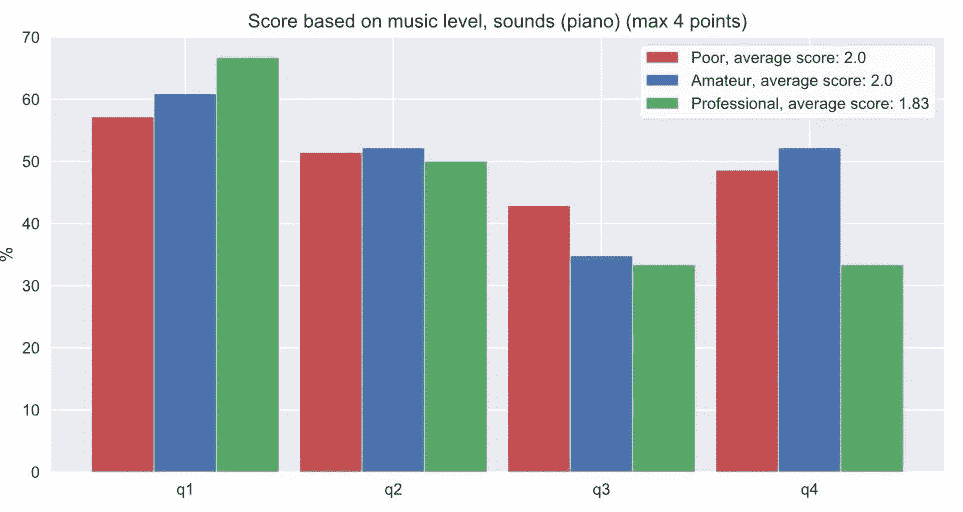

5.**面孔 vs 现代艺术**

在图像问卷中，我们有两种类型的问题——关于人物图像和现代艺术绘画的问题。我们比较了这两类问题的分数分布和平均分数，结果显示人们在现代艺术图像上表现得更好。

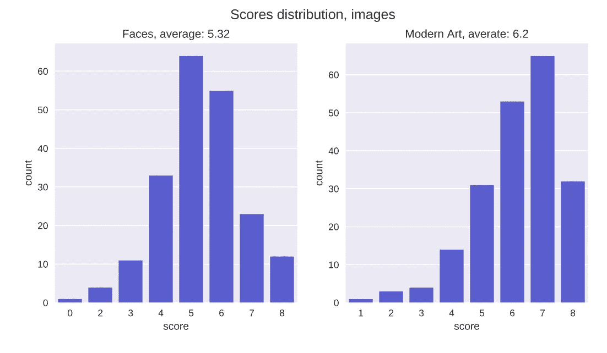

我们不确定为什么艺术的分数会更高。我们最初的假设是，生成的图像比真实的图像模糊，这是可以注意到的。然而，这意味着回答者会理解这一特点，最后的问题会得到更高的分数。但是如果记得上面的图片，艺术部分的“学习”效果并不是这样。

在准备调查问卷时，我们考虑过增加一个关于受访者艺术知识的问题。但是，我们放弃了这个想法，因为有经验的受访者人数不会很多。此外，真正的艺术图像来自相当模糊的来源(例如，不是博物馆)，可能也不出名。

所以，最终，这对我们来说还是一个悬而未决的问题。我们不确定这是巧合、有趣的发现还是问题结构的直接结果。

现代艺术问题的例子

# 结论

我们得到的结果似乎相当有趣，甚至令人惊讶。

在所有三个领域中，图像被证明是最容易的领域，受访者获得最高分，最低分为 6 分。我们在一定程度上预料到了面部表情会有这样的结果，但我们惊讶地得知，艺术部分的综合得分甚至更高。

我们不希望任何人口统计因素(教育、人工智能经验、英语水平等)在最终得分中不起任何作用。我们甚至可以得出结论，我们区分人工智能生成的内容的能力并不太依赖于额外的知识。然而，我们发现，收到反馈和对之前问题的正确回答可能会影响后续的回答，在某些情况下，回答者可以通过这种反馈进行“训练”。

另一个意想不到的结果是，只有图像的比较问题更容易回答。实际上，我们希望他们在图像和文本方面都能获得更高的分数。正如我们上面提到的，这可能是我们“过度复制”文本的结果。为了得到更公正的结果，文本中的任何线索都应该被删除。

总的来说，我们对我们所做的工作很满意。虽然我们没有收到我们希望的那么多数据，但我们坚信，随着更多的回复，分析结果不会有太大的变化。

## 任务分工

问卷准备和数据分析:

*   图片—安娜斯塔西娅
*   文本—玛丽娅
*   声音——基里尔

博文是一起写的，然后由 Anastasiia 格式化。

演示幻灯片和演示文稿—Maria。

## **致谢**

Raul Vicente 和 Daniel Majoral 感谢 Madis Vasser 在之前版本的图像问卷和调查中进行了富有成效的讨论。