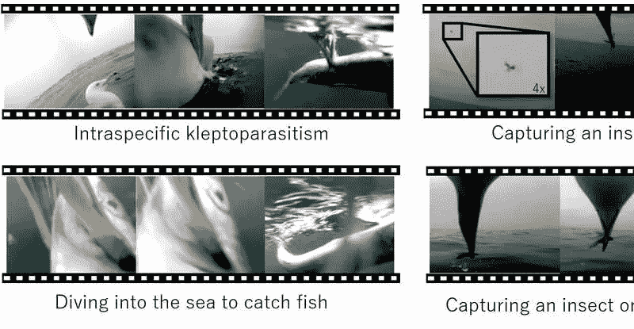
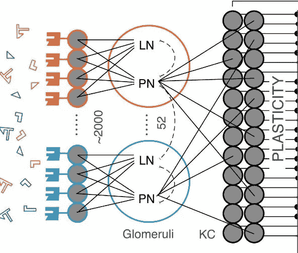
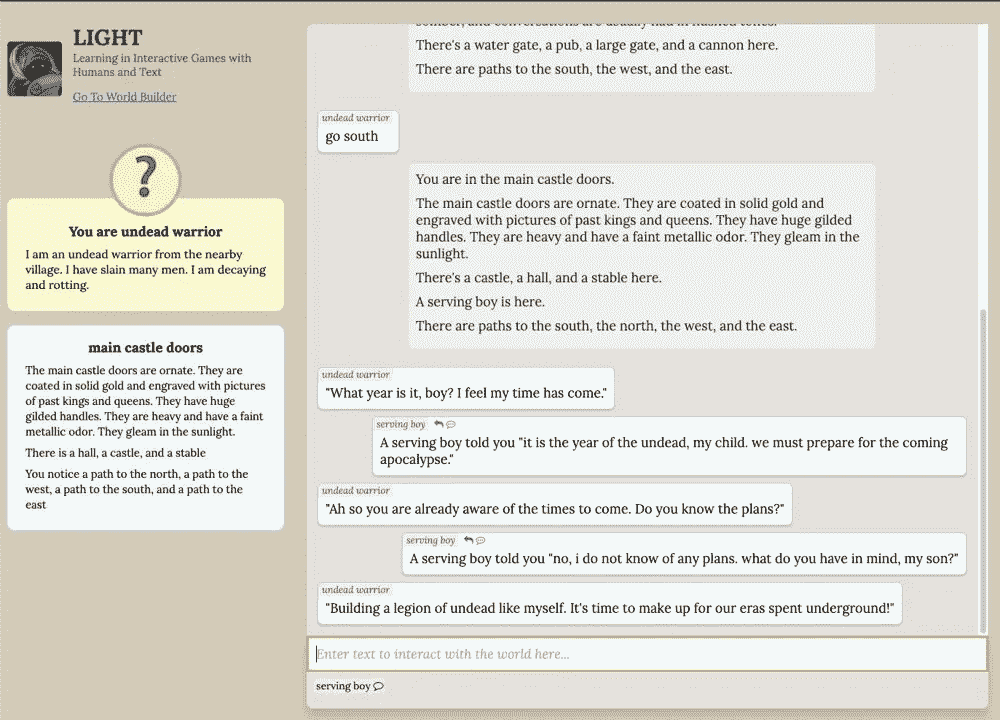

# 识别鸟类行为的人工视觉

> 原文：<https://medium.com/analytics-vidhya/artificial-vision-to-identify-behaviors-in-birds-7a79150f6c25?source=collection_archive---------23----------------------->

*这是对一周内发生的一些人工智能新闻的回顾。*

大阪大学的研究人员开发了一个收集动物传输数据的系统，该系统由人工智能领导，可以识别鸟类中没有记录的行为。野生动物的数据收集已经实现了技术化，在它们的身体上安装微型摄像机，可以在最小干扰的情况下观察它们的行为和相互作用。目前的障碍是电池的持续时间，但随着人工视觉的引入，它将有可能自动检测和记录感兴趣的特定行为，供其研究。

## 科学家开发人工智能来解释他的发现

由于使用了深度神经网络，UMaine scientist 希望用一种可以理解的方式向用户解释他的发现。解释可解释的机器学习根据数据执行图像比较和预测，从而开发描述所发现内容的推理。所有这些都是因为开发者陈想要通过展示内部来提高对深度学习的理解，因为它是一个内部未知的黑匣子。

## 神经系统激发了高效的人工智能系统

对昆虫神经系统的研究寻找大脑生物计算的原理及其对机器学习和人工智能的可能影响。从技术上来说，他们分析了昆虫如何学会将来自环境的感官信息联系起来以获得食物奖励，以及它们如何记住这种奖励，然后完成更复杂的任务。这些结果有望激励未来应用机器学习和人工智能来解决复杂的任务。

## 智能代理学习在虚拟世界中交流和行动

自然语言处理技术旨在理解人类语言，通过实现交互(人类人工智能体)来产生响应。研究人员将自然语言处理添加到目标驱动的代理中，以便与其他角色进行交流，并在虚拟环境中完成动作。结果产生了说话和行为与他们的一般动机一致的游戏角色。目前，这些代理是非常原始的，他们接受叙事游戏或冒险的训练，帮助代理针对对象和对话改善他们的口头互动和他们与他们的行动的关系。

感谢阅读，我希望你已经了解了一些新的东西。下一期再见。