# ASHRAE 大能量预测 III 挑战

> 原文：<https://medium.com/analytics-vidhya/ashrae-great-energy-prediction-iii-challenge-4910a7e17324?source=collection_archive---------8----------------------->

# 目录:

1.问题陈述

2.数据集

3.将现实世界的问题映射到 ML 问题

4.探索性数据分析

5.特征工程

6.模型和超参数调整

7.参考

# 1.问题陈述:

这是由 ASHRAE(美国供暖、制冷和空调工程师协会)组织的一场卡格尔竞赛。ASHRAE 成立于 1894 年，是一个通过建筑环境的可持续技术促进人类福祉的全球性协会。这些数据来自 1000 多栋建筑，时间跨度为三年(2016 年至 2019 年)。随着对这些节能投资的更好估计，大规模投资者和金融机构将更倾向于在这一领域投资，以促进建筑效率的提高。

来源:https://www . ka ggle . com/c/ASHRAE-energy-prediction/overview

## 2.数据集

数据集由五个 CSV 文件组成。这些文件是 train.csv，test.csv，building_metadata.csv，weather_train.csv，weather_test.csv，train.csv，weather_train.csv，weather_test . CSV。CSV 是一个时间序列数据。building_metadata 由 site_id、building_id、primary_use、square _ feet、year _ 等要素组成。weather_train 和 weather _ test 数据由以下气象要素组成:气温、露水温度、云量、风速、风向、precience 从 2016 年 1 月 1 日到 2017 年 1 月 1 日测量了 Weather_train 数据集。Weather_test 数据集跨度为 2017 年 1 月 1 日至 2019 年 1 月 1 日。

来源:https://www.kaggle.com/c/ashrae-energy-prediction/data

## 3.将现实世界的问题映射到 ML 问题:

在这个问题中，我们要预测两年(2017 年到 2019 年)的 meter_readings。因此，这是一个回归问题，因为我们的目标变量 meter_readings 是一个连续变量。给出的评估指标是 RMSLE(均方根对数误差)。

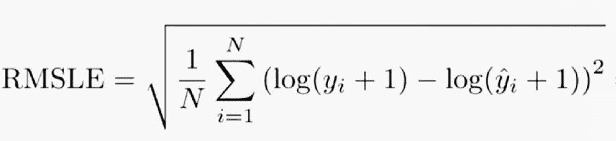

其中:

n 是(公共/私有)数据集中的观察总数。

yi^你对目标的预测。

y 是 ii 的实际目标。

log(x)是 x 的自然对数。

来源:[https://www . ka ggle . com/c/ASHRAE-energy-prediction/overview/evaluation](https://www.google.com/url?q=https://www.kaggle.com/c/ashrae-energy-prediction/overview/evaluation&sa=D&ust=1602591028562000&usg=AOvVaw2Pp9JH8h-5U0AgWobeEeml)

# 4.探索性数据分析:

首先，我们将训练数据与 weather_train 和 building_metadata 合并。然后对该合并的训练数据执行分析。我们对 train_data meter_type(0:电力，1:冷水，2:蒸汽，3:热水)进行了分析。为此有两个柱状图:一个显示记录仪表读数与仪表类型，另一个显示仪表类型使用频率与仪表类型。

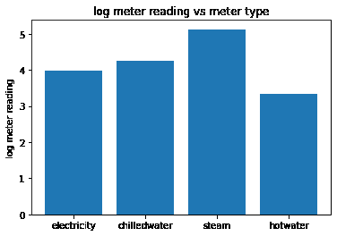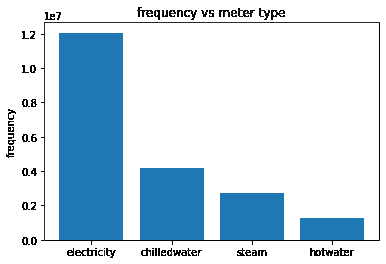

我们看到蒸汽表类型消耗的能量最多，最常用的表类型是电表。最少使用热水表类型。现在我们对 site_id 和 primary_use 特征进行分析。有 16 种主要用途类型。主要用途特征告诉我们给定位置(site_id)的建筑物的用途。site_id 是建筑物的位置。在该数据中有 16 个站点被赋予唯一标识符 site _ id.site _ id 值的范围从 0 到 15。通过堆叠图，我们可以看到每个站点 id 的主要用途的平均仪表读数。

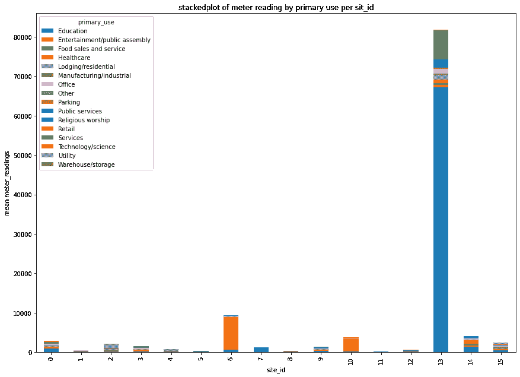

从上图中我们可以看出，站点 id 13 具有最高的平均仪表读数。site_id 13“教育”建筑对平均仪表读数的贡献最大。现在，为了进一步分析各种建筑类型中安装的电表类型，我们再次绘制堆栈图。由于教育建筑中安装了大量的蒸汽表，我们的平均仪表读数很高。

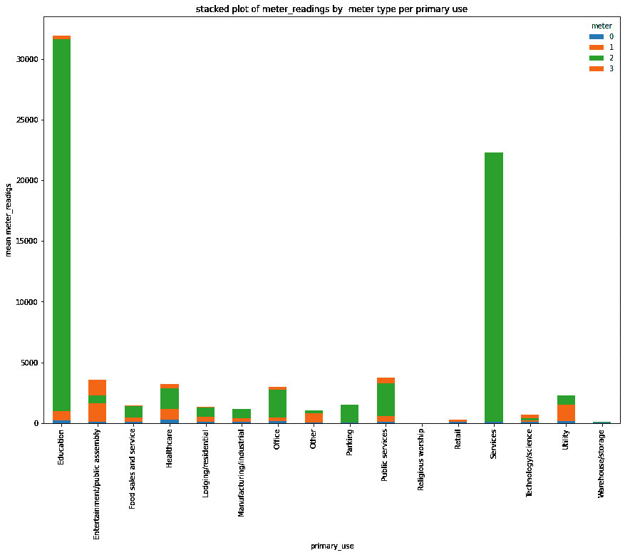

接下来，我们绘制 2016 年的日平均仪表读数。我们希望看到 2016 年每天平均仪表读数的模式。这将让我们知道哪个月的读数高/低。

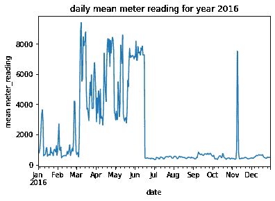

这里的仪表读数在三月后异常爆炸，然后从七月到十一月几乎为零，然后在十一月达到峰值。我们必须深入挖掘，找出导致平均仪表读数异常增加的异常值。我们现在分析每个站点 id 的平均仪表读数。在分析了每个 site_id 平均抄表数后，发现 site_id 13 号教育大楼 1099 的平均抄表数与 2016 年的总体平均抄表数相同。因此，site_id 13 教育大楼编号 1099 是一个异常值。它在 2016 年统治着整个抄表行业。现在，在移除 site_id 13 education building 1099 后，我们得到如下的抄表地块:

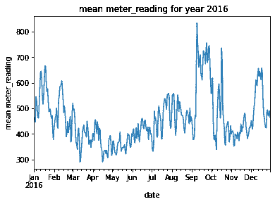

从上面的图中，我们看到从 9 月到 10 月，然后从 10 月到 11 月，平均仪表读数急剧增加。所以让我们找到它的原因。从之前的堆栈图分析中，我们看到 site_id 6 具有第二高的抄表数。所以我们需要进一步分析 site_id 6。发现 site_id 6(娱乐建筑编号 778)的平均仪表读数在整个平均仪表读数中占主导地位。所以也是离群值。它被移除了。现在总的平均仪表读数是:

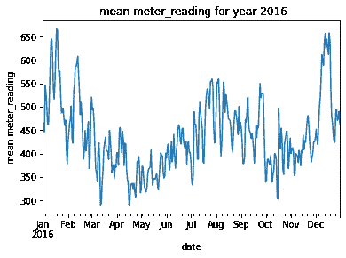

这是剔除异常值后的总平均仪表读数图。这是一条标准化曲线。它具有合理的平均仪表读数。

## 5.特征工程:

a)填充缺失值:

许多基于天气的要素缺少值，因此我们需要填充它们。用一个月中某一天的平均温度填充缺少的空气温度。每个月都是一个季节，一个季节里气温变化很大。所以用年平均值填充不是一个好主意。有些要素具有连续的 nan 值。因此，首先，我们计算平均云覆盖率、降水深度 1 小时、海平面气压和风向，然后用最后一次有效观测值填充剩余的缺失值。(用 method='ffill '选项填充。“ffill”代表“向前填充”并将向前传播最后一次有效观察)。我们使用基于时间的特征来填充 nan 值。使用基于时间的功能，如“日”、“月”。

b)向数据添加特征 **:**

基于时间的特征被添加到训练和测试数据中。基于时间的功能有:

1 .一个月中的某一天

2 .月份

3 .一天中的某个小时

4 .工作日

5 .年份

这些基于时间的特征是从数据集的时间戳特征中提取的。还增加了基于天气的滞后特征，提高了模型的准确性

还增加了气象特征相对湿度。

RH:= 100(EXP((17.625 TD)/(243.04+TD))/EXP((17.625 * T)/(243.04+T)))

其中 TD 是露点温度，T 是空气温度。

## 6.模型和超参数调整:

我已经对目标应用了 log1p 变换，因此在整个项目中，我将使用 RMSE(均方根误差)作为单一评估指标，即:

def rmse(y_true，y_pred):

返回 NP . sqrt(NP . mean(NP . square(y _ true—y _ pred)))

决策树回归模型

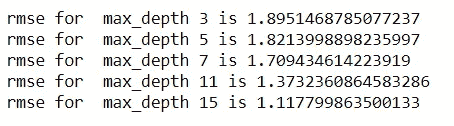

随机森林回归模型

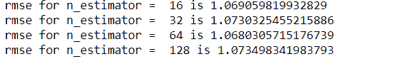

LIGHTGBM 回归模型:

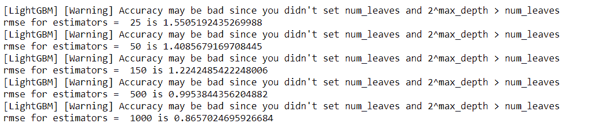

CATBOOST 回归模型:

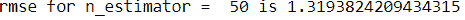

堆积 CV 回归器:

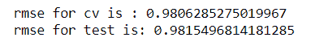

从以上模型得出的结论:

在这里，我们看到 Lightgbm 在所有测试数据的模型中给出了最小的 rmse。Lightgbm 也更快。与其他基于树的模型相比，决策树模型和随机森林模型给出了更高的 rmse。

## 7.参考资料:

【https://www.kaggle.com/isaienkov/lightgbm-fe-1-19 号

[https://www . ka ggle . com/cereniyim/save-the-energy-for-the-future-1-detailed-EDA](https://www.google.com/url?q=https://www.kaggle.com/cereniyim/save-the-energy-for-the-future-1-detailed-eda&sa=D&ust=1602591028573000&usg=AOvVaw2lTNxqK-KgRTALldKX0JsO)

[https://www.kaggle.com/aitude/ashrae-hyperparameter-tuning](https://www.google.com/url?q=https://www.kaggle.com/aitude/ashrae-hyperparameter-tuning&sa=D&ust=1602591028573000&usg=AOvVaw3DwFLrXZoyCBMe4UfZmUtc)

[https://www.appliedaicourse.com](https://www.google.com/url?q=https://www.appliedaicourse.com/&sa=D&ust=1602591028573000&usg=AOvVaw2QApUaT7w4qd0Gh090P6D3)

[https://www . ka ggle . com/jesucristo/starter-great-energy-predictor](https://www.google.com/url?q=https://www.kaggle.com/jesucristo/starter-great-energy-predictor&sa=D&ust=1602591028574000&usg=AOvVaw37ZVzrzwPfJcuo9k5uQN1i)

完整代码 Github 链接:[https://github . com/rash 938/ASHRAE-伟大-能量-预测-三](https://github.com/rash938/ASHRAE-GREAT-ENERGY-PREDICTION-III)

领英简介:[https://www.linkedin.com/feed/](https://www.google.com/url?q=https://www.linkedin.com/feed/&sa=D&ust=1602591028575000&usg=AOvVaw28RnFV7mh0CCSKKI5Vnj83)

*最初发表于*[*http://docs.google.com*](https://docs.google.com/document/d/e/2PACX-1vSLwOIQaDcH_KL1ebCnbhGXLEvv3uyIS2U2b7jwDe_0Eu-ejb387lqF_l0P-5SZ6XEmy8cuq4duB9RS/pub)*。*