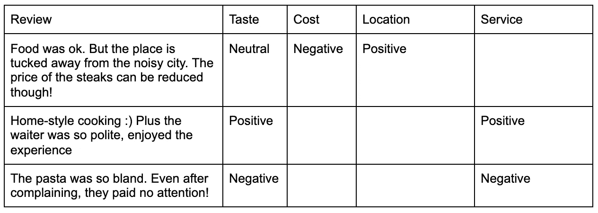
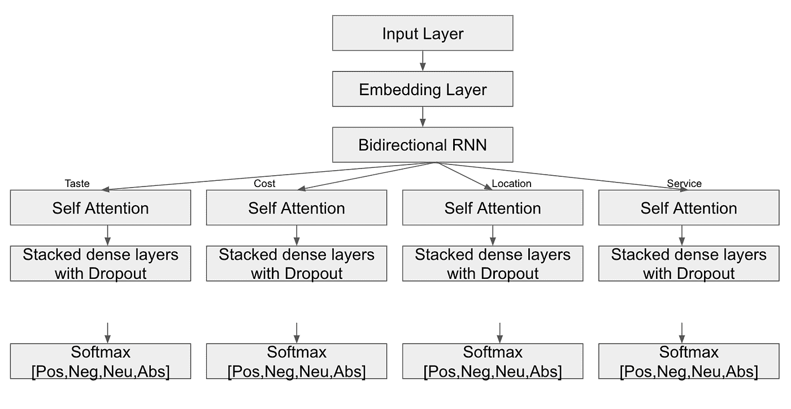

# 基于方面的情感分析

> 原文：<https://medium.com/analytics-vidhya/aspect-based-sentiment-analysis-5a78d4cba1b1?source=collection_archive---------8----------------------->

布莱克·维斯兹在 [Unsplash](https://unsplash.com?utm_source=medium&utm_medium=referral) 上的照片

# **简介**

我们生活在一个比以往任何时候都更加固执己见的世界。我们消费的任何服务都会让我们满意或不满意。随着社交媒体的出现，我们可以立刻公开我们的观点。大量的数据来源可以通过评论、客户满意度调查、客户投诉等形式获得。企业可以使用这些数据来了解客户在谈论什么，并做出数据驱动的决策来改善他们的服务。

现在就从机器学习方面来说吧！

情感分析是了解客户对服务满意度的过程。满意度通常分为三个等级(积极、消极或中性)。尽管类别的数量可以变化。当我们已经标记了数据时，我们可以使用大量的机器和深度学习分类模型。然而，如果标记的数据不可用，我们将不得不退回到基于词典的方法。还有很多方法可以在无监督的情况下进行情感分析，然而，这篇文章将只讨论有监督的方法。

> 这篇文章的 USP 是**基于方面的情感分析(ABSA)** 。这是最实用的情感分析形式，因为在现实生活数据中，客户谈论服务的多个方面，每个方面的情感可能不同。

只有一个人负责所有的桌子，所以我们不得不等了很长时间。但是食物非常好吃，而且物有所值！

在对一家餐馆的评论中，顾客谈论三个方面:等待时间、味道、物有所值。所以，整个复习只有一个感悟是没有意义的。使用基于方面的情感分析，我们可以更深入地了解客户满意度和餐厅的可行项目，即增加员工以减少等待时间。

# **创建数据**

对于 ABSA，我们可以根据数据集的领域来定义方面。对于餐馆评论，方面可以是味道、成本、位置、服务等。对于电子商务产品评论数据集，方面可以是交付、包装、产品质量、客户服务、价格等。

一旦我们决定了我们的方面，我们就可以得到一些针对每个方面的评论。数据看起来像这样:

请注意，有些单元格是空白的。这表明审查没有谈到这一方面。

# **清理正文**

任何 NLP 问题中最重要的一步是预处理文本。这可以包括:

*   用小写字体书写
*   删除非 ASCII 字符
*   删除标点符号
*   删除多余的行和空格
*   删除停用词
*   堵塞物
*   基本拼写纠正
*   俚语纠正
*   等等。

像 [nltk](https://pypi.org/project/nltk/) 和 [spacy](https://pypi.org/project/spacy/) 这样的 Python 包可以用于大多数步骤。对于拼写纠正，一种更简单的方法是使用拼写错误及其相应纠正的字典。预处理的另一个方面是处理表情符号和表情符号。对于任何其他 NLP 任务，表情符号可能是不必要的。然而，对于情感分析，它们起着至关重要的作用。python 中的[表情](https://pypi.org/project/emot/)包是一个很好的选择，可以检测、移除或替换带有保留令牌的表情符号/表情符号。

# **型号**

看着上面的数据，我们已经把我们的问题转化为一个多任务分类问题。每个方面指的是一个单独的任务，而这个任务又是一个四级分类。类别包括:中立、积极、消极和缺席，缺席表示该方面不在评审中。

模型架构看起来像这样:

用于基于方面的情感分析的模型架构

在该模型中，我首先通过嵌入层传递标记化的输入，然后是双向 LSTM。在这之后，我在我的模型中创建 4 个分支，每个方面一个。每一个分支都有一个自我关注层，它赋予描述给定方面的词更大的权重。你也可以尝试没有自我关注层。但我的实验表明，在每个方面以局部的方式使用注意力有助于模型学习每个方面的模式和语法。在这里，我用了一个简单的点产品注意。这可以改变成许多复杂的注意力方法(我将在我接下来的文章中介绍！)
然后，我们跟进 2–3 个完全连接的密集层。每个分支的输出使用跨 4 个类的 softmax 进行转换；积极、消极、中立和缺席。

虽然可以有更多的基于方面的情感分析模型，但我发现这种架构简单而有效。它不仅消除了对每个方面的多个模型的需要，而且还联合训练方面的存在/不存在及其情感。

# **结论**

情感分析是自然语言处理最广泛的应用之一。它利用了公共平台上大量存在的数据。并为企业提供有用的见解，帮助他们改善服务，从而提高客户满意度。基于方面的情感分析比传统的情感分析领先了一步。像 BERT 这样的模型已经被证明对情感分析非常有效。然而，实际应用告诉我，更简单的模型可以以更少的计算要求和训练时间提供相当好的性能。此外，当使用英语以外的语言时，很难找到好的预训练模型！

我是一个 NLP 爱好者，在这个行业工作了 6 年多。然而，我的博客之旅才刚刚开始。请为这个帖子鼓掌支持。未来的帖子将包括从 Bahdanau 到多头和自我关注的关注机制等主题；记号赋予者、语言模型、Seq2Seq 模型等等(希望这个列表是无穷无尽的……)

干杯！

Eram