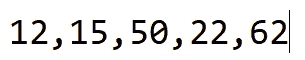
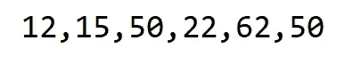
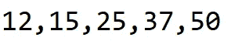
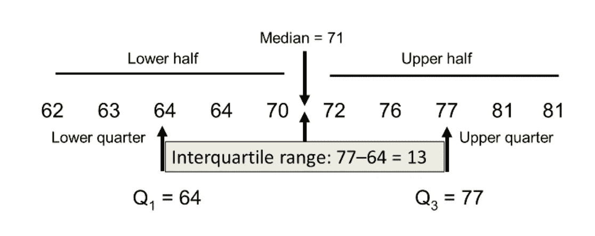
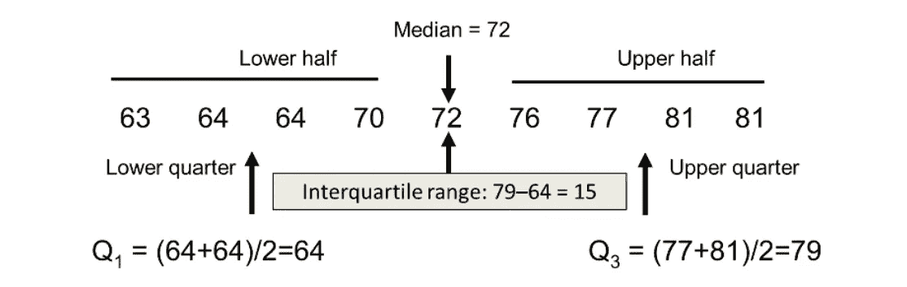
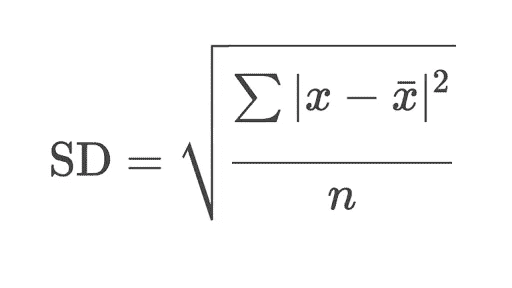
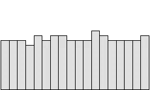
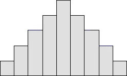
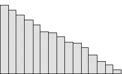

# 定量数据的各个方面

> 原文：<https://medium.com/analytics-vidhya/aspects-of-quantitative-data-cd0c78bfda61?source=collection_archive---------14----------------------->

来源(omniupdate.com)

# **定量数据:**

每当有一个所有的数字数据的集合，那么这种类型的数据被称为定量数据。这种类型的数据主要包含数字和值。这种方法用于回答基于“多少”、“什么”等的问题。通常以普查、表格等形式收集定量数据以进行统计分析。

这种类型的数据可以进一步分为两种类型:

1.  离散数据
2.  连续数据

关于离散和连续数据的更多细节，可以在这里阅读我之前的文章[。](/analytics-vidhya/descriptive-statistics-a-beginners-guide-d9ca0ac97f63)

所以现在我们来详细讨论一下这几个方面。

# **1。中心**

分布的中心也称为分布的中间。该中心有三项主要措施。他们是

**A .意思是**

平均值是指一组数值的平均值。求平均值的公式如下:

平均值=所有值的总和/值的数量

示例:

平均示例

这里，所有 5 个值的总和是 161，因此根据公式，该列表的平均值是 32.20

**B .中位数**

Median 表示给定元素列表的中间值。它将元素列表分为两个不同的部分。

如果列表中元素的数量是奇数，那么中值将是列表的中间元素。

中位数奇数示例

这个奇数列表的中值是 50，因为 50 是列表中的中间元素。

如果列表中元素的数量是偶数，那么中值将是两个中间元素的和。

中位数偶数示例

这个偶数列表的中位数是(50+22)/2 即 36。

**C .模式**

数据的模式被计算为列表中最常见的元素。很多时候，列表中所有的值都是唯一的。如果有多个值具有相同的频率，那么这样的数据被称为双峰。类似地，如果 n 个值具有相同的频率，则称为多峰。

示例:

模式示例。

这里，数据的众数是 50，因为值 50 重复了几次。

# **2。展开**

分布是指数据集的变化。用通俗的语言来说，人们可以说这些点彼此相距多远。传播有四个衡量标准。它们是:

**A .范围**

范围是最简单的统计方法。它可以被计算为数据的最后一个和第一个元素之间的差。

范围示例

这里，最后一个元素和第一个元素之间的差是 50–12 = 38，这是给定数据的范围。

**B .四分位数间距(IQR)**

IQR 是给定数据的第三个四分位数和第一个四分位数之间的差值。

IQR 的公式是:IQR = Q3-Q1

给定数据的中位数是数据分成两部分(即下半部分和上半部分)的点。

偶数样本量的 IQR 示例

此处，数据在中位数(即 71)的帮助下分为两部分。那么四分位数 1 取为下半部分的中位数 64，四分位数 3 取为上半部分的中位数 77。因此，第三个四分位数和第一个四分位数之间的差值是 77–64 = 13，这是给定数据的四分位数间距。

类似地

样本量为奇数的 IQR 示例

此处，数据在中位数(即 72)的帮助下分为两部分。中间值不包含在任何一半中。那么四分位数 1 取为下半部分的中位数 64，四分位数 3 取为上半部分的中位数 79。因此，第三个四分位数和第一个四分位数之间的差值是 79–64 = 15，这是给定数据的四分位数间距。

**C .标准偏差**

标准差是每个元素和平均值之间的平均距离的度量。每当标准差较低时，我们可以说数据点接近数据集的平均值，而标准差较高则表明元素的分布更广。

标准差的公式。

为了找到标准偏差，我们需要遵循以下步骤

首先:找出数据的平均值

第二:对于每个点，找出它到平均值的距离的平方。

第三:总结第二步的所有要点

第四:将总和除以值/记录的总数，然后取它的平方根。

示例:

标清示例

这里的平均值是 32.20，每个点到平均值的距离之和是 2012.8，再除以 5 得到 402.56，然后取它的平方根，我们将得到 20.06 作为标准偏差。

注:该公式仅适用于人口数据。如果你在计算样本数据，那么你需要取 n-1 而不是 n。

**D .方差**

方差是每个数量和平均值之间的平均距离的平方。即它是标准偏差的平方。

方差=(标准偏差)*(标准偏差)

从上面标准差的例子，我们可以说数据的方差是 20.06 * 20.06 = 402.56。

# **3。形状**

shape 属性有助于识别数据的实际分布或模式。现在，我们知道定量数据处理的是数字，所以为了分析趋势或了解定量数据的分布，我们通常使用直方图。

直方图一般有以下四种模式。

**A .制服**

统一直方图显示数据中存在一致性。被发现是均匀的数据可能是双峰的。在这种情况下，每个类的频率与其他类的频率几乎相同。

统一直方图(来源:pqsystems.com)

**B .对称**

对称直方图显示这些值以规则的频率出现。它通常被称为钟形曲线，因为它以类似的方式形成形状。它也被称为数据的正态分布。平均值和标准偏差是计算的首选。

这里均值=中位数=众数。

对称直方图(来源:pqsystems.com)

**陈少华右倾**

一般来说，当发现数据按降序排列时，就称为右偏直方图。这里，均值被拉高，中值和众数彼此更接近。右偏意味着尾部朝向数据的右侧。

这里，均值>中值>众数。

右偏直方图(来源:pqsystems.com)

**婷左斜**

一般来说，当发现数据按升序排序时，它就被称为左偏数据。在这里，平均值被拉向较低的一侧。左偏意味着数据的尾部朝向数据的左侧。

这里指的是< MEDIAN < MODE.

# **4。离群值**

离群值定义为远离数据集中其余值的数据点。通常，异常值对分析没有帮助。它们可以是极高的值，也可以是极低的值。为了检测异常值，通常使用散点图或箱线图。

检测和处理异常值的步骤如下。

A.首先，我们需要注意到数据中存在异常值。我们需要意识到异常值对汇总统计数据的影响。

B.如果有打字错误(错别字)，我们需要删除它们或修复它们。

C.人们需要理解他/她试图回答的关于数据的问题的影响。

D.当我们有异常值时，使用五个数总和比使用均值、标准差或方差更好。

E.报告时要小心，并且应该知道如何提出正确的问题。

感谢您阅读并投入您的时间。希望你学到了新的东西或者更新了旧的概念。如果你喜欢这篇让我有动力写更多的文章，请鼓掌。请与其他学员分享。谢谢，祝你平安快乐！