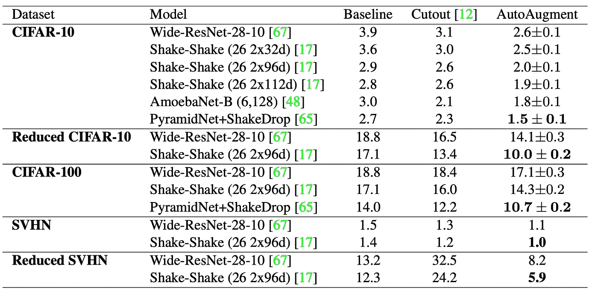
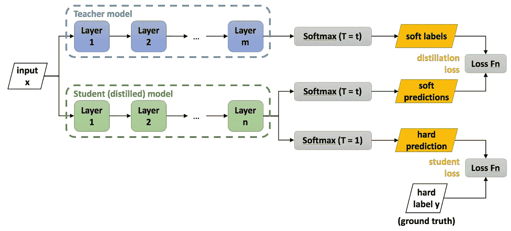

# Assemble-ResNet 比 EfficientNet B6 +自动增强快 5 倍，但精度相同

> 原文：<https://medium.com/analytics-vidhya/assemble-resnet-that-is-5-times-faster-with-the-same-accuracy-as-efficientnet-b6-autoaugment-c752f1835c38?source=collection_archive---------1----------------------->

# 关于这篇文章

他的帖子是对 2020 年 1 月 17 日发表的论文“在卷积神经网络中组合组装技术的性能改进[1]”的解释。本文提出的汇编资源网具有与 B6 +自动增强相同的精度，但速度快 5 倍。

本帖解释:
1。论文摘要
2。基线法、效率网和自动增强
3。汇编使用的技术-ResNet
4。结果

本文的主要内容如下。

> **构建网络，结合一些强大的现有技术，实现与 EfficientNet B6 + AutoAug 相同的准确性，但速度快 5 倍。作者说，这里没有使用 AugMix 等最新的，所以精度可能还有待提高。**

# 基线方法

在这一节中，我将解释 EfficientNet 和 AutoAugment，它们是 Assemble-ResNet 的基线比较。EfficientNet 是一个比 2019 年 5 月提出的现有网络更轻便、更精确的网络。AutoAugment 是一篇发表于 2018 年的论文，是一项自动搜索最佳数据增强的研究。两者都是强大的技术，经常作为图像识别的基线出现。

# 效率网

EfficientNet [2]是 2019 年 5 月 28 日提交的论文，比现有网络更快更准确。的摘要如下。

> **他们通过同时优化分辨率、深度和通道数量来构建高速、高精度的网络。通过在等式 3 中设置φ = 1，在 MnasNet (B0)的搜索空间中优化αβγ，然后改变φ并重复重新优化以构造 B1- > B**

同时搜索深度、模型宽度(CNN 频道数)和分辨率的最佳参数。通过设置三个约束参数α、β和γ找到最合适的网络。并在该范围内进行网格搜索。EfficientNet B0，B1 … B7 按照严格搜索约束的顺序。

# 自动增强

AutoAugment 是 2018 年 5 月 24 日提交的论文，讲的是通过强化学习寻找最佳的数据增强方法。作者优化了由五个子策略组成的数据扩充策略，从而减少了验证数据的丢失。

(左)自动增强流程(右)五个子策略的示例

以下是自动增强的结果。你可以看到自动增强是一个相当强大的方法。

# 关键见解和方法

assembly-ResNet 如此强大以至于能够击败 EfficientNet 的一点在于，它把现有的所有好的网络结构和正则化方法都放在了 ResNet 上。

作者使用 ResNet-D [4]、选择性内核[5]、抗混叠下采样[6]和大小网络[10]来改进 ImageNet 的网络架构。并使用正则化方法，标记平滑，混合[7]，丢弃块[8]，知识蒸馏[9]和自动增强[2]。

以下部分描述了用于 assembly-ResNet 的网络结构改进和正则化方法。

# 网络调整

## 网络微调 1。ResNet-D

ResNet-D 是在 CVPR2019 上提出的 ResNet 的改进架构[4]。它的结构如下图所示，是一种可以在不增加计算成本的情况下提高精度的方法。

## 网络调整 2。选择性内核

选择性核[5]的灵感来自于人类图像识别中感受野的大小因神经元而异的事实。原始选择性核方法将核大小为 3×3 的流、5×5 卷积的流与注意力相结合。在 Assemble-ResNet 中，考虑到速度和精度之间的平衡，作者考虑使用通道数量翻倍的 3x3 滤波器，而不是使用 5x5 内核。作为检查的结果，采用了表 2 中的 C3 结构。

## 网络调整 3。抗锯齿下采样

抗混叠下采样[6]是一种旨在为 CNN 提供移位不变量的方法。诸如 MaxPooling 之类的下采样方法在像素上不会变得移位不变。因此，CNN 的输出对位移并不鲁棒。在下采样过程中加入反走样处理(BlurPool)是一种具有平移不变性的方法。

## 网络调整 4。大大小小的网络

大小网络是一种有效处理多种分辨率图像的网络结构。下图显示了分辨率的分支数为 K = 2 的示例。下面的路线处理与输入分辨率相同的图像，上面的路线处理垂直和水平方向大小为一半的图像。在 Assemble-ResNet 中，除了普通的残差块之外，还增加了一条处理分辨率降低的图像的路径。

# 组装 ResNet 架构

使用上述技术的网络如下所示。它被配置为将上述技术添加到正常的 ResNet-50。

# 正规化

## 正规化 1。标签平滑

标签平滑是一种使用像[0.1，0.9]这样的软标签而不是像[0.0，1.0]这样的热标签(硬标签)的方法。根据这项研究[11]，标签平滑具有协调每个类别的分布的效果，并且在减少对数据的过度拟合方面也是有效的(对于一个热标签，即使 softmax 值为 0.99，也会发生惩罚)。

## 正规化 2。混合

MIXUP [7]是一种混合输入和输出的数据扩充方法。从β分布中取样混合比，并混合两个数据的输入和输出。据说，在每个类的聚类之间创建插值数据，使得潜在空间被平滑。

## 正规化 3。下落滑车

DropBlock [8]是 CNN 的丢弃方法。在正常掉线的情况下，图像会出现下图 b 所示的丢失，但与被掉线像素相邻的像素往往不会掉线，所以图像的正则化会比较弱。因此，DropBlock 通过丢弃二维空间中彼此相邻的像素来增强正则化效果。

## 正规化 4。知识蒸馏

知识蒸馏是一种将大量高精度网络知识转移到小型轻量级网络的技术。蒸馏源的大网络称为教师模型，蒸馏目的地的小网络称为学生模型。不仅使用与正常教师标签(硬标签)的交叉熵，而且使用教师模型的输出(软标签)来训练学生模型。众所周知，使用这种方法，轻量级学生模型可以获得更高的精度，接近高精度教师模型的精度，而不是仅使用学生模型和标记数据进行学习。

(Ref:[https://nerv anasystems . github . io/distiller/knowledge _ distillation . html](https://nervanasystems.github.io/distiller/knowledge_distillation.html))

# 结果

使用上述技术的 Assemble-ResNet 的结果如下。Assemble-ResNet-152 的精度与 efficient net B6+auto augment top-1 精度相当，但推理速度快 5 倍。mCE 是模型预测对噪声的稳健程度的度量。它是使用 ImageNet 上带有噪声的数据集来测量的。

另外，你可以看到每一种介绍的方法都是有效的。即使没有自动增强，准确性也可与 EfficientNetB3 +自动增强相媲美，推理速度快 3 倍以上。

# 结论

在这篇文章中，我解释了高精度和高速汇编-ResNet。由于使用了知识提炼和自动增强，这些精度不能通过仅使用这种网络结构的一次训练来实现。但你可以看到，通过以这种方式结合现有的有效方法，即使在现实世界的任务中，也有可能实现高精度的模型。

## 推特，我贴一句纸评论。

 [## 阿基拉

### akira 的最新推文(@AkiraTOSEI)。机器学习工程师/数据科学家/物理学硕士/…

twitter.com](https://twitter.com/AkiraTOSEI) 

# 参考

1.  李荣奎，泰伦元，基奥洪。卷积神经网络组合技术的性能改进， *arXiv:2001.06268*
2.  谭明星诉乐。反思卷积神经网络的模型缩放。 *arXiv:1905.11946*
3.  Ekin D. Cubuk，Barret Zoph，Dandelion Mane，Vijay Vasudevan，Quoc V. Le。自动增强:从数据中学习增强策略。 *arXiv:1805.09501*
4.  佟鹤年，，张航，，军，。卷积神经网络用于图像分类的技巧包。在 2019 年 IEEE 计算机视觉和模式识别会议论文集第 558–567 页
5.  李翔、王文海、胡小林和杨坚。选择性核网络。 *arXiv:1903.06586* ( 2019)
6.  张曦轲。让卷积网络再次保持平移不变，ICML2019
7.  张弘毅，混合:超越经验风险最小化，arXiv:1710.09412 (2017)
8.  高尔纳兹·吉亚西、宗-林逸和郭伏·勒。Dropblock:卷积网络的正则化方法。在*神经信息处理系统进展*，10727–10737 页，2018
9.  杰弗里·辛顿、奥里奥尔·维尼亚尔斯和杰夫·迪恩。从神经网络中提取知识。 *arXiv 预印本 arXiv:1503.02531* ，2015 年。
10.  春-陈辅、范全福、尼尔·马利纳、汤姆·塞尔库和罗杰奥·费里斯。大-小网络:视觉和语音识别的有效多尺度特征表示。 *arXiv 预印本 arXiv:1807.03848* ，2018
11.  拉斐尔·米勒，西蒙·科恩布鲁斯，杰弗里·辛顿。标注平滑何时有帮助？。NeurIPS 2019(2019)