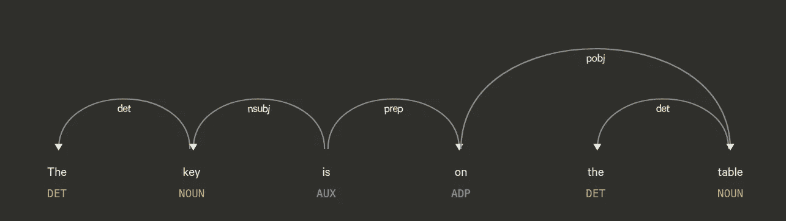
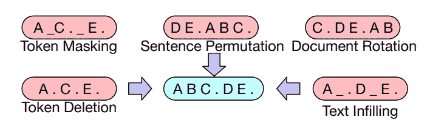
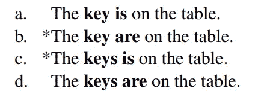
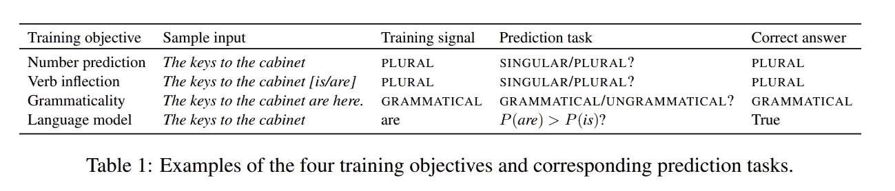
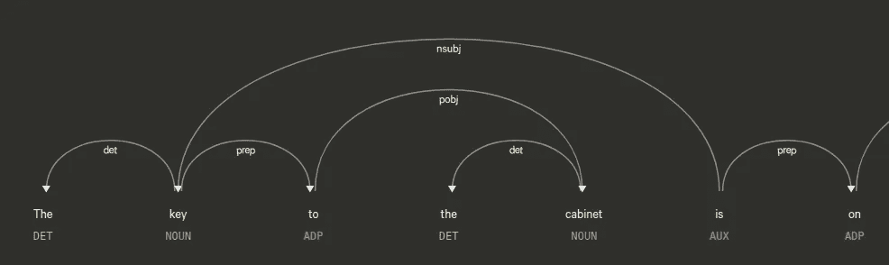
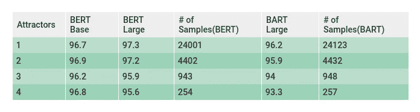
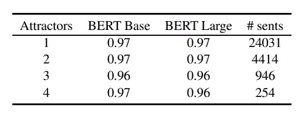
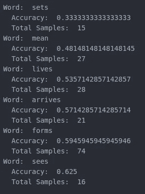
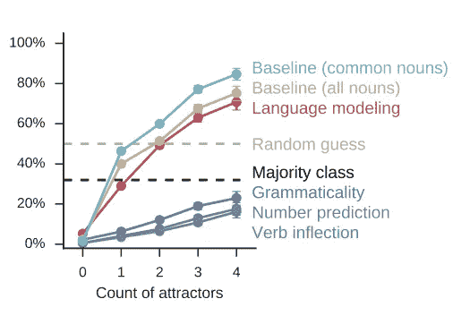

# 评估 BART(和 BERT)的句法能力第 1 部分

> 原文：<https://medium.com/analytics-vidhya/assesing-barts-syntactic-abilities-and-bert-s-part-1-cbf0983f6ea4?source=collection_archive---------19----------------------->

**TLDR**；

在主谓一致分析中，当出现越来越多的一致吸引子时，BART 的句法能力似乎比 BERT 下降得更快。

# 介绍

在本文结束时，您应该已经完成了以下工作

1.  窥视巴特激动人心的世界。
2.  理解如何对主谓一致进行定量分析。
3.  比较和分析了 BART 与 BERT 的性能
4.  访问代码，自己玩玩，在不同的拥抱脸模型上执行这些分析。

# 巴特是什么？

> **一种用于预处理序列间模型的去噪自动编码器。**

是《T4》的作者 BART @ FAIR 对它的定义。如果你正在阅读这篇文章，你已经了解什么是**序列到序列**模型。 [Dominic Monn](https://medium.com/u/677f03e54270?source=post_page-----cbf0983f6ea4--------------------------------) 快速解释了什么是**去噪自动编码器**这里的[是](https://towardsdatascience.com/denoising-autoencoders-explained-dbb82467fc2)。

为了保持本文简洁，我们将只查看 BART 的预训练目标。BERT 使用了一个掩码 LM(令牌掩码)来训练编码器，其中大约 15%的令牌被掩码。BART 更进一步，应用了一系列噪声技术。

BART 中输入文本转换的类型

当与 BERT 及其不同预训练目标的变体进行比较时，文本填充方法在诸如 SQuAD 1.1 和 CNN/DM 的任务中优于其他方法。这种比较成立，因为它们是在类似的架构和培训周期中进行的。

# 评估句法能力

自从 rnn 和 LSTMs 大量涌现以来，研究者们一直试图评估模型的句法能力。随着不同的模型服从不同的训练目标，理解模型理解语法的程度变得越来越困难。

在本文中，我们将触及主谓一致的细微差别，并对其进行定量分析。

**什么是主谓一致？**

以这四个句子为例。

https://arxiv.org/pdf/1611.01368.pd 福

主题是“钥匙/钥匙”。动词是“是/是”。 **a** 和 **d** 正确。有效主语动词一致的一般定义是

> **“单数主语(*她，比尔，汽车*)带单数动词(*是，去，闪耀*)，而复数主语带复数动词。”详细解释** [**此处**](https://www.grammarbook.com/grammar/subjectVerbAgree.asp)

Linzen、Goldberg 和 Dupoux 已经[广泛地研究了一种方法来评估 LSTMS 和其他模型的这种特殊的句法能力。](https://arxiv.org/pdf/1611.01368.pdf)

**原始论文的目标(2016)是**:在动词出现之前，模型预测动词是单数还是复数的效果如何。通过将“关键”输入到模型中，它能预测跟随它的动词是复数还是单数吗？它不关心动词本身，而只关心二元预测。这项任务被称为“数字预测”，有不同的变体，如“动词变形”、“语法性”，其中最适合这个讨论的是“语言模型”

https://arxiv.org/pdf/1611.01368.pd[f](https://arxiv.org/pdf/1611.01368.pdf)

**LMs 的目标**:

1.  感兴趣的动词被屏蔽并输入到编码器。
2.  计算屏蔽位置的输出字的 softmax。
3.  检查动词的两种形式(单数和复数)的 softmax 分数。较大的一个是模型在屏蔽位置中发现更有可能的一个。
4.  **如果动词的正确形式得到较高的分数，如上表所示，如果 P(are) > P(is)则预测是正确的。**

本文中的大部分探索都是基于大约 3 年后由 Goldberg [在这里](https://arxiv.org/pdf/1901.05287.pdf)完成的语言模型扩展。该分析将测试查询分为 4 类。1、2、3 和 4 主语和动词之间的一致吸引子。

# 什么是协议吸引子？

在前面的简单例子中——“钥匙在桌子上”。动词“is”紧跟在主语“key”之后。他们俩之间没有言语。然而，一般的英语句子并不总是这么乐观。你可能会在主语和动词之间遇到多个单词、名词、代词等。

> 柜子的钥匙在桌子上。

1.  目标动词:是
2.  主题:关键字
3.  协议吸引人:内阁(名词)

“cabinet”是一个出现在目标动词和它的主语之间的名词，可能会误导模型选择动词的复数或单数形式。在这种情况下，协议吸引子“cabinet”变成了单数形式。即使模型已经错误地学会将动词“is”与“cabinet”相关联，预测也不会改变，因为 cabinet 和 key 都是单数。如果输入句子被修改为以下内容(机柜已更改为机柜)

> 橱柜的钥匙在桌子上。

在这种情况下，如果模型没有很好地理解句子的语法和依存结构，它可能会预测答案为“橱柜的钥匙在桌子上”，这在语法上是不正确的。

当我们讨论依赖结构的时候，你可以看到“is”是如何与单词“key”相关联的。

用 SpaCy 生成的依赖关系解析树。

该树是使用语言规则生成的，模型的句法分析的总体目标是尝试并理解深度学习模型是否能够捕捉这种依赖性作为其网络参数的一部分。主语和动词的一致是许多此类分析中的一种。

既然你已经理解了什么是一致吸引子，那么动词和主语之间可能出现的这种潜在候选者的数量就是一致吸引子的程度。一致吸引子的数量越多，模型预测动词的复数就越复杂。

在他对 BERT 中句法的分析中，goldberg 考虑了 1、2、3 和 4 度的一致吸引子。我们将同样扩展到 BART，并尝试将其性能与 BERT 进行比较。我们将首先看到结果，然后看看代码。

# BERT vs BART 句法分析

我们比较了 3 种模型。

1.  **伯特基地脱壳**
2.  **伯特大号未装箱**
3.  **巴特大**

巴特对伯特的表现。

该数据集包含总共 29，985 个句子，其中 1 个吸引子包含约 24200 个句子，4 个吸引子包含约 270 个句子。尽管 BART 和 BERT 的评估是在同一数据集上进行的，但样本数量略有不同。在计算准确性度量时，并没有考虑大约 29，000 个句子中的每一个句子。

测试 BERT 和 BART 的样本数量不同，因为 BERT 和 BART 的词汇不同。自从巴特和伯特使用 BPE(字节对编码)以来，一些动词被记号赋予器分解了。这使得屏蔽词的预测不可能与输入词整体匹配。例如，单词“locates”被 BART 分解为“loc”和“ates”。BART 的 tokenizer 遗漏了数据集中的大约 180 个样本，BERT 的遗漏了 330 个样本。

goldberg 返回的原始结果是，这或多或少是我用 BERT 和 BART 的批处理方法得到的。

根据[戈德堡](https://arxiv.org/pdf/1901.05287.pdf)的报告，伯特基数与大基数之比

注意:我使用了拥抱脸的最新版本的 BERT，在 Goldberg 进行实验的数据集中有几个样本的动词的两个屈折相同(例如，lie 和 lie 而不是 lie 和 lies)，可能是一个打字错误。我在实验中忽略了这些情况。

1.  BERT-base 无壳:12 层，768 隐藏，12 头，110M 参数
2.  BERT-大型无外壳:24 层，1024 隐藏，16 头，340M 参数
3.  BART-large: [400M](https://github.com/pytorch/fairseq/tree/master/examples/bart) 参数，BART 包含的参数比同等大小的 BERT 模型多大约 10%

# 分析

BART 模型的预测精度与 BERT 相当，但随着吸引子数量的增加而下降。对 BART 失败的动词也有了更详细的理解。

在 colab 中，人们还可以找到这个特定动词无法映射到正确数字的句子。这将有望允许对准确性非常低的单词进行更精细的研究，例如上面的那些单词。

# 代码和实验

谷歌 colab 笔记本可以在[这里](https://colab.research.google.com/drive/1Ce8Cy6U7tsuhpRbH6uAoIEdczB6uhJ5e)找到，github 回购[这里](https://github.com/naveenjafer/bart-bert-syntactic-analysis)找到。

# 整理思绪。

仅在 4 年前，当涉及到在多个吸引子存在的情况下主语动词一致的任务时，语言模型与 LSTMs 相比表现糟糕。由 Linzen、Duopox 和 Goldberg 构建的用于分析这些结果的 LM 在存在吸引子的情况下比随机猜测表现得更差。即使是拥有大约 12 亿参数的 SOTA[LMs](https://research.google/pubs/pub45446/)中的一个，也没有帮助提高语言模型的句法能力，没有明确的训练目标来预测动词的数量。

[https://arxiv.org/pdf/1611.01368.pdf](https://arxiv.org/pdf/1611.01368.pdf)

以“语法性”、“数字预测”和“动词变化”为目标训练的 LSTMs 仅在 4 年前胜过 LMs。

在过去的 4 年里，这一领域取得了巨大的发展和进步。

# 前进

这一部分总结了作为句法分析手段的主谓一致分析。在第二部分中，我们有来自马文和林曾作品的分析方法。

同时，可以通过 HuggingFace 随意扩展这个代码，在其他 Trasnformer 模型上运行类似的分析。你可能需要对面具和其他特定职业的细微差别进行细微的调整。玩得开心。

# 参考

1.  [评估伯特的句法能力](https://arxiv.org/pdf/1901.05287.pdf)
2.  [评估 LSTMs 学习语法敏感依赖性的能力](https://arxiv.org/pdf/1611.01368.pdf)
3.  [巴特](https://arxiv.org/pdf/1910.13461.pdf)
4.  [抱脸巴特](https://huggingface.co/transformers/model_doc/bart.html)文档
5.  [主语动词一致](https://www.grammarbook.com/grammar/subjectVerbAgree.asp)