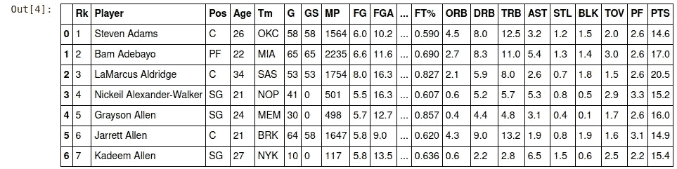
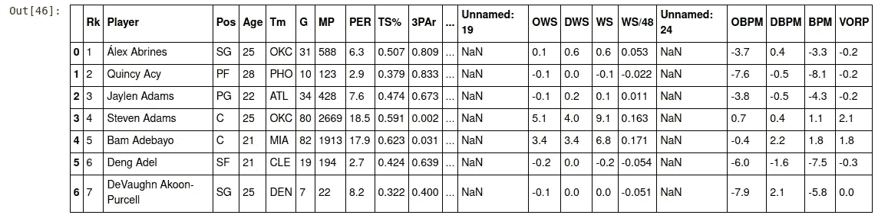
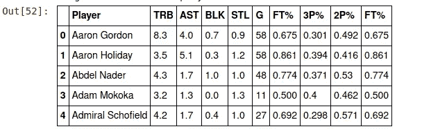
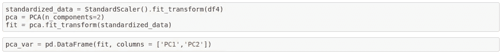
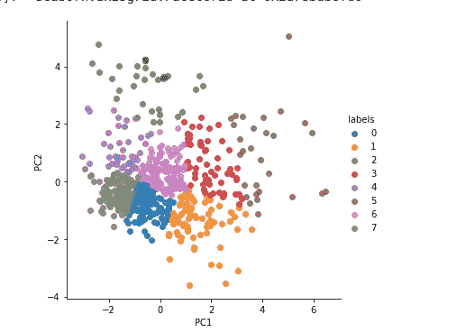
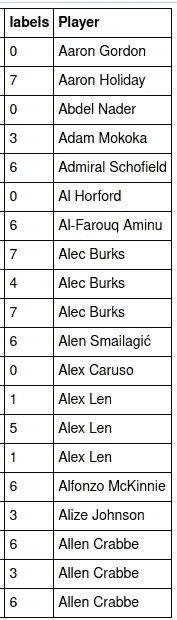

# 使用 K-均值聚类评估相似性

> 原文：<https://medium.com/analytics-vidhya/assessing-similarity-using-k-means-clustering-f035a875ca5f?source=collection_archive---------8----------------------->

我们大多数人总是倾向于寻找事物或人之间的相似之处。例如，我们发现演员、玩家等之间的相似之处。但是如果算法为我们做了，我们就不需要自己做事情了。其中一个 ML 算法可以帮助我们解决这个问题。

Kmeans 聚类是机器学习中一种简单而常用的无监督学习算法。在本文中，我将尝试使用 Kmeans 聚类算法来处理评估相似性的过程。

**聚类**是一种常用的数据分析技术，用于发现数据的结构并从中跟踪结果。它可以被定义为将数据分类到组中，并在数据点相似的情况下找到其中的子组。这种方法被认为是无监督学习，因为这里我们没有标签来比较我们得到的输出和评估性能。聚类将数据点分组并研究其结构。Kmeans 被认为是最常用的聚类算法之一。

Kmeans 算法是一种迭代算法，它使用聚类技术将数据集划分为 k 个聚类，每个聚类有一个质心，并使用距离度量(如欧几里德距离、汉明距离等)来查找数据点和质心之间的距离。，并迭代地进行聚类过程。

这最终基于数据的特征将相似的数据点分组到聚类中。我已经使用 NBA 球员的统计数据来使用这些方法，并根据各种特征找到球员之间的相似之处。

我们使用 NBA 常规赛的球员数据，并结合来自网站[篮球参考](https://www.basketball-reference.com/)的两个数据集。来自 Basketball-reference 的第一个数据集由传统的 NBA 统计数据(得分、篮板等)组成。

来自第一个数据集的样本数据

第二个是 NBA 球员的高级统计数据。

来自高级统计数据的示例数据

# 数据清理和预处理:

最初，通过删除空行或空列来删除空值。否则，更好的方法是用一些聚合值填充空数据。例如，将第一个数据集的 2p%、3p%列中的空值填充为 0，因为它无法聚合。在移除空值之后，合并两个数据集，并从中过滤出必要的列到数据框中，以供我们的算法处理。过滤掉本质特征是数据处理的一个重要部分，它对我们算法的结果有很大的影响。

我使用的所有处理的结果数据集是，

合并数据集中的样本数据

在传递到算法之前删除 player 列，因为稍后将通过索引访问它。

# 数据分析

在预处理之后，我们在数据集上应用标准标量来执行数据归一化。

然后我们对数据进行主成分分析。主成分分析是一种用于*特征提取*的技术——因此它以特定的方式组合我们的输入变量，然后我们可以丢弃“最不重要”的变量，同时仍然保留所有变量中最有价值的部分。*作为一个额外的好处，PCA 之后的每个“新”变量都是相互独立的*

现在我们进入 PCA 之后的数据的 K-均值聚类。我在算法中采用了 8 个集群，即 k=8。这找到了相似的数据点，并将其分组为 8 个类别，这些类别可以可视化如下:

应用 kmeans 后的集群可视化

我们可以看到，它将数据分成了 8 个簇，用不同的颜色表示。每个集群都有一个标签，通过它我们可以评估相似的玩家。

现在，将聚类标签与玩家的数据集反规格化并合并。结果看起来像是，

带有相应集群标签的玩家名称

这里，对应于玩家名字的标签表示他们之间的相似性，并且可以相应地分类。

此外，我还用 Kollywood 艺术家数据集进行了试验，根据评分、发行数量、类型等特征绘制艺术家的相似性。

我建议你寻找有趣的数据集，并在其中尝试，享受结果。