# 评估机器学习的性能(错误的类型和来源)

> 原文：<https://medium.com/analytics-vidhya/assessing-the-performance-types-and-sources-of-error-in-machine-learning-e5d28b71da6b?source=collection_archive---------5----------------------->

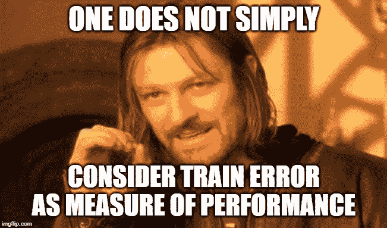

# **列车错误**

训练误差被定义为在训练过程中发生的平均损失。它由下式给出:

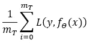

这里，m_t 是训练集的大小，损失函数是实际输出和预测输出之差的平方。上面的等式可以写成:

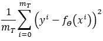

我们可以取上式的根来计算均方根误差(RMSE)。应该注意的是，与测试误差相比，训练误差将是低的。

# **列车误差对模型复杂度**

随着模型复杂度的增加，训练误差不断减小。这里，复杂性可以定义为模型中涉及的不同或复杂(x^power)输入特征的数量。该关系可以绘制为:

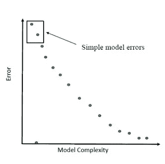

简单模型预计具有较高的训练误差，这可以借助于下面的示例来解释，在该示例中，一个温度特征用于进行预测。

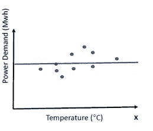

从上图可以明显看出，恒定线根本不是一个很好的拟合。并且，随着我们在上面的例子中增加模型的复杂性，获得了下面的模型。

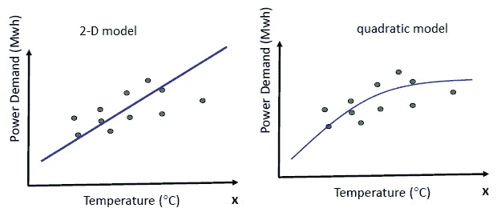

如果我们继续增加模型的复杂性，最终，我们会得到下面的模型:

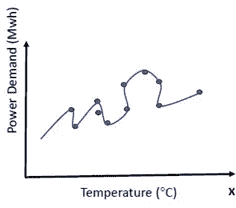

这个模型可能看起来很好，因为它几乎没有训练错误，但是，这个模型在测试集上会非常失败，因为它缺乏通用性。

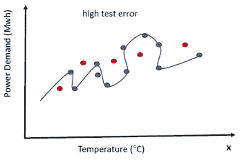

因此，单独的训练误差是对性能的过度乐观的度量，我们需要考虑泛化和测试误差来评估模型。

# **泛化错误**

泛化是在一个独立的测试集中测量的。一般化误差对模型复杂性可以绘制如下:

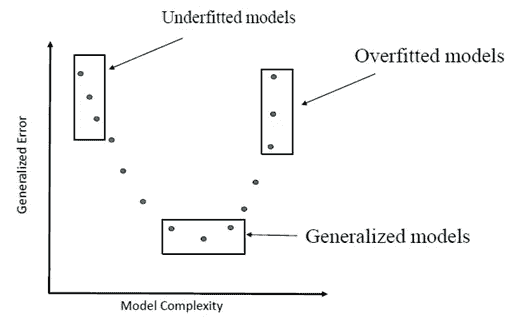

# **过拟合**

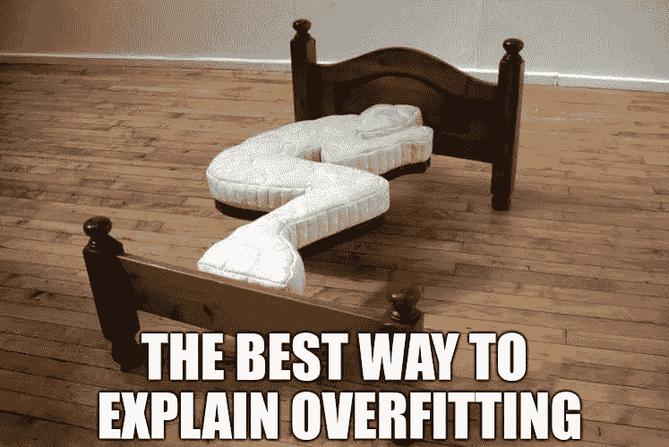

过度拟合是指模型对训练数据建模得太好。这意味着，即使是训练数据中的噪声或随机波动也会被模型学习到，这会对其在新的看不见的数据上的性能产生不利影响。另一个需要考虑的要点是回归的大系数(θ),这通常与过度拟合有关。因此，总成本可以定义为:

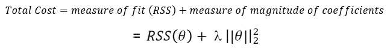

这里，θ是回归公式的系数， **λ** 是决定θ对总成本的大小或影响的正则化系数。

# **欠配合**

欠拟合指的是既不能对训练数据建模也不能推广到新数据的模型。欠拟合很容易发现，因为它会导致较差的训练误差。

# **良好拟合/通用模型**

一个好的合身模型是在合身不足和合身过度之间的一个甜蜜点。这种模式是我们的目标。

# **测试错误**

测试误差通过取测试组中出现的损失的平均值来计算，由下式给出:

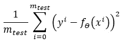

测试误差随着模型复杂性的增加而减小，直到某一点，然后开始增加:

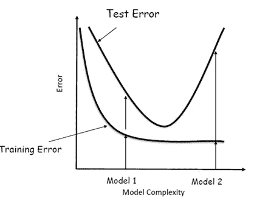

在上图中，如果我们比较模型 1 和模型 2，那么模型 1 肯定更好，因为与模型 1 相比，模型 2 的测试误差非常高。

# **误差来源**

模型中有三个误差来源:

1.  噪音
2.  偏见
3.  差异

# **噪音**

噪声继承自噪声数据，这是一个不可减少的误差。例如，在估计电力需求时，噪声可能是由于个人社交活动或聚会导致的电力需求突然上升而产生的。

# **偏置**

对于特定的模型，偏差定义为平均拟合和真实函数之间的差异。平均拟合是通过在不同数据集上训练模型并取所有拟合线的平均值来获得的。换句话说，偏差可以定义为模型捕捉数据的能力。更多的是特征的数量；模型将更好地捕捉数据，这将导致平均拟合和真实函数之间的低差异。所以复杂程度越高；偏差越低。所以，我们可以控制偏差。

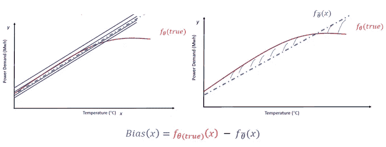

# **差异**

这是对特定拟合与预期拟合的差异程度的度量。相对于通过对不同数据集进行训练而获得的不同模型来计算方差。因此，复杂模型将具有更高的方差，因为预测将对数据集的类型敏感，因为更复杂的模型将总是试图完全适合给定数据集的所有数据点。

# **偏差-方差权衡**

应该注意的是，虽然我们可以控制偏差或方差，但我们不能计算它们，因为它们是相对于真实函数定义的。

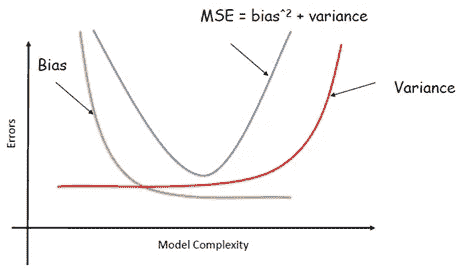

我们试图在方差和偏差之间选择最佳平衡点来选择最佳模型。因此，我们可以总结为，对于模型选择，我们需要选择控制模型复杂性的调整参数(例如，多项式的次数或特征的数量)。此外，模型评估是在选择模型并评估测试或泛化误差之后进行的。希望这篇博文能帮助你理解机器学习模型性能评估的基础。

# 参考

 [## 机器学习算法的过拟合和欠拟合

### 机器学习性能不佳的原因是数据过拟合或欠拟合。在这篇文章中，你…

machinelearningmastery.com](https://machinelearningmastery.com/overfitting-and-underfitting-with-machine-learning-algorithms/) 

内容:对西方大学阿卜杜拉·米沙博士提供的机器学习课程笔记的自我解读。

图片:[https://twitter.com/silo_ai/status/1000254359148613632](https://twitter.com/silo_ai/status/1000254359148613632)

图片:[https://imgflip.com/i/3ops8r](https://imgflip.com/i/3ops8r)