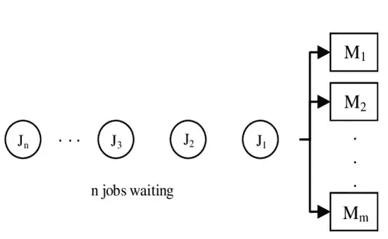
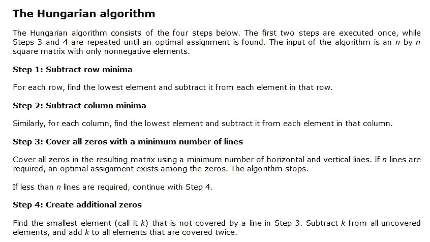
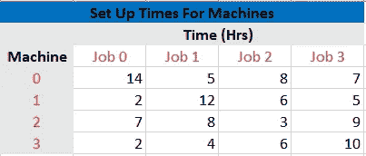
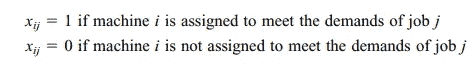
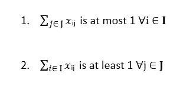
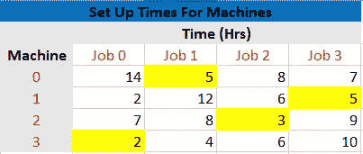

# 使用 PYTHON 解决指派问题(运筹学)

> 原文：<https://medium.com/analytics-vidhya/assignment-problem-in-operations-research-using-python-3fa48ac2d342?source=collection_archive---------1----------------------->



# 背景

指派问题是基于以下假设的特殊类型的线性规划问题:

1.  它的目标是用一定的资源(人或机器)完成一定数量的任务，使相关的成本或时间最小化。
2.  一个资源只能分配一个作业。

从数学上讲，这个问题是用匈牙利方法解决的，解释如下:



然而，为增加数量的工作和/或资源解决这个任务需要计算技术。

本文旨在使用 Python 的 Gurobi 包解决一个赋值问题。

# 问题陈述

Machineco 有四台机器和四项工作要完成。每台机器必须被分配完成一项工作。下表显示了设置每台机器以完成每项工作所需的时间。Machineco 希望最大限度地减少完成四项工作所需的总准备时间。



# 导入 GUROBI 包

```
from gurobipy import *
```

# 设置

4 台机器和 4 个作业是从所提出的问题中识别出的集合。

```
# Defining Sets
machines = ["M0","M1","M2", "M3"]
jobs= ["J0", "J1", "J2", "J3"]

I = range(len(machines))
J = range(len(jobs))
```

# 数据

问题矩阵为我们提供了完成工作所需的每台机器的准备时间值。

```
#Data
Set_up_time = [
    [14,5,8,7],
    [2,12,6,5],
    [7,8,3,9],
    [2,4,6,10]
]
```

# 定义模型

```
#Model
m= Model("Assignment Model")
```

# 定义变量

xij 定义了应该将哪台机器分配给每个作业，以便:



```
#Defining the Variable
X = {}
for i in I:
    for j in J:
       X[i,j] = m.addVar(vtype= GRB.BINARY)
```

# 目标函数

目标是最小化完成四个任务所需的总准备时间。

```
#Objective Function
m.setObjective(quicksum(Set_up_time[i][j]*X[i,j] for i in I for j in J), GRB.MINIMIZE)
```

# 限制

需要满足两个约束条件:

1.  每台机器最多执行一个作业，方法是强制(对于每台机器)所有作业的 X(i，j)之和最多为 1。
2.  每项工作都要通过强制所有机器的 X(i，j)之和至少为 1 来完成。

这些可以写成:



计算这些约束条件如下:

```
#Constraint-1
for i in I:
     m.addConstr(quicksum(X[i,j] for j in J) <= 1)#Constraint-2
for j in J:
    m.addConstr(quicksum(X[i,j] for i in I) >= 1)
```

# 优化准备时间

```
m.optimize()
print("Optimized Set up Time",m.objVal, "hours")Gurobi Optimizer version 9.0.1 build v9.0.1rc0 (win64)
Optimize a model with 8 rows, 16 columns and 32 nonzeros
Model fingerprint: 0xee439cf7
Variable types: 0 continuous, 16 integer (0 binary)
Coefficient statistics:
  Matrix range     [1e+00, 1e+00]
  Objective range  [2e+00, 1e+01]
  Bounds range     [0e+00, 0e+00]
  RHS range        [1e+00, 1e+00]
Presolved: 8 rows, 16 columns, 32 nonzeros

Continuing optimization...

Explored 0 nodes (6 simplex iterations) in 0.01 seconds
Thread count was 8 (of 8 available processors)

Solution count 2: 15 28 

Optimal solution found (tolerance 1.00e-04)
Best objective 1.500000000000e+01, best bound 1.500000000000e+01, gap 0.0000%
Optimized Set up Time 15.0 hours
```

# 灵敏度分析

基于初始假设和下面的输出，15 小时的最佳分配可以通过分配:

1.  机器 0 到作业 1
2.  机器 1 至工单 3
3.  机器 2 至工单 2
4.  机器 3 至工单 0

```
for i in I:
    print("-"*30)
    print("Machine:",i)
    print("-"*30)   
    for j in J:
        print("   Jobs",j,X[i,j].x)------------------------------
Machine: 0
------------------------------
   Jobs 0 -0.0
   Jobs 1 1.0
   Jobs 2 -0.0
   Jobs 3 -0.0
------------------------------
Machine: 1
------------------------------
   Jobs 0 0.0
   Jobs 1 -0.0
   Jobs 2 -0.0
   Jobs 3 1.0
------------------------------
Machine: 2
------------------------------
   Jobs 0 -0.0
   Jobs 1 -0.0
   Jobs 2 1.0
   Jobs 3 -0.0
------------------------------
Machine: 3
------------------------------
   Jobs 0 1.0
   Jobs 1 0.0
   Jobs 2 -0.0
   Jobs 3 -0.0
```

# 验证结果

根据上面建议的任务，机器的准备时间在下表中突出显示。

从表格结果来看，

最佳设置时间= 5 + 5 + 3 + 2 = 15，这是计算出的最佳设置时间值，因此确认了最佳结果

