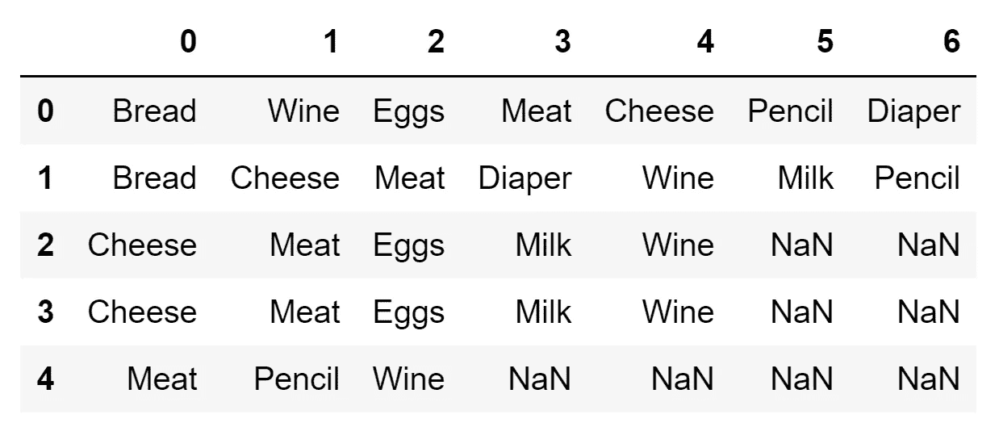
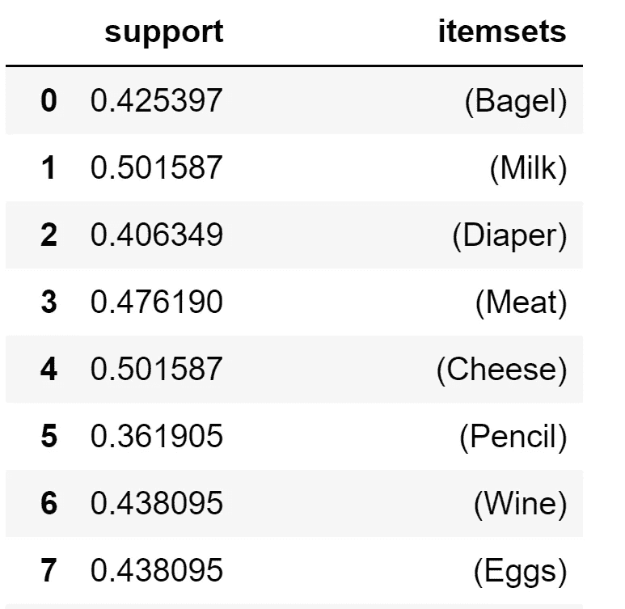
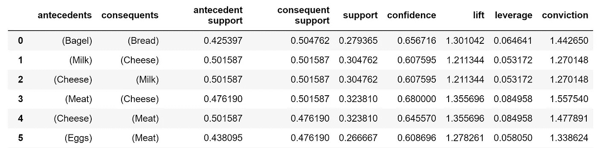
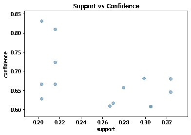
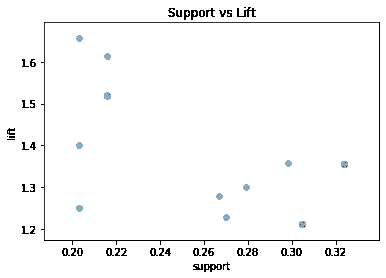
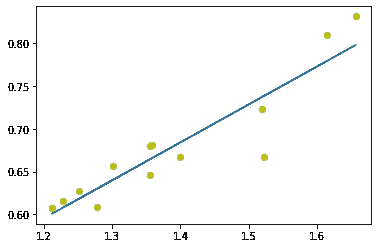

# Python 中的关联分析

> 原文：<https://medium.com/analytics-vidhya/association-analysis-in-python-2b955d0180c?source=collection_archive---------0----------------------->

## Python 中基于 Apriori 算法的频繁项集挖掘

这个文档是为那些对先验知识及其工作原理有所了解的人编写的。

直接从维基百科更新先验知识:

> ***先验*** *是一种* [*算法*](https://en.wikipedia.org/wiki/Algorithm) *用于频繁项集挖掘和* [*关联规则学习*](https://en.wikipedia.org/wiki/Association_rule_learning) *超过关系数据库*[](https://en.wikipedia.org/wiki/Databases)**。它通过识别数据库中频繁出现的单个项目，并将其扩展到越来越大的项目集，只要这些项目集在数据库中出现得足够频繁。由先验确定的频繁项集可以用来确定* [*关联规则*](https://en.wikipedia.org/wiki/Association_rules) *，这些关联规则突出了* [*数据库*](https://en.wikipedia.org/wiki/Database) *中的一般趋势:这在* [*购物篮分析*](https://en.wikipedia.org/wiki/Market_basket_analysis) *等领域都有应用。**
> 
> **-Apriori 算法*，*维基百科 2019。**

*Apriori 算法是从关联分析开始的完美算法，因为它不仅易于理解和解释，而且易于实现。*

*Python 有许多用于先验实现的库。也可以从头开始实现算法。但是等一下，还有 mlxtend 的救援。这个库拥有 apriori 的漂亮实现，它还允许从结果中提取关联规则。*

*那么我们还在等什么呢？开始编码吧！！*

*我们将利用下面的 python 库
1。还记得可爱的熊猫和熊猫吗？
2。mlxtend 或 ML extended 将用于先验实现和提取关联规则。
3。然后还有一个:matplotlib，用于可视化结果*

```
*import pandas as pd
import numpy as np
from mlxtend.frequent_patterns import apriori, association_rules
import matplotlib.pyplot as plt*
```

> *我为此选择的数据集是我创建的自定义数据集。如果你想玩数据集，你可以在这里找到它。*

*retail_dataset.csv*

```
*## Use this to read data directly from github
df = pd.read_csv('[https://gist.githubusercontent.com/Harsh-Git-Hub/2979ec48043928ad9033d8469928e751/raw/72de943e040b8bd0d087624b154d41b2ba9d9b60/retail_dataset.csv'](https://gist.githubusercontent.com/Harsh-Git-Hub/2979ec48043928ad9033d8469928e751/raw/72de943e040b8bd0d087624b154d41b2ba9d9b60/retail_dataset.csv'), sep=',')## Use this to read data from the csv file on local system.
df = pd.read_csv('./data/retail_data.csv', sep=',') ## Print first 10 rows 
df.head(10)*
```

**

*数据集的每一行代表同一天在同一家商店一起购买的商品。数据集是一个**稀疏数据集**，因为相对较高百分比的数据是 NA 或 NaN 或等效数据。*

*这些 NaNs 让人很难读懂表格。让我们看看表中实际上有多少独特的项目。*

```
*items = set()
for col in df:
    items.update(df[col].unique())print(items)Out:
{'Bread', 'Cheese', 'Meat', 'Eggs', 'Wine', 'Bagel', 'Pencil',
       'Diaper', 'Milk']}*
```

*总共只有 9 个项目组成了整个数据集。很好，更容易找到频繁项集或者你认为是这样！！*

# *数据预处理*

*为了使用 mlxtend 库提供的 apriori 模块，我们需要根据数据集的喜好对其进行转换。apriori 模块要求数据帧包含 0 和 1 或 True 和 False 作为数据。我们拥有的数据都是字符串(项目名称)，我们需要**一个热编码**数据。*

*自定义一个热编码*

```
*itemset = set(items)
encoded_vals = []
for index, row in df.iterrows():
    rowset = set(row) 
    labels = {}
    uncommons = list(itemset - rowset)
    commons = list(itemset.intersection(rowset))
    for uc in uncommons:
        labels[uc] = 0
    for com in commons:
        labels[com] = 1
    encoded_vals.append(labels)
encoded_vals[0]ohe_df = pd.DataFrame(encoded_vals)*
```

# *应用先验知识*

*mlxtend 库中的 apriori 模块提供了快速有效的 apriori 实现。*

> ****先验(df，min_support=0.5，use_colnames=False，max_len=None，verbose=0，low_memory=False)****

*因素*

*   *`df`:一位热编码数据帧或值为 0 和 1 或真和假的数据帧*
*   *`min_support`:介于 0 和 1 之间的浮点值，表示要选择的项目集所需的最小支持度。
    【带项观察数/总观察数】*
*   *`use_colnames`:这允许保留项目集的列名，使其更具可读性。*
*   *`max_len`:生成的项目集的最大长度。如果未设置，则评估所有可能的长度。*
*   *`verbose`:显示> = 1 且 low_memory 为真时的迭代次数。如果=1 且 low_memory 为 False，则显示组合的数量。*
*   *`low_memory`:*
*   *如果为 True，则使用迭代器搜索 min_support 以上的组合。请注意，虽然 low_memory=True 应该只用于内存资源有限的大型数据集，因为这种实现大约。比默认速度慢 3-6 倍。*

```
*freq_items = apriori(ohe_df, min_support=0.2, use_colnames=True, verbose=1)
freq_items.head(7)*
```

**

*输出是支持每个项目集的数据框。*

# *挖掘关联规则*

*频繁的 if-then **关联**称为**关联规则**，由一个前因(if)和一个后果(then)组成。*

> ****【关联 _ 规则(df，metric= '置信度'，min_threshold=0.8，support_only=False)****

*指标可以设置为信心、提升、支持、杠杆和信念。*

```
*rules = association_rules(freq_items, metric="confidence", min_threshold=0.6)
rules.head()*
```

**

*关联分析的结果显示了哪个项目经常与其他项目一起被购买。*

# *可视化结果*

1.  ***支持 vs 信心***

```
*plt.scatter(rules['support'], rules['confidence'], alpha=0.5)
plt.xlabel('support')
plt.ylabel('confidence')
plt.title('Support vs Confidence')
plt.show()*
```

**

*2.**支撑 vs 升降***

```
*plt.scatter(rules[‘support’], rules[‘lift’], alpha=0.5)
plt.xlabel(‘support’)
plt.ylabel(‘lift’)
plt.title(‘Support vs Lift’)
plt.show()*
```

**

***提升 vs 信心***

```
*fit = np.polyfit(rules[‘lift’], rules[‘confidence’], 1)
fit_fn = np.poly1d(fit)
plt.plot(rules[‘lift’], rules[‘confidence’], ‘yo’, rules[‘lift’], 
 fit_fn(rules[‘lift’]))*
```

**