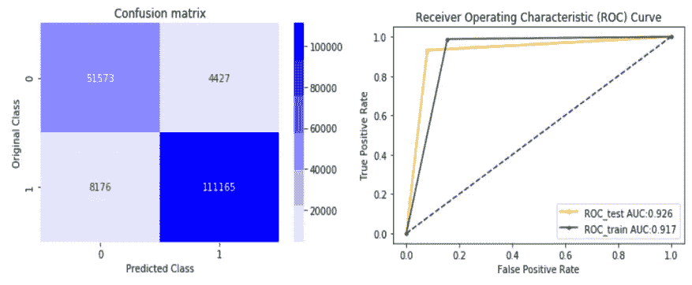

# 网络入侵检测系统中的关联规则特征挖掘

> 原文：<https://medium.com/analytics-vidhya/association-rule-feature-mining-arm-in-network-intrusion-detection-system-6174a06789f0?source=collection_archive---------5----------------------->

## 基于机器学习的入侵检测系统频繁项集挖掘。


来源:NIDS

在这篇文章中，你将学习关联规则挖掘(ARM)是如何工作的，以及它如何有助于机器学习算法的特征选择。

# **目录**

## 关联规则挖掘:
Apriori 算法:
从频繁项集生成强关联规则
入侵检测系统
简介:
1 .商务问题
1.1。描述
2。机器学习问题公式化
2.1。数据概述
2.2。将现实世界的问题映射到 ML 问题
3。探索性数据分析
3.1 可视化类标签
3.2 可视化分类数据
3.3 可视化数值数据及其分布
3.4 数据的相关性
3.5 特征描述
3.6 EDA 结论
4 .ARM —特征选择
4.1 关联规则挖掘
4.2 数据预处理
5 .机器学习模型
5.1 读取训练和测试数据
5.2 Logistic 回归模型
5.3 支持向量机模型
5.4 随机森林模型
5.5 堆叠分类器
6 .型号对比
7。结论
8。未来工作
9。参考

# 关联规则挖掘:

这是一种基于规则的学习，用于发现大数据集之间的有趣关联。这种学习的主要目的是生成可由给定数据库生成的强关联规则和弱关联规则。

这是一个分两步走的过程。

1.查找所有频繁项目集

*   先验方法
*   FB 生长法

2.从步骤 1 中获得的频繁项目集生成强关联规则。

它是基于支持度和置信度来识别规则。

我将使用 Apriori 算法进行特征选择

# Apriori 算法:

Apriori 算法是由 Agrawal 和 Srikant 在 1994 年提出的。

这是一种称为逐级搜索的迭代方法，其中 I-项集用于探索(I+1)-项集。

参考:[数据挖掘和数据仓库:原理和实用技术，Parteek Bhatia 著](https://books.google.co.in/books?id=bF6NDwAAQBAJ&lpg=PA252&ots=pMwClCpzFd&dq=The%20join%20step%3A%20To%20find%20Lk%2C%20a%20set%20of%20candidates%20k-itemsets%20is%20generated%20by%20joining%20Lk-1%20with%20itself&pg=PP1#v=onepage&q=The%20join%20step:%20To%20find%20Lk,%20a%20set%20of%20candidates%20k-itemsets%20is%20generated%20by%20joining%20Lk-1%20with%20itself&f=false)，2019 -剑桥大学出版社

**先验属性:**

频繁项目集的所有非空子集也必须是频繁的。如果一个项集是不频繁的，那么它的所有超集都是不频繁的。

这意味着在我们找到空集之前，我们需要执行频繁项集的逐级搜索。

先验地遵循两步过程:

1.  连接步骤:为了找到 Lk，通过将 Lk-1 与其自身连接来生成一组候选 k 项集。这组候选者被表示为 Ck。
2.  剪枝步骤:Ck 是 Lk-1 的超集，即其成员可能是也可能不是频繁的，但所有的频繁 k 项集都包含在 Ck 中。为了减小 Ck 的大小，使用了先验属性。

假设 I = {I1，I2，I3 … Im}是数据库中二进制属性的集合，T = {T1，T2，T3 … Tm}是称为数据库的事务的集合。


交易数据库

**支持计数** —一个项目集 a 出现的频率


现在我们需要使用 Apriori 算法找到最小支持数为 2 的频繁项集


如果我们合并 L3，我们发现只有一个 4 频繁项目集。

在第 4 步中，我们发现只有一个包含 4 个项目集的事务。并且我们不能产生更多的 5-频繁项目集，因为我们只有一个项目集。

L1、L2、L3 和 L4 是使用支持计数= 2 的 Apriori 算法生成的频繁项集。

# 从频繁项目集生成强关联规则

为了生成强规则，我们需要考虑最小支持度和最小置信度值作为度量。

如果一个规则满足最小支持度和最小置信度值，则它被设置为强规则。

它按如下方式生成:

*   对于每个频繁项集 l，生成 l 的所有非空子集。
*   对于 l 的每个非空子集 s，输出规则 s => (l — s)


规则生成如下。

让我们假设 min_conf = 0.5

让我们考虑 **l = > {I1，I3，I5，I6}** 而 s 标识为‘s’的列规则是从 s 生成的

拿着，


让我们遵循第一条规则，找到自信。


和上面的方法一样，我们需要找到所有频繁项集 Lk 的规则。

# 入侵检测系统


来源: [IDS](https://www.thesecuritybuddy.com/data-breaches-prevention/what-is-ids-intrusion-detection-system-how-does-it-work/)

# 简介:

入侵检测系统是一种识别计算机网络上恶意活动的方法。有两种类型的入侵检测系统网络入侵检测(NIDS)是一个系统监测攻击网络和主机入侵检测系统(HIDS)它是种植在一个主机设备和监测的恶意文件和软件。

在这篇文章中，我将使用 NIDS 来识别网络上的异常。鉴于大型思科网络数据集 UNSW NB-15 我将使用机器学习算法来识别网络入侵。

对于具有 45 个特征集或属性的大量数据集，有几个属性与识别网络入侵无关。这种无关的特征可能增加误报率并降低准确性。这个问题可以通过执行正确的特征选择技术来选择最相关的特征来解决。特征选择将消除噪声和不相关的特征。通过选定的相关功能，我将实现最有效和最可靠的机器学习模型。

我将实现一个二元分类问题来识别网络异常。我将根据处理高维数据的能力选择算法，并为二元分类选择最佳的模型精度。

使用混淆矩阵对结果进行分析，以确定正确分类的点占全部数据集的百分比和虚警率的百分比，这是虚警率的概率或百分比。建立一个误检率尽可能小的模型。


# 1.商业问题

## 1.1.描述

来源:[https://www . UNSW . adfa . edu . au/UNSW-Canberra-cyber/cyber security/ADFA-NB15-](https://www.unsw.adfa.edu.au/unsw-canberra-cyber/cybersecurity/ADFA-NB15-Datasets/)

[数据集](https://www.unsw.adfa.edu.au/unsw-canberra-cyber/cybersecurity/ADFA-NB15-Datasets/)

数据:思科网络数据集——UNSW-NB15 数据集

下载 UNSW-NB15-CSV 文件。

**问题陈述:**

根据原始网络数据包中的证据，对给定网络进行入侵或正常分类

UNSW-NB 15 数据集。它是由网络范围内的 IXIA 完美风暴工具创建的

澳大利亚网络安全中心(ACCS)实验室。

# 2.机器学习问题公式

## 2.1.数据概述


来源:[https://cloud stor . AAR net . edu . au/plus/index . PHP/s/2 dhnlgddeeco 4 ys](https://cloudstor.aarnet.edu.au/plus/index.php/s/2DhnLGDdEECo4ys)

*   我们有多个数据文件:下载 UNSW-NB15-CSV 文件。该文件包含以下结构

训练和测试集的一部分—文件夹包含训练和测试数据 csv 文件

NUSW-NB15_features.csv —功能描述

NUSW-NB15_GT.csv

description.pdf UNSW NB15

UNSW-NB15_1.csv

UNSW-NB15_2.csv

UNSW-NB15_3.csv

UNSW-NB15_4.csv

UNSW-NB15 _ 列表 _ 事件. csv

*   这些特性在 **UNSW-NB15_features.csv** 文件中有描述。
*   记录总数为 200 万 540，044 条，存储在四个 CSV 文件中，即 UNSW-NB15_1.csv、UNSW-NB15_2.csv、UNSW-NB15_3.csv 和 UNSWNB15_4.csv
*   地面真值表命名为 **UNSW-NB15_GT.csv** ，事件文件列表命名为 UNSW-NB15_LIST_EVENTS.csv
*   该数据集中的一个分区被配置为训练集和测试集，分别为**UNSW _ NB15 _ 训练集. csv** 和**UNSW _ NB15 _ 测试集. csv** 。
*   训练集中的记录数量是 82，332 条记录，测试集是 175，341 条来自不同类型(攻击和正常)的记录。上图分别显示了 UNSW-NB15 的试验台配置数据集和特征创建方法。

数据文件的信息:训练和测试文件都包含 45 列

```
[‘dur’, ‘spkts’, ‘dpkts’, ‘sbytes’, ’sload’, ’dload’, ’sloss’, ’dloss’, ’sinpkt’, ’dinpkt’, ’sjit’, ’djit’, ’swin’, ’stcpb’, ’dtcpb’,’dwin’, ’tcprtt’, ’synack’, ’ackdat’, ’smean’, ’dmean’, ’trans_depth’, ’response_body_len’, ’ct_srv_src’, ’ct_state_ttl’, ’ct_dst_ltm’, ’ct_src_dport_ltm’, ’ct_dst_sport_ltm’, ’ct_dst_src_ltm’, ’is_ftp_login’, ’ct_ftp_cmd’, ’ct_flw_http_mthd’, ’ct_src_ltm’, ’ct_srv_dst’, ’is_sm_ips_ports’]
```

分类(4)列

数字(41)列

## 2.2.将现实世界的问题映射到 ML 问题

**2.2.1。机器学习问题的类型**

```
There are two different class normal or attack. Find the network is normal or intrusion. => Binary class classification problem
```

**2.2.2。绩效指标**

用于确定模型性能的指标

度量标准:

- AUC 和 f1-得分

-混淆矩阵

-FAR-误报率应尽可能低

**2.2.3。机器学习的目标和约束**

```
Objective: Predict the probability of each data-point whether the network is normal or attack.
```

样本数据集:


# 3.探索性数据分析

## 3.1 可视化类别标签


类别标签

上图显示数据集不是不平衡的数据集

## 3.2 可视化分类数据


分类数据集

从分类数据中我们可以看到数据的不平衡。此外，“原型”类别有 200 多个类别。其他列少于或等于 13 列。

## 3.3 可视化数值数据及其分布


数值数据集分布

从分布图来看，每个特征都有一个比其他值出现次数更多的值

正如我们可以从数字数据分布中看到的，很少有特征是彼此高度相关的。

## 3.4 数据的相关性


相关矩阵

*   从上面的可视化中，我们可以清楚地看到，有几个列彼此之间有很高的相关性。
*   我们将找到这些列的相关性和分布，并删除必要的列

## 3.5 功能描述

示例功能描述


feature _ 描述. csv

**3.5.1 sbytes — dbytes，sloss — dloss 和 spkt—dpkt**

*   源到目标的事务字节和目标到源的事务字节
*   源数据包被重新传输或丢弃，目的数据包被重新传输或丢弃
*   源到目的地包计数和目的地到源包计数。


列分布

从上面的分布样本中，我们可以清楚地看到它们是高度相关的。

**3 对列的相关矩阵:**


相关矩阵

*   我们可以从上面的表示中去掉列 sbyte 和 dbyte。
*   从该可视化图中，我们可以看到两者具有高相关性，并且与其他柱具有相同的分布。

## 3.5.2 swin — dwin

*   Swin —源 TCP 窗口广告值
*   Dwin —目标 TCP 窗口广告值


列分布


相关矩阵

*   从上面的分布图中，我们可以区分正常和异常。
*   窗口率-50 到 50 小于 0.0075 为正常，200 到 300 小于 0.0075 为异常
*   我们可以忽略这一列中的一个。

## ct_dst_src_ltm，ct_srv_src，ct_srv_dst

*   ct_dst_src_ltm —根据上一次(26)在 100 个连接中具有相同源(1)和目标(3)地址的连接数。
*   ct_srv_dst —根据上一次(26)，在 100 个连接中包含相同服务(14)和源地址(1)的连接数。
*   ct_srv_dst —根据上一次(26)，在 100 个连接中包含相同服务(14)和目标地址(3)的连接数。


列分布


相关矩阵

*   我们可以删除 ct_srv_dst 列
*   从这个可视化中，我们可以看到三个列具有高相关性和相同的分布

## 3.5.4 'is_ftp_login '，' ct_ftp_cmd '

*   is_ftp_login —如果 ftp 会话由用户和密码访问，则为 1，否则为 0。
*   ct_ftp_cmd —'在 ftp 会话中有命令的流的数量。


列分布


相关矩阵

*   我们可以去掉 ct_ftp_cmd。
*   从该可视化中，我们可以看到两者具有高相关性和相同的分布

# 3.6 EDA 结论

我们可以删除上面分析中提到的高度相关的 4 列

*   sbyte 和 dbyte
*   ct_srv_dst
*   ct_ftp_cmd
*   德温


# 4.ARM 特征选择

## 4.1 关联规则挖掘

正如我们已经深入讨论过的，让我们转到步骤。

**4.1.1 实施步骤**


步伐

## 4.2 数据预处理

*   为了更好地理解数据集
*   识别分类数据和数字数据，并执行以下编码

分类数据(标签编码)

数字数据(最小最大比例)

*   将数据转换成数值，以便输入机器学习模型。


数据预处理后的数据帧

**4.2.1 将数据分成相等的部分**

为了降低时间复杂度，数据集被分成相等的部分

**数量𝑜𝑓数据集=数量𝑜𝑓 𝑟𝑒𝑐𝑜𝑟𝑑𝑠 /数量𝑜𝑓 𝑎𝑡𝑡𝑟𝑖𝑏𝑢𝑡𝑒𝑠**

**4.2.2 属性的查找模式**

*   让我们计算每个属性的模式。这是属性中最常见的值。
*   对于每个数据集属性，频繁值被识别，并且最频繁的值被设置为真，其余的为假。任务将在数字和分类数据中执行，如下所示。
*   它将实现采用相关属性的模型输出的可靠性。

> 示例:

1.数字的

X = {1，2，3，1，3，1} => {1} => {1，0，0，1，0，1}

2.绝对的

X = {'INT '，' FIN '，' REQ '，' ACC '，' INT '，' INT ' } = > { ' INT ' } = > { 1，0，0，0，1，0，1}


属性的查找模式

该二进制表将用于特征选择的 ARM 过程

## 4.2.3 基于 Apriori 算法创建 ARM 规则

*   利用 apriori 发现频繁项集
*   下面我已经用 mlxtend 包实现了 apriori 算法
*   这将产生 Lk 个项目集。
*   为了找到 Lk，通过将 Lk-1 与其自身连接来生成一组候选 Ck-项集。


利用 Apriori 算法发现频繁项集


结果数据框架项目集

**找到关联规则:**


生成规则

*   下面是带有前件→后件及其置信度值的结果项集。
*   从 mlxtend 包生成。


关联规则

使用上述方法，我们将找到所有 42 个数据集的前因和后果

## 特征选择

*   在每个集合中创建规则后，前件、后件被组合以在每个数据集上生成频繁项集
*   每个数据集的频繁项被再次组合以构成所有数据集的最终属性。
*   最大规则长度设置为 2，以消除不经常出现的属性。至少有一个项目/属性与其他属性一起出现
*   考虑到项目/属性占总数据集/事务的 30%以上。
*   min_support = 0.3，这是总交易中存在的项目的 30%。

下面是从 ARM 流程中选择的列。它将产生对另一个人来说是常见的所有特征。


最终列

# 5.机器学习模型

## 5.1 读取列车和测试数据

读取训练和测试数据集

仅从 ARM 流程中选择列

对分类数据应用标签编码

使用 MinMaxScaler 标准化色谱柱。

应用机器学习模型。


训练数据集示例

## 5.2 逻辑回归模型

已应用 GridSearchCV()来调整 hyper 参数。并使用校准分类器进行校准—校准分类器用于使用保序回归或 sigmoid 进行概率校准。这里我们应用 sigmoid 进行二分类。


逻辑回归模型

**公制输出:**


逻辑回归度量

## 5.3 支持向量机模型

已应用 GridSearchCV()来调整 hyper 参数。并使用校准分类器进行校准—校准分类器用于使用保序回归或 sigmoid 进行概率校准。这里我们应用 sigmoid 进行二分类。我用 L2 正则化支持向量机。


SVM 模型

**公制输出:**


SVM 公制

## 5.4 随机森林模型

已应用 GridSearchCV()来调整 hyper 参数。并使用校准分类器进行校准—校准分类器用于使用保序回归或 sigmoid 进行概率校准。这里我们应用 sigmoid 进行二分类。选择随机森林的标准为基尼系数。


随机森林模型

**公制输出:**


随机森林度量

## 5.5 堆积分类器

堆叠分类器使用前两个模型作为估计量，使用逻辑回归作为最终估计量。与其他模型相比，堆叠很好地改进了该模型。


堆叠分类器模型

**公制输出:**



堆叠分类器度量

# 6.模型比较

下表比较了模型的性能。


模型评估

# 7.结论

*   在这篇文章中，我们看到了新的实用的关联规则挖掘算法，用于异常检测中的特征选择。关联规则挖掘(ARM)被定制为通过移除不相关或有噪声的特征来找到排名最高的特征。最终特征然后被输入到机器学习模型。
*   先验算法主要用于识别重要的稀有特征。
*   在异常检测系统中，网络攻击非常罕见，因此数据集中可能隐藏着一些罕见的特征。发现这些稀有特征是通过 Apriori 算法完成的。
*   为了区分正常和攻击，我使用了逻辑回归，线性 SVM 随机森林和堆叠。
*   实验结果表明，堆叠分类器模型的性能优于其他模型。其 f1 测量值的**为 94%，**为 7.3%的误报率**，明显低于其他车型。**
*   此外，我们可以理解，与其他分类数据编码技术相比，响应编码表现良好。
*   **假阴性率**也非常低在这种情况下，与假阴性相关的成本应该非常低。因为无法正常预测入侵。
*   f1-得分是精确度和召回率的加权平均值。精确度是从所有预测的入侵中正确识别的入侵的量度。召回是从所有实际标记的入侵中正确识别的入侵的度量。

这个帖子的代码在 [**GitHub**](https://github.com/Anand2805/ARM-in-Network-Intrusion-Detection-System) **中有。**

# 8.未来的工作

在未来，我将致力于 FB 增长算法的特征选择超过 Apriori 算法。Apriori 算法产生的项目集不是频繁的。当处理大量数据时，该算法还需要大量的 I/O 操作和 CPU 进程。它的工作方式是逐级搜索，这在大数据中需要更多的时间。

FB-Growth 方法只会生成频繁的项目集。它致力于频繁模式树的生成。这比先验更快并且不需要更多的空间。适用于大型数据集。

# 9.参考

1. [Apriori 算法](https://web.stanford.edu/class/cs345d-01/rl/ar-mining.pdf)由 Agrawal 和 Srikant 于 1994 年提出。

2.[数据挖掘和数据仓库:原理和实用技术，Parteek Bhatia 著](https://books.google.co.in/books?id=bF6NDwAAQBAJ&lpg=PA252&ots=pMwClCpzFd&dq=The%20join%20step%3A%20To%20find%20Lk%2C%20a%20set%20of%20candidates%20k-itemsets%20is%20generated%20by%20joining%20Lk-1%20with%20itself&pg=PP1#v=onepage&q=The%20join%20step:%20To%20find%20Lk,%20a%20set%20of%20candidates%20k-itemsets%20is%20generated%20by%20joining%20Lk-1%20with%20itself&f=false)，2019-剑桥大学出版社

3.[分类数据的响应编码](/@thewingedwolf.winterfell/response-coding-for-categorical-data-7bb8916c6dc1)

4.IDS—【https://en.wikipedia.org/wiki/Intrusion_detection_system 

5.[使用 Hadoop MapReduce 基于哈希的 Apriori 算法进行网络入侵检测](https://doi.org/10.3390/computers8040086) —作者:努雷尼·阿约费·阿泽斯、托卢佩吉德·阿耶莫博拉、桑杰·米斯拉、里蒂斯·马斯克里斯纳斯和罗伯塔斯·达马舍维丘斯

6.[使用 Apriori 算法发现频繁项集以检测大数据集中的入侵](https://www.ijcait.com/IJCAIT/61/611.pdf) — Kamini Nalavade，B.B. Meshram

7.应用人工智能课程—[https://www.appliedaicourse.com/](https://www.appliedaicourse.com/)

感谢您的阅读！

如果您有任何意见，请告诉我！！！

*你可以在**[***LinkedIn***](https://www.linkedin.com/in/anand-pandiyan-409818180/)**和*[***GitHub***](https://github.com/Anand2805)*上找到我。***