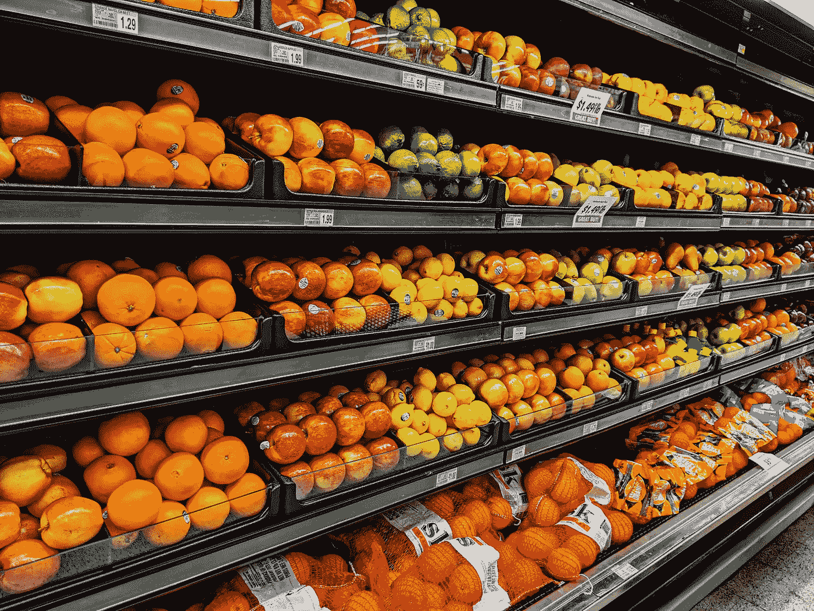
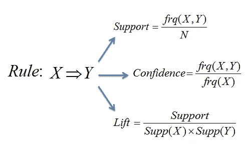
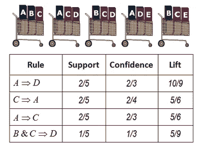
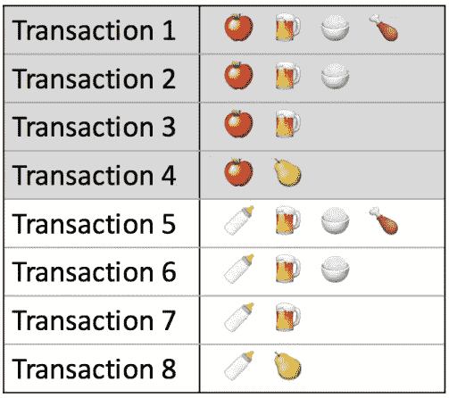
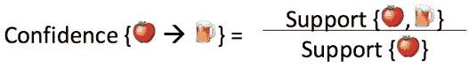
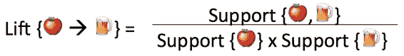
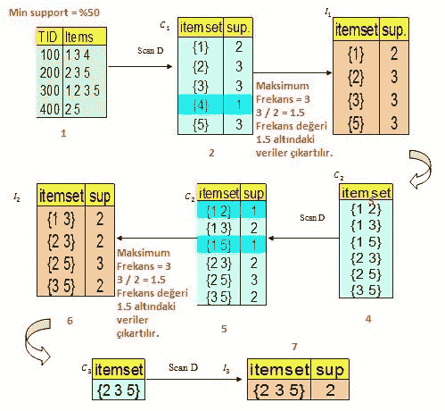

# 关联规则学习& APriori 算法

> 原文：<https://medium.com/analytics-vidhya/association-rule-learning-apriori-algorithm-d4abebbbbbcd?source=collection_archive---------15----------------------->

**关联规则学习**是一种基于[规则的机器学习](https://en.wikipedia.org/wiki/Rule-based_machine_learning)方法，用于发现大型数据库中变量之间的有趣关系。它旨在使用一些感兴趣的度量来识别在数据库中发现的强规则。

关联规则找到具有大于最小支持度的 ***支持度*** 的所有项目集(项目集)，然后使用大项目集来生成具有大于最小信任度的*置信度的期望规则。规则的 ***提升*** 是如果 X 和 Y 是独立的，观察到的支持与预期的支持之比。关联规则应用的一个典型且广泛使用的例子是购物篮分析。*

****

***措施一:支持**。这表示一个项目集有多受欢迎，用项目集出现的事务的比例来衡量。在下面的表 1 中，{apple}的支持度为 8 分之 4，即 50%。项目集也可以包含多个项目。例如，{苹果、啤酒、大米}的支持度为 8 分之 2，即 25%。*

**

*如果你发现超过一定比例的商品销售往往会对你的利润产生重大影响，你可以考虑使用该比例作为你的*支持阈值*。然后，您可以将支持值高于此阈值的项集标识为重要项集。*

*衡量标准二:信心。这表示购买物品 X 时购买物品 Y 的可能性，表示为{X - > Y}。这通过与项目 X 的交易的比例来衡量，其中项目 Y 也出现。在表 1 中，{apple - > beer}的置信度为 4 分之 3，即 75%。*

**

*置信度度量的一个缺点是它可能错误地表示了关联的重要性。这是因为它只解释了苹果有多受欢迎，而不是啤酒。如果啤酒通常也很受欢迎，那么包含苹果的交易也包含啤酒的可能性会更高，从而扩大了信心指数。为了说明这两个组成项目的基本受欢迎程度，我们使用了第三个指标，称为 lift。*

***措施三:抬起**。这表示当购买物品 X 时购买物品 Y 的可能性，同时控制物品 Y 的受欢迎程度。在表 1 中，{apple - > beer}的 lift 是 1，这意味着项目之间没有关联。大于 1 的提升值意味着如果购买了物品 X，物品 Y 可能会被购买，而小于 1 的提升值意味着如果购买了物品 X，物品 Y 不太可能被购买。*

**

# ***APriori 算法***

**

*它是在机器学习中为提取数据之间的关系而开发的算法。该算法使用自下而上的方法，一次检查一个数据，并寻找该数据与其他数据之间的关系。*

*例如，假设上图是市场中客户的购物篮。当我们看第一张表时，我们看到产品被取走。(1 3 4–2 3 4 等。)算法首先找到这些产品的出现频率，即总摄入次数。(第一个产品买了 2 次，第三个产品买了 3 次，以此类推。)找到这些值后，它得到最高频率的最小支持值(50–3 * 50/100 = 1.5%)，频率低于该值的被淘汰。通过组合剩余的值，重复相同的过程，并进一步简化表格。这种情况一直持续到找到关系为止。*

*我们使用真实的超市数据执行 Apriori 算法。您可以通过下面的 Kaggle 链接访问该应用程序。*

*[https://www . ka ggle . com/Ibrahim yildiz/association-analysis-with-apriori-association-rule](https://www.kaggle.com/ibrahimyildiz/association-analysis-with-apriori-association-rule)*

# *参考*

*   *https://en.wikipedia.org/wiki/Association_rule_learning*
*   *[https://www . saedsayad . com/Association _ rules . htm #:~:text = Modeling %20](https://www.saedsayad.com/association_rules.htm#:~:text=Modeling%20)>% 20 Association%20Rules-，Association % 20 rules，大于% 20% 20 最小% 20 置信度。*
*   *[https://www . kdnugges . com/2016/04/association-rules-apriori-algorithm-tutorial . html](https://www.kdnuggets.com/2016/04/association-rules-apriori-algorithm-tutorial.html)*
*   *[https://medium . com/@ ek rem . hatipoglu/machine-learning-association-rule-mining-birliktelik-kural-](/@ekrem.hatipoglu/machine-learning-association-rule-mining-birliktelik-kural-)karm-apriori-algorithm-4326 b 8 f 224 c 3*