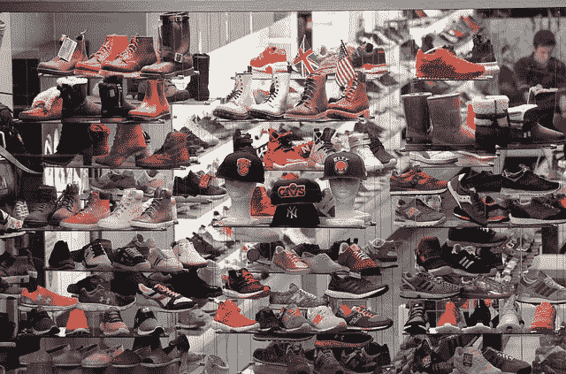

# 关联规则学习

> 原文：<https://medium.com/analytics-vidhya/association-rule-learning-f8b7928ba747?source=collection_archive---------14----------------------->

关联规则学习是一种数据挖掘技术，它允许我们获得项目之间关系的有趣见解。如果我必须用一句话来定义它，我可以简单地说，

> 关联规则学习就是寻找两个不同事物之间的关联。例如，买面包的人也买黄油，或者看《三个白痴》的人也看《奇乔》等。

这些关联规则可以用来发现不同项目之间的相关性。

通过市场篮子分析可以最好地理解这一点。我们来类比理解一下。假设你是一家非常棒的 FashX 商店的老板，你在那里卖各种袜子、拖鞋和鞋子。

FashX 商店

你的生意真的很好。顾客正在购买不同的鞋子和拖鞋。你感觉很好，认为我也应该卖帽子和内衣来增加销售额。就在第二天，你从经销商那里拿了很多帽子和内衣，装满了你的商店。你很高兴你的销售额会飙升。不幸的是，事情并没有像你希望的那样发展。人们只买拖鞋、鞋子和袜子。这件事发生了整整一个月。现在你很沮丧，去了你的朋友家，他也是一名数据科学家。

对话开始了…

你:嘿，迪佩什！我真的很沮丧，我需要一些建议。

*迪佩什:嘿，发生什么事了？*

*你:正如你所知道的，我的店在鞋子和拖鞋方面做得很好。*

是的，伙计！你是我们市这两种商品的最大销售商。

你:我知道老弟。有了这个想法，上个月我计划在我的店里增加更多的商品，比如帽子和内衣。我也加了。但是新产品的销售额很低。看着自己卖鞋卖拖鞋成功，买了太多箱帽子和内胆。顾客买鞋子或拖鞋，但他们不买帽子或内衣。

*Dipesh:哦！那真是一件不幸的事情。你认为这是为什么？你有没有试着和客户谈过为什么他们不感兴趣？*

你:是的。大多数顾客说他们并不真正需要它，所以他们不买。现在我完蛋了！

嘿，兄弟，别这么说。让我们找到解决这种情况的方法。

*你:我已经想到了每一种可能的方式去思考，信任我是没有办法的。*

迪佩什:你能和我分享你的销售数据吗？

你:我可以，但是你为什么想要它？

Dipesh:我一直在研究这种关联规则学习，它发现可能发生的事情之间的某种关联。

你:我不知道男人！如果你想看，你可以拿去，但我不确定它会有任何帮助。

迪佩什:让我们看看。

然后你回到家，给你的朋友 Dipesh 发送了一个包含所有交易的大 excel 文件。

第二天…

Dipesh 给你打电话问你有空吗？我想我有办法解决你的问题。你很好奇，说是的，当然。我去你家。

你:嘿，老弟！发生了什么事？

*迪佩什:老兄，你昨天给我的数据很有见地。我想我可能有解决你问题的办法。*

*你:真的吗？？*

是的，看这里。根据这些数据，95%的顾客在购买袜子时会搭配拖鞋和鞋子。

你:这有什么新鲜事吗？这个我已经知道了。

没有你得不到的男人。几乎你所有的顾客都买袜子配拖鞋和鞋子。现在看看你的店铺照片。你把商店分成了两个部分。在一个区域，你将所有鞋子、拖鞋和袜子放在一起。在另一个区域，你放置了所有你想卖的新物品，比如帽子或内衣。大多数人只参观一个区，离开另一个区。

*你:是老弟！这是为了确保顾客在一个地方找到他们需要一切。有什么条件？*

*参见..我觉得这就是问题所在。你应该把你的袜子放在另一个区域。*

你:老兄你说什么？这将是自杀。，

不，兄弟！几乎你所有买鞋或拖鞋的顾客都买袜子。因此，无论你把袜子放在商店的什么地方，他们都会买。

做一件事，把你的袜子放在另一个区域，把帽子和内衬放在它们之间。因此，那些已经挑选了鞋子，现在又在挑选与之相配的袜子的人，将会看到各种各样的帽子，可以用来搭配他们的服装。对于这些帽子和内衬的销售，提供组合优惠，如那些购买鞋子和袜子或拖鞋和袜子的人将有权享受这些组合的 20%的折扣。人家肯定会买的。

你:哦！我从来没有那样想过。可能有用。

是的，兄弟！试试看。

第二天…

你把所有东西都放在你和迪佩什讨论过的地方了。

一周过去了，你想让我们看看销售数据，以了解这些帽子和内饰的销售情况！

你感到惊讶的是，你库存的帽子和内饰几乎有 50%已经售出。你给迪普什打电话了..

你:嘿，迪佩什！你是对的。销售额确实增加了。你是如何从销售数据中找到所有这些联系的？

Dipesh:我没有做任何事情，这一切都是可能的，因为关联规则学习帮助我理解不同项目集之间的相关性。

你:哇呀！这真是太神奇了。你帮了我大忙。