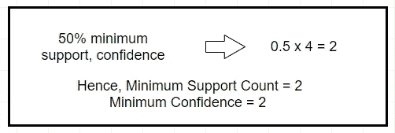

# 关联规则挖掘

> 原文：<https://medium.com/analytics-vidhya/association-rule-mining-7f06401f0601?source=collection_archive---------2----------------------->

## 这种数据挖掘技术如何改变了企业制定销售战略的方式。

说买面包的人也有可能买黄油，似乎是一个合乎逻辑的结论。对大多数人来说，买面包的人也倾向于买黄油是有道理的。因此，如果我拥有一家商店，我会把它们放在彼此更近的地方，以提高我的销售额。

在 [Unsplash](https://unsplash.com/s/photos/pop-tarts?utm_source=unsplash&utm_medium=referral&utm_content=creditCopyText) 上由 [twinsfisch](https://unsplash.com/@twinsfisch?utm_source=unsplash&utm_medium=referral&utm_content=creditCopyText) 拍摄的照片

然而，如果我告诉你，在飓风来袭之前，人们倾向于储备草莓馅饼，就像储备电池和其他必需品一样多，你可能会有点怀疑。草莓馅饼和飓风有什么关系？

原来，在 2004 年，沃尔玛挖掘了数万亿字节的数据，发现草莓馅饼是飓风前购买最多的。这后来被归因于馅饼的免烹饪、持久的能力，使它们成为灾难的最爱。这后来被证明是真的，在未来的几年里，他们在飓风来临前囤积了大量的馅饼，结果都卖光了。

你知道沃尔玛是如何通过预测果酱馅饼的销售来提高销售额的吗？这就是关联规则挖掘的作用。

> **关联规则挖掘**是一种在数据中发现模式的数据挖掘技术。

关联规则挖掘发现的模式表示项目之间的关系。当这与销售数据一起使用时，它被称为**购物篮分析**。

Andrew Herashchenko 在 [Unsplash](https://unsplash.com/s/photos/fast-food?utm_source=unsplash&utm_medium=referral&utm_content=creditCopyText) 上拍摄的照片

例如，快餐连锁店很早就在游戏中了解到，购买快餐的人往往会因为高盐含量而感到口渴，最终会购买可乐。他们利用这一点创造了套餐，提供给你的食物肯定会让你口渴，可乐是这顿饭的一部分。

也许这些连锁店没有使用数据挖掘来达到这一商业策略，或者也许他们做到了。不管怎样，这都有助于提高他们的利润。这个例子背后的思想是理解关联规则代表关系；这些需要被解释以便在策略中使用。

以下是为什么关联规则挖掘对企业来说是如此棒的工具的一些原因。

弗兰基·查马基在 [Unsplash](https://unsplash.com/s/photos/shelf-store?utm_source=unsplash&utm_medium=referral&utm_content=creditCopyText) 上拍摄的照片

1.  **它帮助企业建立销售策略。**

*   最终，任何企业的主要目标都是盈利。这意味着，吸引更多的客户，提高他们的销售。
*   通过确定一起销售更好的产品，他们可以制定更好的战略。例如，知道买薯条的人几乎总是买可乐可以被利用来提高销售额。

**2。它帮助企业建立营销策略。**

*   吸引顾客是任何生意中非常重要的一部分。了解哪些产品可以一起销售，哪些产品不能一起销售，是制定营销策略的关键。
*   这包括销售和广告的计划以及有针对性的营销。例如，知道一些饰品在圣诞节期间不如其他饰品卖得好可能有助于经理提供非经常饰品的销售。

**3。它有助于保质期规划。**

*   关联规则的知识可以使商店经理计划他们的库存，并确保他们不会因过量储存低价易腐品而遭受损失。
*   例如，如果橄榄卖得不多，经理就不会囤积。但他仍想确保现有股票在到期日之前卖出。知道购买比萨饼面团的人倾向于购买橄榄，橄榄可以与比萨饼面团一起以较低的价格出售。

**4。这有助于店内组织。**

*   已知能推动其他产品销售的产品可以在商店中靠得更近。例如，如果黄油的销售是由面包的销售带动的，那么它们可以被移动到商店的同一个通道。

关联规则挖掘在媒体推荐(电影、音乐等)中也有应用。)，网页分析:访问网站 A 的人也有可能访问网站 B 等。

# 关联规则挖掘的步骤

关联规则挖掘可以描述为一个两步过程。

## 第一步:找到所有频繁项目集。

> 一个**项目集**是出现在购物篮中的一组项目。

购物篮中的一组项目可以称为项目集。它可以包含任意数量的产品。例如，[面包，黄油，鸡蛋]是超市数据库中的一个项目集。

频繁项集是在数据库中频繁出现的项集。这就引出了如何定义频率的问题。这就是**支持计数**发挥作用的地方。

> 项目的**支持计数**定义为项目在数据集中的出现频率。

项目集及其各自的支持计数。

支持计数只能代表项目集的频率。它不考虑相对频率，即相对于交易数量的频率。这称为项目集的支持。

> 一个项集的**支持度**是该项集相对于事务数的频率。

项目集及其各自的支持度。

考虑拥有 80%支持的项目集[Bread]。这意味着，在每 100 次交易中，面包出现 80 次。

将支持定义为百分比有助于我们设置一个称为 **min_support** 的频率阈值。如果我们将支持度设置为 50%，这意味着我们将频繁项集定义为在 100 个事务中至少出现 50 次的项集。例如，对于上面的数据集，我们将 threshold_support 设置为 60%。

我们总是**排除那些支持度小于 min_support** 的项目，正如上表中灰色部分所示。频繁项集的生成取决于所使用的算法。

## 步骤 2:从频繁项集生成强关联规则。

关联规则是通过从步骤 1 中生成的频繁项目集构建关联来生成的。这使用了一种叫做信心的方法来寻找强关联。这在示例部分已经讨论过了。

# 为什么要啤酒和尿布？

您可能想知道为什么以前的数据集在其事务中有啤酒和尿布。这背后的故事是这样的——沃尔玛分析了一家商店的 120 万个篮子，发现了一个非常有趣的关联。他们发现，在周五下午 5 点到 7 点之间，尿布和啤酒经常被一起购买。为了验证这一点，他们在商店中将两者移得更近，发现这对这些产品的销售有重大影响。进一步分析后，他们得出了以下结论:“周五晚上，男人们会下班回家，买些啤酒，同时给他们的婴儿拿尿布。”

# Apriori 算法

[Miti](https://unsplash.com/@gigantfotos?utm_source=unsplash&utm_medium=referral&utm_content=creditCopyText) 在 [Unsplash](https://unsplash.com/s/photos/supermarket-bread?utm_source=unsplash&utm_medium=referral&utm_content=creditCopyText) 上拍摄的照片

Apriori 算法被认为是最基本的关联规则挖掘算法之一。其工作原理是"*具有频繁项集的先验知识可以生成强关联规则。*“Apriori 这个词的意思是先验知识。

Apriori 通过一个称为**候选项集生成的过程来发现频繁项集。**这是一种迭代方法，其中 k-项集用于探索(k+1)-项集。首先，找到频繁 1-项集，然后是频繁 2-项集，依此类推，直到再也找不到频繁 k-项集。

> 一个**候选 k-项集**是一个包含 k 个项的项集。示例:候选 2 项集可以是[面包，黄油]。

为了提高逐层生成频繁项集的效率，使用了一个叫做**先验属性**的重要属性来缩小搜索空间。

> **先验属性**声明“频繁项目集的所有非空子集也必须是频繁的。”

这意味着如果有一个频繁项，那么它的子集也将是频繁的。例如，如果[面包，黄油]是一个频繁项目集，这意味着[面包]和[黄油]必须分别是频繁的。

# 先验的例子

Apriori 的样本数据集

考虑一个样本数据集，其中需要使用 Apriori 算法挖掘关联规则。

这里有一个分步解决方案。

## 第一步:设置一个最小的支持度和信任度阈值。

我们将阈值设置为 50%,这意味着如果一个项目集在 2 个事务中至少出现一次，我们就将其定义为频繁。信心是在第三步引入的。

## 步骤 2:生成候选项集。

候选 1-项集分别由所有单个产品及其支持计数组成。例如，[A]在四分之三的交易中出现。

灰色行表示支持计数不符合阈值要求的项目集。

**L1:[甲]，[乙]，[丙]**

候选 2-项集由 L1 及其各自支持计数的所有可能的 2 项集组合组成。例如，[A，C]在 4 个事务中有 2 个同时出现。

**L2:[阿，中]**

候选 3 项集将从 L2 中生成，包含所有 3 项组合。然而，在 L2，我们只剩下 2 个项目，我们不能生成候选的 3-项目集。

## 步骤 3:挖掘关联规则

为了从候选项集中挖掘关联规则，使用了一种称为置信度的度量。它被简单地定义为项目之间的关联规则。

[Toa Heftiba](https://unsplash.com/@heftiba?utm_source=unsplash&utm_medium=referral&utm_content=creditCopyText) 在 [Unsplash](https://unsplash.com/s/photos/bread-butter?utm_source=unsplash&utm_medium=referral&utm_content=creditCopyText) 上拍摄的照片

考虑一个项目集[面包，黄油]。这里可以考虑两种可能的情况:

1.买面包的人也买黄油。黄油的销售受到面包销售的推动。这是有道理的，因为任何包含面包的菜肴通常都包含黄油。

2.买黄油的人也买面包。黄油推动了面包的销售。这是没有意义的，因为黄油可以用于任何东西，而不仅仅是面包。

信心测量有助于识别哪种产品推动了哪种其他产品的销售。对于任何两种产品，表示为{ A B }的 A 驱动器 B 与 B 驱动器 A { B A }不同。如果关联规则{ A B }的置信度为 60%，则意味着包含 A 的事务中有 60%也包含 B。

> 置信度度量产品一起出现在数据集中的情况。

考虑 L2 的候选项集输出:[ A，C ]。这些是支持度为 50%的频繁项集。

由于两个规则的置信度都大于 50%，所以两个规则都被接受。但是,{ C A } 100%有把握地出现，这意味着在大多数情况下，C 推动了 A 的销售。

# 先验的缺点

Apriori 有两个主要缺点，限制了它在现实世界用例中的使用:

## 1.它是计算密集型的。

*   Apriori 需要重复扫描数据库来生成项集。这非常耗费资源和时间。

## 2.它可以挖掘误导模式。

*   已知 Apriori 和其他关联规则挖掘算法产生的规则是偶然的产物。
*   例如，在雨季，雨伞的销量可能会上升。假设一家商店把雨伞放在收银台附近。人们在结账时会注意到这一点，还会拿起一把雨伞。这可能会产生一个规则，即一些杂货产品推动雨伞的销售。这实际上是不正确的，因为雨伞是季节性的一次性购买。