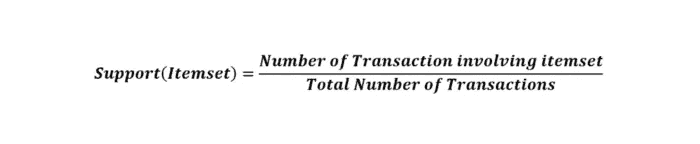

# 关联规则挖掘——概念和实现

> 原文：<https://medium.com/analytics-vidhya/association-rule-mining-concept-and-implementation-28443d16f611?source=collection_archive---------3----------------------->

## 解决购物篮分析问题的综合指南


来源:https://www.exchange4media.com/

关联规则挖掘是数据挖掘和机器学习的主要概念之一，它简单地用于识别大型数据集中的出现模式。我们建立了一套规则来找出不同项目的定位是如何相互影响的。这些模式可以是任何类型，如电话联系模式、可疑活动模式、任何疾病症状的模式和顾客购物模式。在这里，我们将重点关注客户购物模式，更合适的术语是购物篮分析。

市场购物篮分析是最受欢迎的技术之一，用于寻找商店中的最佳产品位置，并决定提高整体销售额的报价。这个想法是把那些在使用上有某种相互依赖的产品集合在一起。这样做肯定能促进销售，因为将它们放在一起会提醒或鼓励顾客对相关产品的需求。为了解决这个问题，我们开发所有可能的产品关联规则集，并找出最有效的关联规则。现在的问题是我们如何开发和发现这些关联规则的有效性？答案是 **Apriori 算法**。

# Apriori 算法

## 概念:

该算法由 R. Agrawal 先生和 R. Srikant 先生于 1994 年提出，他们称之为“Apriori ”,因为它使用先验信息，即现有的交易，来找出关联和模式。

在我们深入研究它的工作原理之前，我们必须了解它的特性:

*   *向下闭包性质*，它说一个频繁项集的子集也应该是频繁的。
*   所有非经常项目子集也有非经常项目超集。

## 关联措施:

它遵循三种方法来找出关联。让我们通过一个小示例集来了解这些度量是如何计算的:


在不同交易中购买的项目

它只包含 10 个事务，因此计算和理解支持、信心和提升会更容易。

1.  ***支持:*** 是项目/项目集的出现百分比，或者简单的说是项目的流行度。它可以通过简单地找出包含项目的交易的比例来计算。



*例如*

支持(Soap) = (4/10)*100 = 40%

意味着 40%的交易包括巧克力。

**2。*置信度:*** 它是关联规则的可能性或可信度，或者简单地说，它告诉我们规则有效的频率；比方说，如果我们寻找的模式是 Y 在 X 之后购买，那么置信度可以计算为:


*例如:*

信心(香水->肥皂)=支持(香水 U 肥皂)/支持(香水)

= (30/40) * 100

意味着 75%的顾客在购买香水的时候，最终也会购买肥皂。

***3。Lift:*** 它不过是(关联规则的)置信度和期望置信度的比值。这里的期望置信度意味着不存在这样的模式，意味着销售项目在关联规则中是独立的。看看这个公式，举一个例子可以更好理解:


在这个公式中，期望的置信度只不过是项目 Y 在交易中的出现，与项目 x 的关联无关。

如果我们得到:

**Lift = ~1，**表示项目 Y 的销售是独立的，无论如何都会以相同的金额发生，而不管它与任何其他项目的关联，因此我们不应该在这些项目之间找到任何关联。

**Lift > 1** ，表示关联规则中项目的销售有很强的正相关关系，或者换句话说，人们倾向于一起购买这些项目，而不是单独购买 Y，因此 X 在将 Y 放在一起时也会促进 Y 的销售。

**Lift < 1** ，表示关联规则中项目的销售具有负/逆关系，即它们是相互替代的，一个项目的存在可以降低其他项目的销售，反之亦然。

Lift(香水->肥皂)=信心(香水->肥皂)/支持(肥皂)

=75/40 =1.87

意味着香水和肥皂有很强的关系，香水的存在促进了肥皂的销售。

现在我们了解了识别强关联规则的各种方法，并准备好了解 Apriori 算法的完整工作原理。

## 完成工作:


该流程图解释了该算法的工作原理，我们将通过一个示例来理解这一点，但首先我们需要获取支持度和置信度的阈值。

> ***支持阈值(或 min_supp) = 30%***
> 
> ***【或 min _ conf】= 70%***

这些阈值只不过是一个最低标准，将用于挑选流行项目集和强关联规则的剪枝。我们还需要理解，这些阈值应该基于商品的种类和市场规模。我的意思是，在真实情况下，任何商店都会有如此多的商品，所以你不能将 30%设定为支持阈值，因为并非所有商品都是我们日常需求的一部分，所以它们可能不太受欢迎。

**第一步:**

**A.** 创建*1-项集*候选项，并计算所有项的支持度。

**B.** 执行剪枝创建 *L1 频繁项集。*在修剪中，我们将过滤掉支持度小于 min_supp 值(30)的所有项目。


1-项集候选和 L1 频繁项集

**第二步:**

**A.** 从 *L1 频繁项集*中创建 2 个*-项集*候选项，并计算它们的支持度。

**B.** 进行剪枝，创建 *L2 频繁项集。*和以前一样，我们将再次过滤掉支持度小于 min_supp 值(30)的所有项目集。


2-项集候选和 L2 频繁项集

**第三步:**

**A.** 从 *L2 频繁项集*中创建 3 个*-项集*候选项，并计算它们的支持度。

**B.** 进行剪枝，创建 *L3 频繁项集*。但是在这里你可以看到，对于所有的 3-项集，Support 都小于 min_supp 值(30 ),所以我们不能前进，只需要从 *L2 频繁项集*中找到关联规则。


3 项集候选者

**最后一步:创建关联规则**

我们需要计算 *L2 频繁项目集中所有项目组合的置信度。*


获取的关联规则

**B.** 再次对执行剪枝，这次过滤掉所有那些置信度(%)小于 min_conf(70%)的关联规则。

此外，我们还计算了提升值，以更好地了解该关联规则将对单个商品的销售产生何种影响。但是，我们不会将其用作规则选择标准。


强关联规则

所以最后，我们获得了关联规则，可以在任何商店使用，以促进销售。

# 用 Python 实现

我们将对一个非常小而简单的数据集进行简单的市场购物篮分析，该数据集包含对大约 120 种商品的交易模式的大约 7500 次观察，以下是该数据集的链接:

[https://www . ka ggle . com/roshan Sharma/market-basket-optimization](https://www.kaggle.com/roshansharma/market-basket-optimization)

库导入

```
import numpy as np *# linear algebra*
import pandas as pd *# data processing, CSV file I/O (e.g. pd.read_csv)*
pd.set_option('display.max_rows', None)from matplotlib import pyplot as plt
%matplotlib inlineimport seaborn as sns
sns.set_style('whitegrid')from mlxtend.preprocessing import TransactionEncoder
from mlxtend.frequent_patterns import apriori, association_rules
```

读出数据

```
market_basket_df = pd.read_csv('./Market_Basket_Optimisation.csv', header=None)
market_basket_df.head()
```


如您所见，数据集不包含列或索引标签，所以让我们继续假设每一行都是一个事务或篮子。我们需要把它放在适当的结构中，只有这样我们才能做进一步的分析。我们可以为每个项目创建列，并根据它在事务中的出现情况将其行值保持为 True/False。

```
basket_items = []
for index, row in market_basket_df.iterrows():
   cleansed_items = [item for item in row if str(item)!=’nan’]
   basket_items.append(cleansed_items)basket_items[:3]
```


我们将使用从我这里导入的 TranscationEncoder 扩展并传递我们创建的购物篮项目列表。正如我们所讨论的，它将根据事务列值的出现情况对它们进行热编码。

```
tran_encod = TransactionEncoder()
tran_encod_list = tran_encod.fit(basket_items).transform(basket_items)
transaction_df = pd.DataFrame(tran_encod_list, columns=tran_encod.columns_)transaction_df.head()
```


为项目频率创建数据框架

```
item_count = {}
for col in transaction_df.columns:
    item_count[col] = transaction_df[col].sum()item_freq_df = pd.DataFrame(data=list(item_count.values()), index=list(item_count.keys()), columns=['frequency']).sort_values(by='frequency', ascending=False)
item_freq_df.shape, item_freq_df.head(10)
```


好了，我们有 120 个独特的项目，让我们检查它们在柱状图中的出现频率，洞察有助于进一步决策。

```
plt.figure(figsize=(16,7))
sns.barplot(y=item_freq_df.index[:10], x=item_freq_df.frequency[:10])
plt.xticks(rotation=90)
```


此图仅包含前 10 项，请不要在您的*笔记本*上绘图时设置任何限制。一些有趣的观察(来自完整的情节):

*   人们越来越注重健康，比起茶，他们更喜欢绿茶。哦，坚持住..与燕麦片和蔬菜相比，他们消耗更多的意大利面、薯条、巧克力、汉堡、蛋糕和饼干..巧合！！！不，事情就是这样发生的，我们吃很多垃圾食品，试图用绿茶来平衡，我们很聪明😅
*   在 Covid19 之前的世界，餐巾纸的需求量并不大。

好了，言归正传。我们总共有 7501 个观察值，只有 7 个项目的频率大于 750。这意味着只有 7 个项目的支持率超过 10%。让我们交叉验证:

```
apriori(transaction_df, min_support=0.1, use_colnames=True)
```


那现在怎么办？？好了，现在我们需要决定一些现实的 *min_support* 只有这样我们才能找到一些有用的关联规则。

```
print(f’freq>200: {item_freq_df[item_freq_df.frequency>200].shape[0]} items’)
print(f’freq>100: {item_freq_df[item_freq_df.frequency>100].shape[0]} items’)
print(f’freq>50: {item_freq_df[item_freq_df.frequency>50].shape[0]} items’)
```


看起来如果我们取 220 个频率限制，那么我们将得到 50 个独特的项目，这将给出一些体面的支持集。

```
pd.set_option(‘display.max_rows’, 15)
freq_itemset_support = apriori(transaction_df, min_support=0.03, use_colnames=True)
freq_itemset_support
```


基于 20%的最小置信度得分寻找最佳关联规则

```
overal_association_rules = association_rules(freq_itemset_support, metric="confidence", min_threshold=0.2)
overal_association_rules
```


好吧，如果以 20%作为置信度，关联规则多以矿泉水关联为主。矿泉水已经和大部分产品关联了，我们最好把它排除在交易之外，找出其他有意义的关联规则。

```
trans_wo_water_df = transaction_df.drop(columns=['mineral water'])freq_itemset_wo_water_supp = apriori(trans_wo_water_df, min_support=0.02, use_colnames=True)
freq_itemset_wo_water_supp
```


```
wo_water_assoc_rules = association_rules(freq_itemset_wo_water_supp, metric=”confidence”, min_threshold=0.2)
wo_water_assoc_rules
```


嗯，让我们先确定一下，然后再取消

```
wo_water_assoc_rules.sort_values('confidence', ascending=False)
```


```
wo_water_assoc_rules.sort_values('lift', ascending=False)
```


好了，现在我们看到一些有意义的联想，比如:

*   碎牛肉->意大利面条
*   香草和胡椒->碎牛肉
*   红酒->意大利面
*   西红柿->冷冻蔬菜
*   冷冻蔬菜->意大利面条
*   (巧克力，意大利面)->牛奶
*   汉堡->鸡蛋
*   汉堡->薯条
*   煎饼->薯条
*   牛奶->巧克力
*   牛奶->鸡蛋
*   橄榄油->意大利面条

还有一些奇怪的联想(至少按照印度人的口味):

*   牛肉末->牛奶
*   香槟->巧克力
*   橄榄油->巧克力
*   虾->牛奶
*   绿茶->薯条

如果您已经注意到这些关联规则仍然由几个最常见的产品主导:

*   蛋
*   意大利式细面条
*   巧克力
*   牛奶
*   牛肉糜
*   冷冻蔬菜

您可以进一步缩小范围，基于置信度或 lift 应用各种过滤器，并生成许多其他关联规则。只是要注意，关联规则的质量依赖于数据的质量，或者我更好地说是数据的真实性。对于实际问题和真实数据集，不能心血来潮简单决定 *min_support* 和*min _ confidence*；这需要一些批判性的思考。然而，你必须从某个地方开始，这就是我试图给你的。稍后我们将探讨*市场篮子差异分析*。

有任何问题/反馈！随意评论。

快乐学习。