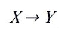
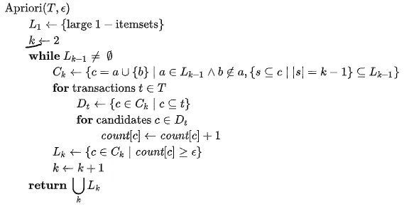
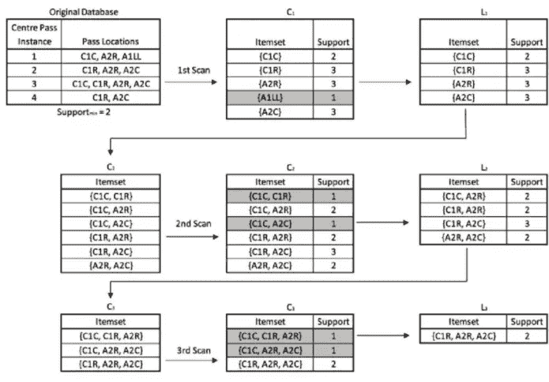
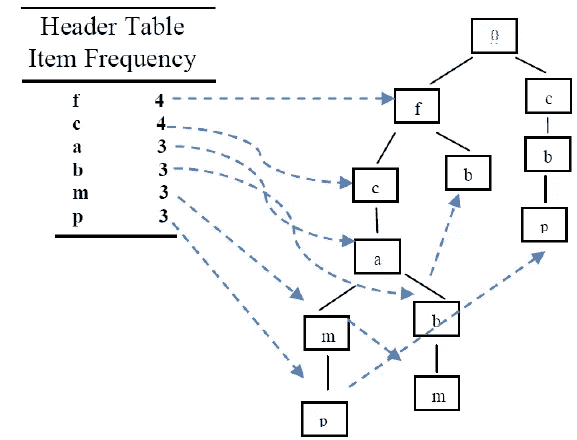
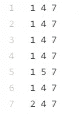
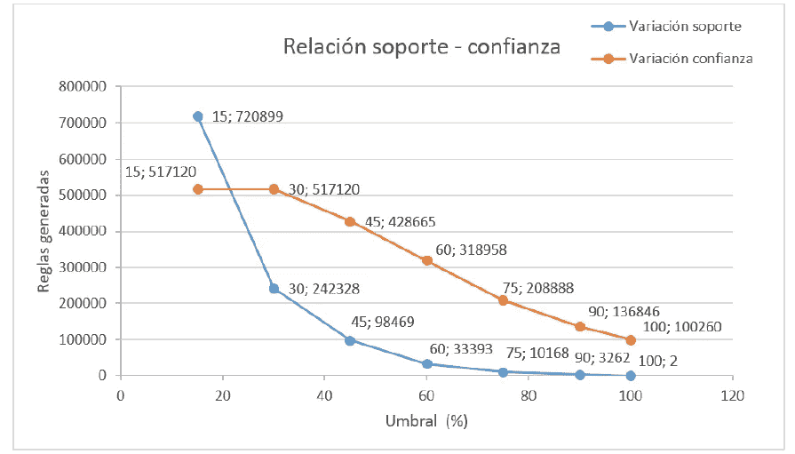
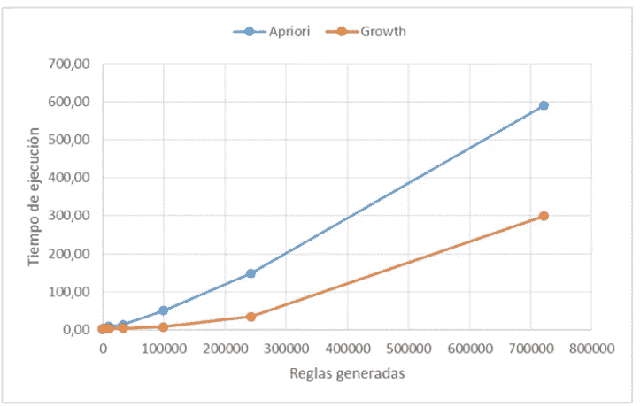

# 关联规则:apriori 算法的操作

> 原文：<https://medium.com/analytics-vidhya/association-rules-operation-of-the-apriori-algorithm-7f3ce928d0c4?source=collection_archive---------12----------------------->

这两种算法都可以从 GitHub 下载，在 Datasets 文件夹中，有要测试的文件。帖子最后是全文(西班牙语)。

数据挖掘包括分析来自不同工具或技术的大量数据，这些工具或技术有助于这一过程，例如先验算法、FP-Growth、aprioriTID、aprioriHybrid、Eclat、Top-k 规则等。今天，数据挖掘的应用可以在许多领域看到，如医学、生物学或商业企业。

# 关联规则

关联规则显示了从大量交易分析中发现的相关性。这些规则用先行项 X 和结果项 y 来表示。

获取这些规则的最常见技术使用两个参数，**支持度，**和**信任度**。第一个是相对于事务集 T 计算的，并指示包含 x 的事务的百分比

**支持** =(包含 X 的交易数)/(总交易数)

第二个指示包含 X 的事务中也包含 Y 的事务的百分比，由下式给出:

**信任** =支持(X U Y) /支持(X)

每个规则表明，如果 X 得到满足，则 Y 也有一定的概率得到满足。

# Apriori 算法

**Github 代码**:

 [## martbrn/Apriori 算法

### 是一种在关系数据库上进行频繁项集挖掘和关联规则学习的算法。它通过…进行

github.com](https://github.com/martbrn/Apriori-Algorithm) 

该算法从支持度和最小信任度中发现所有可能的规则。它分为两个主要部分。第一步是获取频繁项目集，第二步是规则生成。

**来源:**[https://en.wikipedia.org/wiki/Apriori_algorithm](https://en.wikipedia.org/wiki/Apriori_algorithm)

**示例**

来源:[https://www . research gate . net/figure/Tabular-example-of-the-Apriori-algorithm-process-Processing-example-of-the-Apriori _ fig 3 _ 335323554](https://www.researchgate.net/figure/Tabular-example-of-the-Apriori-algorithm-process-Processing-example-of-the-Apriori_fig3_335323554)

# FP-增长算法(备选)

**Github 代码**

 [## martbrn/FP 增长算法

### 由韩提出的 FP-Growth 算法是一种有效的、可扩展的挖掘频繁集的方法

github.com](https://github.com/martbrn/FP-Growth-Algorithm) 

像先验算法一样，它生成所有可能的规则，并由两部分组成，即频繁项目的识别和使用信任和支持作为阈值的规则生成的另一个特征。FPGrowth 在生成频繁元素集上的区别是基于树的构建。该树是用频繁项目(即，那些超过最小已建立支持的项目)构建的，因此那些具有最高频率的项目将位于树的顶部，而每个分支是通过遍历频繁项目已经按降序排序的事务集来创建的。

来源:[https://www . research gate . net/figure/An-example-of-FP-growth _ fig 1 _ 268435656](https://www.researchgate.net/figure/An-example-of-FP-growth_fig1_268435656)

## 西班牙文全文

 [## priori.pdf 算法功能分析协会

### 编辑描述

drive.google.com](https://drive.google.com/file/d/1Eq3xWv0pZwiWu6w85HQf1o05-12l9x03/view?usp=sharing) 

数据集组装如下:

橙色线->信任/蓝色线->支持

从下一张图中可以看出，通过改变两个参数(信任和支持),在两种情况下生成的规则数量都会减少。由于先验算法的特性，每当其中一个参数增加时，规则的数量就会减少。支持度的变化影响更大，生成的规则数量比置信度变化时少得多。

表演

算法的性能根据生成的规则的数量而变化。

# 结论

用于生成关联规则的先验算法没有能力根据它们所在的域来决定生成的输出，也就是说，它们返回尽可能多的结果，这可以从本文生成的大量规则中观察到。这就是为什么让解决方案适应特定的业务需求是一个很好的选择。