# 关联分析和 COVID — 19 症状

> 原文：<https://medium.com/analytics-vidhya/associative-analysis-and-covid-19-symptoms-9749e31463c4?source=collection_archive---------23----------------------->

**简介**

关联分析也被称为**购物篮分析**是一种用于发现商品之间关联的关键技术，最初由大型超市和零售商使用。它分析一起出现的项目组合，并寻找这些交易的频率。从而帮助理解人们购买的物品之间的关系。应用程序很多，包括在过道上摆放产品、在电子商务网站上推荐商品以及在 Spotify 上推荐歌曲。

随着当前 COVID-19 的发布，许多数据集已经公开供研究人员使用。我遇到过 wolfram [1]发表的一个这样的数据集。数据集有一些关于病人症状的细节，我决定对这些症状进行更深入的研究。

本文将讨论数据的洞察力，以及如何做到这一点的方法。

**接近**

在这个特定的数据集中，总共有 13179 个患者数据，但是大多数列是稀疏的。因为我们只关注新冠肺炎的症状，所以从整个数据集中只有 1631 个患者症状数据可用。有人可能会说信息量很少，但是让我们乐观一点，好吗？

加载数据后，有必要进行清理和格式转换。如果我们仔细看看症状数据，下图显示了症状数据的格式。

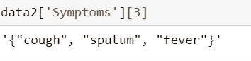

接下来在 regex 库的帮助下，需要提取症状。下面的代码段将有助于提取

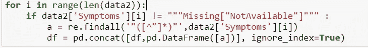

关联分析的下一步是对提取的数据进行一次性编码。在这个特定的数据集中，我们总共有 95 个独特的症状。下图描述了所有 95 种独特的症状。

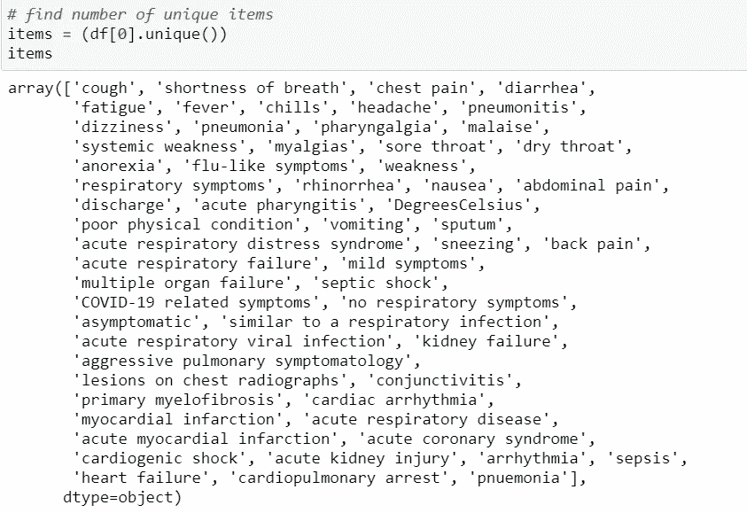

有人可能更喜欢用一个库来完成这种编码，但我更喜欢从头开始写代码。

现在我们已经准备好了相关分析的数据。

**方法和评估**

有许多算法可用于关联分析。我已经为这个特殊情况应用了“Apriori 算法”。也可以使用其他算法，例如 Eclat、FP-growth、ASSOC 和 OPUS search。

Apriori 算法使用呼吸优先搜索策略来计算支持项。它使用一个候选生成函数，该函数利用了 support 的向下闭包特性。

对于 apriori 算法，我使用了 mlxtend 库。

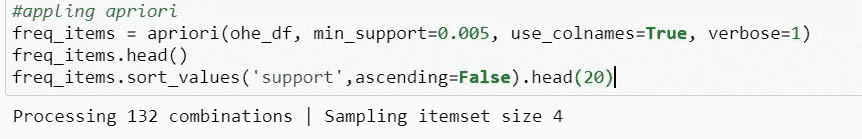

最小支持度设置为 0.005，因为数据集相对较小。该模式总共找到了 132 种可能的组合。

在进行评估时，使用了以下指标

**支持**

这个度量给出了一个*项目集*在所有事务中出现的频率

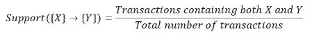

支持的价值有助于识别规则的价值，为将来的分析做准备。例如，可能只想考虑在总共 100，000 个事务中至少出现 50 次的项目集，即 support = 0.0005。如果一个*项目集*恰好具有非常低的支持度，我们没有足够的关于其项目之间关系的信息，因此不能从这样的规则中得出结论

**信心**

这个度量定义了在购物车已经有先行词的情况下，在购物车上出现结果的可能性

**电梯**

在计算给定{X}的{Y}出现的条件概率时，*的提升控制支持*(频率)的后果

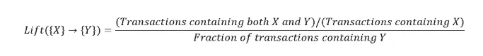

其他矩阵，如信念和杠杆也可以用于诊断目的。

**结果**

下图显示了 apriori 算法给出的一些受支持频率最高的项目。

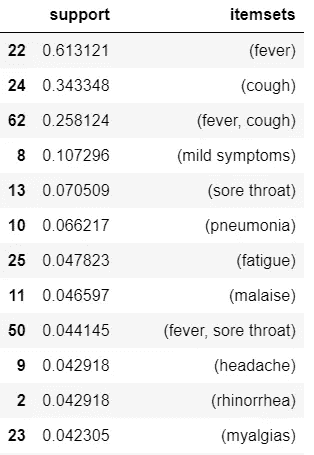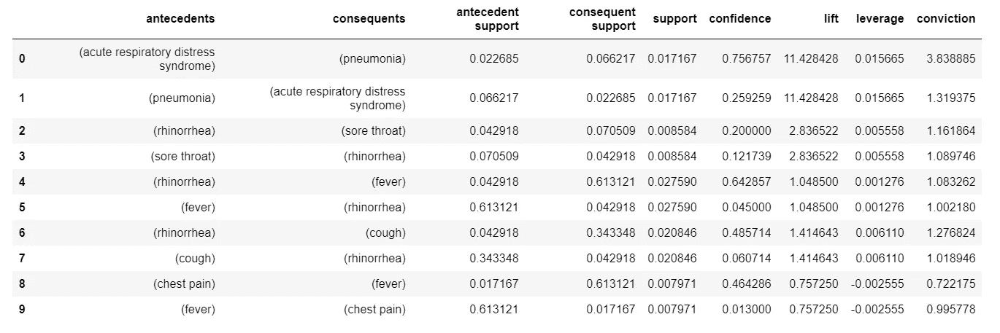

上图显示了 apriori 算法开发的规则，以及评估指标。

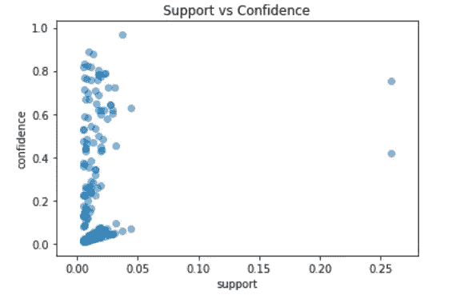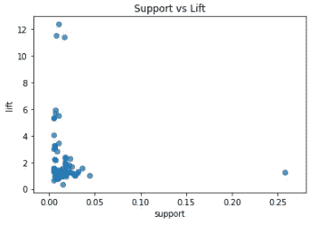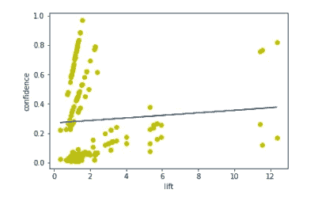

正如我们从最右边的图像中看到的，对提升的拟合不是很好，但这可以通过更多的数据和增加 apriori 算法的最小支持值来改善。

**对 COVID — 19** 
的应用利用这种关联规则，我们能够识别症状及其发展阶段。这在医疗资源非常匮乏的国家将非常有益。这也可以用来确定病人的严重程度。

参考

1.[https://www.wolfram.com/covid-19-resources/](https://www.wolfram.com/covid-19-resources/)